### bCMS_SR_bCMS
```
{	:better gt
 	:candidates 50
 	:cr 0.3
 	:evaluation evaluate_random
 	:f 0.75
 	:gens 100
 	:obj_funcs ['eval_softgoals', 'eval_goals', 'eval_coverage']
 	:seed 1
}
Time Taken :  1.51859116554

rank ,         name ,    med   ,  iqr 
----------------------------------------------------
   1 ,      gen0_f1 ,     500  ,   200 (       ----   *|  ----        ), 3.00,  4.00,  5.00,  6.00,  7.00
   2 ,     gen20_f1 ,     600  ,   100 (              -|--*           ), 5.00,  6.00,  6.00,  7.00,  7.00
   2 ,     gen40_f1 ,     600  ,   100 (              -|--*   ----    ), 5.00,  6.00,  6.00,  7.00,  8.00
   2 ,     gen60_f1 ,     600  ,   100 (              -|--*   ----    ), 5.00,  6.00,  6.00,  7.00,  8.00
   2 ,     gen80_f1 ,     700  ,   100 (              -|--    *---    ), 5.00,  6.00,  7.00,  7.00,  8.00
   2 ,    gen100_f1 ,     700  ,   100 (              -|--    *---    ), 5.00,  6.00,  7.00,  7.00,  8.00

rank ,         name ,    med   ,  iqr 
----------------------------------------------------
   1 ,      gen0_f2 ,    1000  ,   400 (  -----  *    -|-             ), 7.00,  9.00, 10.00, 12.00, 13.00
   2 ,     gen20_f2 ,    1300  ,   200 (            -- | * ---        ),11.00, 12.00, 13.00, 14.00, 15.00
   3 ,     gen40_f2 ,    1400  ,   300 (            ---|-  *  --      ),11.00, 13.00, 14.00, 15.00, 16.00
   3 ,     gen60_f2 ,    1400  ,   200 (            ---|-  *  --      ),11.00, 13.00, 14.00, 15.00, 16.00
   3 ,     gen80_f2 ,    1400  ,   200 (              -|-  *  --      ),12.00, 13.00, 14.00, 15.00, 16.00
   3 ,    gen100_f2 ,    1400  ,   200 (              -|-  *  --      ),12.00, 13.00, 14.00, 15.00, 16.00

rank ,         name ,    med   ,  iqr 
----------------------------------------------------
   1 ,      gen0_f3 ,    4700  ,   200 (     ------*   | ------       ),46.00, 47.00, 47.00, 48.00, 49.00
   2 ,     gen20_f3 ,    4900  ,   100 (               |       *----- ),48.00, 48.00, 49.00, 49.00, 50.00
   2 ,     gen40_f3 ,    4900  ,   100 (               | ------*      ),48.00, 49.00, 49.00, 50.00, 50.00
   2 ,     gen60_f3 ,    4900  ,   100 (               | ------*      ),48.00, 49.00, 49.00, 50.00, 50.00
   2 ,     gen80_f3 ,    4900  ,   100 (               | ------*      ),48.00, 49.00, 49.00, 50.00, 50.00
   2 ,    gen100_f3 ,    4900  ,   100 (               | ------*      ),48.00, 49.00, 49.00, 50.00, 50.00

```
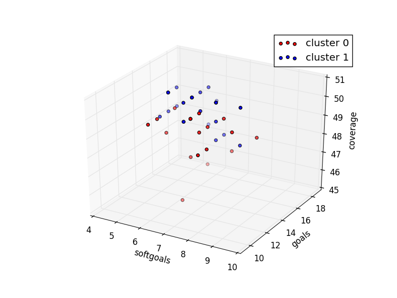

### bCMS_SR_bCMS_AuthenticationVariation
```
{	:better gt
 	:candidates 50
 	:cr 0.3
 	:evaluation evaluate_random
 	:f 0.75
 	:gens 100
 	:obj_funcs ['eval_softgoals', 'eval_goals', 'eval_coverage']
 	:seed 1
}
Time Taken :  2.27856707573

rank ,         name ,    med   ,  iqr 
----------------------------------------------------
   1 ,      gen0_f1 ,     500  ,   200 (    ----    *--|-----         ), 3.00,  4.00,  5.00,  5.00,  7.00
   2 ,     gen20_f1 ,     600  ,   200 (               | *   ----     ), 5.00,  5.00,  6.00,  7.00,  8.00
   2 ,     gen40_f1 ,     600  ,   200 (               | *   ----     ), 5.00,  5.00,  6.00,  7.00,  8.00
   2 ,     gen60_f1 ,     600  ,   200 (               | *   ----     ), 5.00,  5.00,  6.00,  7.00,  8.00
   2 ,     gen80_f1 ,     600  ,   200 (            ---|-*   ----     ), 5.00,  6.00,  6.00,  7.00,  8.00
   2 ,    gen100_f1 ,     600  ,   200 (            ---|-*   ----     ), 5.00,  6.00,  6.00,  7.00,  8.00

rank ,         name ,    med   ,  iqr 
----------------------------------------------------
   1 ,      gen0_f2 ,    1100  ,   400 (    -------  * |  -----       ), 7.00, 10.00, 11.00, 13.00, 15.00
   2 ,     gen20_f2 ,    1400  ,   300 (               |--  *  --     ),12.00, 13.00, 14.00, 15.00, 16.00
   2 ,     gen40_f2 ,    1400  ,   300 (               |--  *    --   ),12.00, 13.00, 14.00, 16.00, 17.00
   2 ,     gen60_f2 ,    1500  ,   300 (               |----   * --   ),12.00, 14.00, 15.00, 16.00, 17.00
   2 ,     gen80_f2 ,    1500  ,   300 (               |----   * --   ),12.00, 14.00, 15.00, 16.00, 17.00
   2 ,    gen100_f2 ,    1500  ,   300 (               |----   * --   ),12.00, 14.00, 15.00, 16.00, 17.00

rank ,         name ,    med   ,  iqr 
----------------------------------------------------
   1 ,      gen0_f3 ,    5400  ,   300 (          -----|   * ---      ),51.00, 53.00, 54.00, 55.00, 56.00
   2 ,     gen20_f3 ,    5600  ,   100 (               |   --   *--   ),54.00, 55.00, 56.00, 56.00, 57.00
   2 ,     gen40_f3 ,    5600  ,   100 (               |   --   *--   ),54.00, 55.00, 56.00, 56.00, 57.00
   2 ,     gen60_f3 ,    5600  ,   200 (               |        *--   ),55.00, 55.00, 56.00, 56.00, 57.00
   2 ,     gen80_f3 ,    5600  ,   200 (               |        *  -- ),55.00, 55.00, 56.00, 57.00, 58.00
   2 ,    gen100_f3 ,    5600  ,   200 (               |        *  -- ),55.00, 55.00, 56.00, 57.00, 58.00

```
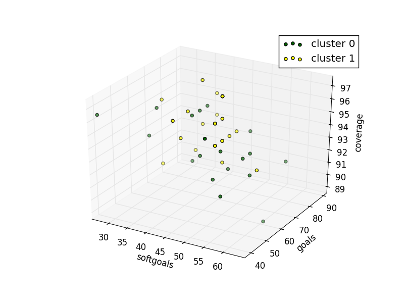

### bCMS_SR_bCMS_exceptional
```
{	:better gt
 	:candidates 50
 	:cr 0.3
 	:evaluation evaluate_random
 	:f 0.75
 	:gens 100
 	:obj_funcs ['eval_softgoals', 'eval_goals', 'eval_coverage']
 	:seed 1
}
Time Taken :  1.53869891167

rank ,         name ,    med   ,  iqr 
----------------------------------------------------
   1 ,      gen0_f1 ,     400  ,   200 (       ----*  -|--            ), 3.00,  4.00,  4.00,  5.00,  6.00
   2 ,     gen20_f1 ,     600  ,   100 (           --- |  *-------    ), 4.00,  5.00,  6.00,  6.00,  8.00
   2 ,     gen40_f1 ,     600  ,   200 (           --- |  *-------    ), 4.00,  5.00,  6.00,  6.00,  8.00
   2 ,     gen60_f1 ,     600  ,   200 (               |  *   ----    ), 5.00,  5.00,  6.00,  7.00,  8.00
   2 ,     gen80_f1 ,     600  ,   200 (              -|--*   ----    ), 5.00,  6.00,  6.00,  7.00,  8.00
   2 ,    gen100_f1 ,     600  ,   200 (              -|--*   ----    ), 5.00,  6.00,  6.00,  7.00,  8.00

rank ,         name ,    med   ,  iqr 
----------------------------------------------------
   1 ,      gen0_f2 ,     700  ,   300 (     --------  |*  -----      ), 3.00,  6.00,  7.00,  8.00, 10.00
   2 ,     gen20_f2 ,     900  ,   300 (             --|---  *  ---   ), 6.00,  8.00,  9.00, 10.00, 11.00
   3 ,     gen40_f2 ,     900  ,   200 (               |-----   *---- ), 7.00,  9.00, 10.00, 10.00, 12.00
   3 ,     gen60_f2 ,    1000  ,   200 (               |-----   *  -- ), 7.00,  9.00, 10.00, 11.00, 12.00
   3 ,     gen80_f2 ,    1000  ,   200 (               |-----   *  -- ), 7.00,  9.00, 10.00, 11.00, 12.00
   3 ,    gen100_f2 ,    1000  ,   200 (               |-----   *  -- ), 7.00,  9.00, 10.00, 11.00, 12.00

rank ,         name ,    med   ,  iqr 
----------------------------------------------------
   1 ,      gen0_f3 ,    4000  ,   200 (     ------    | *            ),38.00, 39.00, 40.00, 41.00, 41.00
   2 ,     gen20_f3 ,    4100  ,   100 (               | ------*      ),40.00, 41.00, 41.00, 42.00, 42.00
   2 ,     gen40_f3 ,    4100  ,   100 (               |       *      ),41.00, 41.00, 41.00, 42.00, 42.00
   2 ,     gen60_f3 ,    4100  ,   100 (               |       *      ),41.00, 41.00, 41.00, 42.00, 42.00
   2 ,     gen80_f3 ,    4100  ,   100 (               |       *      ),41.00, 41.00, 41.00, 42.00, 42.00
   2 ,    gen100_f3 ,    4100  ,   100 (               |       *      ),41.00, 41.00, 41.00, 42.00, 42.00

```
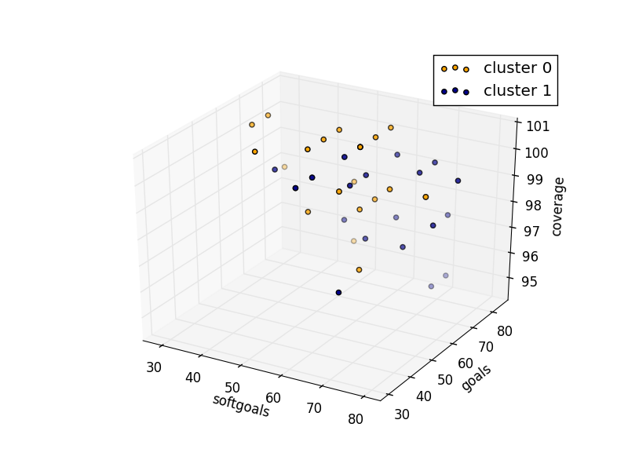

### bCMS_SR_bCMS_VehicleCommunicationVariant
```
{	:better gt
 	:candidates 50
 	:cr 0.3
 	:evaluation evaluate_random
 	:f 0.75
 	:gens 100
 	:obj_funcs ['eval_softgoals', 'eval_goals', 'eval_coverage']
 	:seed 1
}
Time Taken :  2.01121687889

rank ,         name ,    med   ,  iqr 
----------------------------------------------------
   1 ,      gen0_f1 ,     400  ,   300 (   --------   *|------        ), 2.00,  4.00,  5.00,  5.00,  7.00
   2 ,     gen20_f1 ,     500  ,   200 (           ---*|  ----        ), 4.00,  5.00,  5.00,  6.00,  7.00
   3 ,     gen40_f1 ,     600  ,   200 (           --- |  *           ), 4.00,  5.00,  6.00,  7.00,  7.00
   3 ,     gen60_f1 ,     600  ,   200 (           --- |  *   ----    ), 4.00,  5.00,  6.00,  7.00,  8.00
   3 ,     gen80_f1 ,     600  ,   200 (           --- |  *   ----    ), 4.00,  5.00,  6.00,  7.00,  8.00
   3 ,    gen100_f1 ,     600  ,   200 (           --- |  *   ----    ), 4.00,  5.00,  6.00,  7.00,  8.00

rank ,         name ,    med   ,  iqr 
----------------------------------------------------
   1 ,      gen0_f2 ,    1200  ,   300 (       ----    * ----         ), 8.00, 10.00, 12.00, 13.00, 15.00
   2 ,     gen20_f2 ,    1400  ,   300 (             --|   *---       ),11.00, 12.00, 14.00, 14.00, 16.00
   2 ,     gen40_f2 ,    1400  ,   300 (             --|-  * --       ),11.00, 13.00, 14.00, 15.00, 16.00
   2 ,     gen60_f2 ,    1400  ,   200 (               |-  * ----     ),12.00, 13.00, 14.00, 15.00, 17.00
   2 ,     gen80_f2 ,    1400  ,   200 (               |---* ----     ),12.00, 14.00, 14.00, 15.00, 17.00
   2 ,    gen100_f2 ,    1400  ,   200 (               |---* ----     ),12.00, 14.00, 14.00, 15.00, 17.00

rank ,         name ,    med   ,  iqr 
----------------------------------------------------
   1 ,      gen0_f3 ,    5500  ,   300 (         ------|*      ---    ),53.00, 55.00, 55.00, 57.00, 58.00
   2 ,     gen20_f3 ,    5700  ,   200 (               |---    *  --- ),55.00, 56.00, 57.00, 58.00, 59.00
   3 ,     gen40_f3 ,    5800  ,   100 (               |-------   *-- ),55.00, 57.00, 58.00, 58.00, 59.00
   3 ,     gen60_f3 ,    5800  ,   100 (               |-------   *-- ),55.00, 57.00, 58.00, 58.00, 59.00
   3 ,     gen80_f3 ,    5800  ,   100 (               |   ----   *-- ),56.00, 57.00, 58.00, 58.00, 59.00
   3 ,    gen100_f3 ,    5800  ,   100 (               |          *-- ),57.00, 57.00, 58.00, 58.00, 59.00

```
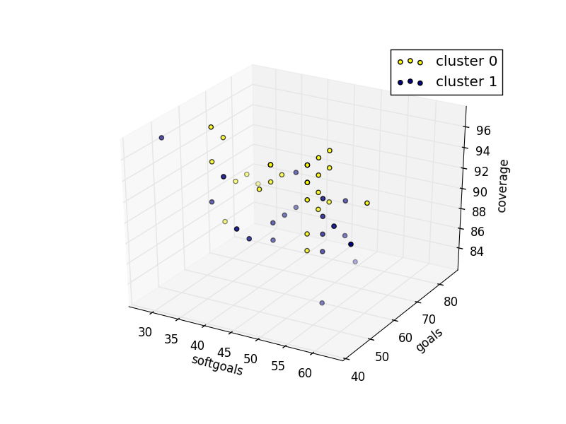

### bCMS_SR_CommunicationCompromiser
```
{	:better gt
 	:candidates 10
 	:cr 0.3
 	:evaluation evaluate_random
 	:f 0.75
 	:gens 100
 	:obj_funcs ['eval_softgoals', 'eval_goals', 'eval_coverage']
 	:seed 1
}
Time Taken :  0.0926570892334

rank ,         name ,    med   ,  iqr 
----------------------------------------------------
   1 ,      gen0_f1 ,     100  ,   100 (               |             *), 0.00,  0.00,  1.00,  1.00,  1.00
   1 ,     gen20_f1 ,     100  ,     0 (---------------|-------------*), 0.00,  1.00,  1.00,  1.00,  1.00
   1 ,     gen40_f1 ,     100  ,     0 (---------------|-------------*), 0.00,  1.00,  1.00,  1.00,  1.00
   1 ,     gen60_f1 ,     100  ,     0 (---------------|-------------*), 0.00,  1.00,  1.00,  1.00,  1.00
   1 ,     gen80_f1 ,     100  ,     0 (               |             *), 1.00,  1.00,  1.00,  1.00,  1.00
   1 ,    gen100_f1 ,     100  ,     0 (               |             *), 1.00,  1.00,  1.00,  1.00,  1.00

rank ,         name ,    med   ,  iqr 
----------------------------------------------------
   1 ,      gen0_f2 ,     100  ,   100 (         *-----|---           ), 0.00,  0.00,  1.00,  1.00,  2.00
   1 ,     gen20_f2 ,     100  ,   100 (---------*     |   ---------- ), 0.00,  1.00,  1.00,  2.00,  3.00
   1 ,     gen40_f2 ,     200  ,   100 (---------      |   *--------- ), 0.00,  1.00,  2.00,  2.00,  3.00
   1 ,     gen60_f2 ,     200  ,   100 (---------      |   *--------- ), 0.00,  1.00,  2.00,  2.00,  3.00
   1 ,     gen80_f2 ,     200  ,   100 (---------      |   *--------- ), 0.00,  1.00,  2.00,  2.00,  3.00
   1 ,    gen100_f2 ,     200  ,   100 (---------      |   *--------- ), 0.00,  1.00,  2.00,  2.00,  3.00

rank ,         name ,    med   ,  iqr 
----------------------------------------------------
   1 ,      gen0_f3 ,    1200  ,   100 (         *     |              ),12.00, 12.00, 12.00, 13.00, 13.00
   2 ,     gen20_f3 ,    1300  ,     0 (         ------|---*--------- ),12.00, 13.00, 13.00, 13.00, 14.00
   2 ,     gen40_f3 ,    1300  ,     0 (               |   *--------- ),13.00, 13.00, 13.00, 13.00, 14.00
   2 ,     gen60_f3 ,    1300  ,     0 (               |   *--------- ),13.00, 13.00, 13.00, 13.00, 14.00
   2 ,     gen80_f3 ,    1300  ,     0 (               |   *--------- ),13.00, 13.00, 13.00, 13.00, 14.00
   2 ,    gen100_f3 ,    1300  ,     0 (               |   *--------- ),13.00, 13.00, 13.00, 13.00, 14.00

```
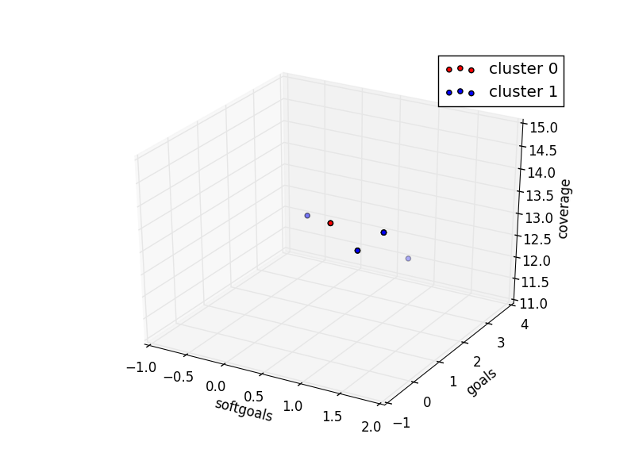

### bCMS_SR_Fireman
```
{	:better gt
 	:candidates 50
 	:cr 0.3
 	:evaluation evaluate_random
 	:f 0.75
 	:gens 100
 	:obj_funcs ['eval_softgoals', 'eval_goals', 'eval_coverage']
 	:seed 1
}
Time Taken :  1.55577206612

rank ,         name ,    med   ,  iqr 
----------------------------------------------------
   1 ,      gen0_f1 ,     600  ,   200 (      -------  |*  ----       ), 3.00,  5.00,  6.00,  7.00,  8.00
   2 ,     gen20_f1 ,     700  ,   200 (             --|   *   ---    ), 5.00,  6.00,  7.00,  8.00,  9.00
   2 ,     gen40_f1 ,     700  ,   200 (               |   *   ---    ), 6.00,  6.00,  7.00,  8.00,  9.00
   2 ,     gen60_f1 ,     700  ,   200 (               |   *   ---    ), 6.00,  6.00,  7.00,  8.00,  9.00
   2 ,     gen80_f1 ,     700  ,   300 (               |---    *----- ), 6.00,  7.00,  8.00,  8.00, 10.00
   2 ,    gen100_f1 ,     800  ,   300 (               |---    *----- ), 6.00,  7.00,  8.00,  8.00, 10.00

rank ,         name ,    med   ,  iqr 
----------------------------------------------------
   1 ,      gen0_f2 ,     400  ,   200 (       ----   *|  ----        ), 2.00,  3.00,  4.00,  5.00,  6.00
   2 ,     gen20_f2 ,     600  ,   200 (              -|--    *       ), 4.00,  5.00,  6.00,  7.00,  7.00
   2 ,     gen40_f2 ,     600  ,   100 (               |  ----*   --- ), 5.00,  6.00,  6.00,  7.00,  8.00
   3 ,     gen60_f2 ,     700  ,   100 (               |  ----    *-- ), 5.00,  6.00,  7.00,  7.00,  8.00
   3 ,     gen80_f2 ,     700  ,   100 (               |  ----    *-- ), 5.00,  6.00,  7.00,  7.00,  8.00
   3 ,    gen100_f2 ,     700  ,   100 (               |  ----    *-- ), 5.00,  6.00,  7.00,  7.00,  8.00

rank ,         name ,    med   ,  iqr 
----------------------------------------------------
   1 ,      gen0_f3 ,    3800  ,   200 (    --------   | *            ),35.00, 37.00, 38.00, 39.00, 39.00
   2 ,     gen20_f3 ,    3900  ,   100 (            ---|-    *---     ),37.00, 38.00, 39.00, 39.00, 40.00
   2 ,     gen40_f3 ,    3900  ,   200 (            ---|-----*        ),37.00, 39.00, 39.00, 40.00, 40.00
   2 ,     gen60_f3 ,    3900  ,   200 (            ---|-----*        ),37.00, 39.00, 39.00, 40.00, 40.00
   2 ,     gen80_f3 ,    3900  ,   200 (            ---|-----*        ),37.00, 39.00, 39.00, 40.00, 40.00
   2 ,    gen100_f3 ,    3900  ,   100 (            ---|-----*        ),37.00, 39.00, 39.00, 40.00, 40.00

```
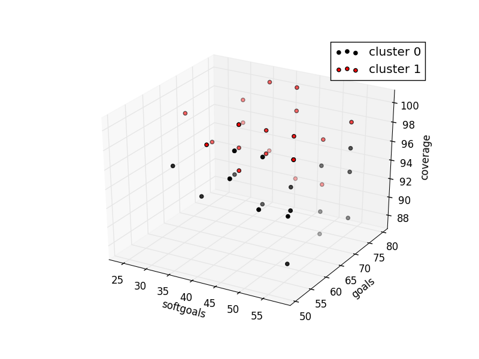

### bCMS_SR_FSC
```
{	:better gt
 	:candidates 10
 	:cr 0.3
 	:evaluation evaluate_random
 	:f 0.75
 	:gens 100
 	:obj_funcs ['eval_softgoals', 'eval_goals', 'eval_coverage']
 	:seed 1
}
Time Taken :  0.173491954803

rank ,         name ,    med   ,  iqr 
----------------------------------------------------
   1 ,      gen0_f1 ,     400  ,   200 (               | *     ------ ), 3.00,  3.00,  4.00,  5.00,  6.00
   1 ,     gen20_f1 ,     400  ,   100 (           ----|-*     ------ ), 3.00,  4.00,  4.00,  5.00,  6.00
   1 ,     gen40_f1 ,     400  ,   100 (               |       *----- ), 4.00,  4.00,  5.00,  5.00,  6.00
   1 ,     gen60_f1 ,     400  ,   100 (               |       *----- ), 4.00,  4.00,  5.00,  5.00,  6.00
   1 ,     gen80_f1 ,     400  ,   100 (               |       *----- ), 4.00,  4.00,  5.00,  5.00,  6.00
   1 ,    gen100_f1 ,     400  ,   100 (               |       *----- ), 4.00,  4.00,  5.00,  5.00,  6.00

rank ,         name ,    med   ,  iqr 
----------------------------------------------------
   1 ,      gen0_f2 ,     300  ,   200 (-------       *|------        ), 2.00,  3.00,  4.00,  4.00,  5.00
   2 ,     gen20_f2 ,     400  ,   100 (               |      *       ), 4.00,  4.00,  5.00,  6.00,  6.00
   2 ,     gen40_f2 ,     400  ,   100 (               |      *       ), 4.00,  4.00,  5.00,  6.00,  6.00
   2 ,     gen60_f2 ,     500  ,   100 (               |      *       ), 4.00,  4.00,  5.00,  6.00,  6.00
   2 ,     gen80_f2 ,     500  ,   100 (               |      *       ), 4.00,  4.00,  5.00,  6.00,  6.00
   2 ,    gen100_f2 ,     500  ,   100 (              -|------*       ), 4.00,  5.00,  5.00,  6.00,  6.00

rank ,         name ,    med   ,  iqr 
----------------------------------------------------
   1 ,      gen0_f3 ,    2500  ,   200 (       --------|------       *),23.00, 25.00, 26.00, 26.00, 26.00
   1 ,     gen20_f3 ,    2600  ,   100 (               |             *),25.00, 25.00, 26.00, 26.00, 26.00
   1 ,     gen40_f3 ,    2600  ,   100 (               |             *),25.00, 25.00, 26.00, 26.00, 26.00
   1 ,     gen60_f3 ,    2600  ,   100 (               |      -------*),25.00, 26.00, 26.00, 26.00, 26.00
   1 ,     gen80_f3 ,    2600  ,   100 (               |      -------*),25.00, 26.00, 26.00, 26.00, 26.00
   1 ,    gen100_f3 ,    2600  ,   100 (               |      -------*),25.00, 26.00, 26.00, 26.00, 26.00

```
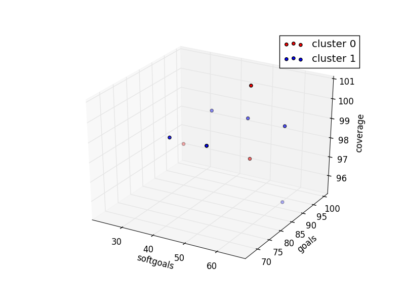

### bCMS_SR_GovernmentAgency
```
{	:better gt
 	:candidates 42
 	:cr 0.3
 	:evaluation evaluate_random
 	:f 0.75
 	:gens 100
 	:obj_funcs ['eval_softgoals', 'eval_goals', 'eval_coverage']
 	:seed 1
}
Time Taken :  0.336823940277

rank ,         name ,    med   ,  iqr 
----------------------------------------------------
   1 ,      gen0_f1 ,     200  ,   200 (              *|              ), 1.00,  1.00,  2.00,  3.00,  3.00
   2 ,     gen20_f1 ,     300  ,   100 (       ------- |      *------ ), 1.00,  2.00,  3.00,  3.00,  4.00
   2 ,     gen40_f1 ,     300  ,   100 (               |      *------ ), 2.00,  2.00,  3.00,  3.00,  4.00
   2 ,     gen60_f1 ,     300  ,   200 (               |      *------ ), 2.00,  2.00,  3.00,  3.00,  4.00
   2 ,     gen80_f1 ,     300  ,   200 (               |      *       ), 2.00,  2.00,  3.00,  4.00,  4.00
   2 ,    gen100_f1 ,     300  ,   200 (              -|------*       ), 2.00,  3.00,  3.00,  4.00,  4.00

rank ,         name ,    med   ,  iqr 
----------------------------------------------------
   1 ,      gen0_f2 ,     100  ,   100 (---------*     |   ---------- ), 0.00,  1.00,  1.00,  2.00,  3.00
   2 ,     gen20_f2 ,     200  ,     0 (         ------|---*--------- ), 1.00,  2.00,  2.00,  2.00,  3.00
   2 ,     gen40_f2 ,     200  ,   100 (         ------|---*          ), 1.00,  2.00,  2.00,  3.00,  3.00
   2 ,     gen60_f2 ,     200  ,   100 (         ------|---*          ), 1.00,  2.00,  2.00,  3.00,  3.00
   2 ,     gen80_f2 ,     200  ,   100 (         ------|---*          ), 1.00,  2.00,  2.00,  3.00,  3.00
   2 ,    gen100_f2 ,     300  ,   100 (         ------|---          *), 1.00,  2.00,  3.00,  3.00,  3.00

rank ,         name ,    med   ,  iqr 
----------------------------------------------------
   1 ,      gen0_f3 ,    1400  ,   100 (              *|------        ),13.00, 13.00, 14.00, 14.00, 15.00
   1 ,     gen20_f3 ,    1400  ,   100 (       -------*|              ),13.00, 14.00, 14.00, 15.00, 15.00
   2 ,     gen40_f3 ,    1400  ,   100 (               |      *       ),14.00, 14.00, 15.00, 15.00, 15.00
   2 ,     gen60_f3 ,    1500  ,   100 (               |      *------ ),14.00, 14.00, 15.00, 15.00, 16.00
   2 ,     gen80_f3 ,    1500  ,   100 (               |      *------ ),14.00, 14.00, 15.00, 15.00, 16.00
   2 ,    gen100_f3 ,    1500  ,   100 (               |      *------ ),14.00, 14.00, 15.00, 15.00, 16.00

```
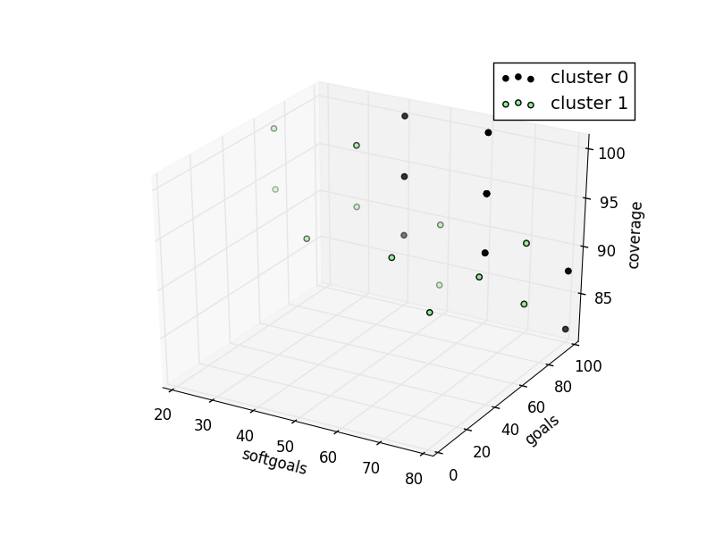

### bCMS_SR_Policeman
```
{	:better gt
 	:candidates 50
 	:cr 0.3
 	:evaluation evaluate_random
 	:f 0.75
 	:gens 100
 	:obj_funcs ['eval_softgoals', 'eval_goals', 'eval_coverage']
 	:seed 1
}
Time Taken :  0.760379076004

rank ,         name ,    med   ,  iqr 
----------------------------------------------------
   1 ,      gen0_f1 ,     300  ,   100 (    -----     *|--------      ), 1.00,  2.00,  3.00,  3.00,  5.00
   1 ,     gen20_f1 ,     300  ,   100 (         -----*|   -----      ), 2.00,  3.00,  3.00,  4.00,  5.00
   2 ,     gen40_f1 ,     400  ,   100 (         ----- |   *----      ), 2.00,  3.00,  4.00,  4.00,  5.00
   2 ,     gen60_f1 ,     400  ,   200 (              -|---*          ), 3.00,  4.00,  4.00,  5.00,  5.00
   2 ,     gen80_f1 ,     400  ,   100 (              -|---*          ), 3.00,  4.00,  4.00,  5.00,  5.00
   2 ,    gen100_f1 ,     400  ,   100 (              -|---*          ), 3.00,  4.00,  4.00,  5.00,  5.00

rank ,         name ,    med   ,  iqr 
----------------------------------------------------
   1 ,      gen0_f2 ,     300  ,   200 (    -----     *|              ), 1.00,  2.00,  3.00,  4.00,  4.00
   2 ,     gen20_f2 ,     400  ,   200 (              -|---*----      ), 3.00,  4.00,  4.00,  4.00,  5.00
   2 ,     gen40_f2 ,     400  ,   100 (              -|---*          ), 3.00,  4.00,  4.00,  5.00,  5.00
   3 ,     gen60_f2 ,     400  ,   100 (              -|---     *     ), 3.00,  4.00,  5.00,  5.00,  5.00
   3 ,     gen80_f2 ,     500  ,   100 (               |        *---- ), 4.00,  4.00,  5.00,  5.00,  6.00
   3 ,    gen100_f2 ,     500  ,   100 (               |        *---- ), 4.00,  4.00,  5.00,  5.00,  6.00

rank ,         name ,    med   ,  iqr 
----------------------------------------------------
   1 ,      gen0_f3 ,    2200  ,   300 (    ----    *  |     ----     ),20.00, 21.00, 22.00, 24.00, 25.00
   2 ,     gen20_f3 ,    2400  ,   200 (            ---|-----*        ),22.00, 24.00, 24.00, 25.00, 25.00
   2 ,     gen40_f3 ,    2400  ,   100 (            ---|-----*   ---- ),22.00, 24.00, 24.00, 25.00, 26.00
   3 ,     gen60_f3 ,    2500  ,   100 (            ---|-----    *--- ),22.00, 24.00, 25.00, 25.00, 26.00
   3 ,     gen80_f3 ,    2500  ,   100 (               | ----    *--- ),23.00, 24.00, 25.00, 25.00, 26.00
   3 ,    gen100_f3 ,    2500  ,   100 (               | --------*--- ),23.00, 25.00, 25.00, 25.00, 26.00

```
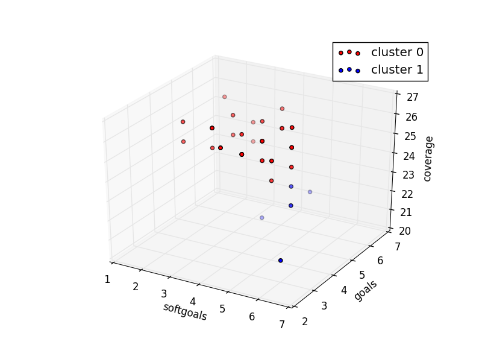

### bCMS_SR_PSC
```
{	:better gt
 	:candidates 10
 	:cr 0.3
 	:evaluation evaluate_random
 	:f 0.75
 	:gens 100
 	:obj_funcs ['eval_softgoals', 'eval_goals', 'eval_coverage']
 	:seed 1
}
Time Taken :  0.176223993301

rank ,         name ,    med   ,  iqr 
----------------------------------------------------
   1 ,      gen0_f1 ,     400  ,   100 (-----------    | *----------- ), 1.00,  3.00,  4.00,  4.00,  6.00
   1 ,     gen20_f1 ,     400  ,   100 (               | *            ), 4.00,  4.00,  4.00,  6.00,  6.00
   2 ,     gen40_f1 ,     500  ,   200 (               |             *), 4.00,  4.00,  6.00,  6.00,  6.00
   2 ,     gen60_f1 ,     600  ,   100 (               | ------      *), 4.00,  5.00,  6.00,  6.00,  6.00
   2 ,     gen80_f1 ,     600  ,   100 (               | ------      *), 4.00,  5.00,  6.00,  6.00,  6.00
   2 ,    gen100_f1 ,     600  ,   100 (               |             *), 5.00,  5.00,  6.00,  6.00,  6.00

rank ,         name ,    med   ,  iqr 
----------------------------------------------------
   1 ,      gen0_f2 ,     200  ,   100 (       *      -|------        ), 2.00,  2.00,  3.00,  4.00,  5.00
   2 ,     gen20_f2 ,     400  ,   200 (       ------- |      *       ), 3.00,  4.00,  5.00,  5.00,  5.00
   2 ,     gen40_f2 ,     400  ,   100 (               |      *       ), 4.00,  4.00,  5.00,  5.00,  5.00
   2 ,     gen60_f2 ,     400  ,   100 (               |      *------ ), 4.00,  4.00,  5.00,  5.00,  6.00
   2 ,     gen80_f2 ,     400  ,   100 (               |      *------ ), 4.00,  4.00,  5.00,  5.00,  6.00
   2 ,    gen100_f2 ,     400  ,   100 (               |      *       ), 4.00,  4.00,  5.00,  6.00,  6.00

rank ,         name ,    med   ,  iqr 
----------------------------------------------------
   1 ,      gen0_f3 ,    2400  ,   100 (              *|      ------- ),23.00, 23.00, 24.00, 25.00, 26.00
   2 ,     gen20_f3 ,    2500  ,   100 (              -|------       *),24.00, 25.00, 26.00, 26.00, 26.00
   2 ,     gen40_f3 ,    2500  ,   100 (              -|------       *),24.00, 25.00, 26.00, 26.00, 26.00
   2 ,     gen60_f3 ,    2500  ,   100 (               |             *),25.00, 25.00, 26.00, 26.00, 26.00
   2 ,     gen80_f3 ,    2500  ,   100 (               |             *),25.00, 25.00, 26.00, 26.00, 26.00
   2 ,    gen100_f3 ,    2500  ,   100 (               |             *),25.00, 25.00, 26.00, 26.00, 26.00

```
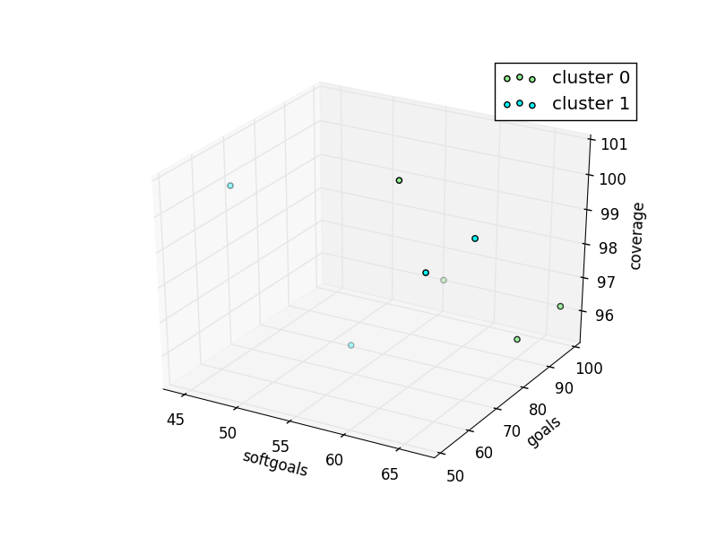

### bCMS_SR_Victim
```
{	:better gt
 	:candidates 50
 	:cr 0.3
 	:evaluation evaluate_random
 	:f 0.75
 	:gens 100
 	:obj_funcs ['eval_softgoals', 'eval_goals', 'eval_coverage']
 	:seed 1
}
Time Taken :  1.11802887917

rank ,         name ,    med   ,  iqr 
----------------------------------------------------
   1 ,      gen0_f1 ,     300  ,   200 (       ----*   |  ----        ), 2.00,  3.00,  3.00,  5.00,  6.00
   2 ,     gen20_f1 ,     500  ,   200 (           --- |  *   ----    ), 3.00,  4.00,  5.00,  6.00,  7.00
   2 ,     gen40_f1 ,     500  ,   200 (           --- |  *   ----    ), 3.00,  4.00,  5.00,  6.00,  7.00
   3 ,     gen60_f1 ,     500  ,   200 (           --- |      *---    ), 3.00,  4.00,  6.00,  6.00,  7.00
   3 ,     gen80_f1 ,     500  ,   200 (           ----|--    *---    ), 3.00,  5.00,  6.00,  6.00,  7.00
   3 ,    gen100_f1 ,     600  ,   100 (           ----|--    *---    ), 3.00,  5.00,  6.00,  6.00,  7.00

rank ,         name ,    med   ,  iqr 
----------------------------------------------------
   1 ,      gen0_f2 ,     300  ,   100 (    -----     *|---           ), 1.00,  2.00,  3.00,  3.00,  4.00
   2 ,     gen20_f2 ,     300  ,   100 (               |   *----      ), 3.00,  3.00,  4.00,  4.00,  5.00
   3 ,     gen40_f2 ,     400  ,   100 (               |   *----      ), 3.00,  3.00,  4.00,  4.00,  5.00
   3 ,     gen60_f2 ,     400  ,   200 (              -|---*          ), 3.00,  4.00,  4.00,  5.00,  5.00
   3 ,     gen80_f2 ,     400  ,   100 (              -|---*          ), 3.00,  4.00,  4.00,  5.00,  5.00
   3 ,    gen100_f2 ,     400  ,   100 (              -|---*          ), 3.00,  4.00,  4.00,  5.00,  5.00

rank ,         name ,    med   ,  iqr 
----------------------------------------------------
   1 ,      gen0_f3 ,    2800  ,   300 (   ------    * |   ----       ),25.00, 27.00, 28.00, 30.00, 31.00
   2 ,     gen20_f3 ,    3000  ,   200 (         ------|   *   ---    ),27.00, 29.00, 30.00, 31.00, 32.00
   2 ,     gen40_f3 ,    3100  ,   200 (         ------|       *--    ),27.00, 29.00, 31.00, 31.00, 32.00
   2 ,     gen60_f3 ,    3100  ,   300 (         ------|---    *      ),27.00, 30.00, 31.00, 32.00, 32.00
   2 ,     gen80_f3 ,    3100  ,   200 (         ------|---    *      ),27.00, 30.00, 31.00, 32.00, 32.00
   2 ,    gen100_f3 ,    3100  ,   200 (         ------|-------*      ),27.00, 31.00, 31.00, 32.00, 32.00

```
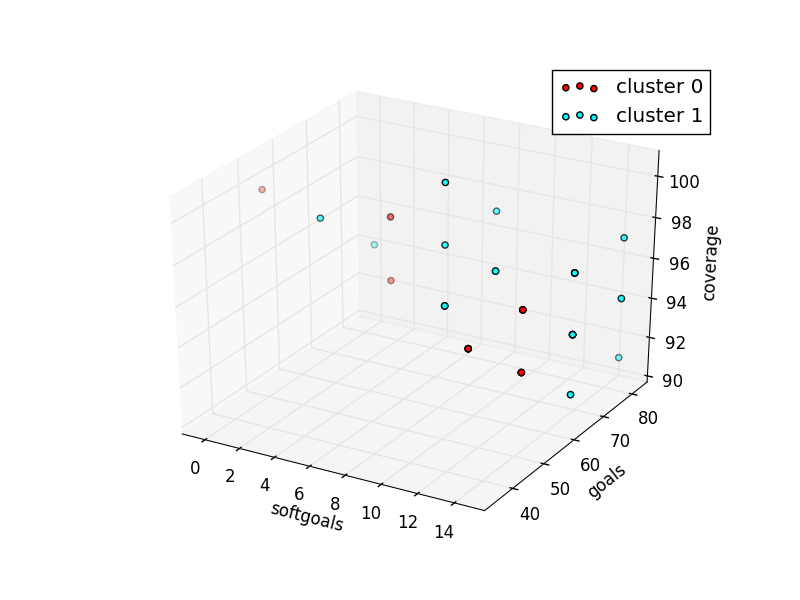

### bCMS_SR_Witness
```
{	:better gt
 	:candidates 50
 	:cr 0.3
 	:evaluation evaluate_random
 	:f 0.75
 	:gens 100
 	:obj_funcs ['eval_softgoals', 'eval_goals', 'eval_coverage']
 	:seed 1
}
Time Taken :  0.794137001038

rank ,         name ,    med   ,  iqr 
----------------------------------------------------
   1 ,      gen0_f1 ,     400  ,   200 (    ----    *  |              ), 2.00,  3.00,  4.00,  5.00,  5.00
   2 ,     gen20_f1 ,     500  ,   100 (        ----   | *---         ), 3.00,  4.00,  5.00,  5.00,  6.00
   2 ,     gen40_f1 ,     500  ,   200 (               | *            ), 4.00,  4.00,  5.00,  6.00,  6.00
   2 ,     gen60_f1 ,     500  ,   200 (               | *   ----     ), 4.00,  4.00,  5.00,  6.00,  7.00
   2 ,     gen80_f1 ,     500  ,   200 (            ---|-*   ----     ), 4.00,  5.00,  5.00,  6.00,  7.00
   2 ,    gen100_f1 ,     500  ,   200 (            ---|-*   ----     ), 4.00,  5.00,  5.00,  6.00,  7.00

rank ,         name ,    med   ,  iqr 
----------------------------------------------------
   1 ,      gen0_f2 ,     200  ,   200 (     ------*   | ------       ), 1.00,  2.00,  2.00,  3.00,  4.00
   2 ,     gen20_f2 ,     300  ,   100 (           ----|-*     ------ ), 2.00,  3.00,  3.00,  4.00,  5.00
   2 ,     gen40_f2 ,     300  ,   100 (           ----|-*     ------ ), 2.00,  3.00,  3.00,  4.00,  5.00
   3 ,     gen60_f2 ,     400  ,   100 (               |       *----- ), 3.00,  3.00,  4.00,  4.00,  5.00
   3 ,     gen80_f2 ,     400  ,   100 (               |       *----- ), 3.00,  3.00,  4.00,  4.00,  5.00
   3 ,    gen100_f2 ,     400  ,   100 (               |       *----- ), 3.00,  3.00,  4.00,  4.00,  5.00

rank ,         name ,    med   ,  iqr 
----------------------------------------------------
   1 ,      gen0_f3 ,    2400  ,   200 (    -----     *|   -----      ),22.00, 23.00, 24.00, 25.00, 26.00
   2 ,     gen20_f3 ,    2600  ,     0 (         ------|--------*---- ),23.00, 26.00, 26.00, 26.00, 27.00
   2 ,     gen40_f3 ,    2600  ,   100 (               |   -----*     ),25.00, 26.00, 26.00, 27.00, 27.00
   2 ,     gen60_f3 ,    2600  ,   100 (               |        *     ),26.00, 26.00, 26.00, 27.00, 27.00
   2 ,     gen80_f3 ,    2600  ,   100 (               |        *     ),26.00, 26.00, 26.00, 27.00, 27.00
   2 ,    gen100_f3 ,    2600  ,   100 (               |        *     ),26.00, 26.00, 26.00, 27.00, 27.00

```
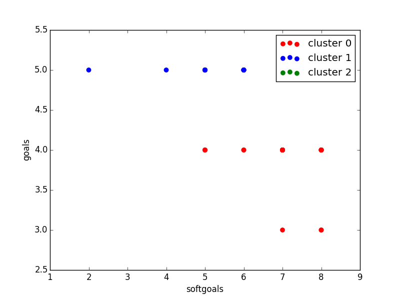

### bCMS_StrategicDependency_MultiplicityVariant
```
{	:better gt
 	:candidates 50
 	:cr 0.3
 	:evaluation evaluate_random
 	:f 0.75
 	:gens 100
 	:obj_funcs ['eval_softgoals', 'eval_goals', 'eval_coverage']
 	:seed 1
}
Time Taken :  0.636549949646

rank ,         name ,    med   ,  iqr 
----------------------------------------------------
   1 ,      gen0_f1 ,       0  ,     0 (*              |              ), 0.00,  0.00,  0.00,  0.00,  0.00
   1 ,     gen20_f1 ,       0  ,     0 (*              |              ), 0.00,  0.00,  0.00,  0.00,  0.00
   1 ,     gen40_f1 ,       0  ,     0 (*              |              ), 0.00,  0.00,  0.00,  0.00,  0.00
   1 ,     gen60_f1 ,       0  ,     0 (*              |              ), 0.00,  0.00,  0.00,  0.00,  0.00
   1 ,     gen80_f1 ,       0  ,     0 (*              |              ), 0.00,  0.00,  0.00,  0.00,  0.00
   1 ,    gen100_f1 ,       0  ,     0 (*              |              ), 0.00,  0.00,  0.00,  0.00,  0.00

rank ,         name ,    med   ,  iqr 
----------------------------------------------------
   1 ,      gen0_f2 ,     300  ,   200 (              *|   -----      ), 2.00,  2.00,  3.00,  4.00,  5.00
   2 ,     gen20_f2 ,     600  ,     0 (               |             *), 6.00,  6.00,  6.00,  6.00,  6.00
   2 ,     gen40_f2 ,     600  ,     0 (               |             *), 6.00,  6.00,  6.00,  6.00,  6.00
   2 ,     gen60_f2 ,     600  ,     0 (               |             *), 6.00,  6.00,  6.00,  6.00,  6.00
   2 ,     gen80_f2 ,     600  ,     0 (               |             *), 6.00,  6.00,  6.00,  6.00,  6.00
   2 ,    gen100_f2 ,     600  ,     0 (               |             *), 6.00,  6.00,  6.00,  6.00,  6.00

rank ,         name ,    med   ,  iqr 
----------------------------------------------------
   1 ,      gen0_f3 ,    3100  ,     0 (*              |              ),31.00, 31.00, 31.00, 31.00, 31.00
   1 ,     gen20_f3 ,    3100  ,     0 (*              |              ),31.00, 31.00, 31.00, 31.00, 31.00
   1 ,     gen40_f3 ,    3100  ,     0 (*              |              ),31.00, 31.00, 31.00, 31.00, 31.00
   1 ,     gen60_f3 ,    3100  ,     0 (*              |              ),31.00, 31.00, 31.00, 31.00, 31.00
   1 ,     gen80_f3 ,    3100  ,     0 (*              |              ),31.00, 31.00, 31.00, 31.00, 31.00
   1 ,    gen100_f3 ,    3100  ,     0 (*              |              ),31.00, 31.00, 31.00, 31.00, 31.00

```
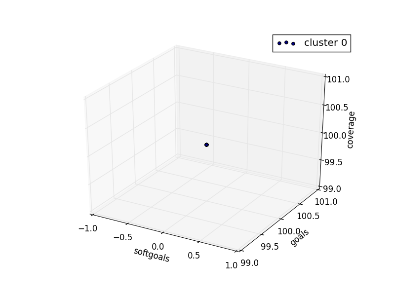

### bCMS_StrategicDependency_VehiclesVariant
```
{	:better gt
 	:candidates 50
 	:cr 0.3
 	:evaluation evaluate_random
 	:f 0.75
 	:gens 100
 	:obj_funcs ['eval_softgoals', 'eval_goals', 'eval_coverage']
 	:seed 1
}
Time Taken :  0.791244029999

rank ,         name ,    med   ,  iqr 
----------------------------------------------------
   1 ,      gen0_f1 ,       0  ,     0 (*              |              ), 0.00,  0.00,  0.00,  0.00,  0.00
   1 ,     gen20_f1 ,       0  ,     0 (*              |              ), 0.00,  0.00,  0.00,  0.00,  0.00
   1 ,     gen40_f1 ,       0  ,     0 (*              |              ), 0.00,  0.00,  0.00,  0.00,  0.00
   1 ,     gen60_f1 ,       0  ,     0 (*              |              ), 0.00,  0.00,  0.00,  0.00,  0.00
   1 ,     gen80_f1 ,       0  ,     0 (*              |              ), 0.00,  0.00,  0.00,  0.00,  0.00
   1 ,    gen100_f1 ,       0  ,     0 (*              |              ), 0.00,  0.00,  0.00,  0.00,  0.00

rank ,         name ,    med   ,  iqr 
----------------------------------------------------
   1 ,      gen0_f2 ,     200  ,   100 (       -------*|              ), 1.00,  2.00,  2.00,  3.00,  3.00
   2 ,     gen20_f2 ,     400  ,     0 (               |             *), 4.00,  4.00,  4.00,  4.00,  4.00
   2 ,     gen40_f2 ,     400  ,     0 (               |             *), 4.00,  4.00,  4.00,  4.00,  4.00
   2 ,     gen60_f2 ,     400  ,     0 (               |             *), 4.00,  4.00,  4.00,  4.00,  4.00
   2 ,     gen80_f2 ,     400  ,     0 (               |             *), 4.00,  4.00,  4.00,  4.00,  4.00
   2 ,    gen100_f2 ,     400  ,     0 (               |             *), 4.00,  4.00,  4.00,  4.00,  4.00

rank ,         name ,    med   ,  iqr 
----------------------------------------------------
   1 ,      gen0_f3 ,    3000  ,     0 (*              |              ),30.00, 30.00, 30.00, 30.00, 30.00
   1 ,     gen20_f3 ,    3000  ,     0 (*              |              ),30.00, 30.00, 30.00, 30.00, 30.00
   1 ,     gen40_f3 ,    3000  ,     0 (*              |              ),30.00, 30.00, 30.00, 30.00, 30.00
   1 ,     gen60_f3 ,    3000  ,     0 (*              |              ),30.00, 30.00, 30.00, 30.00, 30.00
   1 ,     gen80_f3 ,    3000  ,     0 (*              |              ),30.00, 30.00, 30.00, 30.00, 30.00
   1 ,    gen100_f3 ,    3000  ,     0 (*              |              ),30.00, 30.00, 30.00, 30.00, 30.00

```
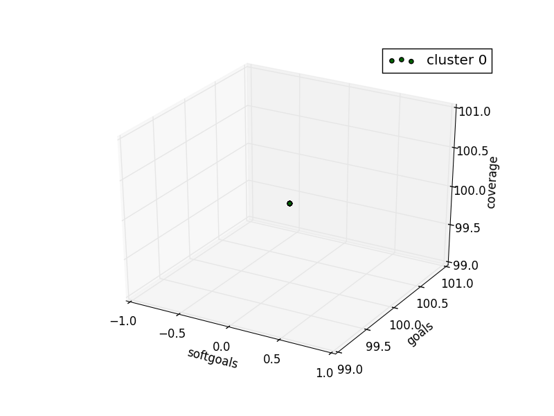

### bCMS_StrategicDependency_withbCMS
```
{	:better gt
 	:candidates 50
 	:cr 0.3
 	:evaluation evaluate_random
 	:f 0.75
 	:gens 100
 	:obj_funcs ['eval_softgoals', 'eval_goals', 'eval_coverage']
 	:seed 1
}
Time Taken :  0.684283018112

rank ,         name ,    med   ,  iqr 
----------------------------------------------------
   1 ,      gen0_f1 ,       0  ,     0 (*              |              ), 0.00,  0.00,  0.00,  0.00,  0.00
   1 ,     gen20_f1 ,       0  ,     0 (*              |              ), 0.00,  0.00,  0.00,  0.00,  0.00
   1 ,     gen40_f1 ,       0  ,     0 (*              |              ), 0.00,  0.00,  0.00,  0.00,  0.00
   1 ,     gen60_f1 ,       0  ,     0 (*              |              ), 0.00,  0.00,  0.00,  0.00,  0.00
   1 ,     gen80_f1 ,       0  ,     0 (*              |              ), 0.00,  0.00,  0.00,  0.00,  0.00
   1 ,    gen100_f1 ,       0  ,     0 (*              |              ), 0.00,  0.00,  0.00,  0.00,  0.00

rank ,         name ,    med   ,  iqr 
----------------------------------------------------
   1 ,      gen0_f2 ,     300  ,   200 (              *|   -----      ), 2.00,  2.00,  3.00,  4.00,  5.00
   2 ,     gen20_f2 ,     600  ,     0 (               |             *), 6.00,  6.00,  6.00,  6.00,  6.00
   2 ,     gen40_f2 ,     600  ,     0 (               |             *), 6.00,  6.00,  6.00,  6.00,  6.00
   2 ,     gen60_f2 ,     600  ,     0 (               |             *), 6.00,  6.00,  6.00,  6.00,  6.00
   2 ,     gen80_f2 ,     600  ,     0 (               |             *), 6.00,  6.00,  6.00,  6.00,  6.00
   2 ,    gen100_f2 ,     600  ,     0 (               |             *), 6.00,  6.00,  6.00,  6.00,  6.00

rank ,         name ,    med   ,  iqr 
----------------------------------------------------
   1 ,      gen0_f3 ,    3100  ,     0 (*              |              ),31.00, 31.00, 31.00, 31.00, 31.00
   1 ,     gen20_f3 ,    3100  ,     0 (*              |              ),31.00, 31.00, 31.00, 31.00, 31.00
   1 ,     gen40_f3 ,    3100  ,     0 (*              |              ),31.00, 31.00, 31.00, 31.00, 31.00
   1 ,     gen60_f3 ,    3100  ,     0 (*              |              ),31.00, 31.00, 31.00, 31.00, 31.00
   1 ,     gen80_f3 ,    3100  ,     0 (*              |              ),31.00, 31.00, 31.00, 31.00, 31.00
   1 ,    gen100_f3 ,    3100  ,     0 (*              |              ),31.00, 31.00, 31.00, 31.00, 31.00

```
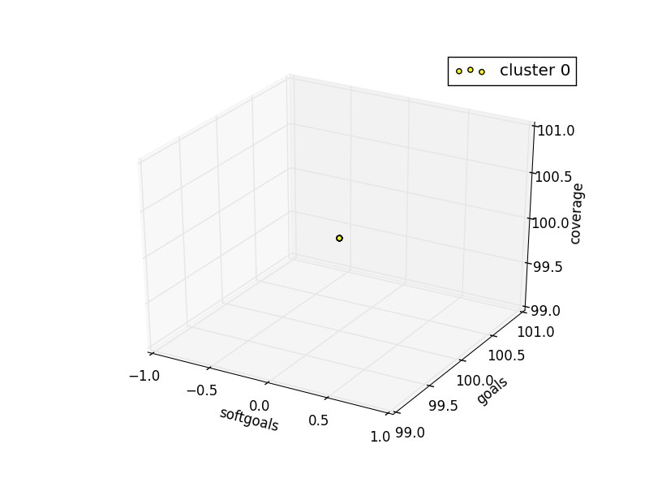

### bCMS_StrategicDependency_withoutbCMS
```
{	:better gt
 	:candidates 50
 	:cr 0.3
 	:evaluation evaluate_random
 	:f 0.75
 	:gens 100
 	:obj_funcs ['eval_softgoals', 'eval_goals', 'eval_coverage']
 	:seed 1
}
Time Taken :  0.56205201149

rank ,         name ,    med   ,  iqr 
----------------------------------------------------
   1 ,      gen0_f1 ,       0  ,     0 (*              |              ), 0.00,  0.00,  0.00,  0.00,  0.00
   1 ,     gen20_f1 ,       0  ,     0 (*              |              ), 0.00,  0.00,  0.00,  0.00,  0.00
   1 ,     gen40_f1 ,       0  ,     0 (*              |              ), 0.00,  0.00,  0.00,  0.00,  0.00
   1 ,     gen60_f1 ,       0  ,     0 (*              |              ), 0.00,  0.00,  0.00,  0.00,  0.00
   1 ,     gen80_f1 ,       0  ,     0 (*              |              ), 0.00,  0.00,  0.00,  0.00,  0.00
   1 ,    gen100_f1 ,       0  ,     0 (*              |              ), 0.00,  0.00,  0.00,  0.00,  0.00

rank ,         name ,    med   ,  iqr 
----------------------------------------------------
   1 ,      gen0_f2 ,     200  ,   200 (       -------*|              ), 1.00,  2.00,  2.00,  3.00,  3.00
   2 ,     gen20_f2 ,     400  ,     0 (               |             *), 4.00,  4.00,  4.00,  4.00,  4.00
   2 ,     gen40_f2 ,     400  ,     0 (               |             *), 4.00,  4.00,  4.00,  4.00,  4.00
   2 ,     gen60_f2 ,     400  ,     0 (               |             *), 4.00,  4.00,  4.00,  4.00,  4.00
   2 ,     gen80_f2 ,     400  ,     0 (               |             *), 4.00,  4.00,  4.00,  4.00,  4.00
   2 ,    gen100_f2 ,     400  ,     0 (               |             *), 4.00,  4.00,  4.00,  4.00,  4.00

rank ,         name ,    med   ,  iqr 
----------------------------------------------------
   1 ,      gen0_f3 ,    2500  ,     0 (*              |              ),25.00, 25.00, 25.00, 25.00, 25.00
   1 ,     gen20_f3 ,    2500  ,     0 (*              |              ),25.00, 25.00, 25.00, 25.00, 25.00
   1 ,     gen40_f3 ,    2500  ,     0 (*              |              ),25.00, 25.00, 25.00, 25.00, 25.00
   1 ,     gen60_f3 ,    2500  ,     0 (*              |              ),25.00, 25.00, 25.00, 25.00, 25.00
   1 ,     gen80_f3 ,    2500  ,     0 (*              |              ),25.00, 25.00, 25.00, 25.00, 25.00
   1 ,    gen100_f3 ,    2500  ,     0 (*              |              ),25.00, 25.00, 25.00, 25.00, 25.00

```
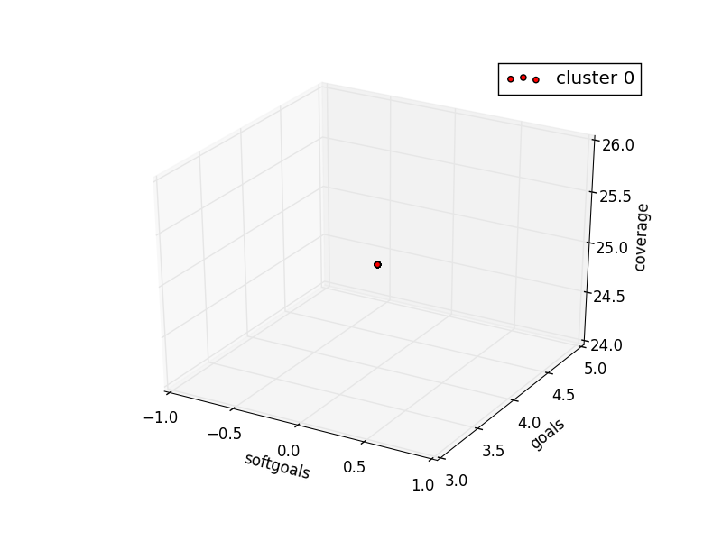

