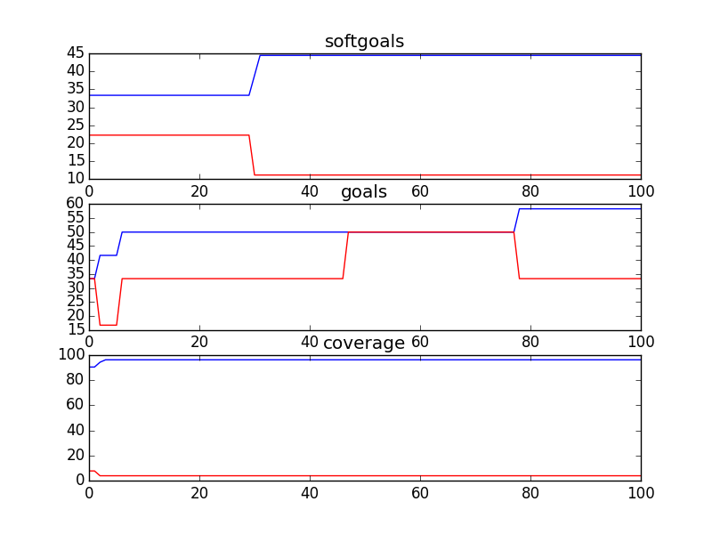

### bCMS_SR_bCMS
```
{	:better gt
 	:candidates 50
 	:cr 0.3
 	:evaluation evaluate_random
 	:f 0.75
 	:gens 100
 	:is_percent True
 	:obj_funcs ['eval_softgoals', 'eval_goals', 'eval_coverage']
 	:seed 1
}
Time Taken :  2.4188439846

rank ,         name ,    med   ,   iqr 
----------------------------------------------------
   1 ,      gen0_f1 ,    36.36  ,   9.09 (   --------*  -|--            ),18.18, 36.36, 36.36, 45.45, 54.55
   2 ,     gen20_f1 ,    54.55  ,  18.19 (           --- |  *-------    ),36.36, 45.45, 54.55, 54.55, 72.73
   2 ,     gen40_f1 ,    54.55  ,   9.09 (              -|--*   ----    ),45.45, 54.55, 54.55, 63.64, 72.73
   2 ,     gen60_f1 ,    54.55  ,   9.09 (              -|--*   ----    ),45.45, 54.55, 54.55, 63.64, 72.73
   3 ,     gen80_f1 ,    54.55  ,   9.09 (              -|--    *---    ),45.45, 54.55, 63.64, 63.64, 72.73
   3 ,    gen100_f1 ,    63.64  ,   9.09 (              -|--    *---    ),45.45, 54.55, 63.64, 63.64, 72.73

rank ,         name ,    med   ,   iqr 
----------------------------------------------------
   1 ,      gen0_f2 ,    52.38  ,   23.8 (    -----    * |-------       ),33.33, 42.86, 52.38, 57.14, 71.43
   2 ,     gen20_f2 ,     61.9  ,  14.29 (         ------|    *         ),42.86, 57.14, 66.67, 71.43, 71.43
   2 ,     gen40_f2 ,    66.67  ,  14.29 (           ----|--  *         ),47.62, 61.90, 66.67, 71.43, 71.43
   2 ,     gen60_f2 ,    66.67  ,  14.29 (           ----|--  *  --     ),47.62, 61.90, 66.67, 71.43, 76.19
   2 ,     gen80_f2 ,    66.67  ,   9.53 (             --|--  *  --     ),52.38, 61.90, 66.67, 71.43, 76.19
   2 ,    gen100_f2 ,    66.67  ,   9.53 (             --|--     *-     ),52.38, 61.90, 71.43, 71.43, 76.19

rank ,         name ,    med   ,   iqr 
----------------------------------------------------
   1 ,      gen0_f3 ,     94.0  ,    4.0 (         -----*|   -----      ),92.00, 94.00, 94.00, 96.00, 98.00
   2 ,     gen20_f3 ,     98.0  ,    2.0 (               |        *---- ),96.00, 96.00, 98.00, 98.00, 100.00
   2 ,     gen40_f3 ,     98.0  ,    4.0 (               |        *     ),96.00, 96.00, 98.00, 100.00, 100.00
   2 ,     gen60_f3 ,     98.0  ,    4.0 (               |   -----*     ),96.00, 98.00, 98.00, 100.00, 100.00
   2 ,     gen80_f3 ,     98.0  ,    4.0 (               |   -----*     ),96.00, 98.00, 98.00, 100.00, 100.00
   2 ,    gen100_f3 ,     98.0  ,    2.0 (               |   -----*     ),96.00, 98.00, 98.00, 100.00, 100.00

```


### bCMS_SR_bCMS_AuthenticationVariation
```
{	:better gt
 	:candidates 50
 	:cr 0.3
 	:evaluation evaluate_random
 	:f 0.75
 	:gens 100
 	:is_percent True
 	:obj_funcs ['eval_softgoals', 'eval_goals', 'eval_coverage']
 	:seed 1
}
Time Taken :  2.88975691795

rank ,         name ,    med   ,   iqr 
----------------------------------------------------
   1 ,      gen0_f1 ,    45.45  ,  18.19 (    ----    *  |              ),27.27, 36.36, 45.45, 54.55, 54.55
   2 ,     gen20_f1 ,    54.55  ,  18.19 (            ---|-*            ),45.45, 54.55, 54.55, 63.64, 63.64
   2 ,     gen40_f1 ,    54.55  ,  18.19 (            ---|-*            ),45.45, 54.55, 54.55, 63.64, 63.64
   2 ,     gen60_f1 ,    54.55  ,   9.09 (            ---|-*   ----     ),45.45, 54.55, 54.55, 63.64, 72.73
   2 ,     gen80_f1 ,    54.55  ,   9.09 (            ---|-*   ----     ),45.45, 54.55, 54.55, 63.64, 72.73
   2 ,    gen100_f1 ,    54.55  ,   9.09 (            ---|-*   ----     ),45.45, 54.55, 54.55, 63.64, 72.73

rank ,         name ,    med   ,   iqr 
----------------------------------------------------
   1 ,      gen0_f2 ,    47.62  ,  19.04 (   ------  *   |---           ),28.57, 42.86, 47.62, 57.14, 66.67
   2 ,     gen20_f2 ,     61.9  ,  19.05 (         ----  | *   ----     ),42.86, 52.38, 61.90, 71.43, 80.95
   3 ,     gen40_f2 ,    66.67  ,  14.29 (             --|   * ----     ),52.38, 57.14, 66.67, 71.43, 80.95
   3 ,     gen60_f2 ,    66.67  ,  14.29 (             --|-  * ----     ),52.38, 61.90, 66.67, 71.43, 80.95
   3 ,     gen80_f2 ,    66.67  ,  14.29 (             --|-    * --     ),52.38, 61.90, 71.43, 76.19, 80.95
   3 ,    gen100_f2 ,    71.43  ,  14.29 (             --|-    * --     ),52.38, 61.90, 71.43, 76.19, 80.95

rank ,         name ,    med   ,   iqr 
----------------------------------------------------
   1 ,      gen0_f3 ,    89.66  ,   5.17 (           *   |  ----        ),87.93, 87.93, 89.66, 93.10, 94.83
   2 ,     gen20_f3 ,     93.1  ,   3.45 (              -|--*   ----    ),91.38, 93.10, 93.10, 94.83, 96.55
   2 ,     gen40_f3 ,    94.83  ,   1.73 (              -|--    *---    ),91.38, 93.10, 94.83, 94.83, 96.55
   2 ,     gen60_f3 ,    94.83  ,   3.45 (              -|--    *       ),91.38, 93.10, 94.83, 96.55, 96.55
   2 ,     gen80_f3 ,    94.83  ,   3.45 (              -|--    *       ),91.38, 93.10, 94.83, 96.55, 96.55
   2 ,    gen100_f3 ,    94.83  ,   3.45 (              -|--    *   --- ),91.38, 93.10, 94.83, 96.55, 98.28

```


### bCMS_SR_bCMS_exceptional
```
{	:better gt
 	:candidates 50
 	:cr 0.3
 	:evaluation evaluate_random
 	:f 0.75
 	:gens 100
 	:is_percent True
 	:obj_funcs ['eval_softgoals', 'eval_goals', 'eval_coverage']
 	:seed 1
}
Time Taken :  2.27587008476

rank ,         name ,    med   ,   iqr 
----------------------------------------------------
   1 ,      gen0_f1 ,    36.36  ,  18.18 (       ----*  -|--            ),27.27, 36.36, 36.36, 45.45, 54.55
   2 ,     gen20_f1 ,    45.45  ,    9.1 (           ---*|  ----        ),36.36, 45.45, 45.45, 54.55, 63.64
   3 ,     gen40_f1 ,    54.55  ,    9.1 (           --- |  *-------    ),36.36, 45.45, 54.55, 54.55, 72.73
   3 ,     gen60_f1 ,    54.55  ,  18.19 (           --- |  *   ----    ),36.36, 45.45, 54.55, 63.64, 72.73
   3 ,     gen80_f1 ,    54.55  ,  18.19 (           --- |  *   ----    ),36.36, 45.45, 54.55, 63.64, 72.73
   3 ,    gen100_f1 ,    54.55  ,  18.19 (              -|--*   ----    ),45.45, 54.55, 54.55, 63.64, 72.73

rank ,         name ,    med   ,   iqr 
----------------------------------------------------
   1 ,      gen0_f2 ,     50.0  ,  21.43 (       -----  *|------        ),28.57, 42.86, 50.00, 50.00, 71.43
   2 ,     gen20_f2 ,    64.29  ,  14.29 (              -|-   * --      ),50.00, 57.14, 64.29, 71.43, 78.57
   2 ,     gen40_f2 ,    64.29  ,  14.29 (               | ---* -----   ),57.14, 64.29, 64.29, 71.43, 85.71
   3 ,     gen60_f2 ,    71.43  ,   7.14 (               | ---  *----   ),57.14, 64.29, 71.43, 71.43, 85.71
   3 ,     gen80_f2 ,    71.43  ,   7.14 (               | ---  *----   ),57.14, 64.29, 71.43, 71.43, 85.71
   3 ,    gen100_f2 ,    71.43  ,  14.28 (               | ---  * ---   ),57.14, 64.29, 71.43, 78.57, 85.71

rank ,         name ,    med   ,   iqr 
----------------------------------------------------
   1 ,      gen0_f3 ,    95.24  ,   4.76 (     ------    | *     ------ ),90.48, 92.86, 95.24, 97.62, 100.00
   2 ,     gen20_f3 ,    97.62  ,   4.76 (               | ------*      ),95.24, 97.62, 97.62, 100.00, 100.00
   2 ,     gen40_f3 ,    97.62  ,   2.38 (               | ------*      ),95.24, 97.62, 97.62, 100.00, 100.00
   2 ,     gen60_f3 ,    97.62  ,   2.38 (               | ------*      ),95.24, 97.62, 97.62, 100.00, 100.00
   2 ,     gen80_f3 ,    97.62  ,   2.38 (               | ------*      ),95.24, 97.62, 97.62, 100.00, 100.00
   2 ,    gen100_f3 ,    100.0  ,   2.38 (               | ------      *),95.24, 97.62, 100.00, 100.00, 100.00

```


### bCMS_SR_bCMS_VehicleCommunicationVariant
```
{	:better gt
 	:candidates 50
 	:cr 0.3
 	:evaluation evaluate_random
 	:f 0.75
 	:gens 100
 	:is_percent True
 	:obj_funcs ['eval_softgoals', 'eval_goals', 'eval_coverage']
 	:seed 1
}
Time Taken :  3.02574014664

rank ,         name ,    med   ,   iqr 
----------------------------------------------------
   1 ,      gen0_f1 ,    36.36  ,  18.18 (   --------*  -|--            ),18.18, 36.36, 36.36, 45.45, 54.55
   2 ,     gen20_f1 ,    45.45  ,  18.19 (           ---*|  ----        ),36.36, 45.45, 45.45, 54.55, 63.64
   3 ,     gen40_f1 ,    54.55  ,  18.19 (           --- |  *-------    ),36.36, 45.45, 54.55, 54.55, 72.73
   3 ,     gen60_f1 ,    54.55  ,  18.19 (           --- |  *   ----    ),36.36, 45.45, 54.55, 63.64, 72.73
   3 ,     gen80_f1 ,    54.55  ,  18.19 (           ----|--*   ----    ),36.36, 54.55, 54.55, 63.64, 72.73
   3 ,    gen100_f1 ,    54.55  ,  18.19 (           ----|--*   ----    ),36.36, 54.55, 54.55, 63.64, 72.73

rank ,         name ,    med   ,   iqr 
----------------------------------------------------
   1 ,      gen0_f2 ,    45.45  ,  18.18 (       ---    *| --           ),31.82, 40.91, 50.00, 59.09, 63.64
   2 ,     gen20_f2 ,    59.09  ,  13.63 (            ---| *   -        ),45.45, 54.55, 59.09, 68.18, 72.73
   3 ,     gen40_f2 ,    63.64  ,  13.64 (               |-  * ---      ),54.55, 59.09, 63.64, 68.18, 77.27
   3 ,     gen60_f2 ,    63.64  ,  13.64 (               |-  *  --      ),54.55, 59.09, 63.64, 72.73, 77.27
   3 ,     gen80_f2 ,    63.64  ,  13.64 (               |---*  --      ),54.55, 63.64, 63.64, 72.73, 77.27
   3 ,    gen100_f2 ,    68.18  ,  13.64 (               |---  *--      ),54.55, 63.64, 68.18, 72.73, 77.27

rank ,         name ,    med   ,   iqr 
----------------------------------------------------
   1 ,      gen0_f3 ,    94.92  ,   5.08 (   --------    |  *   ----    ),88.14, 91.53, 94.92, 96.61, 98.31
   2 ,     gen20_f3 ,    96.61  ,   3.39 (              -|--    *       ),93.22, 94.92, 96.61, 98.31, 98.31
   2 ,     gen40_f3 ,    96.61  ,   3.39 (               |  ----*       ),94.92, 96.61, 96.61, 98.31, 98.31
   2 ,     gen60_f3 ,    96.61  ,    1.7 (               |  ----*       ),94.92, 96.61, 96.61, 98.31, 98.31
   3 ,     gen80_f3 ,    96.61  ,    1.7 (               |  ----    *-- ),94.92, 96.61, 98.31, 98.31, 100.00
   3 ,    gen100_f3 ,    98.31  ,    1.7 (               |  ----    *-- ),94.92, 96.61, 98.31, 98.31, 100.00

```


### bCMS_SR_CommunicationCompromiser
```
{	:better gt
 	:candidates 10
 	:cr 0.3
 	:evaluation evaluate_random
 	:f 0.75
 	:gens 100
 	:is_percent True
 	:obj_funcs ['eval_softgoals', 'eval_goals', 'eval_coverage']
 	:seed 1
}
Time Taken :  0.159837007523

rank ,         name ,    med   ,   iqr 
----------------------------------------------------
   1 ,      gen0_f1 ,    33.33  ,  33.33 (               |             *), 0.00,  0.00, 33.33, 33.33, 33.33
   1 ,     gen20_f1 ,    33.33  ,    0.0 (---------------|-------------*), 0.00, 33.33, 33.33, 33.33, 33.33
   1 ,     gen40_f1 ,    33.33  ,    0.0 (---------------|-------------*), 0.00, 33.33, 33.33, 33.33, 33.33
   1 ,     gen60_f1 ,    33.33  ,    0.0 (---------------|-------------*), 0.00, 33.33, 33.33, 33.33, 33.33
   1 ,     gen80_f1 ,    33.33  ,    0.0 (               |             *),33.33, 33.33, 33.33, 33.33, 33.33
   1 ,    gen100_f1 ,    33.33  ,    0.0 (               |             *),33.33, 33.33, 33.33, 33.33, 33.33

rank ,         name ,    med   ,   iqr 
----------------------------------------------------
   1 ,      gen0_f2 ,    33.33  ,  33.33 (         *-----|----          ), 0.00,  0.00, 33.33, 33.33, 66.67
   1 ,     gen20_f2 ,    33.33  ,  33.34 (---------*     |    --------- ), 0.00, 33.33, 33.33, 66.67, 100.00
   1 ,     gen40_f2 ,    66.67  ,  33.34 (---------      |    *-------- ), 0.00, 33.33, 66.67, 66.67, 100.00
   1 ,     gen60_f2 ,    66.67  ,  33.34 (---------      |    *-------- ), 0.00, 33.33, 66.67, 66.67, 100.00
   1 ,     gen80_f2 ,    66.67  ,  33.34 (---------      |    *-------- ), 0.00, 33.33, 66.67, 66.67, 100.00
   1 ,    gen100_f2 ,    66.67  ,  33.34 (---------      |    *-------- ), 0.00, 33.33, 66.67, 66.67, 100.00

rank ,         name ,    med   ,   iqr 
----------------------------------------------------
   1 ,      gen0_f3 ,    85.71  ,   7.15 (         *     |              ),85.71, 85.71, 85.71, 92.86, 92.86
   2 ,     gen20_f3 ,    92.86  ,    0.0 (         ------|----*-------- ),85.71, 92.86, 92.86, 92.86, 100.00
   2 ,     gen40_f3 ,    92.86  ,    0.0 (               |    *-------- ),92.86, 92.86, 92.86, 92.86, 100.00
   2 ,     gen60_f3 ,    92.86  ,    0.0 (               |    *-------- ),92.86, 92.86, 92.86, 92.86, 100.00
   2 ,     gen80_f3 ,    92.86  ,    0.0 (               |    *-------- ),92.86, 92.86, 92.86, 92.86, 100.00
   2 ,    gen100_f3 ,    92.86  ,    0.0 (               |    *-------- ),92.86, 92.86, 92.86, 92.86, 100.00

```


### bCMS_SR_Fireman
```
{	:better gt
 	:candidates 50
 	:cr 0.3
 	:evaluation evaluate_random
 	:f 0.75
 	:gens 100
 	:is_percent True
 	:obj_funcs ['eval_softgoals', 'eval_goals', 'eval_coverage']
 	:seed 1
}
Time Taken :  2.28586220741

rank ,         name ,    med   ,   iqr 
----------------------------------------------------
   1 ,      gen0_f1 ,    35.29  ,  11.77 (      -------  |*   ---       ),17.65, 29.41, 35.29, 41.18, 47.06
   2 ,     gen20_f1 ,    41.18  ,  11.77 (             --|    *  ---    ),29.41, 35.29, 41.18, 47.06, 52.94
   2 ,     gen40_f1 ,    41.18  ,  11.77 (               |    *  ---    ),35.29, 35.29, 41.18, 47.06, 52.94
   2 ,     gen60_f1 ,    41.18  ,  11.77 (               |    *  ---    ),35.29, 35.29, 41.18, 47.06, 52.94
   2 ,     gen80_f1 ,    41.18  ,  17.65 (               |----   *----- ),35.29, 41.18, 47.06, 47.06, 58.82
   2 ,    gen100_f1 ,    47.06  ,  17.65 (               |----   *----- ),35.29, 41.18, 47.06, 47.06, 58.82

rank ,         name ,    med   ,   iqr 
----------------------------------------------------
   1 ,      gen0_f2 ,     40.0  ,   20.0 (       ----   *|  ----        ),20.00, 30.00, 40.00, 50.00, 60.00
   2 ,     gen20_f2 ,     60.0  ,   20.0 (              -|--    *       ),40.00, 50.00, 60.00, 70.00, 70.00
   2 ,     gen40_f2 ,     60.0  ,   10.0 (               |  ----*   --- ),50.00, 60.00, 60.00, 70.00, 80.00
   3 ,     gen60_f2 ,     70.0  ,   10.0 (               |  ----    *-- ),50.00, 60.00, 70.00, 70.00, 80.00
   3 ,     gen80_f2 ,     70.0  ,   10.0 (               |  ----    *-- ),50.00, 60.00, 70.00, 70.00, 80.00
   3 ,    gen100_f2 ,     70.0  ,   10.0 (               |  ----    *-- ),50.00, 60.00, 70.00, 70.00, 80.00

rank ,         name ,    med   ,   iqr 
----------------------------------------------------
   1 ,      gen0_f3 ,    92.68  ,   4.88 (    --------   | *            ),85.37, 90.24, 92.68, 95.12, 95.12
   2 ,     gen20_f3 ,    95.12  ,   2.44 (            ---|-    *---     ),90.24, 92.68, 95.12, 95.12, 97.56
   2 ,     gen40_f3 ,    95.12  ,   4.88 (            ---|-----*        ),90.24, 95.12, 95.12, 97.56, 97.56
   2 ,     gen60_f3 ,    95.12  ,   4.88 (            ---|-----*        ),90.24, 95.12, 95.12, 97.56, 97.56
   2 ,     gen80_f3 ,    95.12  ,   4.88 (            ---|-----*        ),90.24, 95.12, 95.12, 97.56, 97.56
   2 ,    gen100_f3 ,    95.12  ,   2.44 (            ---|-----*        ),90.24, 95.12, 95.12, 97.56, 97.56

```


### bCMS_SR_FSC
```
{	:better gt
 	:candidates 10
 	:cr 0.3
 	:evaluation evaluate_random
 	:f 0.75
 	:gens 100
 	:is_percent True
 	:obj_funcs ['eval_softgoals', 'eval_goals', 'eval_coverage']
 	:seed 1
}
Time Taken :  0.273527860641

rank ,         name ,    med   ,   iqr 
----------------------------------------------------
   1 ,      gen0_f1 ,    44.44  ,  22.23 (               | *      ----- ),33.33, 33.33, 44.44, 55.56, 66.67
   1 ,     gen20_f1 ,    44.44  ,  22.23 (           ----|-*      ----- ),33.33, 44.44, 44.44, 55.56, 66.67
   1 ,     gen40_f1 ,    44.44  ,  11.12 (               |        *---- ),44.44, 44.44, 55.56, 55.56, 66.67
   1 ,     gen60_f1 ,    44.44  ,  11.12 (               |        *---- ),44.44, 44.44, 55.56, 55.56, 66.67
   1 ,     gen80_f1 ,    44.44  ,  11.12 (               |        *---- ),44.44, 44.44, 55.56, 55.56, 66.67
   1 ,    gen100_f1 ,    44.44  ,  11.12 (               |        *---- ),44.44, 44.44, 55.56, 55.56, 66.67

rank ,         name ,    med   ,   iqr 
----------------------------------------------------
   1 ,      gen0_f2 ,     50.0  ,  33.34 (-------        *------        ),33.33, 50.00, 66.67, 66.67, 83.33
   2 ,     gen20_f2 ,    66.67  ,  33.33 (               |      *       ),50.00, 50.00, 83.33, 100.00, 100.00
   2 ,     gen40_f2 ,    66.67  ,  33.33 (       --------|      *       ),50.00, 66.67, 83.33, 100.00, 100.00
   2 ,     gen60_f2 ,    66.67  ,   50.0 (       --------|      *       ),50.00, 66.67, 83.33, 100.00, 100.00
   2 ,     gen80_f2 ,    83.33  ,  33.33 (       --------|      *       ),50.00, 66.67, 83.33, 100.00, 100.00
   2 ,    gen100_f2 ,    83.33  ,  33.33 (       --------|      *       ),50.00, 66.67, 83.33, 100.00, 100.00

rank ,         name ,    med   ,   iqr 
----------------------------------------------------
   1 ,      gen0_f3 ,    96.15  ,   7.69 (       --------|------       *),88.46, 96.15, 100.00, 100.00, 100.00
   1 ,     gen20_f3 ,    100.0  ,   3.85 (               |             *),96.15, 96.15, 100.00, 100.00, 100.00
   1 ,     gen40_f3 ,    100.0  ,   3.85 (               |      -------*),96.15, 100.00, 100.00, 100.00, 100.00
   1 ,     gen60_f3 ,    100.0  ,   3.85 (               |      -------*),96.15, 100.00, 100.00, 100.00, 100.00
   1 ,     gen80_f3 ,    100.0  ,   3.85 (               |      -------*),96.15, 100.00, 100.00, 100.00, 100.00
   1 ,    gen100_f3 ,    100.0  ,   3.85 (               |      -------*),96.15, 100.00, 100.00, 100.00, 100.00

```


### bCMS_SR_GovernmentAgency
```
{	:better gt
 	:candidates 42
 	:cr 0.3
 	:evaluation evaluate_random
 	:f 0.75
 	:gens 100
 	:is_percent True
 	:obj_funcs ['eval_softgoals', 'eval_goals', 'eval_coverage']
 	:seed 1
}
Time Taken :  0.607081890106

rank ,         name ,    med   ,   iqr 
----------------------------------------------------
   1 ,      gen0_f1 ,     40.0  ,   40.0 (              *|              ),20.00, 20.00, 40.00, 60.00, 60.00
   2 ,     gen20_f1 ,     60.0  ,   20.0 (       ------- |      *------ ),20.00, 40.00, 60.00, 60.00, 80.00
   2 ,     gen40_f1 ,     60.0  ,   20.0 (               |      *------ ),40.00, 40.00, 60.00, 60.00, 80.00
   2 ,     gen60_f1 ,     60.0  ,   40.0 (               |      *------ ),40.00, 40.00, 60.00, 60.00, 80.00
   2 ,     gen80_f1 ,     60.0  ,   40.0 (               |      *       ),40.00, 40.00, 60.00, 80.00, 80.00
   2 ,    gen100_f1 ,     60.0  ,   40.0 (              -|------*       ),40.00, 60.00, 60.00, 80.00, 80.00

rank ,         name ,    med   ,   iqr 
----------------------------------------------------
   1 ,      gen0_f2 ,    33.33  ,  33.34 (---------*     |    --------- ), 0.00, 33.33, 33.33, 66.67, 100.00
   2 ,     gen20_f2 ,    66.67  ,    0.0 (         ------|----*-------- ),33.33, 66.67, 66.67, 66.67, 100.00
   2 ,     gen40_f2 ,    66.67  ,  33.33 (         ------|----*         ),33.33, 66.67, 66.67, 100.00, 100.00
   2 ,     gen60_f2 ,    66.67  ,  33.33 (         ------|----*         ),33.33, 66.67, 66.67, 100.00, 100.00
   2 ,     gen80_f2 ,    66.67  ,  33.33 (         ------|----*         ),33.33, 66.67, 66.67, 100.00, 100.00
   2 ,    gen100_f2 ,    100.0  ,  33.33 (         ------|----         *),33.33, 66.67, 100.00, 100.00, 100.00

rank ,         name ,    med   ,   iqr 
----------------------------------------------------
   1 ,      gen0_f3 ,     87.5  ,   6.25 (              *|------        ),81.25, 81.25, 87.50, 87.50, 93.75
   1 ,     gen20_f3 ,     87.5  ,   6.25 (       -------*|              ),81.25, 87.50, 87.50, 93.75, 93.75
   2 ,     gen40_f3 ,     87.5  ,   6.25 (               |      *       ),87.50, 87.50, 93.75, 93.75, 93.75
   2 ,     gen60_f3 ,    93.75  ,   6.25 (               |      *------ ),87.50, 87.50, 93.75, 93.75, 100.00
   2 ,     gen80_f3 ,    93.75  ,   6.25 (               |      *------ ),87.50, 87.50, 93.75, 93.75, 100.00
   2 ,    gen100_f3 ,    93.75  ,   6.25 (               |      *------ ),87.50, 87.50, 93.75, 93.75, 100.00

```


### bCMS_SR_Policeman
```
{	:better gt
 	:candidates 50
 	:cr 0.3
 	:evaluation evaluate_random
 	:f 0.75
 	:gens 100
 	:is_percent True
 	:obj_funcs ['eval_softgoals', 'eval_goals', 'eval_coverage']
 	:seed 1
}
Time Taken :  1.26888895035

rank ,         name ,    med   ,   iqr 
----------------------------------------------------
   1 ,      gen0_f1 ,    33.33  ,  11.11 (    -----     *|---------     ),11.11, 22.22, 33.33, 33.33, 55.56
   1 ,     gen20_f1 ,    33.33  ,  11.11 (         -----*|   ------     ),22.22, 33.33, 33.33, 44.44, 55.56
   2 ,     gen40_f1 ,    44.44  ,  11.11 (               |   *-----     ),33.33, 33.33, 44.44, 44.44, 55.56
   2 ,     gen60_f1 ,    44.44  ,  22.23 (              -|---*          ),33.33, 44.44, 44.44, 55.56, 55.56
   2 ,     gen80_f1 ,    44.44  ,  22.23 (              -|---*          ),33.33, 44.44, 44.44, 55.56, 55.56
   2 ,    gen100_f1 ,    44.44  ,  22.23 (              -|---*          ),33.33, 44.44, 44.44, 55.56, 55.56

rank ,         name ,    med   ,   iqr 
----------------------------------------------------
   1 ,      gen0_f2 ,     50.0  ,  33.34 (     ----     *|    ----      ),16.67, 33.33, 50.00, 66.67, 83.33
   2 ,     gen20_f2 ,    66.67  ,  16.67 (               |    *---      ),50.00, 50.00, 66.67, 66.67, 83.33
   2 ,     gen40_f2 ,    66.67  ,  16.66 (              -|----*         ),50.00, 66.67, 66.67, 83.33, 83.33
   2 ,     gen60_f2 ,    66.67  ,  16.66 (              -|----*   ----- ),50.00, 66.67, 66.67, 83.33, 100.00
   3 ,     gen80_f2 ,    83.33  ,  16.66 (              -|----    *---- ),50.00, 66.67, 83.33, 83.33, 100.00
   3 ,    gen100_f2 ,    83.33  ,  16.66 (              -|----    *---- ),50.00, 66.67, 83.33, 83.33, 100.00

rank ,         name ,    med   ,   iqr 
----------------------------------------------------
   1 ,      gen0_f3 ,    84.62  ,  11.54 (    ----       | *   ----     ),76.92, 80.77, 88.46, 92.31, 96.15
   2 ,     gen20_f3 ,    92.31  ,   7.69 (            ---|-    *        ),84.62, 88.46, 92.31, 96.15, 96.15
   2 ,     gen40_f3 ,    92.31  ,   3.84 (            ---|-----*   ---- ),84.62, 92.31, 92.31, 96.15, 100.00
   3 ,     gen60_f3 ,    96.15  ,   3.84 (               | ----    *--- ),88.46, 92.31, 96.15, 96.15, 100.00
   3 ,     gen80_f3 ,    96.15  ,   3.84 (               | ----    *--- ),88.46, 92.31, 96.15, 96.15, 100.00
   3 ,    gen100_f3 ,    96.15  ,   7.69 (               | ----    *--- ),88.46, 92.31, 96.15, 96.15, 100.00

```


### bCMS_SR_PSC
```
{	:better gt
 	:candidates 10
 	:cr 0.3
 	:evaluation evaluate_random
 	:f 0.75
 	:gens 100
 	:is_percent True
 	:obj_funcs ['eval_softgoals', 'eval_goals', 'eval_coverage']
 	:seed 1
}
Time Taken :  0.272176980972

rank ,         name ,    med   ,   iqr 
----------------------------------------------------
   1 ,      gen0_f1 ,    44.44  ,  11.11 (-----------    | *----------- ),11.11, 33.33, 44.44, 44.44, 66.67
   2 ,     gen20_f1 ,    55.56  ,  22.23 (               | -------*     ),44.44, 55.56, 55.56, 66.67, 66.67
   2 ,     gen40_f1 ,    55.56  ,  11.11 (               | -------     *),44.44, 55.56, 66.67, 66.67, 66.67
   2 ,     gen60_f1 ,    55.56  ,  11.11 (               | -------     *),44.44, 55.56, 66.67, 66.67, 66.67
   2 ,     gen80_f1 ,    55.56  ,  11.11 (               | -------     *),44.44, 55.56, 66.67, 66.67, 66.67
   2 ,    gen100_f1 ,    55.56  ,  11.11 (               | -------     *),44.44, 55.56, 66.67, 66.67, 66.67

rank ,         name ,    med   ,   iqr 
----------------------------------------------------
   1 ,      gen0_f2 ,     50.0  ,  33.34 (       *       |------        ),33.33, 33.33, 50.00, 66.67, 83.33
   2 ,     gen20_f2 ,    66.67  ,  33.33 (       --------*      ------- ),50.00, 66.67, 66.67, 83.33, 100.00
   2 ,     gen40_f2 ,    66.67  ,  16.66 (       --------|      *------ ),50.00, 66.67, 83.33, 83.33, 100.00
   2 ,     gen60_f2 ,    66.67  ,  16.66 (       --------|      *------ ),50.00, 66.67, 83.33, 83.33, 100.00
   2 ,     gen80_f2 ,    83.33  ,  16.66 (               |      *------ ),66.67, 66.67, 83.33, 83.33, 100.00
   2 ,    gen100_f2 ,    83.33  ,  16.66 (               |      *------ ),66.67, 66.67, 83.33, 83.33, 100.00

rank ,         name ,    med   ,   iqr 
----------------------------------------------------
   1 ,      gen0_f3 ,    92.31  ,   3.85 (       -------*|      ------- ),88.46, 92.31, 92.31, 96.15, 100.00
   2 ,     gen20_f3 ,    96.15  ,   3.85 (              -|------       *),92.31, 96.15, 100.00, 100.00, 100.00
   2 ,     gen40_f3 ,    100.0  ,   3.85 (               |      -------*),96.15, 100.00, 100.00, 100.00, 100.00
   2 ,     gen60_f3 ,    100.0  ,   3.85 (               |      -------*),96.15, 100.00, 100.00, 100.00, 100.00
   2 ,     gen80_f3 ,    100.0  ,   3.85 (               |      -------*),96.15, 100.00, 100.00, 100.00, 100.00
   2 ,    gen100_f3 ,    100.0  ,   3.85 (               |      -------*),96.15, 100.00, 100.00, 100.00, 100.00

```


### bCMS_SR_Victim
```
{	:better gt
 	:candidates 50
 	:cr 0.3
 	:evaluation evaluate_random
 	:f 0.75
 	:gens 100
 	:is_percent True
 	:obj_funcs ['eval_softgoals', 'eval_goals', 'eval_coverage']
 	:seed 1
}
Time Taken :  1.70516109467

rank ,         name ,    med   ,   iqr 
----------------------------------------------------
   1 ,      gen0_f1 ,    21.43  ,  14.28 (       ----*   |  ----        ),14.29, 21.43, 21.43, 35.71, 42.86
   2 ,     gen20_f1 ,    35.71  ,  14.29 (           --- |  *   ----    ),21.43, 28.57, 35.71, 42.86, 50.00
   2 ,     gen40_f1 ,    35.71  ,  14.29 (           --- |  *   ----    ),21.43, 28.57, 35.71, 42.86, 50.00
   3 ,     gen60_f1 ,    35.71  ,  14.29 (           --- |      *---    ),21.43, 28.57, 42.86, 42.86, 50.00
   3 ,     gen80_f1 ,    35.71  ,  14.29 (           ----|--    *---    ),21.43, 35.71, 42.86, 42.86, 50.00
   3 ,    gen100_f1 ,    42.86  ,   7.15 (           ----|--    *---    ),21.43, 35.71, 42.86, 42.86, 50.00

rank ,         name ,    med   ,   iqr 
----------------------------------------------------
   1 ,      gen0_f2 ,     50.0  ,  16.67 (     ----     *|----          ),16.67, 33.33, 50.00, 50.00, 66.67
   2 ,     gen20_f2 ,     50.0  ,  16.67 (               |    *---      ),50.00, 50.00, 66.67, 66.67, 83.33
   3 ,     gen40_f2 ,    66.67  ,  16.67 (               |    *---      ),50.00, 50.00, 66.67, 66.67, 83.33
   3 ,     gen60_f2 ,    66.67  ,  33.33 (              -|----*         ),50.00, 66.67, 66.67, 83.33, 83.33
   3 ,     gen80_f2 ,    66.67  ,  16.66 (              -|----*         ),50.00, 66.67, 66.67, 83.33, 83.33
   3 ,    gen100_f2 ,    66.67  ,  16.66 (              -|----*         ),50.00, 66.67, 66.67, 83.33, 83.33

rank ,         name ,    med   ,   iqr 
----------------------------------------------------
   1 ,      gen0_f3 ,    84.85  ,   9.09 (   ------    * |   ----       ),75.76, 81.82, 84.85, 90.91, 93.94
   2 ,     gen20_f3 ,    90.91  ,   6.06 (         ------|   *   ---    ),81.82, 87.88, 90.91, 93.94, 96.97
   2 ,     gen40_f3 ,    93.94  ,   6.06 (         ------|       *--    ),81.82, 87.88, 93.94, 93.94, 96.97
   2 ,     gen60_f3 ,    93.94  ,   9.09 (         ------|---    *      ),81.82, 90.91, 93.94, 96.97, 96.97
   2 ,     gen80_f3 ,    93.94  ,   6.06 (         ------|---    *      ),81.82, 90.91, 93.94, 96.97, 96.97
   2 ,    gen100_f3 ,    93.94  ,   6.06 (         ------|-------*      ),81.82, 93.94, 93.94, 96.97, 96.97

```


### bCMS_SR_Witness
```
{	:better gt
 	:candidates 50
 	:cr 0.3
 	:evaluation evaluate_random
 	:f 0.75
 	:gens 100
 	:is_percent True
 	:obj_funcs ['eval_softgoals', 'eval_goals', 'eval_coverage']
 	:seed 1
}
Time Taken :  1.30547404289

rank ,         name ,    med   ,   iqr 
----------------------------------------------------
   1 ,      gen0_f1 ,    36.36  ,  18.18 (    ----    *  |              ),18.18, 27.27, 36.36, 45.45, 45.45
   2 ,     gen20_f1 ,    45.45  ,   9.09 (        ----   | *---         ),27.27, 36.36, 45.45, 45.45, 54.55
   2 ,     gen40_f1 ,    45.45  ,  18.19 (               | *            ),36.36, 36.36, 45.45, 54.55, 54.55
   2 ,     gen60_f1 ,    45.45  ,  18.19 (               | *   ----     ),36.36, 36.36, 45.45, 54.55, 63.64
   2 ,     gen80_f1 ,    45.45  ,  18.19 (            ---|-*   ----     ),36.36, 45.45, 45.45, 54.55, 63.64
   2 ,    gen100_f1 ,    45.45  ,  18.19 (            ---|-*   ----     ),36.36, 45.45, 45.45, 54.55, 63.64

rank ,         name ,    med   ,   iqr 
----------------------------------------------------
   1 ,      gen0_f2 ,     40.0  ,   40.0 (     ------*   | ------       ),20.00, 40.00, 40.00, 60.00, 80.00
   2 ,     gen20_f2 ,     60.0  ,   20.0 (           ----|-*     ------ ),40.00, 60.00, 60.00, 80.00, 100.00
   2 ,     gen40_f2 ,     60.0  ,   20.0 (           ----|-*     ------ ),40.00, 60.00, 60.00, 80.00, 100.00
   3 ,     gen60_f2 ,     80.0  ,   20.0 (               |       *----- ),60.00, 60.00, 80.00, 80.00, 100.00
   3 ,     gen80_f2 ,     80.0  ,   20.0 (               |       *----- ),60.00, 60.00, 80.00, 80.00, 100.00
   3 ,    gen100_f2 ,     80.0  ,   20.0 (               |       *----- ),60.00, 60.00, 80.00, 80.00, 100.00

rank ,         name ,    med   ,   iqr 
----------------------------------------------------
   1 ,      gen0_f3 ,    88.89  ,    7.4 (    ------    *|   ------     ),81.48, 85.19, 88.89, 92.59, 96.30
   2 ,     gen20_f3 ,     96.3  ,    0.0 (          -----|---------*--- ),85.19, 96.30, 96.30, 96.30, 100.00
   2 ,     gen40_f3 ,     96.3  ,    3.7 (               |   ------*    ),92.59, 96.30, 96.30, 100.00, 100.00
   2 ,     gen60_f3 ,     96.3  ,    3.7 (               |         *    ),96.30, 96.30, 96.30, 100.00, 100.00
   2 ,     gen80_f3 ,     96.3  ,    3.7 (               |         *    ),96.30, 96.30, 96.30, 100.00, 100.00
   2 ,    gen100_f3 ,     96.3  ,    3.7 (               |         *    ),96.30, 96.30, 96.30, 100.00, 100.00

```


### bCMS_StrategicDependency_MultiplicityVariant
```
{	:better gt
 	:candidates 50
 	:cr 0.3
 	:evaluation evaluate_random
 	:f 0.75
 	:gens 100
 	:is_percent True
 	:obj_funcs ['eval_softgoals', 'eval_goals', 'eval_coverage']
 	:seed 1
}
Time Taken :  1.15796899796

rank ,         name ,    med   ,   iqr 
----------------------------------------------------
   1 ,      gen0_f1 ,      0.0  ,    0.0 (*              |              ), 0.00,  0.00,  0.00,  0.00,  0.00
   1 ,     gen20_f1 ,      0.0  ,    0.0 (*              |              ), 0.00,  0.00,  0.00,  0.00,  0.00
   1 ,     gen40_f1 ,      0.0  ,    0.0 (*              |              ), 0.00,  0.00,  0.00,  0.00,  0.00
   1 ,     gen60_f1 ,      0.0  ,    0.0 (*              |              ), 0.00,  0.00,  0.00,  0.00,  0.00
   1 ,     gen80_f1 ,      0.0  ,    0.0 (*              |              ), 0.00,  0.00,  0.00,  0.00,  0.00
   1 ,    gen100_f1 ,      0.0  ,    0.0 (*              |              ), 0.00,  0.00,  0.00,  0.00,  0.00

rank ,         name ,    med   ,   iqr 
----------------------------------------------------
   1 ,      gen0_f2 ,     50.0  ,  33.34 (              *|    ----      ),33.33, 33.33, 50.00, 66.67, 83.33
   2 ,     gen20_f2 ,    100.0  ,    0.0 (               |             *),100.00, 100.00, 100.00, 100.00, 100.00
   2 ,     gen40_f2 ,    100.0  ,    0.0 (               |             *),100.00, 100.00, 100.00, 100.00, 100.00
   2 ,     gen60_f2 ,    100.0  ,    0.0 (               |             *),100.00, 100.00, 100.00, 100.00, 100.00
   2 ,     gen80_f2 ,    100.0  ,    0.0 (               |             *),100.00, 100.00, 100.00, 100.00, 100.00
   2 ,    gen100_f2 ,    100.0  ,    0.0 (               |             *),100.00, 100.00, 100.00, 100.00, 100.00

rank ,         name ,    med   ,   iqr 
----------------------------------------------------
   1 ,      gen0_f3 ,    100.0  ,    0.0 (*              |              ),100.00, 100.00, 100.00, 100.00, 100.00
   1 ,     gen20_f3 ,    100.0  ,    0.0 (*              |              ),100.00, 100.00, 100.00, 100.00, 100.00
   1 ,     gen40_f3 ,    100.0  ,    0.0 (*              |              ),100.00, 100.00, 100.00, 100.00, 100.00
   1 ,     gen60_f3 ,    100.0  ,    0.0 (*              |              ),100.00, 100.00, 100.00, 100.00, 100.00
   1 ,     gen80_f3 ,    100.0  ,    0.0 (*              |              ),100.00, 100.00, 100.00, 100.00, 100.00
   1 ,    gen100_f3 ,    100.0  ,    0.0 (*              |              ),100.00, 100.00, 100.00, 100.00, 100.00

```


### bCMS_StrategicDependency_VehiclesVariant
```
{	:better gt
 	:candidates 50
 	:cr 0.3
 	:evaluation evaluate_random
 	:f 0.75
 	:gens 100
 	:is_percent True
 	:obj_funcs ['eval_softgoals', 'eval_goals', 'eval_coverage']
 	:seed 1
}
Time Taken :  1.10604000092

rank ,         name ,    med   ,   iqr 
----------------------------------------------------
   1 ,      gen0_f1 ,      0.0  ,    0.0 (*              |              ), 0.00,  0.00,  0.00,  0.00,  0.00
   1 ,     gen20_f1 ,      0.0  ,    0.0 (*              |              ), 0.00,  0.00,  0.00,  0.00,  0.00
   1 ,     gen40_f1 ,      0.0  ,    0.0 (*              |              ), 0.00,  0.00,  0.00,  0.00,  0.00
   1 ,     gen60_f1 ,      0.0  ,    0.0 (*              |              ), 0.00,  0.00,  0.00,  0.00,  0.00
   1 ,     gen80_f1 ,      0.0  ,    0.0 (*              |              ), 0.00,  0.00,  0.00,  0.00,  0.00
   1 ,    gen100_f1 ,      0.0  ,    0.0 (*              |              ), 0.00,  0.00,  0.00,  0.00,  0.00

rank ,         name ,    med   ,   iqr 
----------------------------------------------------
   1 ,      gen0_f2 ,     50.0  ,   25.0 (       -------*|              ),25.00, 50.00, 50.00, 75.00, 75.00
   2 ,     gen20_f2 ,    100.0  ,    0.0 (               |             *),100.00, 100.00, 100.00, 100.00, 100.00
   2 ,     gen40_f2 ,    100.0  ,    0.0 (               |             *),100.00, 100.00, 100.00, 100.00, 100.00
   2 ,     gen60_f2 ,    100.0  ,    0.0 (               |             *),100.00, 100.00, 100.00, 100.00, 100.00
   2 ,     gen80_f2 ,    100.0  ,    0.0 (               |             *),100.00, 100.00, 100.00, 100.00, 100.00
   2 ,    gen100_f2 ,    100.0  ,    0.0 (               |             *),100.00, 100.00, 100.00, 100.00, 100.00

rank ,         name ,    med   ,   iqr 
----------------------------------------------------
   1 ,      gen0_f3 ,    100.0  ,    0.0 (*              |              ),100.00, 100.00, 100.00, 100.00, 100.00
   1 ,     gen20_f3 ,    100.0  ,    0.0 (*              |              ),100.00, 100.00, 100.00, 100.00, 100.00
   1 ,     gen40_f3 ,    100.0  ,    0.0 (*              |              ),100.00, 100.00, 100.00, 100.00, 100.00
   1 ,     gen60_f3 ,    100.0  ,    0.0 (*              |              ),100.00, 100.00, 100.00, 100.00, 100.00
   1 ,     gen80_f3 ,    100.0  ,    0.0 (*              |              ),100.00, 100.00, 100.00, 100.00, 100.00
   1 ,    gen100_f3 ,    100.0  ,    0.0 (*              |              ),100.00, 100.00, 100.00, 100.00, 100.00

```


### bCMS_StrategicDependency_withbCMS
```
{	:better gt
 	:candidates 50
 	:cr 0.3
 	:evaluation evaluate_random
 	:f 0.75
 	:gens 100
 	:is_percent True
 	:obj_funcs ['eval_softgoals', 'eval_goals', 'eval_coverage']
 	:seed 1
}
Time Taken :  1.15100908279

rank ,         name ,    med   ,   iqr 
----------------------------------------------------
   1 ,      gen0_f1 ,      0.0  ,    0.0 (*              |              ), 0.00,  0.00,  0.00,  0.00,  0.00
   1 ,     gen20_f1 ,      0.0  ,    0.0 (*              |              ), 0.00,  0.00,  0.00,  0.00,  0.00
   1 ,     gen40_f1 ,      0.0  ,    0.0 (*              |              ), 0.00,  0.00,  0.00,  0.00,  0.00
   1 ,     gen60_f1 ,      0.0  ,    0.0 (*              |              ), 0.00,  0.00,  0.00,  0.00,  0.00
   1 ,     gen80_f1 ,      0.0  ,    0.0 (*              |              ), 0.00,  0.00,  0.00,  0.00,  0.00
   1 ,    gen100_f1 ,      0.0  ,    0.0 (*              |              ), 0.00,  0.00,  0.00,  0.00,  0.00

rank ,         name ,    med   ,   iqr 
----------------------------------------------------
   1 ,      gen0_f2 ,     50.0  ,  33.34 (              *|    ----      ),33.33, 33.33, 50.00, 66.67, 83.33
   2 ,     gen20_f2 ,    100.0  ,    0.0 (               |             *),100.00, 100.00, 100.00, 100.00, 100.00
   2 ,     gen40_f2 ,    100.0  ,    0.0 (               |             *),100.00, 100.00, 100.00, 100.00, 100.00
   2 ,     gen60_f2 ,    100.0  ,    0.0 (               |             *),100.00, 100.00, 100.00, 100.00, 100.00
   2 ,     gen80_f2 ,    100.0  ,    0.0 (               |             *),100.00, 100.00, 100.00, 100.00, 100.00
   2 ,    gen100_f2 ,    100.0  ,    0.0 (               |             *),100.00, 100.00, 100.00, 100.00, 100.00

rank ,         name ,    med   ,   iqr 
----------------------------------------------------
   1 ,      gen0_f3 ,    100.0  ,    0.0 (*              |              ),100.00, 100.00, 100.00, 100.00, 100.00
   1 ,     gen20_f3 ,    100.0  ,    0.0 (*              |              ),100.00, 100.00, 100.00, 100.00, 100.00
   1 ,     gen40_f3 ,    100.0  ,    0.0 (*              |              ),100.00, 100.00, 100.00, 100.00, 100.00
   1 ,     gen60_f3 ,    100.0  ,    0.0 (*              |              ),100.00, 100.00, 100.00, 100.00, 100.00
   1 ,     gen80_f3 ,    100.0  ,    0.0 (*              |              ),100.00, 100.00, 100.00, 100.00, 100.00
   1 ,    gen100_f3 ,    100.0  ,    0.0 (*              |              ),100.00, 100.00, 100.00, 100.00, 100.00

```


### bCMS_StrategicDependency_withoutbCMS
```
{	:better gt
 	:candidates 50
 	:cr 0.3
 	:evaluation evaluate_random
 	:f 0.75
 	:gens 100
 	:is_percent True
 	:obj_funcs ['eval_softgoals', 'eval_goals', 'eval_coverage']
 	:seed 1
}
Time Taken :  0.933638095856

rank ,         name ,    med   ,   iqr 
----------------------------------------------------
   1 ,      gen0_f1 ,      0.0  ,    0.0 (*              |              ), 0.00,  0.00,  0.00,  0.00,  0.00
   1 ,     gen20_f1 ,      0.0  ,    0.0 (*              |              ), 0.00,  0.00,  0.00,  0.00,  0.00
   1 ,     gen40_f1 ,      0.0  ,    0.0 (*              |              ), 0.00,  0.00,  0.00,  0.00,  0.00
   1 ,     gen60_f1 ,      0.0  ,    0.0 (*              |              ), 0.00,  0.00,  0.00,  0.00,  0.00
   1 ,     gen80_f1 ,      0.0  ,    0.0 (*              |              ), 0.00,  0.00,  0.00,  0.00,  0.00
   1 ,    gen100_f1 ,      0.0  ,    0.0 (*              |              ), 0.00,  0.00,  0.00,  0.00,  0.00

rank ,         name ,    med   ,   iqr 
----------------------------------------------------
   1 ,      gen0_f2 ,     50.0  ,   50.0 (       -------*|              ),25.00, 50.00, 50.00, 75.00, 75.00
   2 ,     gen20_f2 ,    100.0  ,    0.0 (               |             *),100.00, 100.00, 100.00, 100.00, 100.00
   2 ,     gen40_f2 ,    100.0  ,    0.0 (               |             *),100.00, 100.00, 100.00, 100.00, 100.00
   2 ,     gen60_f2 ,    100.0  ,    0.0 (               |             *),100.00, 100.00, 100.00, 100.00, 100.00
   2 ,     gen80_f2 ,    100.0  ,    0.0 (               |             *),100.00, 100.00, 100.00, 100.00, 100.00
   2 ,    gen100_f2 ,    100.0  ,    0.0 (               |             *),100.00, 100.00, 100.00, 100.00, 100.00

rank ,         name ,    med   ,   iqr 
----------------------------------------------------
   1 ,      gen0_f3 ,    100.0  ,    0.0 (*              |              ),100.00, 100.00, 100.00, 100.00, 100.00
   1 ,     gen20_f3 ,    100.0  ,    0.0 (*              |              ),100.00, 100.00, 100.00, 100.00, 100.00
   1 ,     gen40_f3 ,    100.0  ,    0.0 (*              |              ),100.00, 100.00, 100.00, 100.00, 100.00
   1 ,     gen60_f3 ,    100.0  ,    0.0 (*              |              ),100.00, 100.00, 100.00, 100.00, 100.00
   1 ,     gen80_f3 ,    100.0  ,    0.0 (*              |              ),100.00, 100.00, 100.00, 100.00, 100.00
   1 ,    gen100_f3 ,    100.0  ,    0.0 (*              |              ),100.00, 100.00, 100.00, 100.00, 100.00

```


