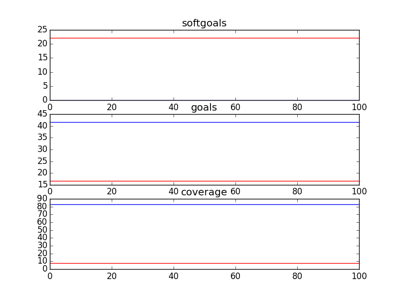
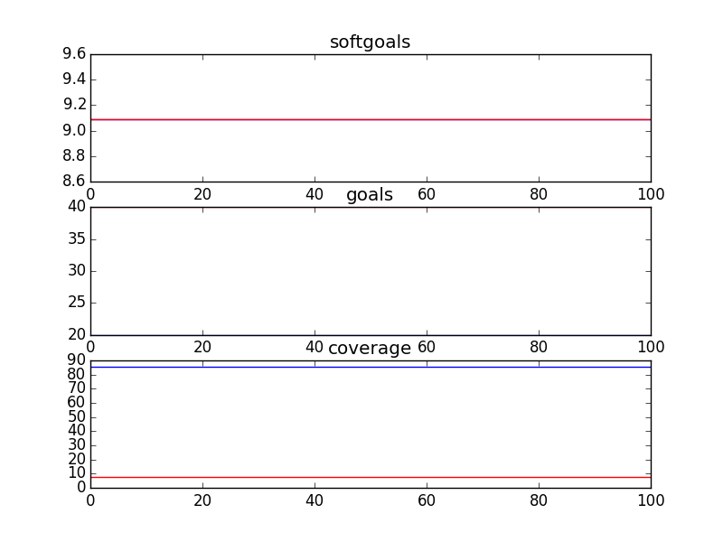
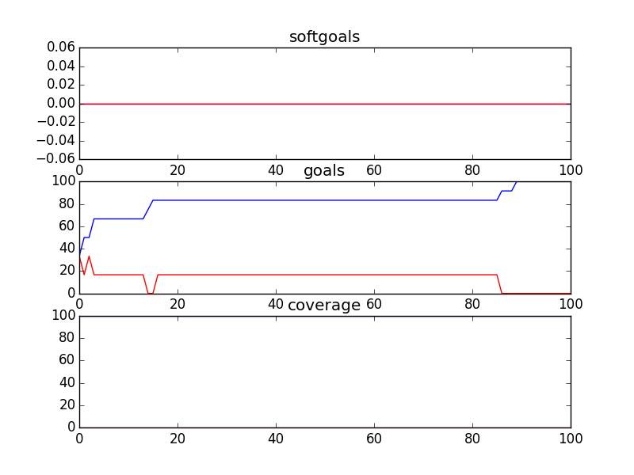

### bCMS_SR_bCMS
```
{	:better gt
 	:binary True
 	:candidates 16
 	:cr 0.3
 	:evaluation evaluate_random
 	:f 0.75
 	:gens 100
 	:is_percent True
 	:obj_funcs ['eval_softgoals', 'eval_goals', 'eval_coverage']
 	:seed 1
}
Time Taken :  0.773589134216

rank ,         name ,    med   ,   iqr 
----------------------------------------------------
   1 ,      gen0_f1 ,    36.36  ,   9.09 (-------------- |      *------ ), 9.09, 27.27, 36.36, 36.36, 45.45
   1 ,     gen20_f1 ,    36.36  ,   9.09 (-------------- |      *------ ), 9.09, 27.27, 36.36, 36.36, 45.45
   1 ,     gen40_f1 ,    36.36  ,   9.09 (-------------- |      *------ ), 9.09, 27.27, 36.36, 36.36, 45.45
   1 ,     gen60_f1 ,    36.36  ,   9.09 (-------------- |      *------ ), 9.09, 27.27, 36.36, 36.36, 45.45
   1 ,     gen80_f1 ,    36.36  ,   9.09 (-------------- |      *------ ), 9.09, 27.27, 36.36, 36.36, 45.45
   1 ,    gen100_f1 ,    36.36  ,   9.09 (-------------- |      *------ ), 9.09, 27.27, 36.36, 36.36, 45.45

rank ,         name ,    med   ,   iqr 
----------------------------------------------------
   1 ,      gen0_f2 ,    47.62  ,  14.28 (       --------|      *       ),28.57, 38.10, 47.62, 52.38, 52.38
   1 ,     gen20_f2 ,    47.62  ,  14.28 (       --------|      *       ),28.57, 38.10, 47.62, 52.38, 52.38
   1 ,     gen40_f2 ,    47.62  ,  14.28 (       --------|      *       ),28.57, 38.10, 47.62, 52.38, 52.38
   1 ,     gen60_f2 ,    47.62  ,  14.28 (       --------|      *       ),28.57, 38.10, 47.62, 52.38, 52.38
   1 ,     gen80_f2 ,    47.62  ,  14.28 (       --------|      *       ),28.57, 38.10, 47.62, 52.38, 52.38
   1 ,    gen100_f2 ,    47.62  ,  14.28 (       --------|      *       ),28.57, 38.10, 47.62, 52.38, 52.38

rank ,         name ,    med   ,   iqr 
----------------------------------------------------
   1 ,      gen0_f3 ,     90.0  ,    4.0 (               |      *       ),88.00, 88.00, 90.00, 92.00, 92.00
   1 ,     gen20_f3 ,     90.0  ,    4.0 (               |      *       ),88.00, 88.00, 90.00, 92.00, 92.00
   1 ,     gen40_f3 ,     90.0  ,    4.0 (               |      *       ),88.00, 88.00, 90.00, 92.00, 92.00
   1 ,     gen60_f3 ,     90.0  ,    4.0 (               |      *       ),88.00, 88.00, 90.00, 92.00, 92.00
   1 ,     gen80_f3 ,     90.0  ,    4.0 (               |      *       ),88.00, 88.00, 90.00, 92.00, 92.00
   1 ,    gen100_f3 ,     90.0  ,    4.0 (               |      *       ),88.00, 88.00, 90.00, 92.00, 92.00

```


### bCMS_SR_bCMS_AuthenticationVariation
```
{	:better gt
 	:binary True
 	:candidates 50
 	:cr 0.3
 	:evaluation evaluate_random
 	:f 0.75
 	:gens 100
 	:is_percent True
 	:obj_funcs ['eval_softgoals', 'eval_goals', 'eval_coverage']
 	:seed 1
}
Time Taken :  3.2999329567

rank ,         name ,    med   ,   iqr 
----------------------------------------------------
   1 ,      gen0_f1 ,    36.36  ,  18.18 (    ---------- |   *----      ), 9.09, 27.27, 36.36, 36.36, 45.45
   1 ,     gen20_f1 ,    36.36  ,   9.09 (              -|---*    ----- ),27.27, 36.36, 36.36, 45.45, 54.55
   2 ,     gen40_f1 ,    45.45  ,   9.09 (              -|---     *---- ),27.27, 36.36, 45.45, 45.45, 54.55
   2 ,     gen60_f1 ,    45.45  ,  18.19 (              -|---     *---- ),27.27, 36.36, 45.45, 45.45, 54.55
   2 ,     gen80_f1 ,    45.45  ,  18.19 (              -|---     *     ),27.27, 36.36, 45.45, 54.55, 54.55
   2 ,    gen100_f1 ,    45.45  ,  18.19 (              -|---     *     ),27.27, 36.36, 45.45, 54.55, 54.55

rank ,         name ,    med   ,   iqr 
----------------------------------------------------
   1 ,      gen0_f2 ,    57.14  ,  19.04 (        ----   | * ---        ),33.33, 42.86, 57.14, 61.90, 71.43
   2 ,     gen20_f2 ,    66.67  ,  14.29 (              -|-    *--      ),47.62, 57.14, 66.67, 71.43, 76.19
   2 ,     gen40_f2 ,    66.67  ,  14.29 (              -|---  *        ),47.62, 61.90, 66.67, 76.19, 76.19
   2 ,     gen60_f2 ,    66.67  ,  14.29 (               |---  *  --    ),52.38, 61.90, 66.67, 76.19, 80.95
   2 ,     gen80_f2 ,    66.67  ,  14.29 (               |---  *  --    ),52.38, 61.90, 66.67, 76.19, 80.95
   2 ,    gen100_f2 ,    71.43  ,  14.29 (               |---   * --    ),52.38, 61.90, 71.43, 76.19, 80.95

rank ,         name ,    med   ,   iqr 
----------------------------------------------------
   1 ,      gen0_f3 ,    89.66  ,   3.45 (   ------    * |-------       ),84.48, 87.93, 89.66, 91.38, 94.83
   2 ,     gen20_f3 ,     93.1  ,   5.17 (             --|   *          ),89.66, 91.38, 93.10, 94.83, 94.83
   2 ,     gen40_f3 ,     93.1  ,   3.45 (             --|   *          ),89.66, 91.38, 93.10, 94.83, 94.83
   2 ,     gen60_f3 ,     93.1  ,   3.45 (             --|---*   ---    ),89.66, 93.10, 93.10, 94.83, 96.55
   2 ,     gen80_f3 ,     93.1  ,   3.45 (               |---*   ---    ),91.38, 93.10, 93.10, 94.83, 96.55
   2 ,    gen100_f3 ,     93.1  ,   1.73 (               |---*   ---    ),91.38, 93.10, 93.10, 94.83, 96.55

```


### bCMS_SR_bCMS_exceptional
```
{	:better gt
 	:binary True
 	:candidates 4
 	:cr 0.3
 	:evaluation evaluate_random
 	:f 0.75
 	:gens 100
 	:is_percent True
 	:obj_funcs ['eval_softgoals', 'eval_goals', 'eval_coverage']
 	:seed 1
}
../GMRepo/CMA12/bCMS_SR_bCMS_exceptional.ood
Cannot generate 4 candidates with 10 leaves
```

### bCMS_SR_bCMS_VehicleCommunicationVariant
```
{	:better gt
 	:binary True
 	:candidates 50
 	:cr 0.3
 	:evaluation evaluate_random
 	:f 0.75
 	:gens 100
 	:is_percent True
 	:obj_funcs ['eval_softgoals', 'eval_goals', 'eval_coverage']
 	:seed 1
}
Time Taken :  3.91691994667

rank ,         name ,    med   ,   iqr 
----------------------------------------------------
   1 ,      gen0_f1 ,    27.27  ,  18.18 (    -----     *|---           ),18.18, 27.27, 36.36, 36.36, 45.45
   2 ,     gen20_f1 ,    36.36  ,   9.09 (         ----- |   *-----     ),27.27, 36.36, 45.45, 45.45, 54.55
   2 ,     gen40_f1 ,    45.45  ,   9.09 (         ----- |   *-----     ),27.27, 36.36, 45.45, 45.45, 54.55
   2 ,     gen60_f1 ,    45.45  ,   9.09 (         ----- |   *-----     ),27.27, 36.36, 45.45, 45.45, 54.55
   2 ,     gen80_f1 ,    45.45  ,   9.09 (         ----- |   *-----     ),27.27, 36.36, 45.45, 45.45, 54.55
   2 ,    gen100_f1 ,    45.45  ,   9.09 (         ----- |   *-----     ),27.27, 36.36, 45.45, 45.45, 54.55

rank ,         name ,    med   ,   iqr 
----------------------------------------------------
   1 ,      gen0_f2 ,     50.0  ,  13.64 (       ----  * |----          ),36.36, 45.45, 50.00, 54.55, 68.18
   2 ,     gen20_f2 ,    59.09  ,  18.18 (         ------|  * ----      ),40.91, 54.55, 63.64, 68.18, 77.27
   3 ,     gen40_f2 ,    63.64  ,  13.64 (           ----|--  * --      ),45.45, 63.64, 68.18, 72.73, 77.27
   3 ,     gen60_f2 ,    68.18  ,  13.64 (               |--  * --      ),54.55, 63.64, 68.18, 72.73, 77.27
   3 ,     gen80_f2 ,    68.18  ,   9.09 (               |--  * ----    ),54.55, 63.64, 68.18, 72.73, 81.82
   3 ,    gen100_f2 ,    68.18  ,   9.09 (               |--  * ----    ),54.55, 63.64, 68.18, 72.73, 81.82

rank ,         name ,    med   ,   iqr 
----------------------------------------------------
   1 ,      gen0_f3 ,    86.44  ,   5.08 (   ----    *   |  ----        ),83.05, 84.75, 86.44, 89.83, 91.53
   2 ,     gen20_f3 ,    89.83  ,   3.39 (           --- |  *   ----    ),86.44, 88.14, 89.83, 91.53, 93.22
   2 ,     gen40_f3 ,    89.83  ,   3.39 (           --- |  *   ----    ),86.44, 88.14, 89.83, 91.53, 93.22
   2 ,     gen60_f3 ,    89.83  ,   3.39 (           --- |  *   ----    ),86.44, 88.14, 89.83, 91.53, 93.22
   2 ,     gen80_f3 ,    89.83  ,   3.39 (           --- |  *   ----    ),86.44, 88.14, 89.83, 91.53, 93.22
   2 ,    gen100_f3 ,    89.83  ,   3.39 (               |  *   ----    ),88.14, 88.14, 89.83, 91.53, 93.22

```


### bCMS_SR_CommunicationCompromiser
```
{	:better gt
 	:binary True
 	:candidates 16
 	:cr 0.3
 	:evaluation evaluate_random
 	:f 0.75
 	:gens 100
 	:is_percent True
 	:obj_funcs ['eval_softgoals', 'eval_goals', 'eval_coverage']
 	:seed 1
}
Time Taken :  0.482604026794

rank ,         name ,    med   ,   iqr 
----------------------------------------------------
   1 ,      gen0_f1 ,      0.0  ,    0.0 (*              |              ), 0.00,  0.00,  0.00,  0.00,  0.00
   1 ,     gen20_f1 ,      0.0  ,    0.0 (*              |              ), 0.00,  0.00,  0.00,  0.00,  0.00
   1 ,     gen40_f1 ,      0.0  ,    0.0 (*              |              ), 0.00,  0.00,  0.00,  0.00,  0.00
   1 ,     gen60_f1 ,      0.0  ,    0.0 (*              |              ), 0.00,  0.00,  0.00,  0.00,  0.00
   1 ,     gen80_f1 ,      0.0  ,    0.0 (*              |              ), 0.00,  0.00,  0.00,  0.00,  0.00
   1 ,    gen100_f1 ,      0.0  ,    0.0 (*              |              ), 0.00,  0.00,  0.00,  0.00,  0.00

rank ,         name ,    med   ,   iqr 
----------------------------------------------------
   1 ,      gen0_f2 ,      0.0  ,  33.33 (*              |              ), 0.00,  0.00,  0.00, 33.33, 33.33
   1 ,     gen20_f2 ,      0.0  ,  33.33 (*              |              ), 0.00,  0.00,  0.00, 33.33, 33.33
   1 ,     gen40_f2 ,      0.0  ,  33.33 (*              |              ), 0.00,  0.00,  0.00, 33.33, 33.33
   1 ,     gen60_f2 ,      0.0  ,  33.33 (*              |              ), 0.00,  0.00,  0.00, 33.33, 33.33
   1 ,     gen80_f2 ,      0.0  ,  33.33 (*              |              ), 0.00,  0.00,  0.00, 33.33, 33.33
   1 ,    gen100_f2 ,      0.0  ,  33.33 (*              |              ), 0.00,  0.00,  0.00, 33.33, 33.33

rank ,         name ,    med   ,   iqr 
----------------------------------------------------
   1 ,      gen0_f3 ,    85.71  ,   7.14 (              *|------------- ),78.57, 78.57, 85.71, 85.71, 92.86
   1 ,     gen20_f3 ,    85.71  ,   7.14 (              *|------------- ),78.57, 78.57, 85.71, 85.71, 92.86
   1 ,     gen40_f3 ,    85.71  ,   7.14 (              *|------------- ),78.57, 78.57, 85.71, 85.71, 92.86
   1 ,     gen60_f3 ,    85.71  ,   7.14 (              *|------------- ),78.57, 78.57, 85.71, 85.71, 92.86
   1 ,     gen80_f3 ,    85.71  ,   7.14 (              *|------------- ),78.57, 78.57, 85.71, 85.71, 92.86
   1 ,    gen100_f3 ,    85.71  ,   7.14 (              *|------------- ),78.57, 78.57, 85.71, 85.71, 92.86

```


### bCMS_SR_Fireman
```
{	:better gt
 	:binary True
 	:candidates 16
 	:cr 0.3
 	:evaluation evaluate_random
 	:f 0.75
 	:gens 100
 	:is_percent True
 	:obj_funcs ['eval_softgoals', 'eval_goals', 'eval_coverage']
 	:seed 1
}
Time Taken :  0.954522132874

rank ,         name ,    med   ,   iqr 
----------------------------------------------------
   1 ,      gen0_f1 ,    17.65  ,  11.76 (-------*       |------        ),11.76, 17.65, 17.65, 23.53, 29.41
   1 ,     gen20_f1 ,    17.65  ,  11.76 (-------*       |------        ),11.76, 17.65, 17.65, 23.53, 29.41
   1 ,     gen40_f1 ,    17.65  ,  11.76 (-------*       |------        ),11.76, 17.65, 17.65, 23.53, 29.41
   1 ,     gen60_f1 ,    17.65  ,  11.76 (-------*       |------        ),11.76, 17.65, 17.65, 23.53, 29.41
   1 ,     gen80_f1 ,    17.65  ,  11.76 (-------*       |------        ),11.76, 17.65, 17.65, 23.53, 29.41
   1 ,    gen100_f1 ,    17.65  ,  11.76 (-------*       |------        ),11.76, 17.65, 17.65, 23.53, 29.41

rank ,         name ,    med   ,   iqr 
----------------------------------------------------
   1 ,      gen0_f2 ,     40.0  ,   30.0 (--------    *  |     ----     ),10.00, 30.00, 40.00, 60.00, 70.00
   1 ,     gen20_f2 ,     40.0  ,   30.0 (--------    *  |     ----     ),10.00, 30.00, 40.00, 60.00, 70.00
   1 ,     gen40_f2 ,     40.0  ,   30.0 (--------    *  |     ----     ),10.00, 30.00, 40.00, 60.00, 70.00
   1 ,     gen60_f2 ,     40.0  ,   30.0 (--------    *  |     ----     ),10.00, 30.00, 40.00, 60.00, 70.00
   1 ,     gen80_f2 ,     40.0  ,   30.0 (--------    *  |     ----     ),10.00, 30.00, 40.00, 60.00, 70.00
   1 ,    gen100_f2 ,     40.0  ,   30.0 (--------    *  |     ----     ),10.00, 30.00, 40.00, 60.00, 70.00

rank ,         name ,    med   ,   iqr 
----------------------------------------------------
   1 ,      gen0_f3 ,    95.12  ,   2.44 (---------*-----|---           ),92.68, 95.12, 95.12, 95.12, 97.56
   1 ,     gen20_f3 ,    95.12  ,   2.44 (---------*-----|---           ),92.68, 95.12, 95.12, 95.12, 97.56
   1 ,     gen40_f3 ,    95.12  ,   2.44 (---------*-----|---           ),92.68, 95.12, 95.12, 95.12, 97.56
   1 ,     gen60_f3 ,    95.12  ,   2.44 (---------*-----|---           ),92.68, 95.12, 95.12, 95.12, 97.56
   1 ,     gen80_f3 ,    95.12  ,   2.44 (---------*-----|---           ),92.68, 95.12, 95.12, 95.12, 97.56
   1 ,    gen100_f3 ,    95.12  ,   2.44 (---------*-----|---           ),92.68, 95.12, 95.12, 95.12, 97.56

```


### bCMS_SR_FSC
```
{	:better gt
 	:binary True
 	:candidates 8
 	:cr 0.3
 	:evaluation evaluate_random
 	:f 0.75
 	:gens 100
 	:is_percent True
 	:obj_funcs ['eval_softgoals', 'eval_goals', 'eval_coverage']
 	:seed 1
}
../GMRepo/CMA12/bCMS_SR_FSC.ood
Cannot generate 8 candidates with 5 leaves
```

### bCMS_SR_GovernmentAgency
```
{	:better gt
 	:binary True
 	:candidates 1
 	:cr 0.3
 	:evaluation evaluate_random
 	:f 0.75
 	:gens 100
 	:is_percent True
 	:obj_funcs ['eval_softgoals', 'eval_goals', 'eval_coverage']
 	:seed 1
}
../GMRepo/CMA12/bCMS_SR_GovernmentAgency.ood
Cannot generate 1 candidates with 7 leaves
```

### bCMS_SR_Policeman
```
{	:better gt
 	:binary True
 	:candidates 16
 	:cr 0.3
 	:evaluation evaluate_random
 	:f 0.75
 	:gens 100
 	:is_percent True
 	:obj_funcs ['eval_softgoals', 'eval_goals', 'eval_coverage']
 	:seed 1
}
Time Taken :  0.429926156998

rank ,         name ,    med   ,   iqr 
----------------------------------------------------
   1 ,      gen0_f1 ,    11.11  ,  22.22 (              *|------------- ), 0.00,  0.00, 11.11, 11.11, 22.22
   1 ,     gen20_f1 ,    11.11  ,  22.22 (              *|------------- ), 0.00,  0.00, 11.11, 11.11, 22.22
   1 ,     gen40_f1 ,    11.11  ,  22.22 (              *|------------- ), 0.00,  0.00, 11.11, 11.11, 22.22
   1 ,     gen60_f1 ,    11.11  ,  22.22 (              *|------------- ), 0.00,  0.00, 11.11, 11.11, 22.22
   1 ,     gen80_f1 ,    11.11  ,  22.22 (              *|------------- ), 0.00,  0.00, 11.11, 11.11, 22.22
   1 ,    gen100_f1 ,    11.11  ,  22.22 (              *|------------- ), 0.00,  0.00, 11.11, 11.11, 22.22

rank ,         name ,    med   ,   iqr 
----------------------------------------------------
   1 ,      gen0_f2 ,     50.0  ,  16.67 (     ---------*|--------      ),16.67, 50.00, 50.00, 50.00, 83.33
   1 ,     gen20_f2 ,     50.0  ,  16.67 (     ---------*|--------      ),16.67, 50.00, 50.00, 50.00, 83.33
   1 ,     gen40_f2 ,     50.0  ,  16.67 (     ---------*|--------      ),16.67, 50.00, 50.00, 50.00, 83.33
   1 ,     gen60_f2 ,     50.0  ,  16.67 (     ---------*|--------      ),16.67, 50.00, 50.00, 50.00, 83.33
   1 ,     gen80_f2 ,     50.0  ,  16.67 (     ---------*|--------      ),16.67, 50.00, 50.00, 50.00, 83.33
   1 ,    gen100_f2 ,     50.0  ,  16.67 (     ---------*|--------      ),16.67, 50.00, 50.00, 50.00, 83.33

rank ,         name ,    med   ,   iqr 
----------------------------------------------------
   1 ,      gen0_f3 ,    88.46  ,   7.69 (      ------   |  *-----      ),80.77, 84.62, 88.46, 88.46, 92.31
   1 ,     gen20_f3 ,    88.46  ,   7.69 (      ------   |  *-----      ),80.77, 84.62, 88.46, 88.46, 92.31
   1 ,     gen40_f3 ,    88.46  ,   7.69 (      ------   |  *-----      ),80.77, 84.62, 88.46, 88.46, 92.31
   1 ,     gen60_f3 ,    88.46  ,   7.69 (      ------   |  *-----      ),80.77, 84.62, 88.46, 88.46, 92.31
   1 ,     gen80_f3 ,    88.46  ,   7.69 (      ------   |  *-----      ),80.77, 84.62, 88.46, 88.46, 92.31
   1 ,    gen100_f3 ,    88.46  ,   7.69 (      ------   |  *-----      ),80.77, 84.62, 88.46, 88.46, 92.31

```


### bCMS_SR_PSC
```
{	:better gt
 	:binary True
 	:candidates 8
 	:cr 0.3
 	:evaluation evaluate_random
 	:f 0.75
 	:gens 100
 	:is_percent True
 	:obj_funcs ['eval_softgoals', 'eval_goals', 'eval_coverage']
 	:seed 1
}
../GMRepo/CMA12/bCMS_SR_PSC.ood
Cannot generate 8 candidates with 5 leaves
```

### bCMS_SR_Victim
```
{	:better gt
 	:binary True
 	:candidates 50
 	:cr 0.3
 	:evaluation evaluate_random
 	:f 0.75
 	:gens 100
 	:is_percent True
 	:obj_funcs ['eval_softgoals', 'eval_goals', 'eval_coverage']
 	:seed 1
}
Time Taken :  2.34017300606

rank ,         name ,    med   ,   iqr 
----------------------------------------------------
   1 ,      gen0_f1 ,     7.14  ,  14.29 (--------------*|              ), 0.00,  7.14,  7.14, 14.29, 14.29
   2 ,     gen20_f1 ,    14.29  ,   7.15 (               |             *), 7.14,  7.14, 14.29, 14.29, 14.29
   2 ,     gen40_f1 ,    14.29  ,   7.15 (               |             *), 7.14,  7.14, 14.29, 14.29, 14.29
   2 ,     gen60_f1 ,    14.29  ,   7.15 (               |             *), 7.14,  7.14, 14.29, 14.29, 14.29
   2 ,     gen80_f1 ,    14.29  ,   7.15 (               |             *), 7.14,  7.14, 14.29, 14.29, 14.29
   2 ,    gen100_f1 ,    14.29  ,   7.15 (               |             *), 7.14,  7.14, 14.29, 14.29, 14.29

rank ,         name ,    med   ,   iqr 
----------------------------------------------------
   1 ,      gen0_f2 ,    33.33  ,  33.33 (      -----*   |  ------      ),16.67, 33.33, 33.33, 50.00, 66.67
   2 ,     gen20_f2 ,     50.0  ,  33.34 (           ----|--      *---- ),33.33, 50.00, 66.67, 66.67, 83.33
   2 ,     gen40_f2 ,    66.67  ,  16.67 (           ----|--      *---- ),33.33, 50.00, 66.67, 66.67, 83.33
   2 ,     gen60_f2 ,    66.67  ,  16.67 (           ----|--      *---- ),33.33, 50.00, 66.67, 66.67, 83.33
   2 ,     gen80_f2 ,    66.67  ,  16.67 (           ----|--      *---- ),33.33, 50.00, 66.67, 66.67, 83.33
   2 ,    gen100_f2 ,    66.67  ,  16.67 (               |        *---- ),50.00, 50.00, 66.67, 66.67, 83.33

rank ,         name ,    med   ,   iqr 
----------------------------------------------------
   1 ,      gen0_f3 ,    90.91  ,   3.03 (-------*      -|------        ),87.88, 90.91, 90.91, 93.94, 96.97
   2 ,     gen20_f3 ,    93.94  ,   3.03 (       -------*|              ),90.91, 93.94, 93.94, 96.97, 96.97
   2 ,     gen40_f3 ,    93.94  ,   3.03 (       -------*|              ),90.91, 93.94, 93.94, 96.97, 96.97
   2 ,     gen60_f3 ,    93.94  ,   3.03 (              *|              ),93.94, 93.94, 93.94, 96.97, 96.97
   2 ,     gen80_f3 ,    93.94  ,   3.03 (              *|              ),93.94, 93.94, 93.94, 96.97, 96.97
   2 ,    gen100_f3 ,    93.94  ,   3.03 (              *|              ),93.94, 93.94, 93.94, 96.97, 96.97

```


### bCMS_SR_Witness
```
{	:better gt
 	:binary True
 	:candidates 32
 	:cr 0.3
 	:evaluation evaluate_random
 	:f 0.75
 	:gens 100
 	:is_percent True
 	:obj_funcs ['eval_softgoals', 'eval_goals', 'eval_coverage']
 	:seed 1
}
Time Taken :  1.20191884041

rank ,         name ,    med   ,   iqr 
----------------------------------------------------
   1 ,      gen0_f1 ,    18.18  ,   9.09 (               |   *--------- ), 9.09,  9.09, 18.18, 18.18, 27.27
   1 ,     gen20_f1 ,    18.18  ,   9.09 (               |   *--------- ), 9.09,  9.09, 18.18, 18.18, 27.27
   1 ,     gen40_f1 ,    18.18  ,   9.09 (               |   *--------- ), 9.09,  9.09, 18.18, 18.18, 27.27
   1 ,     gen60_f1 ,    18.18  ,   9.09 (               |   *--------- ), 9.09,  9.09, 18.18, 18.18, 27.27
   1 ,     gen80_f1 ,    18.18  ,   9.09 (               |   *--------- ), 9.09,  9.09, 18.18, 18.18, 27.27
   1 ,    gen100_f1 ,    18.18  ,   9.09 (               |   *--------- ), 9.09,  9.09, 18.18, 18.18, 27.27

rank ,         name ,    med   ,   iqr 
----------------------------------------------------
   1 ,      gen0_f2 ,     40.0  ,   40.0 (              *|              ),20.00, 20.00, 40.00, 60.00, 60.00
   1 ,     gen20_f2 ,     40.0  ,   40.0 (              *|              ),20.00, 20.00, 40.00, 60.00, 60.00
   1 ,     gen40_f2 ,     40.0  ,   40.0 (              *|              ),20.00, 20.00, 40.00, 60.00, 60.00
   1 ,     gen60_f2 ,     40.0  ,   40.0 (              *|              ),20.00, 20.00, 40.00, 60.00, 60.00
   1 ,     gen80_f2 ,     40.0  ,   40.0 (              *|              ),20.00, 20.00, 40.00, 60.00, 60.00
   1 ,    gen100_f2 ,     40.0  ,   40.0 (              *|              ),20.00, 20.00, 40.00, 60.00, 60.00

rank ,         name ,    med   ,   iqr 
----------------------------------------------------
   1 ,      gen0_f3 ,    88.89  ,    7.4 (              *|------        ),85.19, 85.19, 88.89, 88.89, 92.59
   1 ,     gen20_f3 ,    88.89  ,    7.4 (              *|------        ),85.19, 85.19, 88.89, 88.89, 92.59
   1 ,     gen40_f3 ,    88.89  ,    7.4 (              *|------        ),85.19, 85.19, 88.89, 88.89, 92.59
   1 ,     gen60_f3 ,    88.89  ,    7.4 (              *|------        ),85.19, 85.19, 88.89, 88.89, 92.59
   1 ,     gen80_f3 ,    88.89  ,    7.4 (              *|------        ),85.19, 85.19, 88.89, 88.89, 92.59
   1 ,    gen100_f3 ,    88.89  ,    7.4 (              *|------        ),85.19, 85.19, 88.89, 88.89, 92.59

```


### bCMS_StrategicDependency_MultiplicityVariant
```
{	:better gt
 	:binary True
 	:candidates 50
 	:cr 0.3
 	:evaluation evaluate_random
 	:f 0.75
 	:gens 100
 	:is_percent True
 	:obj_funcs ['eval_softgoals', 'eval_goals', 'eval_coverage']
 	:seed 1
}
Time Taken :  1.7499859333

rank ,         name ,    med   ,   iqr 
----------------------------------------------------
   1 ,      gen0_f1 ,      0.0  ,    0.0 (*              |              ), 0.00,  0.00,  0.00,  0.00,  0.00
   1 ,     gen20_f1 ,      0.0  ,    0.0 (*              |              ), 0.00,  0.00,  0.00,  0.00,  0.00
   1 ,     gen40_f1 ,      0.0  ,    0.0 (*              |              ), 0.00,  0.00,  0.00,  0.00,  0.00
   1 ,     gen60_f1 ,      0.0  ,    0.0 (*              |              ), 0.00,  0.00,  0.00,  0.00,  0.00
   1 ,     gen80_f1 ,      0.0  ,    0.0 (*              |              ), 0.00,  0.00,  0.00,  0.00,  0.00
   1 ,    gen100_f1 ,      0.0  ,    0.0 (*              |              ), 0.00,  0.00,  0.00,  0.00,  0.00

rank ,         name ,    med   ,   iqr 
----------------------------------------------------
   1 ,      gen0_f2 ,     50.0  ,  33.34 (-----------*   |  -----       ),16.67, 50.00, 50.00, 66.67, 83.33
   2 ,     gen20_f2 ,    83.33  ,  16.67 (               |       *      ),83.33, 83.33, 83.33, 100.00, 100.00
   2 ,     gen40_f2 ,    83.33  ,  16.67 (               |       *      ),83.33, 83.33, 83.33, 100.00, 100.00
   3 ,     gen60_f2 ,    100.0  ,  16.67 (               |             *),83.33, 83.33, 100.00, 100.00, 100.00
   3 ,     gen80_f2 ,    100.0  ,  16.67 (               |       ------*),83.33, 100.00, 100.00, 100.00, 100.00
   3 ,    gen100_f2 ,    100.0  ,    0.0 (               |       ------*),83.33, 100.00, 100.00, 100.00, 100.00

rank ,         name ,    med   ,   iqr 
----------------------------------------------------
   1 ,      gen0_f3 ,    100.0  ,    0.0 (*              |              ),100.00, 100.00, 100.00, 100.00, 100.00
   1 ,     gen20_f3 ,    100.0  ,    0.0 (*              |              ),100.00, 100.00, 100.00, 100.00, 100.00
   1 ,     gen40_f3 ,    100.0  ,    0.0 (*              |              ),100.00, 100.00, 100.00, 100.00, 100.00
   1 ,     gen60_f3 ,    100.0  ,    0.0 (*              |              ),100.00, 100.00, 100.00, 100.00, 100.00
   1 ,     gen80_f3 ,    100.0  ,    0.0 (*              |              ),100.00, 100.00, 100.00, 100.00, 100.00
   1 ,    gen100_f3 ,    100.0  ,    0.0 (*              |              ),100.00, 100.00, 100.00, 100.00, 100.00

```


### bCMS_StrategicDependency_VehiclesVariant
```
{	:better gt
 	:binary True
 	:candidates 50
 	:cr 0.3
 	:evaluation evaluate_random
 	:f 0.75
 	:gens 100
 	:is_percent True
 	:obj_funcs ['eval_softgoals', 'eval_goals', 'eval_coverage']
 	:seed 1
}
Time Taken :  1.15645694733

rank ,         name ,    med   ,   iqr 
----------------------------------------------------
   1 ,      gen0_f1 ,      0.0  ,    0.0 (*              |              ), 0.00,  0.00,  0.00,  0.00,  0.00
   1 ,     gen20_f1 ,      0.0  ,    0.0 (*              |              ), 0.00,  0.00,  0.00,  0.00,  0.00
   1 ,     gen40_f1 ,      0.0  ,    0.0 (*              |              ), 0.00,  0.00,  0.00,  0.00,  0.00
   1 ,     gen60_f1 ,      0.0  ,    0.0 (*              |              ), 0.00,  0.00,  0.00,  0.00,  0.00
   1 ,     gen80_f1 ,      0.0  ,    0.0 (*              |              ), 0.00,  0.00,  0.00,  0.00,  0.00
   1 ,    gen100_f1 ,      0.0  ,    0.0 (*              |              ), 0.00,  0.00,  0.00,  0.00,  0.00

rank ,         name ,    med   ,   iqr 
----------------------------------------------------
   1 ,      gen0_f2 ,     50.0  ,   50.0 (       -------*|------        ),25.00, 50.00, 50.00, 50.00, 75.00
   2 ,     gen20_f2 ,    100.0  ,    0.0 (               |      -------*),75.00, 100.00, 100.00, 100.00, 100.00
   2 ,     gen40_f2 ,    100.0  ,    0.0 (               |             *),100.00, 100.00, 100.00, 100.00, 100.00
   2 ,     gen60_f2 ,    100.0  ,    0.0 (               |             *),100.00, 100.00, 100.00, 100.00, 100.00
   2 ,     gen80_f2 ,    100.0  ,    0.0 (               |             *),100.00, 100.00, 100.00, 100.00, 100.00
   2 ,    gen100_f2 ,    100.0  ,    0.0 (               |             *),100.00, 100.00, 100.00, 100.00, 100.00

rank ,         name ,    med   ,   iqr 
----------------------------------------------------
   1 ,      gen0_f3 ,    100.0  ,    0.0 (*              |              ),100.00, 100.00, 100.00, 100.00, 100.00
   1 ,     gen20_f3 ,    100.0  ,    0.0 (*              |              ),100.00, 100.00, 100.00, 100.00, 100.00
   1 ,     gen40_f3 ,    100.0  ,    0.0 (*              |              ),100.00, 100.00, 100.00, 100.00, 100.00
   1 ,     gen60_f3 ,    100.0  ,    0.0 (*              |              ),100.00, 100.00, 100.00, 100.00, 100.00
   1 ,     gen80_f3 ,    100.0  ,    0.0 (*              |              ),100.00, 100.00, 100.00, 100.00, 100.00
   1 ,    gen100_f3 ,    100.0  ,    0.0 (*              |              ),100.00, 100.00, 100.00, 100.00, 100.00

```


### bCMS_StrategicDependency_withbCMS
```
{	:better gt
 	:binary True
 	:candidates 50
 	:cr 0.3
 	:evaluation evaluate_random
 	:f 0.75
 	:gens 100
 	:is_percent True
 	:obj_funcs ['eval_softgoals', 'eval_goals', 'eval_coverage']
 	:seed 1
}
Time Taken :  1.58407211304

rank ,         name ,    med   ,   iqr 
----------------------------------------------------
   1 ,      gen0_f1 ,      0.0  ,    0.0 (*              |              ), 0.00,  0.00,  0.00,  0.00,  0.00
   1 ,     gen20_f1 ,      0.0  ,    0.0 (*              |              ), 0.00,  0.00,  0.00,  0.00,  0.00
   1 ,     gen40_f1 ,      0.0  ,    0.0 (*              |              ), 0.00,  0.00,  0.00,  0.00,  0.00
   1 ,     gen60_f1 ,      0.0  ,    0.0 (*              |              ), 0.00,  0.00,  0.00,  0.00,  0.00
   1 ,     gen80_f1 ,      0.0  ,    0.0 (*              |              ), 0.00,  0.00,  0.00,  0.00,  0.00
   1 ,    gen100_f1 ,      0.0  ,    0.0 (*              |              ), 0.00,  0.00,  0.00,  0.00,  0.00

rank ,         name ,    med   ,   iqr 
----------------------------------------------------
   1 ,      gen0_f2 ,     50.0  ,  33.34 (-----------*   |  -----       ),16.67, 50.00, 50.00, 66.67, 83.33
   2 ,     gen20_f2 ,    83.33  ,  16.67 (               |       *      ),83.33, 83.33, 83.33, 100.00, 100.00
   2 ,     gen40_f2 ,    83.33  ,  16.67 (               |       *      ),83.33, 83.33, 83.33, 100.00, 100.00
   3 ,     gen60_f2 ,    100.0  ,  16.67 (               |             *),83.33, 83.33, 100.00, 100.00, 100.00
   3 ,     gen80_f2 ,    100.0  ,  16.67 (               |       ------*),83.33, 100.00, 100.00, 100.00, 100.00
   3 ,    gen100_f2 ,    100.0  ,    0.0 (               |       ------*),83.33, 100.00, 100.00, 100.00, 100.00

rank ,         name ,    med   ,   iqr 
----------------------------------------------------
   1 ,      gen0_f3 ,    100.0  ,    0.0 (*              |              ),100.00, 100.00, 100.00, 100.00, 100.00
   1 ,     gen20_f3 ,    100.0  ,    0.0 (*              |              ),100.00, 100.00, 100.00, 100.00, 100.00
   1 ,     gen40_f3 ,    100.0  ,    0.0 (*              |              ),100.00, 100.00, 100.00, 100.00, 100.00
   1 ,     gen60_f3 ,    100.0  ,    0.0 (*              |              ),100.00, 100.00, 100.00, 100.00, 100.00
   1 ,     gen80_f3 ,    100.0  ,    0.0 (*              |              ),100.00, 100.00, 100.00, 100.00, 100.00
   1 ,    gen100_f3 ,    100.0  ,    0.0 (*              |              ),100.00, 100.00, 100.00, 100.00, 100.00

```


### bCMS_StrategicDependency_withoutbCMS
```
{	:better gt
 	:binary True
 	:candidates 50
 	:cr 0.3
 	:evaluation evaluate_random
 	:f 0.75
 	:gens 100
 	:is_percent True
 	:obj_funcs ['eval_softgoals', 'eval_goals', 'eval_coverage']
 	:seed 1
}
Time Taken :  1.72402691841

rank ,         name ,    med   ,   iqr 
----------------------------------------------------
   1 ,      gen0_f1 ,      0.0  ,    0.0 (*              |              ), 0.00,  0.00,  0.00,  0.00,  0.00
   1 ,     gen20_f1 ,      0.0  ,    0.0 (*              |              ), 0.00,  0.00,  0.00,  0.00,  0.00
   1 ,     gen40_f1 ,      0.0  ,    0.0 (*              |              ), 0.00,  0.00,  0.00,  0.00,  0.00
   1 ,     gen60_f1 ,      0.0  ,    0.0 (*              |              ), 0.00,  0.00,  0.00,  0.00,  0.00
   1 ,     gen80_f1 ,      0.0  ,    0.0 (*              |              ), 0.00,  0.00,  0.00,  0.00,  0.00
   1 ,    gen100_f1 ,      0.0  ,    0.0 (*              |              ), 0.00,  0.00,  0.00,  0.00,  0.00

rank ,         name ,    med   ,   iqr 
----------------------------------------------------
   1 ,      gen0_f2 ,     50.0  ,   50.0 (              *|------------- ),25.00, 25.00, 50.00, 50.00, 100.00
   2 ,     gen20_f2 ,    100.0  ,   25.0 (               |             *),75.00, 75.00, 100.00, 100.00, 100.00
   2 ,     gen40_f2 ,    100.0  ,    0.0 (               |      -------*),75.00, 100.00, 100.00, 100.00, 100.00
   2 ,     gen60_f2 ,    100.0  ,    0.0 (               |             *),100.00, 100.00, 100.00, 100.00, 100.00
   2 ,     gen80_f2 ,    100.0  ,    0.0 (               |             *),100.00, 100.00, 100.00, 100.00, 100.00
   2 ,    gen100_f2 ,    100.0  ,    0.0 (               |             *),100.00, 100.00, 100.00, 100.00, 100.00

rank ,         name ,    med   ,   iqr 
----------------------------------------------------
   1 ,      gen0_f3 ,    100.0  ,    0.0 (*              |              ),100.00, 100.00, 100.00, 100.00, 100.00
   1 ,     gen20_f3 ,    100.0  ,    0.0 (*              |              ),100.00, 100.00, 100.00, 100.00, 100.00
   1 ,     gen40_f3 ,    100.0  ,    0.0 (*              |              ),100.00, 100.00, 100.00, 100.00, 100.00
   1 ,     gen60_f3 ,    100.0  ,    0.0 (*              |              ),100.00, 100.00, 100.00, 100.00, 100.00
   1 ,     gen80_f3 ,    100.0  ,    0.0 (*              |              ),100.00, 100.00, 100.00, 100.00, 100.00
   1 ,    gen100_f3 ,    100.0  ,    0.0 (*              |              ),100.00, 100.00, 100.00, 100.00, 100.00

```


