### bCMS_SR_bCMS
```
{	:better gt
 	:candidates 16
 	:cr 0.3
 	:evaluation evaluate_random
 	:f 0.75
 	:gens 100
 	:is_percent True
 	:obj_funcs ['eval_softgoals', 'eval_goals', 'eval_coverage']
 	:seed 1
}
Time Taken :  0.822210788727

rank ,         name ,    med   ,   iqr 
----------------------------------------------------
   1 ,      gen0_f1 ,    27.27  ,   9.09 (     ----------|-*     ------ ), 9.09, 27.27, 27.27, 36.36, 45.45
   1 ,     gen20_f1 ,    27.27  ,   9.09 (     ----------|-*     ------ ), 9.09, 27.27, 27.27, 36.36, 45.45
   1 ,     gen40_f1 ,    27.27  ,   9.09 (     ----------|-*     ------ ), 9.09, 27.27, 27.27, 36.36, 45.45
   1 ,     gen60_f1 ,    27.27  ,   9.09 (     ----------|-*     ------ ), 9.09, 27.27, 27.27, 36.36, 45.45
   1 ,     gen80_f1 ,    27.27  ,   9.09 (     ----------|-*     ------ ), 9.09, 27.27, 27.27, 36.36, 45.45
   1 ,    gen100_f1 ,    27.27  ,   9.09 (     ----------|-*     ------ ), 9.09, 27.27, 27.27, 36.36, 45.45

rank ,         name ,    med   ,   iqr 
----------------------------------------------------
   1 ,      gen0_f2 ,    47.62  ,  14.28 (--------    *  | ------------ ),33.33, 42.86, 47.62, 52.38, 66.67
   1 ,     gen20_f2 ,    47.62  ,  14.28 (--------    *  | ------------ ),33.33, 42.86, 47.62, 52.38, 66.67
   1 ,     gen40_f2 ,    47.62  ,  14.28 (--------    *  | ------------ ),33.33, 42.86, 47.62, 52.38, 66.67
   1 ,     gen60_f2 ,    47.62  ,  14.28 (--------    *  | ------------ ),33.33, 42.86, 47.62, 52.38, 66.67
   1 ,     gen80_f2 ,    47.62  ,  14.28 (--------    *  | ------------ ),33.33, 42.86, 47.62, 52.38, 66.67
   1 ,    gen100_f2 ,    47.62  ,  14.28 (--------    *  | ------------ ),33.33, 42.86, 47.62, 52.38, 66.67

rank ,         name ,    med   ,   iqr 
----------------------------------------------------
   1 ,      gen0_f3 ,     86.0  ,    4.0 (    -----     *|   -----      ),82.00, 84.00, 86.00, 88.00, 90.00
   1 ,     gen20_f3 ,     86.0  ,    4.0 (    -----     *|   -----      ),82.00, 84.00, 86.00, 88.00, 90.00
   1 ,     gen40_f3 ,     86.0  ,    4.0 (    -----     *|   -----      ),82.00, 84.00, 86.00, 88.00, 90.00
   1 ,     gen60_f3 ,     86.0  ,    4.0 (    -----     *|   -----      ),82.00, 84.00, 86.00, 88.00, 90.00
   1 ,     gen80_f3 ,     86.0  ,    4.0 (    -----     *|   -----      ),82.00, 84.00, 86.00, 88.00, 90.00
   1 ,    gen100_f3 ,     86.0  ,    4.0 (    -----     *|   -----      ),82.00, 84.00, 86.00, 88.00, 90.00

```
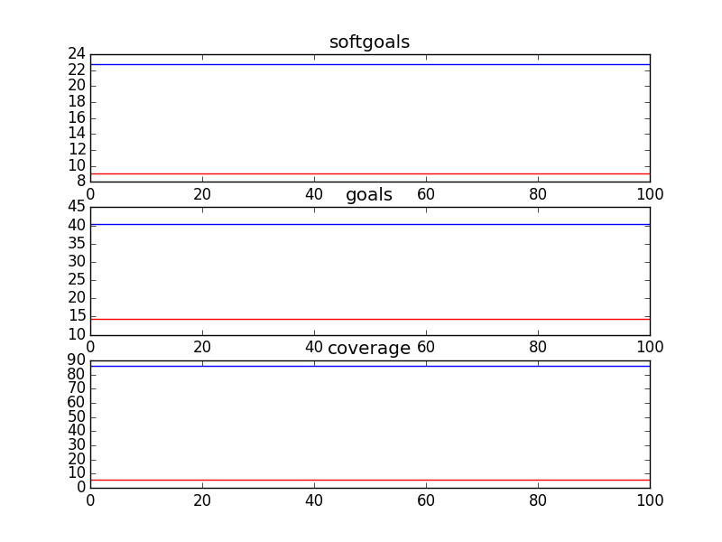

### bCMS_SR_bCMS_AuthenticationVariation
```
{	:better gt
 	:candidates 50
 	:cr 0.3
 	:evaluation evaluate_random
 	:f 0.75
 	:gens 100
 	:is_percent True
 	:obj_funcs ['eval_softgoals', 'eval_goals', 'eval_coverage']
 	:seed 1
}
Time Taken :  3.02226495743

rank ,         name ,    med   ,   iqr 
----------------------------------------------------
   1 ,      gen0_f1 ,    36.36  ,   9.09 (        ----   | *---         ),18.18, 27.27, 36.36, 36.36, 45.45
   1 ,     gen20_f1 ,    36.36  ,   9.09 (            ---|-*   ----     ),27.27, 36.36, 36.36, 45.45, 54.55
   2 ,     gen40_f1 ,    45.45  ,   9.09 (            ---|-    *---     ),27.27, 36.36, 45.45, 45.45, 54.55
   2 ,     gen60_f1 ,    45.45  ,   9.09 (            ---|-    *---     ),27.27, 36.36, 45.45, 45.45, 54.55
   2 ,     gen80_f1 ,    45.45  ,   9.09 (               |     *---     ),36.36, 36.36, 45.45, 45.45, 54.55
   2 ,    gen100_f1 ,    45.45  ,   9.09 (               |     *---     ),36.36, 36.36, 45.45, 45.45, 54.55

rank ,         name ,    med   ,   iqr 
----------------------------------------------------
   1 ,      gen0_f2 ,    47.62  ,  14.28 (    --     * --|----          ),33.33, 38.10, 47.62, 52.38, 66.67
   2 ,     gen20_f2 ,    57.14  ,  14.29 (         ----  |*   -----     ),42.86, 52.38, 57.14, 66.67, 76.19
   3 ,     gen40_f2 ,     61.9  ,  19.05 (           ----|  *    --     ),47.62, 57.14, 61.90, 71.43, 76.19
   3 ,     gen60_f2 ,    66.67  ,  14.29 (             --|    *  --     ),52.38, 57.14, 66.67, 71.43, 76.19
   3 ,     gen80_f2 ,    66.67  ,  14.29 (             --|    *  ----   ),52.38, 57.14, 66.67, 71.43, 80.95
   3 ,    gen100_f2 ,    66.67  ,  14.29 (             --|--  *  ----   ),52.38, 61.90, 66.67, 71.43, 80.95

rank ,         name ,    med   ,   iqr 
----------------------------------------------------
   1 ,      gen0_f3 ,    87.93  ,   3.45 (   ----    *   |--            ),84.48, 86.21, 87.93, 89.66, 91.38
   2 ,     gen20_f3 ,    89.66  ,   5.17 (           ----*  --------    ),87.93, 89.66, 89.66, 91.38, 94.83
   2 ,     gen40_f3 ,    89.66  ,   3.44 (           ----|  *   ----    ),87.93, 89.66, 91.38, 93.10, 94.83
   3 ,     gen60_f3 ,    91.38  ,   3.44 (           ----|  *   ----    ),87.93, 89.66, 91.38, 93.10, 94.83
   3 ,     gen80_f3 ,    91.38  ,   3.44 (               |  *   ----    ),89.66, 89.66, 91.38, 93.10, 94.83
   3 ,    gen100_f3 ,    91.38  ,   3.44 (               |  *   ----    ),89.66, 89.66, 91.38, 93.10, 94.83

```
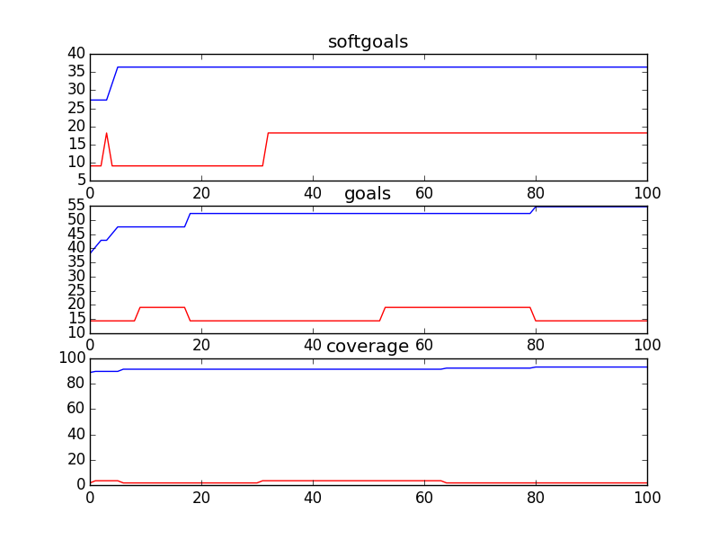

### bCMS_SR_bCMS_exceptional
```
{	:better gt
 	:candidates 4
 	:cr 0.3
 	:evaluation evaluate_random
 	:f 0.75
 	:gens 100
 	:is_percent True
 	:obj_funcs ['eval_softgoals', 'eval_goals', 'eval_coverage']
 	:seed 1
}
../GMRepo/CMA12/bCMS_SR_bCMS_exceptional.ood
Cannot generate 4 candidates with 10 leaves
```

### bCMS_SR_bCMS_VehicleCommunicationVariant
```
{	:better gt
 	:candidates 50
 	:cr 0.3
 	:evaluation evaluate_random
 	:f 0.75
 	:gens 100
 	:is_percent True
 	:obj_funcs ['eval_softgoals', 'eval_goals', 'eval_coverage']
 	:seed 1
}
Time Taken :  3.51138281822

rank ,         name ,    med   ,   iqr 
----------------------------------------------------
   1 ,      gen0_f1 ,    36.36  ,   9.09 (-----      *---|-             ),18.18, 27.27, 36.36, 36.36, 45.45
   1 ,     gen20_f1 ,    36.36  ,  18.18 (     ------*   | -------      ),27.27, 36.36, 36.36, 45.45, 54.55
   2 ,     gen40_f1 ,    36.36  ,   9.09 (     ------    | *------      ),27.27, 36.36, 45.45, 45.45, 54.55
   2 ,     gen60_f1 ,    45.45  ,   9.09 (     ------    | *------      ),27.27, 36.36, 45.45, 45.45, 54.55
   2 ,     gen80_f1 ,    45.45  ,   9.09 (     ------    | *------      ),27.27, 36.36, 45.45, 45.45, 54.55
   2 ,    gen100_f1 ,    45.45  ,  18.19 (     ------    | *------      ),27.27, 36.36, 45.45, 45.45, 54.55

rank ,         name ,    med   ,   iqr 
----------------------------------------------------
   1 ,      gen0_f2 ,    45.45  ,  13.64 (      ---  *   |-------       ),36.36, 40.91, 45.45, 54.55, 68.18
   2 ,     gen20_f2 ,    59.09  ,  18.18 (         ----  |  * -----     ),40.91, 50.00, 59.09, 63.64, 72.73
   3 ,     gen40_f2 ,    63.64  ,  18.18 (           ----|    *  --     ),45.45, 54.55, 63.64, 68.18, 72.73
   3 ,     gen60_f2 ,    63.64  ,  13.63 (           ----|    *  --     ),45.45, 54.55, 63.64, 68.18, 72.73
   3 ,     gen80_f2 ,    63.64  ,  13.63 (             --|--  *  ----   ),50.00, 59.09, 63.64, 68.18, 77.27
   3 ,    gen100_f2 ,    63.64  ,   9.09 (             --|--  *  ----   ),50.00, 59.09, 63.64, 68.18, 77.27

rank ,         name ,    med   ,   iqr 
----------------------------------------------------
   1 ,      gen0_f3 ,    84.75  ,   5.08 (      -----    |* -----       ),77.97, 81.36, 84.75, 86.44, 89.83
   1 ,     gen20_f3 ,    86.44  ,   3.39 (           ----|  * -----     ),81.36, 84.75, 86.44, 88.14, 91.53
   2 ,     gen40_f3 ,    88.14  ,   5.08 (           ----|--  *  ----   ),81.36, 86.44, 88.14, 89.83, 93.22
   2 ,     gen60_f3 ,    88.14  ,   6.78 (           ----|--  *  ----   ),81.36, 86.44, 88.14, 89.83, 93.22
   2 ,     gen80_f3 ,    88.14  ,   5.09 (               |--  *    --   ),84.75, 86.44, 88.14, 91.53, 93.22
   2 ,    gen100_f3 ,    88.14  ,   5.09 (               |--  *    --   ),84.75, 86.44, 88.14, 91.53, 93.22

```
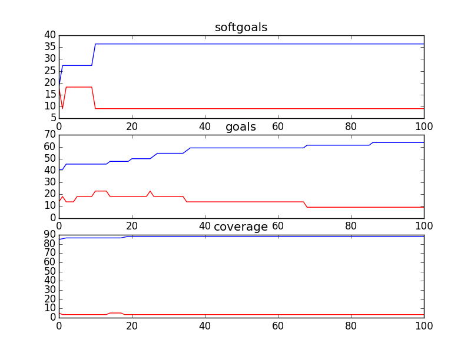

### bCMS_SR_CommunicationCompromiser
```
{	:better gt
 	:candidates 16
 	:cr 0.3
 	:evaluation evaluate_random
 	:f 0.75
 	:gens 100
 	:is_percent True
 	:obj_funcs ['eval_softgoals', 'eval_goals', 'eval_coverage']
 	:seed 1
}
Time Taken :  0.278343915939

rank ,         name ,    med   ,   iqr 
----------------------------------------------------
   1 ,      gen0_f1 ,      0.0  ,    0.0 (*              |              ), 0.00,  0.00,  0.00,  0.00,  0.00
   1 ,     gen20_f1 ,      0.0  ,    0.0 (*              |              ), 0.00,  0.00,  0.00,  0.00,  0.00
   1 ,     gen40_f1 ,      0.0  ,    0.0 (*              |              ), 0.00,  0.00,  0.00,  0.00,  0.00
   1 ,     gen60_f1 ,      0.0  ,    0.0 (*              |              ), 0.00,  0.00,  0.00,  0.00,  0.00
   1 ,     gen80_f1 ,      0.0  ,    0.0 (*              |              ), 0.00,  0.00,  0.00,  0.00,  0.00
   1 ,    gen100_f1 ,      0.0  ,    0.0 (*              |              ), 0.00,  0.00,  0.00,  0.00,  0.00

rank ,         name ,    med   ,   iqr 
----------------------------------------------------
   1 ,      gen0_f2 ,      0.0  ,  33.33 (*              |              ), 0.00,  0.00,  0.00, 33.33, 33.33
   1 ,     gen20_f2 ,      0.0  ,  33.33 (*              |              ), 0.00,  0.00,  0.00, 33.33, 33.33
   1 ,     gen40_f2 ,      0.0  ,  33.33 (*              |              ), 0.00,  0.00,  0.00, 33.33, 33.33
   1 ,     gen60_f2 ,      0.0  ,  33.33 (*              |              ), 0.00,  0.00,  0.00, 33.33, 33.33
   1 ,     gen80_f2 ,      0.0  ,  33.33 (*              |              ), 0.00,  0.00,  0.00, 33.33, 33.33
   1 ,    gen100_f2 ,      0.0  ,  33.33 (*              |              ), 0.00,  0.00,  0.00, 33.33, 33.33

rank ,         name ,    med   ,   iqr 
----------------------------------------------------
   1 ,      gen0_f3 ,    71.43  ,   7.14 (               *------        ),64.29, 64.29, 71.43, 71.43, 78.57
   1 ,     gen20_f3 ,    71.43  ,   7.14 (               *------        ),64.29, 64.29, 71.43, 71.43, 78.57
   1 ,     gen40_f3 ,    71.43  ,   7.14 (               *------        ),64.29, 64.29, 71.43, 71.43, 78.57
   1 ,     gen60_f3 ,    71.43  ,   7.14 (               *------        ),64.29, 64.29, 71.43, 71.43, 78.57
   1 ,     gen80_f3 ,    71.43  ,   7.14 (               *------        ),64.29, 64.29, 71.43, 71.43, 78.57
   1 ,    gen100_f3 ,    71.43  ,   7.14 (               *------        ),64.29, 64.29, 71.43, 71.43, 78.57

```
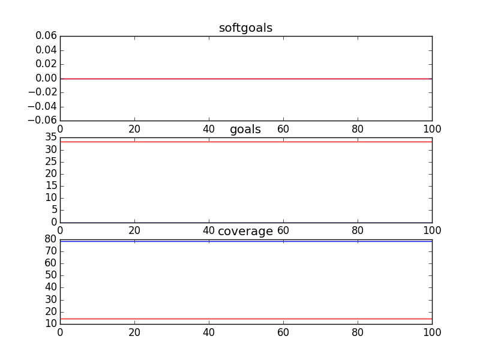

### bCMS_SR_Fireman
```
{	:better gt
 	:candidates 16
 	:cr 0.3
 	:evaluation evaluate_random
 	:f 0.75
 	:gens 100
 	:is_percent True
 	:obj_funcs ['eval_softgoals', 'eval_goals', 'eval_coverage']
 	:seed 1
}
Time Taken :  0.835471153259

rank ,         name ,    med   ,   iqr 
----------------------------------------------------
   1 ,      gen0_f1 ,    23.53  ,  11.76 (------      *--|-------       ),11.76, 17.65, 23.53, 23.53, 35.29
   1 ,     gen20_f1 ,    23.53  ,  11.76 (------      *--|-------       ),11.76, 17.65, 23.53, 23.53, 35.29
   1 ,     gen40_f1 ,    23.53  ,  11.76 (------      *--|-------       ),11.76, 17.65, 23.53, 23.53, 35.29
   1 ,     gen60_f1 ,    23.53  ,  11.76 (------      *--|-------       ),11.76, 17.65, 23.53, 23.53, 35.29
   1 ,     gen80_f1 ,    23.53  ,  11.76 (------      *--|-------       ),11.76, 17.65, 23.53, 23.53, 35.29
   1 ,    gen100_f1 ,    23.53  ,  11.76 (------      *--|-------       ),11.76, 17.65, 23.53, 23.53, 35.29

rank ,         name ,    med   ,   iqr 
----------------------------------------------------
   1 ,      gen0_f2 ,     30.0  ,   10.0 (    -----*    -|--------      ),20.00, 30.00, 30.00, 40.00, 60.00
   1 ,     gen20_f2 ,     30.0  ,   10.0 (    -----*    -|--------      ),20.00, 30.00, 30.00, 40.00, 60.00
   1 ,     gen40_f2 ,     30.0  ,   10.0 (    -----*    -|--------      ),20.00, 30.00, 30.00, 40.00, 60.00
   1 ,     gen60_f2 ,     30.0  ,   10.0 (    -----*    -|--------      ),20.00, 30.00, 30.00, 40.00, 60.00
   1 ,     gen80_f2 ,     30.0  ,   10.0 (    -----*    -|--------      ),20.00, 30.00, 30.00, 40.00, 60.00
   1 ,    gen100_f2 ,     30.0  ,   10.0 (    -----*    -|--------      ),20.00, 30.00, 30.00, 40.00, 60.00

rank ,         name ,    med   ,   iqr 
----------------------------------------------------
   1 ,      gen0_f3 ,    85.37  ,   4.87 (--------    *  | --------     ),78.05, 82.93, 85.37, 87.80, 92.68
   1 ,     gen20_f3 ,    85.37  ,   4.87 (--------    *  | --------     ),78.05, 82.93, 85.37, 87.80, 92.68
   1 ,     gen40_f3 ,    85.37  ,   4.87 (--------    *  | --------     ),78.05, 82.93, 85.37, 87.80, 92.68
   1 ,     gen60_f3 ,    85.37  ,   4.87 (--------    *  | --------     ),78.05, 82.93, 85.37, 87.80, 92.68
   1 ,     gen80_f3 ,    85.37  ,   4.87 (--------    *  | --------     ),78.05, 82.93, 85.37, 87.80, 92.68
   1 ,    gen100_f3 ,    85.37  ,   4.87 (--------    *  | --------     ),78.05, 82.93, 85.37, 87.80, 92.68

```
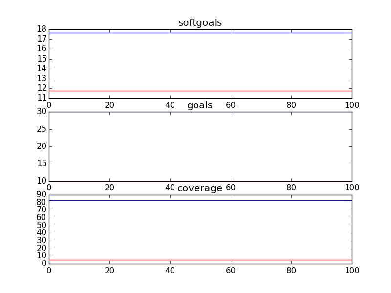

### bCMS_SR_FSC
```
{	:better gt
 	:candidates 8
 	:cr 0.3
 	:evaluation evaluate_random
 	:f 0.75
 	:gens 100
 	:is_percent True
 	:obj_funcs ['eval_softgoals', 'eval_goals', 'eval_coverage']
 	:seed 1
}
../GMRepo/CMA12/bCMS_SR_FSC.ood
Cannot generate 8 candidates with 5 leaves
```

### bCMS_SR_GovernmentAgency
```
{	:better gt
 	:candidates 1
 	:cr 0.3
 	:evaluation evaluate_random
 	:f 0.75
 	:gens 100
 	:is_percent True
 	:obj_funcs ['eval_softgoals', 'eval_goals', 'eval_coverage']
 	:seed 1
}
../GMRepo/CMA12/bCMS_SR_GovernmentAgency.ood
Cannot generate 1 candidates with 7 leaves
```

### bCMS_SR_Policeman
```
{	:better gt
 	:candidates 16
 	:cr 0.3
 	:evaluation evaluate_random
 	:f 0.75
 	:gens 100
 	:is_percent True
 	:obj_funcs ['eval_softgoals', 'eval_goals', 'eval_coverage']
 	:seed 1
}
Time Taken :  0.474924087524

rank ,         name ,    med   ,   iqr 
----------------------------------------------------
   1 ,      gen0_f1 ,    11.11  ,  11.11 (              *|------------- ), 0.00,  0.00, 11.11, 11.11, 22.22
   1 ,     gen20_f1 ,    11.11  ,  11.11 (              *|------------- ), 0.00,  0.00, 11.11, 11.11, 22.22
   1 ,     gen40_f1 ,    11.11  ,  11.11 (              *|------------- ), 0.00,  0.00, 11.11, 11.11, 22.22
   1 ,     gen60_f1 ,    11.11  ,  11.11 (              *|------------- ), 0.00,  0.00, 11.11, 11.11, 22.22
   1 ,     gen80_f1 ,    11.11  ,  11.11 (              *|------------- ), 0.00,  0.00, 11.11, 11.11, 22.22
   1 ,    gen100_f1 ,    11.11  ,  11.11 (              *|------------- ), 0.00,  0.00, 11.11, 11.11, 22.22

rank ,         name ,    med   ,   iqr 
----------------------------------------------------
   1 ,      gen0_f2 ,     50.0  ,  16.67 (---------      |   *          ),16.67, 33.33, 50.00, 50.00, 50.00
   1 ,     gen20_f2 ,     50.0  ,  16.67 (---------      |   *          ),16.67, 33.33, 50.00, 50.00, 50.00
   1 ,     gen40_f2 ,     50.0  ,  16.67 (---------      |   *          ),16.67, 33.33, 50.00, 50.00, 50.00
   1 ,     gen60_f2 ,     50.0  ,  16.67 (---------      |   *          ),16.67, 33.33, 50.00, 50.00, 50.00
   1 ,     gen80_f2 ,     50.0  ,  16.67 (---------      |   *          ),16.67, 33.33, 50.00, 50.00, 50.00
   1 ,    gen100_f2 ,     50.0  ,  16.67 (---------      |   *          ),16.67, 33.33, 50.00, 50.00, 50.00

rank ,         name ,    med   ,   iqr 
----------------------------------------------------
   1 ,      gen0_f3 ,    80.77  ,  15.38 (----        *  |     ----     ),69.23, 73.08, 80.77, 88.46, 92.31
   1 ,     gen20_f3 ,    80.77  ,  15.38 (----        *  |     ----     ),69.23, 73.08, 80.77, 88.46, 92.31
   1 ,     gen40_f3 ,    80.77  ,  15.38 (----        *  |     ----     ),69.23, 73.08, 80.77, 88.46, 92.31
   1 ,     gen60_f3 ,    80.77  ,  15.38 (----        *  |     ----     ),69.23, 73.08, 80.77, 88.46, 92.31
   1 ,     gen80_f3 ,    80.77  ,  15.38 (----        *  |     ----     ),69.23, 73.08, 80.77, 88.46, 92.31
   1 ,    gen100_f3 ,    80.77  ,  15.38 (----        *  |     ----     ),69.23, 73.08, 80.77, 88.46, 92.31

```
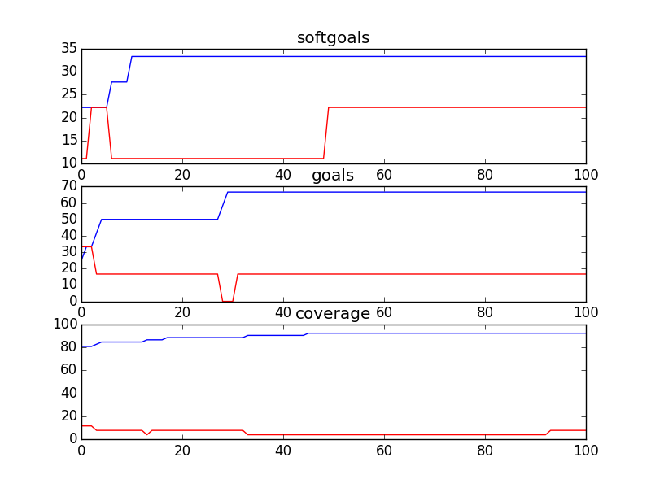

### bCMS_SR_PSC
```
{	:better gt
 	:candidates 8
 	:cr 0.3
 	:evaluation evaluate_random
 	:f 0.75
 	:gens 100
 	:is_percent True
 	:obj_funcs ['eval_softgoals', 'eval_goals', 'eval_coverage']
 	:seed 1
}
../GMRepo/CMA12/bCMS_SR_PSC.ood
Cannot generate 8 candidates with 5 leaves
```

### bCMS_SR_Victim
```
{	:better gt
 	:candidates 50
 	:cr 0.3
 	:evaluation evaluate_random
 	:f 0.75
 	:gens 100
 	:is_percent True
 	:obj_funcs ['eval_softgoals', 'eval_goals', 'eval_coverage']
 	:seed 1
}
Time Taken :  1.95048213005

rank ,         name ,    med   ,   iqr 
----------------------------------------------------
   1 ,      gen0_f1 ,     7.14  ,   7.14 (--------------*|------------- ), 0.00,  7.14,  7.14,  7.14, 14.29
   1 ,     gen20_f1 ,     7.14  ,   7.15 (              *|              ), 7.14,  7.14,  7.14, 14.29, 14.29
   1 ,     gen40_f1 ,     7.14  ,   7.15 (              *|              ), 7.14,  7.14,  7.14, 14.29, 14.29
   1 ,     gen60_f1 ,     7.14  ,   7.15 (              *|              ), 7.14,  7.14,  7.14, 14.29, 14.29
   1 ,     gen80_f1 ,     7.14  ,   7.15 (              *|              ), 7.14,  7.14,  7.14, 14.29, 14.29
   1 ,    gen100_f1 ,     7.14  ,   7.15 (              *|              ), 7.14,  7.14,  7.14, 14.29, 14.29

rank ,         name ,    med   ,   iqr 
----------------------------------------------------
   1 ,      gen0_f2 ,    33.33  ,  16.67 (     ----*    -|----          ),16.67, 33.33, 33.33, 50.00, 66.67
   2 ,     gen20_f2 ,     50.0  ,  33.34 (     ----     *|              ),16.67, 33.33, 50.00, 66.67, 66.67
   2 ,     gen40_f2 ,     50.0  ,  16.67 (         -----*|    ----      ),33.33, 50.00, 50.00, 66.67, 83.33
   2 ,     gen60_f2 ,     50.0  ,  16.67 (         -----*|    ----      ),33.33, 50.00, 50.00, 66.67, 83.33
   2 ,     gen80_f2 ,     50.0  ,  16.67 (         -----*|    ----      ),33.33, 50.00, 50.00, 66.67, 83.33
   2 ,    gen100_f2 ,     50.0  ,  16.67 (         -----*|    ----      ),33.33, 50.00, 50.00, 66.67, 83.33

rank ,         name ,    med   ,   iqr 
----------------------------------------------------
   1 ,      gen0_f3 ,    78.79  ,  12.12 (         ----  |  * ---       ),66.67, 72.73, 78.79, 81.82, 84.85
   2 ,     gen20_f3 ,    81.82  ,  15.15 (         ------|    *  ----   ),66.67, 75.76, 81.82, 84.85, 90.91
   2 ,     gen40_f3 ,    81.82  ,  12.12 (             --|--  *    --   ),72.73, 78.79, 81.82, 87.88, 90.91
   2 ,     gen60_f3 ,    81.82  ,  12.12 (             --|--     * --   ),72.73, 78.79, 84.85, 87.88, 90.91
   2 ,     gen80_f3 ,    84.85  ,   9.09 (             --|--     * --   ),72.73, 78.79, 84.85, 87.88, 90.91
   2 ,    gen100_f3 ,    84.85  ,   9.09 (             --|--     * --   ),72.73, 78.79, 84.85, 87.88, 90.91

```
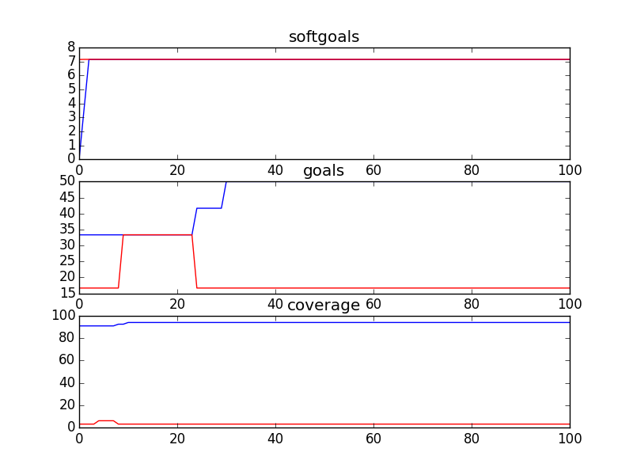

### bCMS_SR_Witness
```
{	:better gt
 	:candidates 32
 	:cr 0.3
 	:evaluation evaluate_random
 	:f 0.75
 	:gens 100
 	:is_percent True
 	:obj_funcs ['eval_softgoals', 'eval_goals', 'eval_coverage']
 	:seed 1
}
Time Taken :  0.960978984833

rank ,         name ,    med   ,   iqr 
----------------------------------------------------
   1 ,      gen0_f1 ,    18.18  ,   9.09 (               |   *--------- ), 9.09,  9.09, 18.18, 18.18, 27.27
   1 ,     gen20_f1 ,    18.18  ,   9.09 (               |   *--------- ), 9.09,  9.09, 18.18, 18.18, 27.27
   1 ,     gen40_f1 ,    18.18  ,   9.09 (               |   *--------- ), 9.09,  9.09, 18.18, 18.18, 27.27
   1 ,     gen60_f1 ,    18.18  ,   9.09 (               |   *--------- ), 9.09,  9.09, 18.18, 18.18, 27.27
   1 ,     gen80_f1 ,    18.18  ,   9.09 (               |   *--------- ), 9.09,  9.09, 18.18, 18.18, 27.27
   1 ,    gen100_f1 ,    18.18  ,   9.09 (               |   *--------- ), 9.09,  9.09, 18.18, 18.18, 27.27

rank ,         name ,    med   ,   iqr 
----------------------------------------------------
   1 ,      gen0_f2 ,     40.0  ,   40.0 (-------       *|      ------- ), 0.00, 20.00, 40.00, 60.00, 80.00
   1 ,     gen20_f2 ,     40.0  ,   40.0 (-------       *|      ------- ), 0.00, 20.00, 40.00, 60.00, 80.00
   1 ,     gen40_f2 ,     40.0  ,   40.0 (-------       *|      ------- ), 0.00, 20.00, 40.00, 60.00, 80.00
   1 ,     gen60_f2 ,     40.0  ,   40.0 (-------       *|      ------- ), 0.00, 20.00, 40.00, 60.00, 80.00
   1 ,     gen80_f2 ,     40.0  ,   40.0 (-------       *|      ------- ), 0.00, 20.00, 40.00, 60.00, 80.00
   1 ,    gen100_f2 ,     40.0  ,   40.0 (-------       *|      ------- ), 0.00, 20.00, 40.00, 60.00, 80.00

rank ,         name ,    med   ,   iqr 
----------------------------------------------------
   1 ,      gen0_f3 ,    70.37  ,  14.81 (   --------   *|          --- ),59.26, 66.67, 70.37, 81.48, 85.19
   1 ,     gen20_f3 ,    70.37  ,  14.81 (   --------   *|          --- ),59.26, 66.67, 70.37, 81.48, 85.19
   1 ,     gen40_f3 ,    70.37  ,  14.81 (   --------   *|          --- ),59.26, 66.67, 70.37, 81.48, 85.19
   1 ,     gen60_f3 ,    70.37  ,  14.81 (   --------   *|          --- ),59.26, 66.67, 70.37, 81.48, 85.19
   1 ,     gen80_f3 ,    70.37  ,  14.81 (   --------   *|          --- ),59.26, 66.67, 70.37, 81.48, 85.19
   1 ,    gen100_f3 ,    70.37  ,  14.81 (   --------   *|          --- ),59.26, 66.67, 70.37, 81.48, 85.19

```
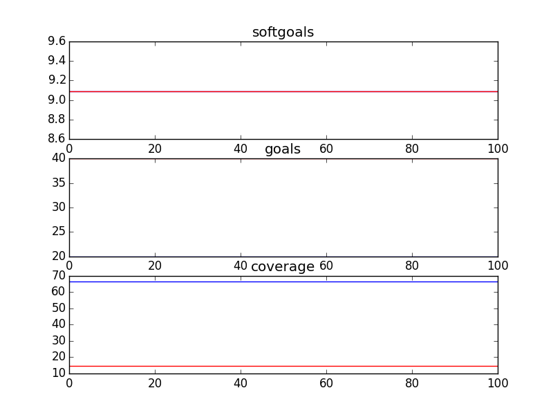

### bCMS_StrategicDependency_MultiplicityVariant
```
{	:better gt
 	:candidates 50
 	:cr 0.3
 	:evaluation evaluate_random
 	:f 0.75
 	:gens 100
 	:is_percent True
 	:obj_funcs ['eval_softgoals', 'eval_goals', 'eval_coverage']
 	:seed 1
}
Time Taken :  1.09634900093

rank ,         name ,    med   ,   iqr 
----------------------------------------------------
   1 ,      gen0_f1 ,      0.0  ,    0.0 (*              |              ), 0.00,  0.00,  0.00,  0.00,  0.00
   1 ,     gen20_f1 ,      0.0  ,    0.0 (*              |              ), 0.00,  0.00,  0.00,  0.00,  0.00
   1 ,     gen40_f1 ,      0.0  ,    0.0 (*              |              ), 0.00,  0.00,  0.00,  0.00,  0.00
   1 ,     gen60_f1 ,      0.0  ,    0.0 (*              |              ), 0.00,  0.00,  0.00,  0.00,  0.00
   1 ,     gen80_f1 ,      0.0  ,    0.0 (*              |              ), 0.00,  0.00,  0.00,  0.00,  0.00
   1 ,    gen100_f1 ,      0.0  ,    0.0 (*              |              ), 0.00,  0.00,  0.00,  0.00,  0.00

rank ,         name ,    med   ,   iqr 
----------------------------------------------------
   1 ,      gen0_f2 ,     50.0  ,  16.67 (-----      *---|--            ),16.67, 33.33, 50.00, 50.00, 66.67
   2 ,     gen20_f2 ,    83.33  ,    0.0 (               |  -----*----- ),66.67, 83.33, 83.33, 83.33, 100.00
   2 ,     gen40_f2 ,    83.33  ,  16.67 (               |       *      ),83.33, 83.33, 83.33, 100.00, 100.00
   3 ,     gen60_f2 ,    100.0  ,  16.67 (               |             *),83.33, 83.33, 100.00, 100.00, 100.00
   3 ,     gen80_f2 ,    100.0  ,  16.67 (               |       ------*),83.33, 100.00, 100.00, 100.00, 100.00
   3 ,    gen100_f2 ,    100.0  ,    0.0 (               |       ------*),83.33, 100.00, 100.00, 100.00, 100.00

rank ,         name ,    med   ,   iqr 
----------------------------------------------------
   1 ,      gen0_f3 ,    100.0  ,    0.0 (*              |              ),100.00, 100.00, 100.00, 100.00, 100.00
   1 ,     gen20_f3 ,    100.0  ,    0.0 (*              |              ),100.00, 100.00, 100.00, 100.00, 100.00
   1 ,     gen40_f3 ,    100.0  ,    0.0 (*              |              ),100.00, 100.00, 100.00, 100.00, 100.00
   1 ,     gen60_f3 ,    100.0  ,    0.0 (*              |              ),100.00, 100.00, 100.00, 100.00, 100.00
   1 ,     gen80_f3 ,    100.0  ,    0.0 (*              |              ),100.00, 100.00, 100.00, 100.00, 100.00
   1 ,    gen100_f3 ,    100.0  ,    0.0 (*              |              ),100.00, 100.00, 100.00, 100.00, 100.00

```
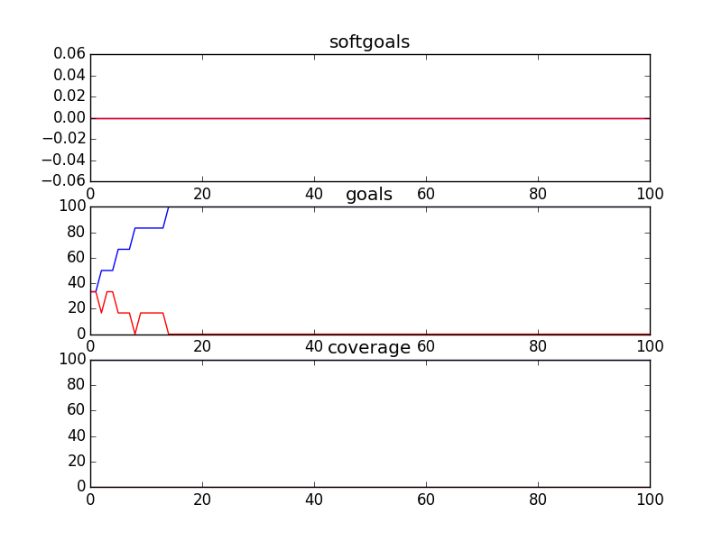

### bCMS_StrategicDependency_VehiclesVariant
```
{	:better gt
 	:candidates 50
 	:cr 0.3
 	:evaluation evaluate_random
 	:f 0.75
 	:gens 100
 	:is_percent True
 	:obj_funcs ['eval_softgoals', 'eval_goals', 'eval_coverage']
 	:seed 1
}
Time Taken :  1.08255195618

rank ,         name ,    med   ,   iqr 
----------------------------------------------------
   1 ,      gen0_f1 ,      0.0  ,    0.0 (*              |              ), 0.00,  0.00,  0.00,  0.00,  0.00
   1 ,     gen20_f1 ,      0.0  ,    0.0 (*              |              ), 0.00,  0.00,  0.00,  0.00,  0.00
   1 ,     gen40_f1 ,      0.0  ,    0.0 (*              |              ), 0.00,  0.00,  0.00,  0.00,  0.00
   1 ,     gen60_f1 ,      0.0  ,    0.0 (*              |              ), 0.00,  0.00,  0.00,  0.00,  0.00
   1 ,     gen80_f1 ,      0.0  ,    0.0 (*              |              ), 0.00,  0.00,  0.00,  0.00,  0.00
   1 ,    gen100_f1 ,      0.0  ,    0.0 (*              |              ), 0.00,  0.00,  0.00,  0.00,  0.00

rank ,         name ,    med   ,   iqr 
----------------------------------------------------
   1 ,      gen0_f2 ,     50.0  ,   50.0 (              *|      ------- ),25.00, 25.00, 50.00, 75.00, 100.00
   2 ,     gen20_f2 ,    100.0  ,   25.0 (               |      -------*),75.00, 100.00, 100.00, 100.00, 100.00
   2 ,     gen40_f2 ,    100.0  ,    0.0 (               |             *),100.00, 100.00, 100.00, 100.00, 100.00
   2 ,     gen60_f2 ,    100.0  ,    0.0 (               |             *),100.00, 100.00, 100.00, 100.00, 100.00
   2 ,     gen80_f2 ,    100.0  ,    0.0 (               |             *),100.00, 100.00, 100.00, 100.00, 100.00
   2 ,    gen100_f2 ,    100.0  ,    0.0 (               |             *),100.00, 100.00, 100.00, 100.00, 100.00

rank ,         name ,    med   ,   iqr 
----------------------------------------------------
   1 ,      gen0_f3 ,    100.0  ,    0.0 (*              |              ),100.00, 100.00, 100.00, 100.00, 100.00
   1 ,     gen20_f3 ,    100.0  ,    0.0 (*              |              ),100.00, 100.00, 100.00, 100.00, 100.00
   1 ,     gen40_f3 ,    100.0  ,    0.0 (*              |              ),100.00, 100.00, 100.00, 100.00, 100.00
   1 ,     gen60_f3 ,    100.0  ,    0.0 (*              |              ),100.00, 100.00, 100.00, 100.00, 100.00
   1 ,     gen80_f3 ,    100.0  ,    0.0 (*              |              ),100.00, 100.00, 100.00, 100.00, 100.00
   1 ,    gen100_f3 ,    100.0  ,    0.0 (*              |              ),100.00, 100.00, 100.00, 100.00, 100.00

```
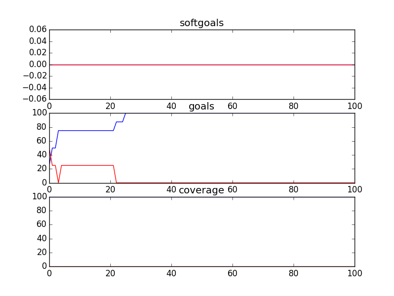

### bCMS_StrategicDependency_withbCMS
```
{	:better gt
 	:candidates 50
 	:cr 0.3
 	:evaluation evaluate_random
 	:f 0.75
 	:gens 100
 	:is_percent True
 	:obj_funcs ['eval_softgoals', 'eval_goals', 'eval_coverage']
 	:seed 1
}
Time Taken :  1.15902590752

rank ,         name ,    med   ,   iqr 
----------------------------------------------------
   1 ,      gen0_f1 ,      0.0  ,    0.0 (*              |              ), 0.00,  0.00,  0.00,  0.00,  0.00
   1 ,     gen20_f1 ,      0.0  ,    0.0 (*              |              ), 0.00,  0.00,  0.00,  0.00,  0.00
   1 ,     gen40_f1 ,      0.0  ,    0.0 (*              |              ), 0.00,  0.00,  0.00,  0.00,  0.00
   1 ,     gen60_f1 ,      0.0  ,    0.0 (*              |              ), 0.00,  0.00,  0.00,  0.00,  0.00
   1 ,     gen80_f1 ,      0.0  ,    0.0 (*              |              ), 0.00,  0.00,  0.00,  0.00,  0.00
   1 ,    gen100_f1 ,      0.0  ,    0.0 (*              |              ), 0.00,  0.00,  0.00,  0.00,  0.00

rank ,         name ,    med   ,   iqr 
----------------------------------------------------
   1 ,      gen0_f2 ,     50.0  ,  16.67 (-----      *---|--            ),16.67, 33.33, 50.00, 50.00, 66.67
   2 ,     gen20_f2 ,    83.33  ,    0.0 (               |  -----*----- ),66.67, 83.33, 83.33, 83.33, 100.00
   2 ,     gen40_f2 ,    83.33  ,  16.67 (               |       *      ),83.33, 83.33, 83.33, 100.00, 100.00
   3 ,     gen60_f2 ,    100.0  ,  16.67 (               |             *),83.33, 83.33, 100.00, 100.00, 100.00
   3 ,     gen80_f2 ,    100.0  ,  16.67 (               |       ------*),83.33, 100.00, 100.00, 100.00, 100.00
   3 ,    gen100_f2 ,    100.0  ,    0.0 (               |       ------*),83.33, 100.00, 100.00, 100.00, 100.00

rank ,         name ,    med   ,   iqr 
----------------------------------------------------
   1 ,      gen0_f3 ,    100.0  ,    0.0 (*              |              ),100.00, 100.00, 100.00, 100.00, 100.00
   1 ,     gen20_f3 ,    100.0  ,    0.0 (*              |              ),100.00, 100.00, 100.00, 100.00, 100.00
   1 ,     gen40_f3 ,    100.0  ,    0.0 (*              |              ),100.00, 100.00, 100.00, 100.00, 100.00
   1 ,     gen60_f3 ,    100.0  ,    0.0 (*              |              ),100.00, 100.00, 100.00, 100.00, 100.00
   1 ,     gen80_f3 ,    100.0  ,    0.0 (*              |              ),100.00, 100.00, 100.00, 100.00, 100.00
   1 ,    gen100_f3 ,    100.0  ,    0.0 (*              |              ),100.00, 100.00, 100.00, 100.00, 100.00

```
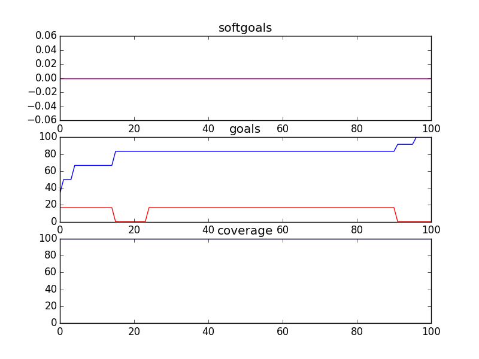

### bCMS_StrategicDependency_withoutbCMS
```
{	:better gt
 	:candidates 50
 	:cr 0.3
 	:evaluation evaluate_random
 	:f 0.75
 	:gens 100
 	:is_percent True
 	:obj_funcs ['eval_softgoals', 'eval_goals', 'eval_coverage']
 	:seed 1
}
Time Taken :  0.913583993912

rank ,         name ,    med   ,   iqr 
----------------------------------------------------
   1 ,      gen0_f1 ,      0.0  ,    0.0 (*              |              ), 0.00,  0.00,  0.00,  0.00,  0.00
   1 ,     gen20_f1 ,      0.0  ,    0.0 (*              |              ), 0.00,  0.00,  0.00,  0.00,  0.00
   1 ,     gen40_f1 ,      0.0  ,    0.0 (*              |              ), 0.00,  0.00,  0.00,  0.00,  0.00
   1 ,     gen60_f1 ,      0.0  ,    0.0 (*              |              ), 0.00,  0.00,  0.00,  0.00,  0.00
   1 ,     gen80_f1 ,      0.0  ,    0.0 (*              |              ), 0.00,  0.00,  0.00,  0.00,  0.00
   1 ,    gen100_f1 ,      0.0  ,    0.0 (*              |              ), 0.00,  0.00,  0.00,  0.00,  0.00

rank ,         name ,    med   ,   iqr 
----------------------------------------------------
   1 ,      gen0_f2 ,     50.0  ,   50.0 (              *|              ),25.00, 25.00, 50.00, 75.00, 75.00
   2 ,     gen20_f2 ,    100.0  ,    0.0 (               |      -------*),75.00, 100.00, 100.00, 100.00, 100.00
   2 ,     gen40_f2 ,    100.0  ,    0.0 (               |             *),100.00, 100.00, 100.00, 100.00, 100.00
   2 ,     gen60_f2 ,    100.0  ,    0.0 (               |             *),100.00, 100.00, 100.00, 100.00, 100.00
   2 ,     gen80_f2 ,    100.0  ,    0.0 (               |             *),100.00, 100.00, 100.00, 100.00, 100.00
   2 ,    gen100_f2 ,    100.0  ,    0.0 (               |             *),100.00, 100.00, 100.00, 100.00, 100.00

rank ,         name ,    med   ,   iqr 
----------------------------------------------------
   1 ,      gen0_f3 ,    100.0  ,    0.0 (*              |              ),100.00, 100.00, 100.00, 100.00, 100.00
   1 ,     gen20_f3 ,    100.0  ,    0.0 (*              |              ),100.00, 100.00, 100.00, 100.00, 100.00
   1 ,     gen40_f3 ,    100.0  ,    0.0 (*              |              ),100.00, 100.00, 100.00, 100.00, 100.00
   1 ,     gen60_f3 ,    100.0  ,    0.0 (*              |              ),100.00, 100.00, 100.00, 100.00, 100.00
   1 ,     gen80_f3 ,    100.0  ,    0.0 (*              |              ),100.00, 100.00, 100.00, 100.00, 100.00
   1 ,    gen100_f3 ,    100.0  ,    0.0 (*              |              ),100.00, 100.00, 100.00, 100.00, 100.00

```
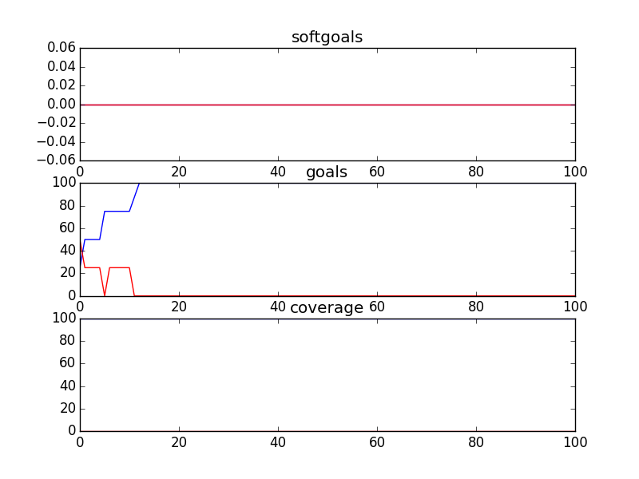

