## CSServices
```

rank ,         name ,    med   ,   iqr 
----------------------------------------------------
   1 ,      gen0_f1 ,    52.15  ,   8.06 (   ---  * ---  |              ),44.62, 48.92, 52.15, 55.38, 59.68
   2 ,     gen20_f1 ,    60.75  ,  11.29 (         ---  *|  --          ),54.30, 58.60, 61.83, 67.74, 71.51
   2 ,     gen40_f1 ,    66.13  ,  11.29 (          ---  | * ------     ),54.84, 60.22, 66.67, 69.89, 78.49
   3 ,     gen60_f1 ,    67.74  ,  13.98 (           ----|   *  ---     ),56.45, 62.37, 68.82, 74.19, 79.57
   3 ,     gen80_f1 ,    70.43  ,  13.97 (           ----|-   *  ---    ),56.99, 66.67, 70.97, 76.34, 80.11
   3 ,    gen100_f1 ,    72.58  ,   12.9 (           ----|--   *  --    ),57.53, 67.20, 73.12, 77.96, 81.18

rank ,         name ,    med   ,   iqr 
----------------------------------------------------
   1 ,      gen0_f2 ,    78.26  ,  13.04 (  -----------  |  * ---       ),47.83, 69.57, 78.26, 82.61, 86.96
   2 ,     gen20_f2 ,     91.3  ,  13.04 (             --|----     * -- ),69.57, 82.61, 91.30, 95.65, 100.00
   2 ,     gen40_f2 ,     91.3  ,  13.04 (             --|-------    *  ),69.57, 86.96, 95.65, 100.00, 100.00
   3 ,     gen60_f2 ,    95.65  ,    8.7 (               |    -----  *  ),82.61, 91.30, 95.65, 100.00, 100.00
   3 ,     gen80_f2 ,    95.65  ,    8.7 (               |    -----  *  ),82.61, 91.30, 95.65, 100.00, 100.00
   3 ,    gen100_f2 ,    95.65  ,    8.7 (               |    -----  *  ),82.61, 91.30, 95.65, 100.00, 100.00

rank ,         name ,    med   ,   iqr 
----------------------------------------------------
   1 ,      gen0_f3 ,    93.73  ,   1.71 (        --    *| ------       ),92.31, 92.88, 93.73, 94.30, 95.44
   2 ,     gen20_f3 ,    95.16  ,   0.86 (               |   -   *---   ),94.59, 94.87, 95.44, 95.73, 96.30
   2 ,     gen40_f3 ,    95.44  ,   0.57 (               |    -  *---   ),94.87, 95.16, 95.44, 95.73, 96.30
   3 ,     gen60_f3 ,    95.73  ,   0.57 (               |     -- *---  ),95.16, 95.44, 95.73, 96.01, 96.58
   3 ,     gen80_f3 ,    96.01  ,   0.57 (               |     --- * -  ),95.16, 95.73, 96.01, 96.30, 96.58
   3 ,    gen100_f3 ,    96.01  ,   0.57 (               |       - * -  ),95.44, 95.73, 96.01, 96.30, 96.58
```
### Time Taken : 176.424337864

## CSCounselling
```

rank ,         name ,    med   ,   iqr 
----------------------------------------------------
   1 ,      gen0_f1 ,    79.01  ,   6.63 (       ---   * |--            ),73.48, 76.80, 80.11, 82.32, 85.64
   2 ,     gen20_f1 ,     88.4  ,   7.73 (              -|--   * --     ),81.77, 85.64, 88.95, 91.71, 93.92
   3 ,     gen40_f1 ,    90.61  ,   4.97 (               |----- * ---   ),83.98, 88.95, 90.61, 92.82, 95.58
   3 ,     gen60_f1 ,    91.16  ,   5.52 (               | ----  * ---  ),85.08, 89.50, 91.16, 93.92, 96.69
   4 ,     gen80_f1 ,    91.71  ,   4.98 (               |   --- * ---  ),86.74, 90.06, 91.71, 93.92, 96.69
   4 ,    gen100_f1 ,    91.71  ,   4.97 (               |   ---  * --  ),87.29, 90.61, 92.27, 94.48, 97.24

rank ,         name ,    med   ,   iqr 
----------------------------------------------------
   1 ,      gen0_f2 ,    86.21  ,    6.9 (    ----    *  | --------     ),79.31, 82.76, 86.21, 89.66, 96.55
   2 ,     gen20_f2 ,     93.1  ,   6.89 (        -------|-    *   ---- ),82.76, 89.66, 93.10, 96.55, 100.00
   2 ,     gen40_f2 ,     93.1  ,   6.89 (            ---|-----*   ---- ),86.21, 93.10, 93.10, 96.55, 100.00
   3 ,     gen60_f2 ,    96.55  ,   6.89 (               | ----    *--- ),89.66, 93.10, 96.55, 96.55, 100.00
   3 ,     gen80_f2 ,    96.55  ,  10.34 (               | ----    *--- ),89.66, 93.10, 96.55, 96.55, 100.00
   3 ,    gen100_f2 ,    96.55  ,  10.34 (               | ----    *--- ),89.66, 93.10, 96.55, 96.55, 100.00

rank ,         name ,    med   ,   iqr 
----------------------------------------------------
   1 ,      gen0_f3 ,    93.71  ,   1.14 (   -----    * -|-             ),92.29, 93.14, 93.71, 94.00, 94.57
   2 ,     gen20_f3 ,    94.86  ,   0.86 (               |-  *  ----    ),94.29, 94.57, 94.86, 95.43, 96.00
   2 ,     gen40_f3 ,    95.14  ,   1.14 (               |---  *  --    ),94.29, 94.86, 95.14, 95.71, 96.00
   3 ,     gen60_f3 ,    95.43  ,   1.14 (               | ---- * --    ),94.57, 95.14, 95.43, 95.71, 96.00
   3 ,     gen80_f3 ,    95.71  ,   0.86 (               |   --   *     ),94.86, 95.14, 95.71, 96.00, 96.00
   3 ,    gen100_f3 ,    95.71  ,   0.86 (               |   ---  * --  ),94.86, 95.43, 95.71, 96.00, 96.29
```
### Time Taken : 164.691888094
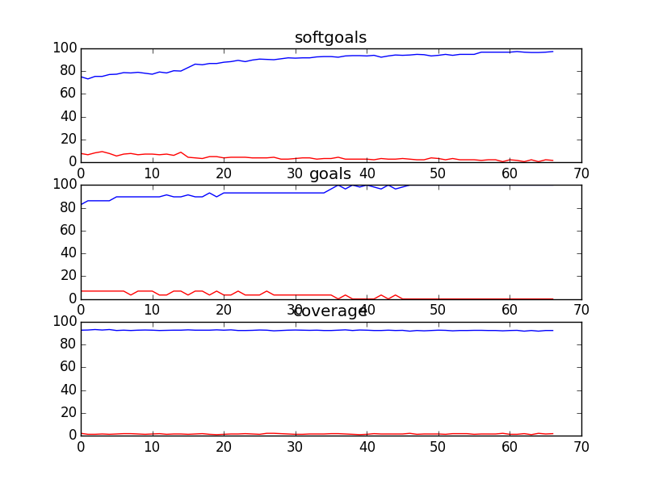
## CSCounsellingManagement
```

rank ,         name ,    med   ,   iqr 
----------------------------------------------------
   1 ,      gen0_f1 ,    81.82  ,   5.79 (       ----   *| ---          ),76.03, 79.34, 81.82, 83.47, 85.95
   2 ,     gen20_f1 ,    88.43  ,   4.13 (               |-----  *--    ),82.64, 86.78, 88.43, 89.26, 90.91
   2 ,     gen40_f1 ,    89.26  ,   4.13 (               |  ---   *---  ),84.30, 86.78, 89.26, 90.08, 92.56
   3 ,     gen60_f1 ,    90.08  ,   3.31 (               |    ---  *--  ),85.95, 88.43, 90.08, 90.91, 92.56
   3 ,     gen80_f1 ,    90.08  ,   3.31 (               |    ---- * -- ),85.95, 89.26, 90.08, 91.74, 93.39
   3 ,    gen100_f1 ,    90.08  ,   4.13 (               |    ----  * - ),85.95, 89.26, 90.91, 92.56, 93.39

rank ,         name ,    med   ,   iqr 
----------------------------------------------------
   1 ,      gen0_f2 ,    97.22  ,    0.0 (--------------*|------------- ),94.44, 97.22, 97.22, 97.22, 100.00
   2 ,     gen20_f2 ,    100.0  ,   2.78 (               |             *),97.22, 97.22, 100.00, 100.00, 100.00
   2 ,     gen40_f2 ,    100.0  ,   2.78 (              -|-------------*),97.22, 100.00, 100.00, 100.00, 100.00
   2 ,     gen60_f2 ,    100.0  ,    0.0 (              -|-------------*),97.22, 100.00, 100.00, 100.00, 100.00
   2 ,     gen80_f2 ,    100.0  ,    0.0 (              -|-------------*),97.22, 100.00, 100.00, 100.00, 100.00
   2 ,    gen100_f2 ,    100.0  ,    0.0 (              -|-------------*),97.22, 100.00, 100.00, 100.00, 100.00

rank ,         name ,    med   ,   iqr 
----------------------------------------------------
   1 ,      gen0_f3 ,    97.09  ,   0.97 (   --------*  -|--            ),96.12, 97.09, 97.09, 97.57, 98.06
   2 ,     gen20_f3 ,    98.54  ,   0.48 (              -|--    *---    ),97.57, 98.06, 98.54, 98.54, 99.03
   2 ,     gen40_f3 ,    98.54  ,   0.48 (               |  ----*---    ),98.06, 98.54, 98.54, 98.54, 99.03
   2 ,     gen60_f3 ,    98.54  ,   0.49 (               |  ----*       ),98.06, 98.54, 98.54, 99.03, 99.03
   2 ,     gen80_f3 ,    98.54  ,   0.49 (               |  ----*       ),98.06, 98.54, 98.54, 99.03, 99.03
   2 ,    gen100_f3 ,    98.54  ,   0.49 (               |  ----*   --- ),98.06, 98.54, 98.54, 99.03, 99.51
```
### Time Taken : 45.4021129608
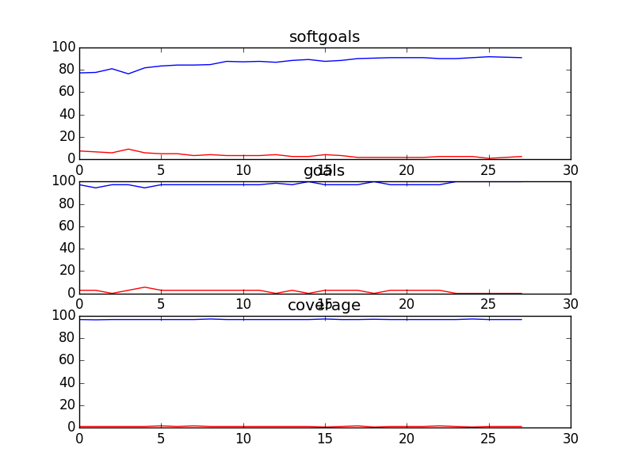
## CSCounsellingManagementSD
```

rank ,         name ,    med   ,   iqr 
----------------------------------------------------
   1 ,      gen0_f1 ,    95.12  ,    0.0 (*--------------|------------- ),95.12, 95.12, 95.12, 95.12, 100.00
   2 ,     gen20_f1 ,    100.0  ,    0.0 (---------------|-------------*),95.12, 100.00, 100.00, 100.00, 100.00
   2 ,     gen40_f1 ,    100.0  ,    0.0 (---------------|-------------*),95.12, 100.00, 100.00, 100.00, 100.00
   2 ,     gen60_f1 ,    100.0  ,    0.0 (               |             *),100.00, 100.00, 100.00, 100.00, 100.00
   2 ,     gen80_f1 ,    100.0  ,    0.0 (               |             *),100.00, 100.00, 100.00, 100.00, 100.00
   2 ,    gen100_f1 ,    100.0  ,    0.0 (               |             *),100.00, 100.00, 100.00, 100.00, 100.00

rank ,         name ,    med   ,   iqr 
----------------------------------------------------
   1 ,      gen0_f2 ,    100.0  ,    0.0 (*              |              ),100.00, 100.00, 100.00, 100.00, 100.00
   1 ,     gen20_f2 ,    100.0  ,    0.0 (*              |              ),100.00, 100.00, 100.00, 100.00, 100.00
   1 ,     gen40_f2 ,    100.0  ,    0.0 (*              |              ),100.00, 100.00, 100.00, 100.00, 100.00
   1 ,     gen60_f2 ,    100.0  ,    0.0 (*              |              ),100.00, 100.00, 100.00, 100.00, 100.00
   1 ,     gen80_f2 ,    100.0  ,    0.0 (*              |              ),100.00, 100.00, 100.00, 100.00, 100.00
   1 ,    gen100_f2 ,    100.0  ,    0.0 (*              |              ),100.00, 100.00, 100.00, 100.00, 100.00

rank ,         name ,    med   ,   iqr 
----------------------------------------------------
   1 ,      gen0_f3 ,    98.33  ,   1.67 (*              |              ),98.33, 98.33, 98.33, 100.00, 100.00
   2 ,     gen20_f3 ,    100.0  ,    0.0 (               |             *),100.00, 100.00, 100.00, 100.00, 100.00
   2 ,     gen40_f3 ,    100.0  ,    0.0 (               |             *),100.00, 100.00, 100.00, 100.00, 100.00
   2 ,     gen60_f3 ,    100.0  ,    0.0 (               |             *),100.00, 100.00, 100.00, 100.00, 100.00
   2 ,     gen80_f3 ,    100.0  ,    0.0 (               |             *),100.00, 100.00, 100.00, 100.00, 100.00
   2 ,    gen100_f3 ,    100.0  ,    0.0 (               |             *),100.00, 100.00, 100.00, 100.00, 100.00
```
### Time Taken : 4.09521603584
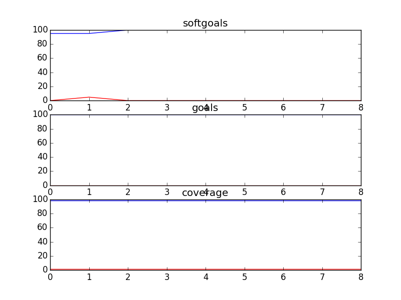
## CSCounsellingSD
```

rank ,         name ,    med   ,   iqr 
----------------------------------------------------
   1 ,      gen0_f1 ,    100.0  ,   3.28 (               |             *),96.72, 96.72, 100.00, 100.00, 100.00
   1 ,     gen20_f1 ,    100.0  ,    0.0 (               |             *),100.00, 100.00, 100.00, 100.00, 100.00
   1 ,     gen40_f1 ,    100.0  ,    0.0 (               |             *),100.00, 100.00, 100.00, 100.00, 100.00
   1 ,     gen60_f1 ,    100.0  ,    0.0 (               |             *),100.00, 100.00, 100.00, 100.00, 100.00
   1 ,     gen80_f1 ,    100.0  ,    0.0 (               |             *),100.00, 100.00, 100.00, 100.00, 100.00
   1 ,    gen100_f1 ,    100.0  ,    0.0 (               |             *),100.00, 100.00, 100.00, 100.00, 100.00

rank ,         name ,    med   ,   iqr 
----------------------------------------------------
   1 ,      gen0_f2 ,    100.0  ,    0.0 (*              |              ),100.00, 100.00, 100.00, 100.00, 100.00
   1 ,     gen20_f2 ,    100.0  ,    0.0 (*              |              ),100.00, 100.00, 100.00, 100.00, 100.00
   1 ,     gen40_f2 ,    100.0  ,    0.0 (*              |              ),100.00, 100.00, 100.00, 100.00, 100.00
   1 ,     gen60_f2 ,    100.0  ,    0.0 (*              |              ),100.00, 100.00, 100.00, 100.00, 100.00
   1 ,     gen80_f2 ,    100.0  ,    0.0 (*              |              ),100.00, 100.00, 100.00, 100.00, 100.00
   1 ,    gen100_f2 ,    100.0  ,    0.0 (*              |              ),100.00, 100.00, 100.00, 100.00, 100.00

rank ,         name ,    med   ,   iqr 
----------------------------------------------------
   1 ,      gen0_f3 ,     98.1  ,   1.91 (               *------        ),97.14, 97.14, 98.10, 98.10, 99.05
   2 ,     gen20_f3 ,    99.05  ,   0.95 (               |      *       ),99.05, 99.05, 99.05, 100.00, 100.00
   3 ,     gen40_f3 ,    100.0  ,   0.95 (               |             *),99.05, 99.05, 100.00, 100.00, 100.00
   3 ,     gen60_f3 ,    100.0  ,    0.0 (               |      -------*),99.05, 100.00, 100.00, 100.00, 100.00
   3 ,     gen80_f3 ,    100.0  ,    0.0 (               |      -------*),99.05, 100.00, 100.00, 100.00, 100.00
   3 ,    gen100_f3 ,    100.0  ,    0.0 (               |      -------*),99.05, 100.00, 100.00, 100.00, 100.00
```
### Time Taken : 7.45779180527
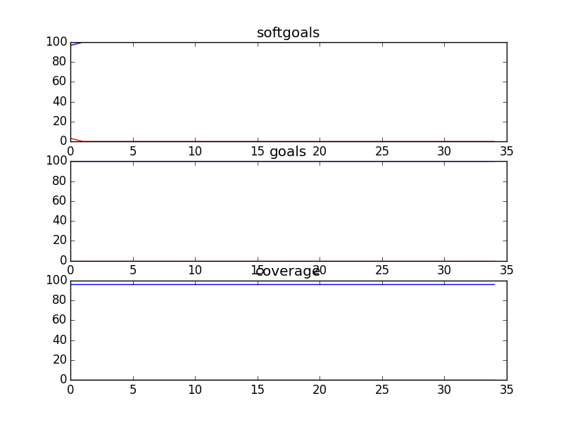
## CSFDandMarketing
```

rank ,         name ,    med   ,   iqr 
----------------------------------------------------
   1 ,      gen0_f1 ,    84.42  ,   5.19 (         ---   * ---          ),77.92, 81.82, 84.42, 86.36, 90.26
   2 ,     gen20_f1 ,    93.51  ,   5.19 (               |  ---- * --   ),87.66, 91.56, 93.51, 95.45, 97.40
   2 ,     gen40_f1 ,    94.81  ,   4.54 (               |   ----  *-   ),88.96, 92.86, 95.45, 96.10, 97.40
   3 ,     gen60_f1 ,    95.45  ,   4.54 (               |    ----  *-- ),89.61, 94.16, 96.10, 97.40, 99.35
   3 ,     gen80_f1 ,     96.1  ,   5.19 (               |    ----- *-- ),89.61, 94.81, 96.10, 97.40, 99.35
   3 ,    gen100_f1 ,     96.1  ,   3.89 (               |     ---- * - ),90.91, 94.81, 96.10, 98.05, 99.35

rank ,         name ,    med   ,   iqr 
----------------------------------------------------
   1 ,      gen0_f2 ,    78.13  ,   12.5 (   --      *   |-----         ),71.88, 75.00, 81.25, 84.38, 90.63
   2 ,     gen20_f2 ,    90.63  ,   6.25 (         ------|-    * ----   ),78.13, 87.50, 90.63, 93.75, 96.88
   3 ,     gen40_f2 ,    93.75  ,   9.38 (               |-      *   -- ),84.38, 87.50, 93.75, 96.88, 100.00
   3 ,     gen60_f2 ,    93.75  ,   6.25 (               |-----  *   -- ),84.38, 90.63, 93.75, 96.88, 100.00
   3 ,     gen80_f2 ,    93.75  ,   6.25 (               |-----  *   -- ),84.38, 90.63, 93.75, 96.88, 100.00
   3 ,    gen100_f2 ,    93.75  ,   6.25 (               |-----      *- ),84.38, 90.63, 96.88, 96.88, 100.00

rank ,         name ,    med   ,   iqr 
----------------------------------------------------
   1 ,      gen0_f3 ,    95.09  ,   0.92 (           ----*  ----        ),94.17, 95.09, 95.09, 95.71, 96.32
   2 ,     gen20_f3 ,    96.32  ,   0.62 (               |  --  *--     ),95.71, 96.01, 96.32, 96.63, 96.93
   2 ,     gen40_f3 ,    96.32  ,   0.62 (               |    --*---    ),96.01, 96.32, 96.32, 96.63, 97.24
   3 ,     gen60_f3 ,    96.63  ,   0.92 (               |    -- * -    ),96.01, 96.32, 96.63, 96.93, 97.24
   3 ,     gen80_f3 ,    96.63  ,   0.61 (               |    ---* -    ),96.01, 96.63, 96.63, 96.93, 97.24
   3 ,    gen100_f3 ,    96.63  ,   0.61 (               |    ---* -    ),96.01, 96.63, 96.63, 96.93, 97.24
```
### Time Taken : 158.062554121
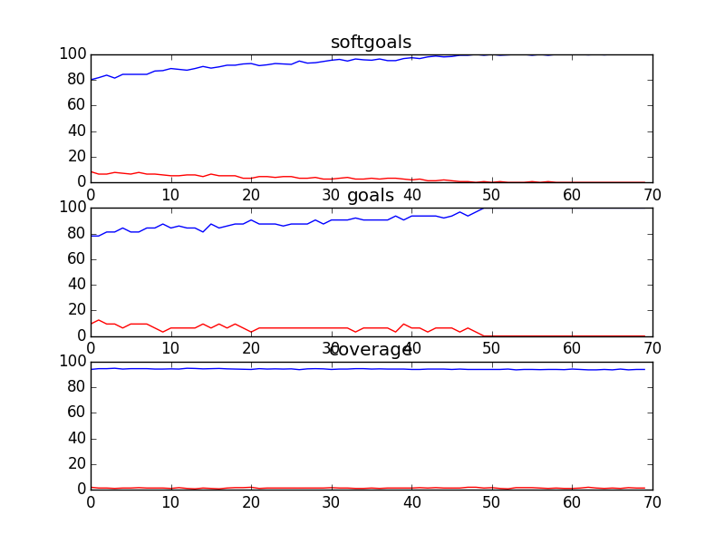
## CSFDandMarketingSD
```

rank ,         name ,    med   ,   iqr 
----------------------------------------------------
   1 ,      gen0_f1 ,    96.67  ,    0.0 (*--------------|------------- ),96.67, 96.67, 96.67, 96.67, 100.00
   2 ,     gen20_f1 ,    100.0  ,   3.33 (               |             *),96.67, 96.67, 100.00, 100.00, 100.00
   2 ,     gen40_f1 ,    100.0  ,   3.33 (               |             *),96.67, 96.67, 100.00, 100.00, 100.00
   2 ,     gen60_f1 ,    100.0  ,   3.33 (---------------|-------------*),96.67, 100.00, 100.00, 100.00, 100.00
   2 ,     gen80_f1 ,    100.0  ,    0.0 (---------------|-------------*),96.67, 100.00, 100.00, 100.00, 100.00
   2 ,    gen100_f1 ,    100.0  ,    0.0 (---------------|-------------*),96.67, 100.00, 100.00, 100.00, 100.00

rank ,         name ,    med   ,   iqr 
----------------------------------------------------
   1 ,      gen0_f2 ,    100.0  ,    0.0 (*              |              ),100.00, 100.00, 100.00, 100.00, 100.00
   1 ,     gen20_f2 ,    100.0  ,    0.0 (*              |              ),100.00, 100.00, 100.00, 100.00, 100.00
   1 ,     gen40_f2 ,    100.0  ,    0.0 (*              |              ),100.00, 100.00, 100.00, 100.00, 100.00
   1 ,     gen60_f2 ,    100.0  ,    0.0 (*              |              ),100.00, 100.00, 100.00, 100.00, 100.00
   1 ,     gen80_f2 ,    100.0  ,    0.0 (*              |              ),100.00, 100.00, 100.00, 100.00, 100.00
   1 ,    gen100_f2 ,    100.0  ,    0.0 (*              |              ),100.00, 100.00, 100.00, 100.00, 100.00

rank ,         name ,    med   ,   iqr 
----------------------------------------------------
   1 ,      gen0_f3 ,    96.97  ,   1.52 (-------       *|------        ),93.94, 95.45, 96.97, 96.97, 98.48
   2 ,     gen20_f3 ,    98.48  ,   1.52 (               |      *       ),98.48, 98.48, 98.48, 100.00, 100.00
   2 ,     gen40_f3 ,    98.48  ,   1.52 (               |      *       ),98.48, 98.48, 98.48, 100.00, 100.00
   3 ,     gen60_f3 ,    100.0  ,   1.52 (               |             *),98.48, 98.48, 100.00, 100.00, 100.00
   3 ,     gen80_f3 ,    100.0  ,    0.0 (               |      -------*),98.48, 100.00, 100.00, 100.00, 100.00
   3 ,    gen100_f3 ,    100.0  ,    0.0 (               |             *),100.00, 100.00, 100.00, 100.00, 100.00
```
### Time Taken : 5.53353691101
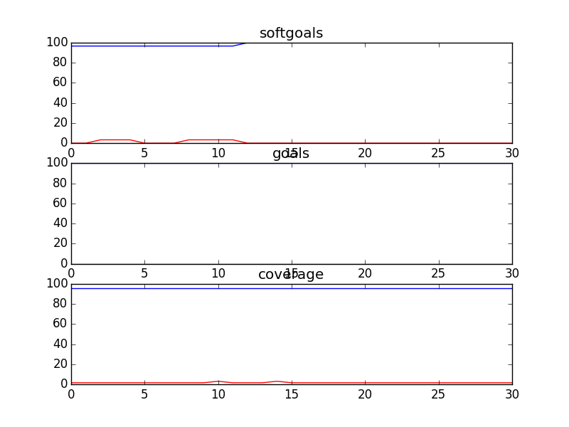
## CSITDepartment
```

rank ,         name ,    med   ,   iqr 
----------------------------------------------------
   1 ,      gen0_f1 ,    81.58  ,  10.52 (           ----|  * ----      ),73.68, 78.95, 84.21, 86.84, 92.11
   2 ,     gen20_f1 ,    94.74  ,  10.53 (               |------    * - ),81.58, 89.47, 94.74, 97.37, 100.00
   2 ,     gen40_f1 ,    94.74  ,   5.26 (               |  ------  * - ),84.21, 92.11, 94.74, 97.37, 100.00
   3 ,     gen60_f1 ,    97.37  ,   5.26 (               |    ------  * ),86.84, 94.74, 97.37, 97.37, 100.00
   3 ,     gen80_f1 ,    97.37  ,   2.63 (               |      ----  * ),89.47, 94.74, 97.37, 97.37, 100.00
   3 ,    gen100_f1 ,    97.37  ,   2.63 (               |      ----  * ),89.47, 94.74, 97.37, 97.37, 100.00

rank ,         name ,    med   ,   iqr 
----------------------------------------------------
   1 ,      gen0_f2 ,     91.3  ,   8.69 (               | *     ------ ),86.96, 86.96, 91.30, 95.65, 100.00
   2 ,     gen20_f2 ,    95.65  ,    8.7 (               | ------*      ),91.30, 95.65, 95.65, 100.00, 100.00
   2 ,     gen40_f2 ,    95.65  ,   4.35 (               | ------*      ),91.30, 95.65, 95.65, 100.00, 100.00
   2 ,     gen60_f2 ,    95.65  ,   4.35 (               | ------*      ),91.30, 95.65, 95.65, 100.00, 100.00
   2 ,     gen80_f2 ,    95.65  ,   4.35 (               | ------*      ),91.30, 95.65, 95.65, 100.00, 100.00
   2 ,    gen100_f2 ,    95.65  ,   4.35 (               | ------*      ),91.30, 95.65, 95.65, 100.00, 100.00

rank ,         name ,    med   ,   iqr 
----------------------------------------------------
   1 ,      gen0_f3 ,     87.3  ,   3.18 (         --  * |------        ),85.71, 86.51, 87.30, 88.89, 91.27
   2 ,     gen20_f3 ,    91.27  ,   0.79 (               |  --  *---    ),89.68, 90.48, 91.27, 91.27, 92.86
   2 ,     gen40_f3 ,    91.27  ,   1.58 (               |  ----* --    ),89.68, 91.27, 91.27, 92.06, 92.86
   2 ,     gen60_f3 ,    91.27  ,   1.59 (               |      *   --  ),91.27, 91.27, 91.27, 92.86, 93.65
   3 ,     gen80_f3 ,    92.06  ,   1.59 (               |        * --  ),91.27, 91.27, 92.06, 92.86, 93.65
   3 ,    gen100_f3 ,    92.06  ,   1.59 (               |        * --  ),91.27, 91.27, 92.06, 92.86, 93.65
```
### Time Taken : 20.300632
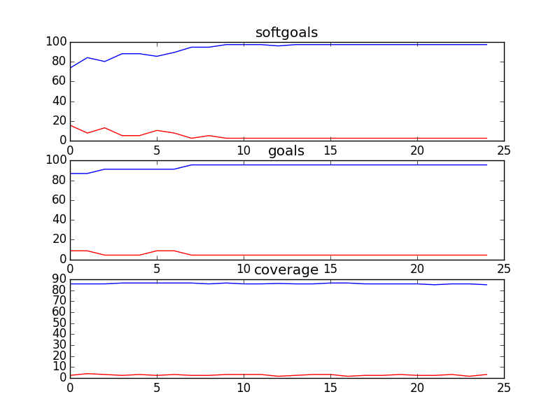
## CSSAProgram
```

rank ,         name ,    med   ,   iqr 
----------------------------------------------------
   1 ,      gen0_f1 ,    63.93  ,  24.59 (      -------  |  *  -----    ),31.15, 50.82, 63.93, 72.13, 86.89
   2 ,     gen20_f1 ,    90.16  ,  11.47 (               |    ------  * ),68.85, 85.25, 90.16, 93.44, 95.08
   2 ,     gen40_f1 ,     91.8  ,   6.56 (               |       -----* ),77.05, 90.16, 91.80, 95.08, 95.08
   3 ,     gen60_f1 ,    95.08  ,   4.92 (               |         --- *),81.97, 90.16, 95.08, 95.08, 95.08
   3 ,     gen80_f1 ,    95.08  ,   4.92 (               |          -- *),85.25, 91.80, 95.08, 95.08, 95.08
   3 ,    gen100_f1 ,    95.08  ,   4.92 (               |          -- *),85.25, 91.80, 95.08, 95.08, 95.08

rank ,         name ,    med   ,   iqr 
----------------------------------------------------
   1 ,      gen0_f2 ,    100.0  ,    0.0 (*              |              ),100.00, 100.00, 100.00, 100.00, 100.00
   1 ,     gen20_f2 ,    100.0  ,    0.0 (*              |              ),100.00, 100.00, 100.00, 100.00, 100.00
   1 ,     gen40_f2 ,    100.0  ,    0.0 (*              |              ),100.00, 100.00, 100.00, 100.00, 100.00
   1 ,     gen60_f2 ,    100.0  ,    0.0 (*              |              ),100.00, 100.00, 100.00, 100.00, 100.00
   1 ,     gen80_f2 ,    100.0  ,    0.0 (*              |              ),100.00, 100.00, 100.00, 100.00, 100.00
   1 ,    gen100_f2 ,    100.0  ,    0.0 (*              |              ),100.00, 100.00, 100.00, 100.00, 100.00

rank ,         name ,    med   ,   iqr 
----------------------------------------------------
   1 ,      gen0_f3 ,    97.37  ,   1.76 (        ----   | *            ),95.61, 96.49, 97.37, 98.25, 98.25
   2 ,     gen20_f3 ,    98.25  ,   0.87 (               | ----*   ---- ),97.37, 98.25, 98.25, 99.12, 100.00
   3 ,     gen40_f3 ,    99.12  ,   0.87 (               |     ----*--- ),98.25, 99.12, 99.12, 99.12, 100.00
   3 ,     gen60_f3 ,    99.12  ,    0.0 (               |     ----*--- ),98.25, 99.12, 99.12, 99.12, 100.00
   3 ,     gen80_f3 ,    99.12  ,    0.0 (               |     ----*--- ),98.25, 99.12, 99.12, 99.12, 100.00
   3 ,    gen100_f3 ,    99.12  ,   0.88 (               |     ----*    ),98.25, 99.12, 99.12, 100.00, 100.00
```
### Time Taken : 21.6080141068
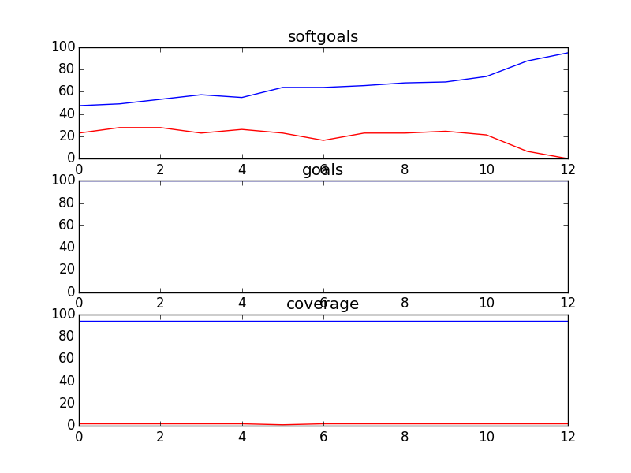
## CSSimplified
```

rank ,         name ,    med   ,   iqr 
----------------------------------------------------
   1 ,      gen0_f1 ,    98.69  ,    0.0 (*--------------|------------- ),98.69, 98.69, 98.69, 98.69, 100.00
   2 ,     gen20_f1 ,    100.0  ,   1.31 (---------------|-------------*),98.69, 100.00, 100.00, 100.00, 100.00
   2 ,     gen40_f1 ,    100.0  ,   1.31 (---------------|-------------*),98.69, 100.00, 100.00, 100.00, 100.00
   2 ,     gen60_f1 ,    100.0  ,    0.0 (---------------|-------------*),98.69, 100.00, 100.00, 100.00, 100.00
   2 ,     gen80_f1 ,    100.0  ,    0.0 (---------------|-------------*),98.69, 100.00, 100.00, 100.00, 100.00
   2 ,    gen100_f1 ,    100.0  ,    0.0 (---------------|-------------*),98.69, 100.00, 100.00, 100.00, 100.00

rank ,         name ,    med   ,   iqr 
----------------------------------------------------
   1 ,      gen0_f2 ,    100.0  ,    0.0 (*              |              ),100.00, 100.00, 100.00, 100.00, 100.00
   1 ,     gen20_f2 ,    100.0  ,    0.0 (*              |              ),100.00, 100.00, 100.00, 100.00, 100.00
   1 ,     gen40_f2 ,    100.0  ,    0.0 (*              |              ),100.00, 100.00, 100.00, 100.00, 100.00
   1 ,     gen60_f2 ,    100.0  ,    0.0 (*              |              ),100.00, 100.00, 100.00, 100.00, 100.00
   1 ,     gen80_f2 ,    100.0  ,    0.0 (*              |              ),100.00, 100.00, 100.00, 100.00, 100.00
   1 ,    gen100_f2 ,    100.0  ,    0.0 (*              |              ),100.00, 100.00, 100.00, 100.00, 100.00

rank ,         name ,    med   ,   iqr 
----------------------------------------------------
   1 ,      gen0_f3 ,    99.37  ,   0.31 (----------*    |              ),99.05, 99.37, 99.37, 99.68, 99.68
   2 ,     gen20_f3 ,    100.0  ,   0.32 (               |             *),99.68, 99.68, 100.00, 100.00, 100.00
   2 ,     gen40_f3 ,    100.0  ,    0.0 (               |             *),100.00, 100.00, 100.00, 100.00, 100.00
   2 ,     gen60_f3 ,    100.0  ,    0.0 (               |             *),100.00, 100.00, 100.00, 100.00, 100.00
   2 ,     gen80_f3 ,    100.0  ,    0.0 (               |             *),100.00, 100.00, 100.00, 100.00, 100.00
   2 ,    gen100_f3 ,    100.0  ,    0.0 (               |             *),100.00, 100.00, 100.00, 100.00, 100.00
```
### Time Taken : 63.854049921
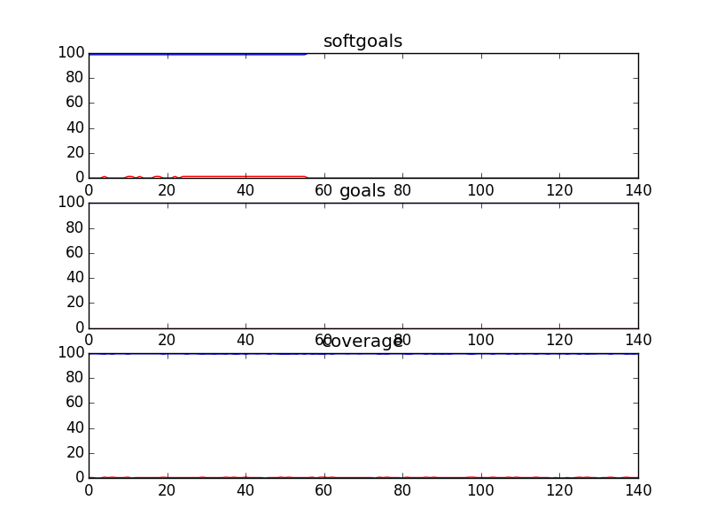
## Kids and Youth
```

rank ,         name ,    med   ,   iqr 
----------------------------------------------------
   1 ,      gen0_f1 ,    97.14  ,   2.85 (               |   *--------- ),94.29, 94.29, 97.14, 97.14, 100.00
   2 ,     gen20_f1 ,    100.0  ,   2.86 (          -----|---          *),94.29, 97.14, 100.00, 100.00, 100.00
   2 ,     gen40_f1 ,    100.0  ,   2.86 (               |             *),97.14, 97.14, 100.00, 100.00, 100.00
   2 ,     gen60_f1 ,    100.0  ,   2.86 (               |             *),97.14, 97.14, 100.00, 100.00, 100.00
   2 ,     gen80_f1 ,    100.0  ,   2.86 (               |   ----------*),97.14, 100.00, 100.00, 100.00, 100.00
   2 ,    gen100_f1 ,    100.0  ,   2.86 (               |   ----------*),97.14, 100.00, 100.00, 100.00, 100.00

rank ,         name ,    med   ,   iqr 
----------------------------------------------------
   1 ,      gen0_f2 ,    100.0  ,    0.0 (               |             *),100.00, 100.00, 100.00, 100.00, 100.00
   1 ,     gen20_f2 ,    100.0  ,    0.0 (               |             *),100.00, 100.00, 100.00, 100.00, 100.00
   1 ,     gen40_f2 ,    100.0  ,    0.0 (               |             *),100.00, 100.00, 100.00, 100.00, 100.00
   1 ,     gen60_f2 ,    100.0  ,    0.0 (               |             *),100.00, 100.00, 100.00, 100.00, 100.00
   1 ,     gen80_f2 ,    100.0  ,    0.0 (               |             *),100.00, 100.00, 100.00, 100.00, 100.00
   1 ,    gen100_f2 ,    100.0  ,    0.0 (               |             *),100.00, 100.00, 100.00, 100.00, 100.00

rank ,         name ,    med   ,   iqr 
----------------------------------------------------
   1 ,      gen0_f3 ,    86.42  ,    3.7 (      ---    * |----          ),82.72, 83.95, 86.42, 87.65, 90.12
   2 ,     gen20_f3 ,    91.36  ,   1.24 (               |  --   *---   ),88.89, 90.12, 91.36, 91.36, 93.83
   2 ,     gen40_f3 ,    91.36  ,   1.23 (               |    ---* --   ),90.12, 91.36, 91.36, 92.59, 93.83
   2 ,     gen60_f3 ,    91.36  ,   1.23 (               |    ---* --   ),90.12, 91.36, 91.36, 92.59, 93.83
   3 ,     gen80_f3 ,    92.59  ,   2.47 (               |         *-   ),91.36, 91.36, 92.59, 92.59, 93.83
   3 ,    gen100_f3 ,    92.59  ,   2.47 (               |         *-   ),91.36, 91.36, 92.59, 92.59, 93.83
```
### Time Taken : 8.38114595413
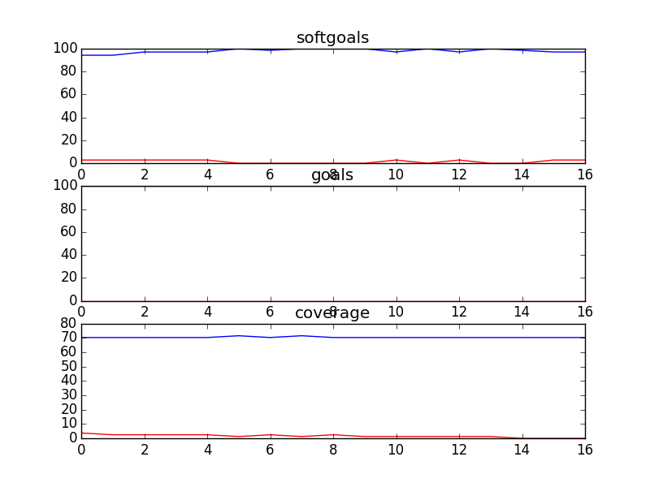
## Parents
```

rank ,         name ,    med   ,   iqr 
----------------------------------------------------
   1 ,      gen0_f1 ,     96.3  ,    3.7 (               |    *         ),96.30, 96.30, 96.30, 100.00, 100.00
   2 ,     gen20_f1 ,    100.0  ,    3.7 (               |    ---------*),96.30, 100.00, 100.00, 100.00, 100.00
   2 ,     gen40_f1 ,    100.0  ,    0.0 (               |    ---------*),96.30, 100.00, 100.00, 100.00, 100.00
   2 ,     gen60_f1 ,    100.0  ,    0.0 (               |    ---------*),96.30, 100.00, 100.00, 100.00, 100.00
   2 ,     gen80_f1 ,    100.0  ,    0.0 (               |    ---------*),96.30, 100.00, 100.00, 100.00, 100.00
   2 ,    gen100_f1 ,    100.0  ,    0.0 (               |    ---------*),96.30, 100.00, 100.00, 100.00, 100.00

rank ,         name ,    med   ,   iqr 
----------------------------------------------------
   1 ,      gen0_f2 ,    100.0  ,    0.0 (               |             *),100.00, 100.00, 100.00, 100.00, 100.00
   1 ,     gen20_f2 ,    100.0  ,    0.0 (               |             *),100.00, 100.00, 100.00, 100.00, 100.00
   1 ,     gen40_f2 ,    100.0  ,    0.0 (               |             *),100.00, 100.00, 100.00, 100.00, 100.00
   1 ,     gen60_f2 ,    100.0  ,    0.0 (               |             *),100.00, 100.00, 100.00, 100.00, 100.00
   1 ,     gen80_f2 ,    100.0  ,    0.0 (               |             *),100.00, 100.00, 100.00, 100.00, 100.00
   1 ,    gen100_f2 ,    100.0  ,    0.0 (               |             *),100.00, 100.00, 100.00, 100.00, 100.00

rank ,         name ,    med   ,   iqr 
----------------------------------------------------
   1 ,      gen0_f3 ,    93.48  ,   6.52 (    --------   | *   ----     ),86.96, 91.30, 93.48, 95.65, 97.83
   2 ,     gen20_f3 ,    95.65  ,   4.35 (            ---|-    *        ),91.30, 93.48, 95.65, 97.83, 97.83
   2 ,     gen40_f3 ,    95.65  ,   2.18 (               | ----*        ),93.48, 95.65, 95.65, 97.83, 97.83
   3 ,     gen60_f3 ,    97.83  ,   2.18 (               | ----    *--- ),93.48, 95.65, 97.83, 97.83, 100.00
   3 ,     gen80_f3 ,    97.83  ,   2.18 (               |         *--- ),95.65, 95.65, 97.83, 97.83, 100.00
   3 ,    gen100_f3 ,    97.83  ,   2.18 (               |         *--- ),95.65, 95.65, 97.83, 97.83, 100.00
```
### Time Taken : 4.72256684303
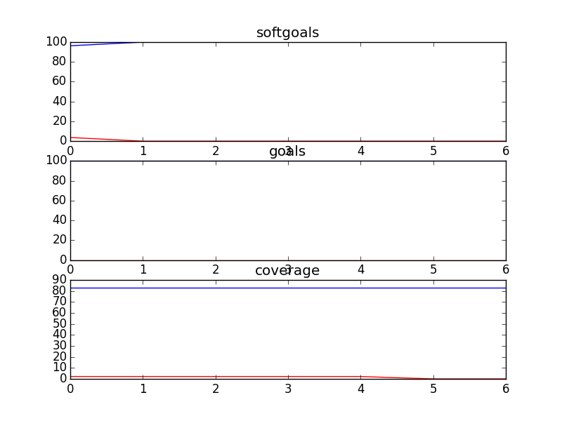
## OOOChatRooms
```

rank ,         name ,    med   ,   iqr 
----------------------------------------------------
   1 ,      gen0_f1 ,    57.47  ,   9.95 (      -    *  -|-----         ),50.23, 52.94, 57.47, 62.44, 72.40
   2 ,     gen20_f1 ,    77.83  ,   9.95 (               | ----    *--  ),66.06, 72.85, 78.73, 80.09, 82.35
   2 ,     gen40_f1 ,    79.19  ,   4.53 (               |  ------  *-  ),67.87, 77.38, 79.19, 81.00, 82.81
   3 ,     gen60_f1 ,    80.09  ,   3.17 (               |     ---- *-- ),72.85, 78.73, 80.09, 81.45, 83.26
   3 ,     gen80_f1 ,    80.09  ,   3.17 (               |       ---*-- ),75.11, 79.19, 80.09, 81.45, 83.26
   3 ,    gen100_f1 ,    80.09  ,   2.71 (               |       --- *- ),75.11, 79.64, 80.54, 81.45, 83.71

rank ,         name ,    med   ,   iqr 
----------------------------------------------------
   1 ,      gen0_f2 ,    33.33  ,  16.67 (*      --------|------------- ),33.33, 33.33, 33.33, 50.00, 100.00
   2 ,     gen20_f2 ,    100.0  ,    0.0 (       --------|-------------*),50.00, 100.00, 100.00, 100.00, 100.00
   2 ,     gen40_f2 ,    100.0  ,    0.0 (       --------|-------------*),50.00, 100.00, 100.00, 100.00, 100.00
   2 ,     gen60_f2 ,    100.0  ,    0.0 (               |             *),100.00, 100.00, 100.00, 100.00, 100.00
   2 ,     gen80_f2 ,    100.0  ,    0.0 (               |             *),100.00, 100.00, 100.00, 100.00, 100.00
   2 ,    gen100_f2 ,    100.0  ,    0.0 (               |             *),100.00, 100.00, 100.00, 100.00, 100.00

rank ,         name ,    med   ,   iqr 
----------------------------------------------------
   1 ,      gen0_f3 ,    99.23  ,   0.77 (        -------|-    *   ---- ),98.07, 98.84, 99.23, 99.61, 100.00
   2 ,     gen20_f3 ,    100.0  ,   0.39 (               |             *),99.61, 99.61, 100.00, 100.00, 100.00
   2 ,     gen40_f3 ,    100.0  ,   0.39 (               |             *),99.61, 99.61, 100.00, 100.00, 100.00
   2 ,     gen60_f3 ,    100.0  ,   0.39 (               |             *),99.61, 99.61, 100.00, 100.00, 100.00
   2 ,     gen80_f3 ,    100.0  ,   0.39 (               |             *),99.61, 99.61, 100.00, 100.00, 100.00
   2 ,    gen100_f3 ,    100.0  ,   0.39 (               |             *),99.61, 99.61, 100.00, 100.00, 100.00
```
### Time Taken : 78.1766757965
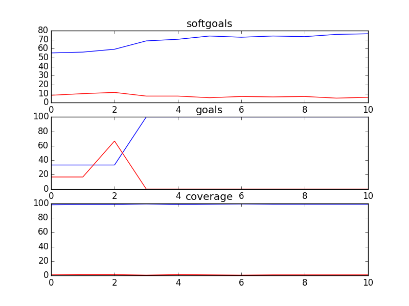
## DelayModeratedBulletinBoard
```

rank ,         name ,    med   ,   iqr 
----------------------------------------------------
   1 ,      gen0_f1 ,    61.71  ,   8.92 (    ------   * |----          ),49.07, 58.36, 62.08, 64.68, 71.75
   2 ,     gen20_f1 ,    76.21  ,    7.8 (               | ---   *---   ),68.40, 72.86, 76.58, 78.44, 82.53
   3 ,     gen40_f1 ,     80.3  ,   5.95 (               |     --   *-  ),73.98, 77.32, 80.67, 82.53, 84.01
   3 ,     gen60_f1 ,    81.04  ,   4.46 (               |      --- *-  ),74.72, 79.55, 81.04, 82.90, 84.01
   4 ,     gen80_f1 ,    81.78  ,   4.46 (               |       --  *  ),76.95, 79.93, 81.78, 83.27, 84.01
   4 ,    gen100_f1 ,    82.16  ,   2.23 (               |        -- *  ),78.07, 81.04, 82.53, 83.27, 84.39

rank ,         name ,    med   ,   iqr 
----------------------------------------------------
   1 ,      gen0_f2 ,      0.0  ,    0.0 (*--------------|------------- ), 0.00,  0.00,  0.00,  0.00, 100.00
   2 ,     gen20_f2 ,    100.0  ,    0.0 (---------------|-------------*), 0.00, 100.00, 100.00, 100.00, 100.00
   2 ,     gen40_f2 ,    100.0  ,    0.0 (               |             *),100.00, 100.00, 100.00, 100.00, 100.00
   2 ,     gen60_f2 ,    100.0  ,    0.0 (               |             *),100.00, 100.00, 100.00, 100.00, 100.00
   2 ,     gen80_f2 ,    100.0  ,    0.0 (               |             *),100.00, 100.00, 100.00, 100.00, 100.00
   2 ,    gen100_f2 ,    100.0  ,    0.0 (               |             *),100.00, 100.00, 100.00, 100.00, 100.00

rank ,         name ,    med   ,   iqr 
----------------------------------------------------
   1 ,      gen0_f3 ,    99.35  ,   0.97 (-----------    | *------      ),98.39, 99.03, 99.35, 99.35, 99.68
   2 ,     gen20_f3 ,    100.0  ,   0.32 (               |             *),99.68, 99.68, 100.00, 100.00, 100.00
   2 ,     gen40_f3 ,    100.0  ,   0.32 (               |             *),99.68, 99.68, 100.00, 100.00, 100.00
   2 ,     gen60_f3 ,    100.0  ,   0.32 (               |        -----*),99.68, 100.00, 100.00, 100.00, 100.00
   2 ,     gen80_f3 ,    100.0  ,   0.32 (               |        -----*),99.68, 100.00, 100.00, 100.00, 100.00
   2 ,    gen100_f3 ,    100.0  ,   0.32 (               |        -----*),99.68, 100.00, 100.00, 100.00, 100.00
```
### Time Taken : 109.158624887
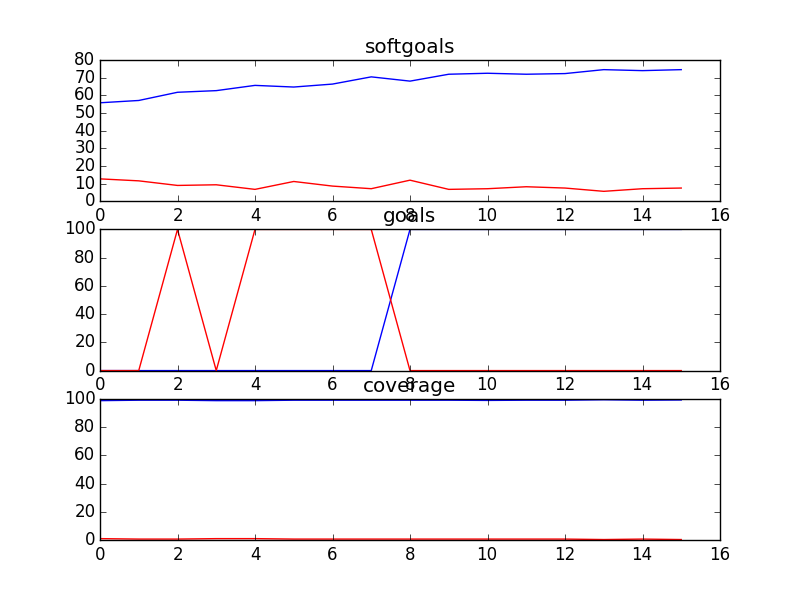
