## CSServices
```

rank ,         name ,    med   ,   iqr 
----------------------------------------------------
   1 ,      gen0_f1 ,    53.23  ,   8.07 (    ---- * --- |              ),45.70, 51.08, 53.23, 55.91, 60.75
   2 ,     gen20_f1 ,    57.53  ,   9.68 (      ---   * -|--            ),48.92, 52.69, 57.53, 61.29, 67.20
   3 ,     gen40_f1 ,    61.29  ,   6.99 (        ----  *|---           ),52.15, 57.53, 61.29, 63.44, 67.74
   3 ,     gen60_f1 ,     62.9  ,   7.52 (          ---- |*  -          ),55.38, 60.22, 64.52, 67.74, 70.43
   4 ,     gen80_f1 ,    66.67  ,   9.68 (          -----|  * ---       ),55.38, 61.83, 67.20, 70.43, 74.19
   4 ,    gen100_f1 ,    68.82  ,  10.21 (           ----|-   *----     ),55.91, 65.59, 69.35, 71.51, 77.96

rank ,         name ,    med   ,   iqr 
----------------------------------------------------
   1 ,      gen0_f2 ,    78.26  ,  13.04 (  -----------  |  * ---       ),47.83, 69.57, 78.26, 82.61, 86.96
   2 ,     gen20_f2 ,    82.61  ,  17.39 (      ---------|    *  --     ),56.52, 73.91, 82.61, 86.96, 91.30
   2 ,     gen40_f2 ,    82.61  ,  13.05 (      ---------|    *  ----   ),56.52, 73.91, 82.61, 86.96, 95.65
   2 ,     gen60_f2 ,    82.61  ,    8.7 (             --|--  *  ----   ),69.57, 78.26, 82.61, 86.96, 95.65
   3 ,     gen80_f2 ,    86.96  ,  13.04 (               |----   * --   ),73.91, 82.61, 86.96, 91.30, 95.65
   3 ,    gen100_f2 ,    86.96  ,  13.04 (               |----   * ---- ),73.91, 82.61, 86.96, 91.30, 100.00

rank ,         name ,    med   ,   iqr 
----------------------------------------------------
   1 ,    gen100_f3 ,     65.0  ,   12.0 (    ---- *   --|-             ),56.00, 62.00, 65.00, 71.00, 79.00
   1 ,     gen80_f3 ,     66.0  ,   13.0 (    ----   *  -|--            ),56.00, 62.00, 67.00, 74.00, 80.00
   1 ,     gen60_f3 ,     70.0  ,   13.0 (     ----   *  |-----         ),57.00, 65.00, 70.00, 77.00, 85.00
   2 ,     gen40_f3 ,     73.0  ,   15.0 (       ----   *|  ----        ),60.00, 68.00, 73.00, 80.00, 88.00
   2 ,     gen20_f3 ,     75.0  ,   15.0 (       -----   |*  ------     ),60.00, 70.00, 76.00, 82.00, 93.00
   2 ,      gen0_f3 ,     80.0  ,   15.0 (        ------ |  *  -------  ),63.00, 74.00, 80.00, 85.00, 99.00
```
### Time Taken : 189.368373156
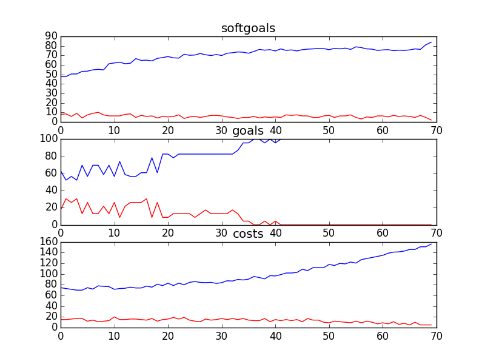
## CSCounselling
```

rank ,         name ,    med   ,   iqr 
----------------------------------------------------
   1 ,      gen0_f1 ,    80.66  ,   7.74 (    -----    * |--            ),71.82, 76.80, 81.22, 83.98, 86.19
   2 ,     gen20_f1 ,    85.08  ,   7.19 (       ------- |  * --        ),75.14, 81.77, 85.64, 87.85, 90.61
   3 ,     gen40_f1 ,    87.85  ,   8.29 (         ------|--  *----     ),76.80, 86.19, 87.85, 89.50, 93.37
   3 ,     gen60_f1 ,     88.4  ,   6.08 (              -|--  * -----   ),81.77, 86.19, 88.40, 90.61, 95.58
   4 ,     gen80_f1 ,    90.61  ,   5.52 (               |----- *  --   ),82.87, 88.95, 90.61, 92.82, 95.58
   4 ,    gen100_f1 ,    91.71  ,   4.98 (               |  ---  *  --  ),86.19, 89.50, 91.71, 93.92, 96.13

rank ,         name ,    med   ,   iqr 
----------------------------------------------------
   1 ,      gen0_f2 ,    86.21  ,    6.9 (    ----    *  | --------     ),79.31, 82.76, 86.21, 89.66, 96.55
   2 ,     gen20_f2 ,    89.66  ,   6.89 (        ----   | *   ----     ),82.76, 86.21, 89.66, 93.10, 96.55
   3 ,     gen40_f2 ,     93.1  ,   6.89 (            ---|-    *        ),86.21, 89.66, 93.10, 96.55, 96.55
   4 ,     gen60_f2 ,     93.1  ,   6.89 (            ---|-        *--- ),86.21, 89.66, 96.55, 96.55, 100.00
   4 ,     gen80_f2 ,    96.55  ,   6.89 (            ---|-----    *--- ),86.21, 93.10, 96.55, 96.55, 100.00
   4 ,    gen100_f2 ,    96.55  ,   3.45 (               | ----    *--- ),89.66, 93.10, 96.55, 96.55, 100.00

rank ,         name ,    med   ,   iqr 
----------------------------------------------------
   1 ,     gen80_f3 ,     68.0  ,   18.0 (   ----    *  -|---           ),53.00, 60.00, 68.00, 74.00, 83.00
   1 ,    gen100_f3 ,     68.0  ,   16.0 (   ---     * --|-             ),53.00, 59.00, 68.00, 73.00, 79.00
   2 ,     gen60_f3 ,     70.0  ,   17.0 (      ---   *  |----          ),58.00, 64.00, 70.00, 78.00, 85.00
   2 ,     gen40_f3 ,     73.0  ,   15.0 (      ---    * | -----        ),58.00, 65.00, 73.00, 79.00, 90.00
   3 ,     gen20_f3 ,     75.0  ,   17.0 (       ----    *   ---        ),61.00, 68.00, 76.00, 83.00, 90.00
   3 ,      gen0_f3 ,     79.0  ,   21.0 (        ----   | *   ----     ),62.00, 70.00, 80.00, 88.00, 96.00
```
### Time Taken : 180.090089083
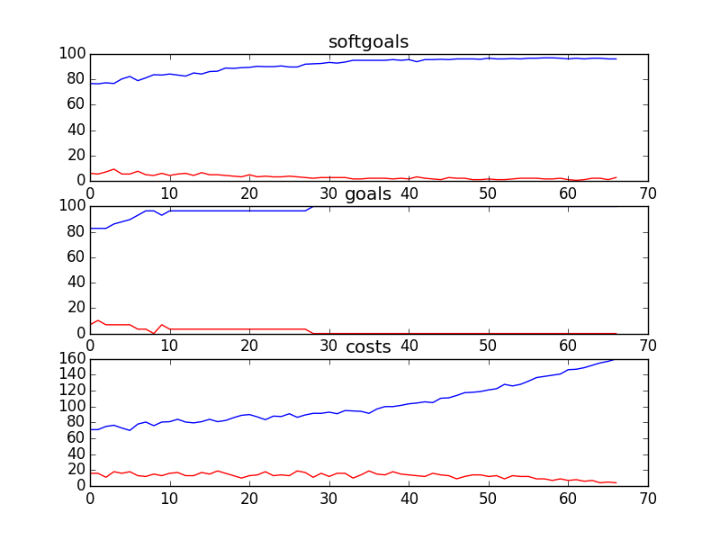
## CSCounsellingManagement
```

rank ,         name ,    med   ,   iqr 
----------------------------------------------------
   1 ,      gen0_f1 ,    81.82  ,   6.61 (      ----    *|   --         ),75.21, 78.51, 81.82, 85.12, 86.78
   2 ,     gen20_f1 ,    86.78  ,   4.96 (               |--   *---     ),82.64, 84.30, 86.78, 87.60, 90.08
   3 ,     gen40_f1 ,     87.6  ,   3.31 (               |  --  * -     ),84.30, 85.95, 87.60, 89.26, 90.08
   4 ,     gen60_f1 ,    88.43  ,   1.66 (               |     --*--    ),86.78, 88.43, 88.43, 89.26, 90.91
   4 ,     gen80_f1 ,    89.26  ,   1.65 (               |     -- *-    ),86.78, 88.43, 89.26, 90.08, 90.91
   4 ,    gen100_f1 ,    89.26  ,   1.65 (               |       -*--   ),88.43, 89.26, 89.26, 90.08, 91.74

rank ,         name ,    med   ,   iqr 
----------------------------------------------------
   1 ,      gen0_f2 ,    97.22  ,    0.0 (--------------*|------------- ),94.44, 97.22, 97.22, 97.22, 100.00
   1 ,     gen20_f2 ,    97.22  ,   2.78 (              *|              ),97.22, 97.22, 97.22, 100.00, 100.00
   2 ,     gen40_f2 ,    100.0  ,   2.78 (               |             *),97.22, 97.22, 100.00, 100.00, 100.00
   2 ,     gen60_f2 ,    100.0  ,   2.78 (               |             *),97.22, 97.22, 100.00, 100.00, 100.00
   2 ,     gen80_f2 ,    100.0  ,   2.78 (               |             *),97.22, 97.22, 100.00, 100.00, 100.00
   2 ,    gen100_f2 ,    100.0  ,   2.78 (              -|-------------*),97.22, 100.00, 100.00, 100.00, 100.00

rank ,         name ,    med   ,   iqr 
----------------------------------------------------
   1 ,     gen80_f3 ,     17.0  ,    7.0 (    --  * ---- |              ),12.00, 15.00, 17.00, 20.00, 26.00
   1 ,    gen100_f3 ,     17.0  ,    6.0 (   ---  * ---  |              ),10.00, 14.00, 17.00, 20.00, 24.00
   2 ,     gen60_f3 ,     20.0  ,    9.0 (     ---  *  --|-             ),13.00, 17.00, 20.00, 24.00, 30.00
   2 ,     gen40_f3 ,     22.0  ,    9.0 (      ---   * -|--            ),14.00, 19.00, 23.00, 26.00, 31.00
   3 ,     gen20_f3 ,     25.0  ,    7.0 (       ----- * |---           ),16.00, 23.00, 25.00, 28.00, 33.00
   4 ,      gen0_f3 ,     31.0  ,   12.0 (           --  |  * ----      ),21.00, 25.00, 31.00, 35.00, 40.00
```
### Time Taken : 55.8840019703
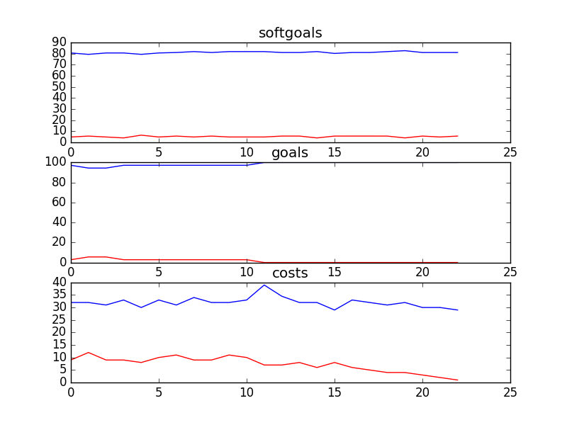
## CSCounsellingManagementSD
```

rank ,         name ,    med   ,   iqr 
----------------------------------------------------
   1 ,      gen0_f1 ,    95.12  ,    0.0 (*--------------|------------- ),95.12, 95.12, 95.12, 95.12, 100.00
   1 ,     gen20_f1 ,    95.12  ,   4.88 (*              |              ),95.12, 95.12, 95.12, 100.00, 100.00
   1 ,     gen40_f1 ,    95.12  ,   4.88 (*              |              ),95.12, 95.12, 95.12, 100.00, 100.00
   1 ,     gen60_f1 ,    95.12  ,   4.88 (*              |              ),95.12, 95.12, 95.12, 100.00, 100.00
   1 ,     gen80_f1 ,    95.12  ,   4.88 (*              |              ),95.12, 95.12, 95.12, 100.00, 100.00
   1 ,    gen100_f1 ,    95.12  ,   4.88 (*              |              ),95.12, 95.12, 95.12, 100.00, 100.00

rank ,         name ,    med   ,   iqr 
----------------------------------------------------
   1 ,      gen0_f2 ,    100.0  ,    0.0 (*              |              ),100.00, 100.00, 100.00, 100.00, 100.00
   1 ,     gen20_f2 ,    100.0  ,    0.0 (*              |              ),100.00, 100.00, 100.00, 100.00, 100.00
   1 ,     gen40_f2 ,    100.0  ,    0.0 (*              |              ),100.00, 100.00, 100.00, 100.00, 100.00
   1 ,     gen60_f2 ,    100.0  ,    0.0 (*              |              ),100.00, 100.00, 100.00, 100.00, 100.00
   1 ,     gen80_f2 ,    100.0  ,    0.0 (*              |              ),100.00, 100.00, 100.00, 100.00, 100.00
   1 ,    gen100_f2 ,    100.0  ,    0.0 (*              |              ),100.00, 100.00, 100.00, 100.00, 100.00

rank ,         name ,    med   ,   iqr 
----------------------------------------------------
   1 ,     gen40_f3 ,      6.0  ,    4.0 (   -- * ---    |              ), 3.00,  5.00,  6.00,  8.00, 11.00
   1 ,     gen60_f3 ,      6.0  ,    4.0 (   -- * ---    |              ), 3.00,  5.00,  6.00,  8.00, 11.00
   1 ,     gen80_f3 ,      6.0  ,    4.0 (   -- * ---    |              ), 3.00,  5.00,  6.00,  8.00, 11.00
   1 ,    gen100_f3 ,      6.0  ,    4.0 (   -- * ---    |              ), 3.00,  5.00,  6.00,  8.00, 11.00
   1 ,     gen20_f3 ,      7.0  ,    4.0 (   --  *---    |              ), 3.00,  5.00,  7.00,  8.00, 11.00
   2 ,      gen0_f3 ,     15.0  ,    7.0 (       ----    *  ----        ), 7.00, 11.00, 15.00, 18.00, 22.00
```
### Time Taken : 4.77103495598
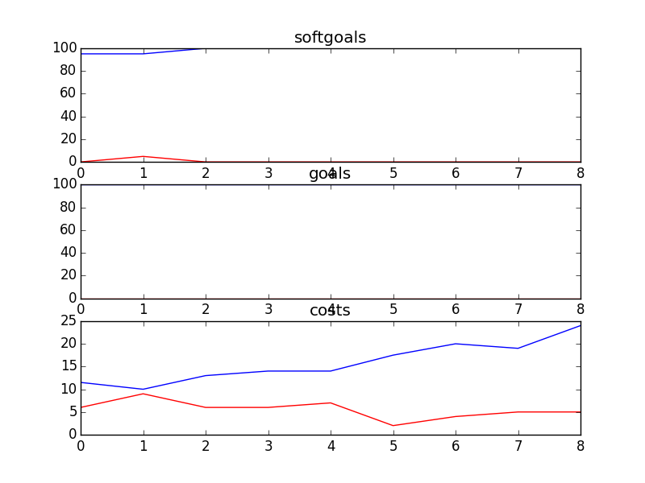
## CSCounsellingSD
```

rank ,         name ,    med   ,   iqr 
----------------------------------------------------
   1 ,      gen0_f1 ,    100.0  ,   3.28 (               |             *),96.72, 96.72, 100.00, 100.00, 100.00
   1 ,     gen20_f1 ,    100.0  ,   3.28 (               |             *),96.72, 96.72, 100.00, 100.00, 100.00
   1 ,     gen40_f1 ,    100.0  ,   3.28 (               |             *),96.72, 96.72, 100.00, 100.00, 100.00
   1 ,     gen60_f1 ,    100.0  ,   3.28 (---------------|-------------*),96.72, 100.00, 100.00, 100.00, 100.00
   1 ,     gen80_f1 ,    100.0  ,   3.28 (---------------|-------------*),96.72, 100.00, 100.00, 100.00, 100.00
   1 ,    gen100_f1 ,    100.0  ,   3.28 (---------------|-------------*),96.72, 100.00, 100.00, 100.00, 100.00

rank ,         name ,    med   ,   iqr 
----------------------------------------------------
   1 ,      gen0_f2 ,    100.0  ,    0.0 (*              |              ),100.00, 100.00, 100.00, 100.00, 100.00
   1 ,     gen20_f2 ,    100.0  ,    0.0 (*              |              ),100.00, 100.00, 100.00, 100.00, 100.00
   1 ,     gen40_f2 ,    100.0  ,    0.0 (*              |              ),100.00, 100.00, 100.00, 100.00, 100.00
   1 ,     gen60_f2 ,    100.0  ,    0.0 (*              |              ),100.00, 100.00, 100.00, 100.00, 100.00
   1 ,     gen80_f2 ,    100.0  ,    0.0 (*              |              ),100.00, 100.00, 100.00, 100.00, 100.00
   1 ,    gen100_f2 ,    100.0  ,    0.0 (*              |              ),100.00, 100.00, 100.00, 100.00, 100.00

rank ,         name ,    med   ,   iqr 
----------------------------------------------------
   1 ,    gen100_f3 ,      7.0  ,    4.0 (-- *           |              ), 2.00,  6.00,  7.00,  7.00,  8.00
   2 ,     gen80_f3 ,      9.0  ,    3.0 (  - *          |              ), 5.00,  8.00,  9.00, 10.00, 12.00
   3 ,     gen60_f3 ,     15.0  ,    2.0 (    --*-       |              ),10.00, 14.00, 15.00, 16.00, 18.00
   4 ,     gen40_f3 ,     23.0  ,    8.0 (        -  *-  |              ),18.00, 20.00, 24.00, 27.00, 29.00
   5 ,     gen20_f3 ,     33.0  ,    9.0 (           --  * -            ),26.00, 30.00, 33.00, 37.00, 40.00
   6 ,      gen0_f3 ,     46.0  ,   12.0 (               |---  * ----   ),36.00, 43.00, 47.00, 51.00, 60.00
```
### Time Taken : 9.60086798668
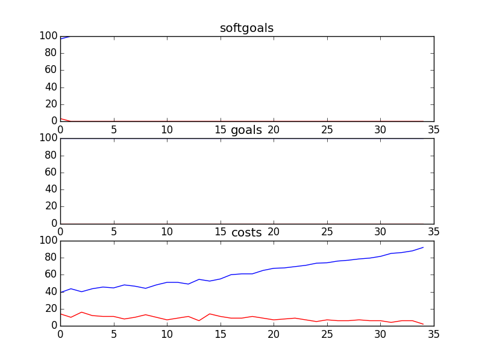
## CSFDandMarketing
```

rank ,         name ,    med   ,   iqr 
----------------------------------------------------
   1 ,      gen0_f1 ,    85.06  ,   6.49 (         ----  |* ---         ),78.57, 82.47, 85.06, 87.66, 90.26
   2 ,     gen20_f1 ,    88.31  ,    5.2 (             --|   * ---      ),83.12, 85.71, 88.31, 90.26, 92.86
   3 ,     gen40_f1 ,    89.61  ,   4.55 (             --|--- *  --     ),83.12, 88.31, 89.61, 91.56, 94.16
   3 ,     gen60_f1 ,    89.61  ,   4.55 (               |--- *  --     ),84.42, 88.31, 89.61, 92.21, 94.16
   3 ,     gen80_f1 ,    90.26  ,    3.9 (               |---- * --     ),84.42, 88.96, 90.26, 92.21, 94.16
   3 ,    gen100_f1 ,    90.26  ,    3.9 (               |----   *--    ),85.06, 89.61, 91.56, 92.86, 94.81

rank ,         name ,    med   ,   iqr 
----------------------------------------------------
   1 ,      gen0_f2 ,    81.25  ,   6.25 (      ----   * |-------       ),75.00, 78.13, 81.25, 84.38, 90.63
   2 ,     gen20_f2 ,    84.38  ,   9.37 (      ----     |*  -------    ),75.00, 78.13, 84.38, 87.50, 93.75
   2 ,     gen40_f2 ,    84.38  ,   9.37 (               |*  -------    ),78.13, 78.13, 84.38, 87.50, 93.75
   2 ,     gen60_f2 ,    84.38  ,   9.38 (          ---  |*      ---    ),78.13, 81.25, 84.38, 90.63, 93.75
   2 ,     gen80_f2 ,    84.38  ,   9.38 (          ---  |*      ---    ),78.13, 81.25, 84.38, 90.63, 93.75
   2 ,    gen100_f2 ,    84.38  ,   9.38 (          -----|*      ---    ),78.13, 84.38, 84.38, 90.63, 93.75

rank ,         name ,    med   ,   iqr 
----------------------------------------------------
   1 ,    gen100_f3 ,     92.0  ,   16.0 (      ---   *  |---           ),81.00, 88.00, 93.00, 101.00, 109.00
   1 ,     gen80_f3 ,     93.0  ,   17.0 (      ----  *  |---           ),81.00, 89.00, 93.00, 103.00, 110.00
   1 ,     gen60_f3 ,     93.0  ,   17.0 (      ----   * |----          ),81.00, 89.00, 95.00, 104.00, 113.00
   1 ,     gen40_f3 ,     94.0  ,   17.0 (      ----   * |-----         ),81.00, 90.00, 95.00, 104.00, 114.00
   2 ,     gen20_f3 ,     95.0  ,   21.0 (      ----   * |  -----       ),81.00, 90.00, 95.00, 108.00, 118.00
   2 ,      gen0_f3 ,    100.0  ,   20.0 (       ----    *   -----      ),83.00, 92.00, 100.00, 111.00, 121.00
```
### Time Taken : 184.674899101
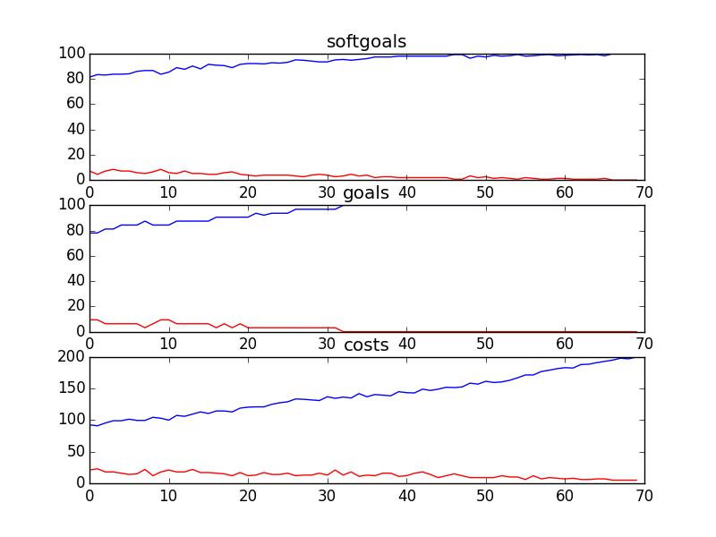
## CSFDandMarketingSD
```

rank ,         name ,    med   ,   iqr 
----------------------------------------------------
   1 ,      gen0_f1 ,    96.67  ,    0.0 (*--------------|------------- ),96.67, 96.67, 96.67, 96.67, 100.00
   1 ,     gen20_f1 ,    96.67  ,   3.33 (*              |              ),96.67, 96.67, 96.67, 100.00, 100.00
   2 ,     gen40_f1 ,    100.0  ,   3.33 (               |             *),96.67, 96.67, 100.00, 100.00, 100.00
   2 ,     gen60_f1 ,    100.0  ,    0.0 (---------------|-------------*),96.67, 100.00, 100.00, 100.00, 100.00
   2 ,     gen80_f1 ,    100.0  ,    0.0 (---------------|-------------*),96.67, 100.00, 100.00, 100.00, 100.00
   2 ,    gen100_f1 ,    100.0  ,    0.0 (---------------|-------------*),96.67, 100.00, 100.00, 100.00, 100.00

rank ,         name ,    med   ,   iqr 
----------------------------------------------------
   1 ,      gen0_f2 ,    100.0  ,    0.0 (*              |              ),100.00, 100.00, 100.00, 100.00, 100.00
   1 ,     gen20_f2 ,    100.0  ,    0.0 (*              |              ),100.00, 100.00, 100.00, 100.00, 100.00
   1 ,     gen40_f2 ,    100.0  ,    0.0 (*              |              ),100.00, 100.00, 100.00, 100.00, 100.00
   1 ,     gen60_f2 ,    100.0  ,    0.0 (*              |              ),100.00, 100.00, 100.00, 100.00, 100.00
   1 ,     gen80_f2 ,    100.0  ,    0.0 (*              |              ),100.00, 100.00, 100.00, 100.00, 100.00
   1 ,    gen100_f2 ,    100.0  ,    0.0 (*              |              ),100.00, 100.00, 100.00, 100.00, 100.00

rank ,         name ,    med   ,   iqr 
----------------------------------------------------
   1 ,    gen100_f3 ,      6.0  ,    2.0 (- *            |              ), 3.00,  5.00,  6.00,  7.00,  7.00
   2 ,     gen80_f3 ,      8.0  ,    3.0 ( - *           |              ), 5.00,  7.00,  8.00,  9.00, 11.00
   3 ,     gen60_f3 ,     14.0  ,    4.0 (    -*--       |              ),10.00, 12.00, 14.00, 16.00, 20.00
   4 ,     gen40_f3 ,     26.0  ,    8.0 (       --  *-  |              ),18.00, 22.00, 26.00, 29.00, 31.00
   5 ,     gen20_f3 ,     35.0  ,   10.0 (           --- |* ---         ),27.00, 32.00, 36.00, 41.00, 47.00
   6 ,      gen0_f3 ,     48.0  ,   11.0 (               |---  * ---    ),35.00, 44.00, 48.00, 51.00, 58.00
```
### Time Taken : 7.15482997894
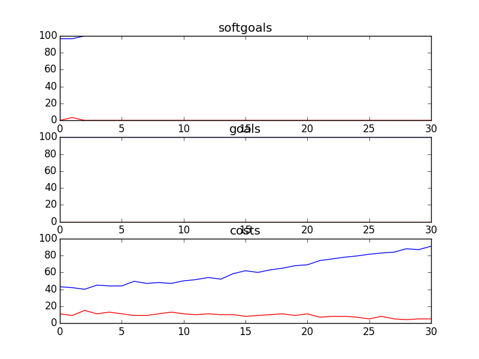
## CSITDepartment
```

rank ,         name ,    med   ,   iqr 
----------------------------------------------------
   1 ,      gen0_f1 ,    81.58  ,  10.52 (  --------    *| -----        ),71.05, 78.95, 84.21, 86.84, 92.11
   2 ,     gen20_f1 ,    92.11  ,    7.9 (          -----|-     *  --   ),78.95, 86.84, 92.11, 94.74, 97.37
   3 ,     gen40_f1 ,    94.74  ,   5.26 (               |   ---   * -- ),89.47, 92.11, 94.74, 97.37, 100.00
   4 ,     gen60_f1 ,    97.37  ,   5.26 (               |      ---  *  ),92.11, 94.74, 97.37, 100.00, 100.00
   4 ,     gen80_f1 ,    97.37  ,   5.26 (               |             *),94.74, 94.74, 100.00, 100.00, 100.00
   4 ,    gen100_f1 ,    100.0  ,   5.26 (               |         --  *),94.74, 97.37, 100.00, 100.00, 100.00

rank ,         name ,    med   ,   iqr 
----------------------------------------------------
   1 ,      gen0_f2 ,     91.3  ,   8.69 (               | *     ------ ),86.96, 86.96, 91.30, 95.65, 100.00
   2 ,     gen20_f2 ,     91.3  ,   4.35 (            ---|-      *----- ),86.96, 91.30, 95.65, 95.65, 100.00
   3 ,     gen40_f2 ,    95.65  ,   4.35 (               | ------*----- ),91.30, 95.65, 95.65, 95.65, 100.00
   3 ,     gen60_f2 ,    95.65  ,    0.0 (               | ------*----- ),91.30, 95.65, 95.65, 95.65, 100.00
   3 ,     gen80_f2 ,    95.65  ,    0.0 (               | ------*----- ),91.30, 95.65, 95.65, 95.65, 100.00
   3 ,    gen100_f2 ,    95.65  ,    0.0 (               | ------*----- ),91.30, 95.65, 95.65, 95.65, 100.00

rank ,         name ,    med   ,   iqr 
----------------------------------------------------
   1 ,    gen100_f3 ,     15.0  ,    4.0 (  - * -        |              ),11.00, 13.00, 15.00, 17.00, 18.00
   1 ,     gen80_f3 ,     17.0  ,    4.0 (  --  *-       |              ),12.00, 14.00, 17.00, 18.00, 20.00
   2 ,     gen60_f3 ,     20.0  ,    6.0 (    --  *---   |              ),14.00, 17.00, 20.00, 22.00, 26.00
   3 ,     gen40_f3 ,     22.0  ,    7.0 (    ---  *  -- |              ),15.00, 19.00, 22.00, 25.00, 29.00
   4 ,     gen20_f3 ,     27.0  ,    9.0 (       ---   * |---           ),19.00, 23.00, 27.00, 30.00, 36.00
   5 ,      gen0_f3 ,     33.0  ,   10.0 (        ------ | * ----       ),20.00, 28.00, 33.00, 36.00, 41.00
```
### Time Taken : 21.6495101452
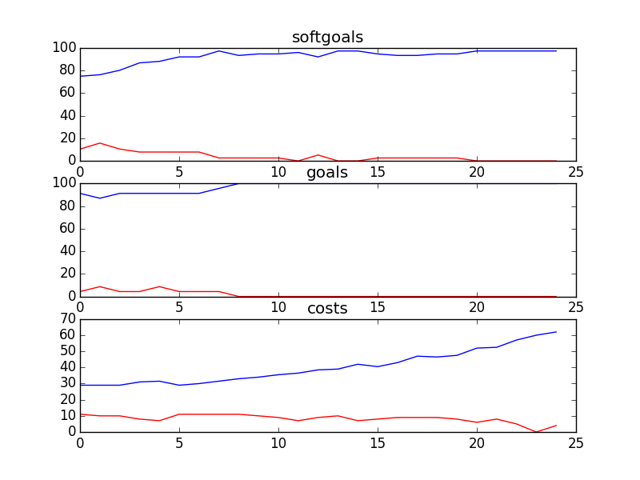
## CSSAProgram
```

rank ,         name ,    med   ,   iqr 
----------------------------------------------------
   1 ,      gen0_f1 ,    60.66  ,  16.39 (     --------- |*   ----      ),32.79, 55.74, 60.66, 70.49, 81.97
   2 ,     gen20_f1 ,    77.05  ,  21.32 (             --|--     *  --  ),52.46, 65.57, 78.69, 85.25, 90.16
   3 ,     gen40_f1 ,    81.97  ,  14.75 (               | -----   *--  ),62.30, 75.41, 83.61, 86.89, 91.80
   3 ,     gen60_f1 ,    83.61  ,  16.39 (               | -----    * - ),63.93, 77.05, 85.25, 90.16, 93.44
   3 ,     gen80_f1 ,    85.25  ,  16.39 (               |   ---    * - ),67.21, 77.05, 85.25, 90.16, 93.44
   3 ,    gen100_f1 ,    85.25  ,  14.75 (               |   ---    * - ),67.21, 77.05, 85.25, 90.16, 95.08

rank ,         name ,    med   ,   iqr 
----------------------------------------------------
   1 ,      gen0_f2 ,    100.0  ,    0.0 (*              |              ),100.00, 100.00, 100.00, 100.00, 100.00
   1 ,     gen20_f2 ,    100.0  ,    0.0 (*              |              ),100.00, 100.00, 100.00, 100.00, 100.00
   1 ,     gen40_f2 ,    100.0  ,    0.0 (*              |              ),100.00, 100.00, 100.00, 100.00, 100.00
   1 ,     gen60_f2 ,    100.0  ,    0.0 (*              |              ),100.00, 100.00, 100.00, 100.00, 100.00
   1 ,     gen80_f2 ,    100.0  ,    0.0 (*              |              ),100.00, 100.00, 100.00, 100.00, 100.00
   1 ,    gen100_f2 ,    100.0  ,    0.0 (*              |              ),100.00, 100.00, 100.00, 100.00, 100.00

rank ,         name ,    med   ,   iqr 
----------------------------------------------------
   1 ,    gen100_f3 ,     15.0  ,    8.0 (    ----  *  --|--            ), 8.00, 13.00, 15.00, 19.00, 25.00
   1 ,     gen40_f3 ,     16.0  ,    8.0 (     ----  *   |--            ), 9.00, 14.00, 16.00, 21.00, 25.00
   1 ,     gen60_f3 ,     16.0  ,    8.0 (     ----  *   |--            ), 9.00, 14.00, 16.00, 21.00, 25.00
   1 ,     gen80_f3 ,     16.0  ,    8.0 (    -----  * --|--            ), 8.00, 14.00, 16.00, 19.00, 25.00
   1 ,     gen20_f3 ,     18.0  ,    8.0 (      ----  *  | --           ),11.00, 15.00, 18.00, 23.00, 26.00
   2 ,      gen0_f3 ,     22.0  ,   10.0 (         ----  |*   ----      ),14.00, 19.00, 22.00, 27.00, 32.00
```
### Time Taken : 25.5196480751
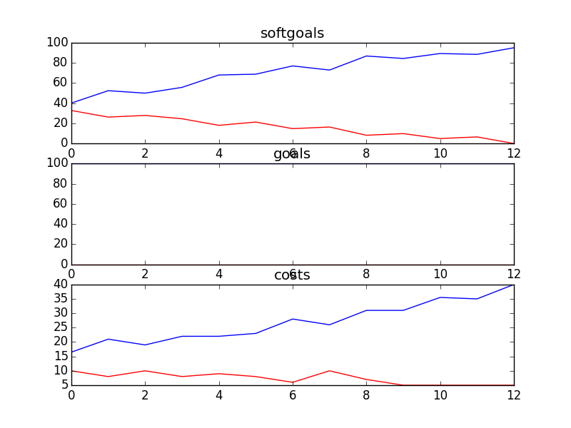
## CSSimplified
```

rank ,         name ,    med   ,   iqr 
----------------------------------------------------
   1 ,      gen0_f1 ,    98.69  ,    0.0 (*--------------|------------- ),98.69, 98.69, 98.69, 98.69, 100.00
   1 ,     gen20_f1 ,    98.69  ,    0.0 (*--------------|------------- ),98.69, 98.69, 98.69, 98.69, 100.00
   1 ,     gen40_f1 ,    98.69  ,   1.31 (*--------------|------------- ),98.69, 98.69, 98.69, 98.69, 100.00
   1 ,     gen60_f1 ,    98.69  ,   1.31 (*              |              ),98.69, 98.69, 98.69, 100.00, 100.00
   1 ,     gen80_f1 ,    98.69  ,   1.31 (*              |              ),98.69, 98.69, 98.69, 100.00, 100.00
   1 ,    gen100_f1 ,    98.69  ,   1.31 (*              |              ),98.69, 98.69, 98.69, 100.00, 100.00

rank ,         name ,    med   ,   iqr 
----------------------------------------------------
   1 ,      gen0_f2 ,    100.0  ,    0.0 (*              |              ),100.00, 100.00, 100.00, 100.00, 100.00
   1 ,     gen20_f2 ,    100.0  ,    0.0 (*              |              ),100.00, 100.00, 100.00, 100.00, 100.00
   1 ,     gen40_f2 ,    100.0  ,    0.0 (*              |              ),100.00, 100.00, 100.00, 100.00, 100.00
   1 ,     gen60_f2 ,    100.0  ,    0.0 (*              |              ),100.00, 100.00, 100.00, 100.00, 100.00
   1 ,     gen80_f2 ,    100.0  ,    0.0 (*              |              ),100.00, 100.00, 100.00, 100.00, 100.00
   1 ,    gen100_f2 ,    100.0  ,    0.0 (*              |              ),100.00, 100.00, 100.00, 100.00, 100.00

rank ,         name ,    med   ,   iqr 
----------------------------------------------------
   1 ,    gen100_f3 ,    178.0  ,   15.0 (  ---  * --    |              ),163.00, 172.00, 179.00, 187.00, 193.00
   2 ,     gen80_f3 ,    186.0  ,   17.0 (     --  *---  |              ),172.00, 179.00, 187.00, 191.00, 199.00
   2 ,     gen60_f3 ,    190.0  ,   15.0 (     ---  *----|              ),172.00, 183.00, 190.00, 193.00, 208.00
   3 ,     gen40_f3 ,    193.0  ,   14.0 (     ----- *---|-             ),175.00, 190.00, 194.00, 198.00, 213.00
   3 ,     gen20_f3 ,    196.0  ,   22.0 (      ----  *  |---           ),176.00, 190.00, 197.00, 208.00, 220.00
   3 ,      gen0_f3 ,    201.0  ,   25.0 (      -----   *| -------      ),176.00, 193.00, 202.00, 214.00, 237.00
```
### Time Taken : 73.2602250576
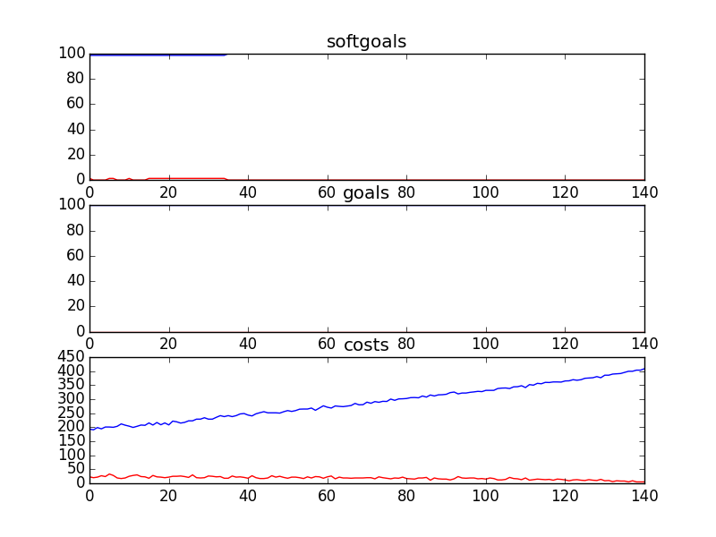
## Kids and Youth
```

rank ,         name ,    med   ,   iqr 
----------------------------------------------------
   1 ,      gen0_f1 ,    97.14  ,   2.85 (               |   *--------- ),94.29, 94.29, 97.14, 97.14, 100.00
   2 ,     gen20_f1 ,    100.0  ,   2.86 (               |   ----------*),97.14, 100.00, 100.00, 100.00, 100.00
   2 ,     gen40_f1 ,    100.0  ,    0.0 (               |             *),100.00, 100.00, 100.00, 100.00, 100.00
   2 ,     gen60_f1 ,    100.0  ,    0.0 (               |             *),100.00, 100.00, 100.00, 100.00, 100.00
   2 ,     gen80_f1 ,    100.0  ,    0.0 (               |             *),100.00, 100.00, 100.00, 100.00, 100.00
   2 ,    gen100_f1 ,    100.0  ,    0.0 (               |             *),100.00, 100.00, 100.00, 100.00, 100.00

rank ,         name ,    med   ,   iqr 
----------------------------------------------------
   1 ,      gen0_f2 ,    100.0  ,    0.0 (               |             *),100.00, 100.00, 100.00, 100.00, 100.00
   1 ,     gen20_f2 ,    100.0  ,    0.0 (               |             *),100.00, 100.00, 100.00, 100.00, 100.00
   1 ,     gen40_f2 ,    100.0  ,    0.0 (               |             *),100.00, 100.00, 100.00, 100.00, 100.00
   1 ,     gen60_f2 ,    100.0  ,    0.0 (               |             *),100.00, 100.00, 100.00, 100.00, 100.00
   1 ,     gen80_f2 ,    100.0  ,    0.0 (               |             *),100.00, 100.00, 100.00, 100.00, 100.00
   1 ,    gen100_f2 ,    100.0  ,    0.0 (               |             *),100.00, 100.00, 100.00, 100.00, 100.00

rank ,         name ,    med   ,   iqr 
----------------------------------------------------
   1 ,     gen60_f3 ,      6.0  ,    2.0 (  - *          |              ), 4.00,  5.00,  6.00,  7.00,  8.00
   1 ,     gen80_f3 ,      6.0  ,    2.0 (  - *          |              ), 4.00,  5.00,  6.00,  7.00,  7.00
   1 ,    gen100_f3 ,      6.0  ,    2.0 (  - *          |              ), 4.00,  5.00,  6.00,  7.00,  7.00
   2 ,     gen40_f3 ,      7.0  ,    3.0 (   - *--       |              ), 5.00,  6.00,  7.00,  9.00, 11.00
   3 ,     gen20_f3 ,     12.0  ,    6.0 (     --   *----|              ), 8.00, 10.00, 13.00, 15.00, 20.00
   4 ,      gen0_f3 ,     23.0  ,    9.0 (           ----|  *  ---      ),14.00, 19.00, 23.00, 26.00, 30.00
```
### Time Taken : 9.1092979908
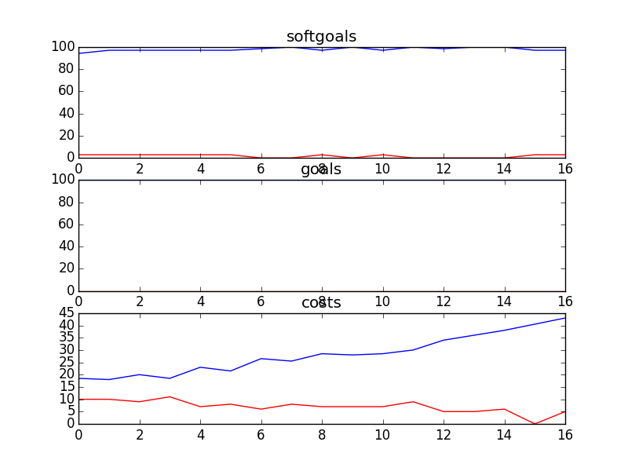
## Parents
```

rank ,         name ,    med   ,   iqr 
----------------------------------------------------
   1 ,      gen0_f1 ,     96.3  ,    3.7 (               |      *       ),96.30, 96.30, 96.30, 100.00, 100.00
   2 ,     gen20_f1 ,    100.0  ,    3.7 (               |             *),96.30, 96.30, 100.00, 100.00, 100.00
   2 ,     gen40_f1 ,    100.0  ,    3.7 (               |             *),96.30, 96.30, 100.00, 100.00, 100.00
   2 ,     gen60_f1 ,    100.0  ,    3.7 (               |             *),96.30, 96.30, 100.00, 100.00, 100.00
   2 ,     gen80_f1 ,    100.0  ,    3.7 (               |             *),96.30, 96.30, 100.00, 100.00, 100.00
   2 ,    gen100_f1 ,    100.0  ,    3.7 (               |             *),96.30, 96.30, 100.00, 100.00, 100.00

rank ,         name ,    med   ,   iqr 
----------------------------------------------------
   1 ,      gen0_f2 ,    100.0  ,    0.0 (               |             *),100.00, 100.00, 100.00, 100.00, 100.00
   1 ,     gen20_f2 ,    100.0  ,    0.0 (               |             *),100.00, 100.00, 100.00, 100.00, 100.00
   1 ,     gen40_f2 ,    100.0  ,    0.0 (               |             *),100.00, 100.00, 100.00, 100.00, 100.00
   1 ,     gen60_f2 ,    100.0  ,    0.0 (               |             *),100.00, 100.00, 100.00, 100.00, 100.00
   1 ,     gen80_f2 ,    100.0  ,    0.0 (               |             *),100.00, 100.00, 100.00, 100.00, 100.00
   1 ,    gen100_f2 ,    100.0  ,    0.0 (               |             *),100.00, 100.00, 100.00, 100.00, 100.00

rank ,         name ,    med   ,   iqr 
----------------------------------------------------
   1 ,     gen20_f3 ,      8.0  ,    4.0 (      --  *  --|              ), 5.00,  6.00,  8.00, 10.00, 12.00
   1 ,     gen40_f3 ,      8.0  ,    4.0 (     ---  * ---|              ), 4.00,  6.00,  8.00,  9.00, 12.00
   1 ,     gen60_f3 ,      8.0  ,    4.0 (     ---  * ---|              ), 4.00,  6.00,  8.00,  9.00, 12.00
   1 ,     gen80_f3 ,      8.0  ,    4.0 (     ---  * -- |              ), 4.00,  6.00,  8.00,  9.00, 11.00
   1 ,    gen100_f3 ,      8.0  ,    4.0 (     ---  * -- |              ), 4.00,  6.00,  8.00,  9.00, 11.00
   2 ,      gen0_f3 ,     10.0  ,    5.0 (      ----    *| ----         ), 5.00,  8.00, 11.00, 13.00, 16.00
```
### Time Taken : 4.60344004631
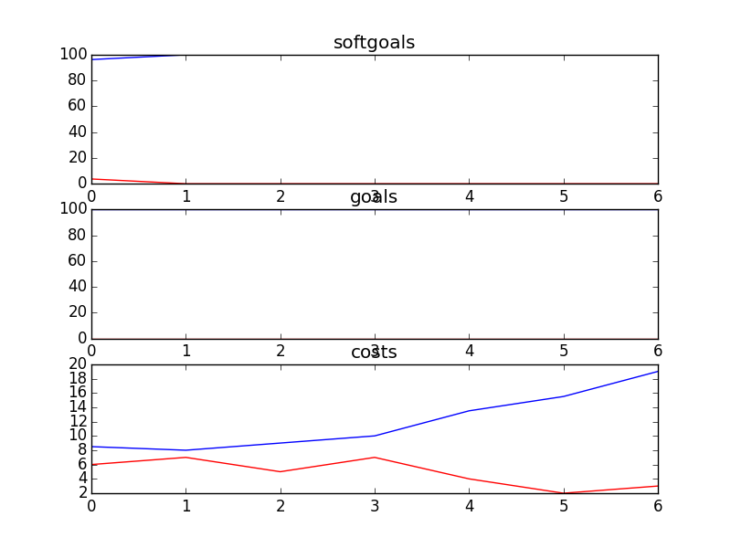
## OOOChatRooms
```

rank ,         name ,    med   ,   iqr 
----------------------------------------------------
   1 ,      gen0_f1 ,    59.73  ,    9.5 (      ---   * -|---           ),51.58, 56.11, 59.73, 63.80, 70.59
   2 ,     gen20_f1 ,    67.87  ,   3.62 (               |-* --------   ),65.16, 66.97, 67.87, 70.14, 81.45
   2 ,     gen40_f1 ,    68.78  ,   4.07 (               |- *--------   ),66.06, 67.87, 69.23, 70.59, 81.90
   2 ,     gen60_f1 ,    69.23  ,   3.62 (               |-- *-------   ),66.52, 68.33, 69.68, 71.04, 82.35
   2 ,     gen80_f1 ,    69.68  ,   2.71 (               | - *-------   ),67.87, 69.23, 69.68, 71.04, 82.35
   2 ,    gen100_f1 ,    70.14  ,   2.26 (               | - *-------   ),67.87, 69.23, 70.14, 71.04, 82.35

rank ,         name ,    med   ,   iqr 
----------------------------------------------------
   1 ,      gen0_f2 ,    33.33  ,  16.67 (*      --------|------------- ),33.33, 33.33, 33.33, 50.00, 100.00
   1 ,     gen20_f2 ,     50.0  ,  16.67 (       *-------|------------- ),33.33, 33.33, 50.00, 50.00, 100.00
   1 ,     gen40_f2 ,     50.0  ,  16.67 (       *-------|------------- ),33.33, 33.33, 50.00, 50.00, 100.00
   1 ,     gen60_f2 ,     50.0  ,  16.67 (       *-------|------------- ),33.33, 33.33, 50.00, 50.00, 100.00
   1 ,     gen80_f2 ,     50.0  ,  16.67 (       *-------|------------- ),33.33, 33.33, 50.00, 50.00, 100.00
   1 ,    gen100_f2 ,     50.0  ,  16.67 (       *-------|------------- ),33.33, 33.33, 50.00, 50.00, 100.00

rank ,         name ,    med   ,   iqr 
----------------------------------------------------
   1 ,     gen20_f3 ,      2.0  ,    5.0 (------*        |              ), 0.00,  2.00,  2.00,  7.00,  7.00
   1 ,     gen40_f3 ,      2.0  ,    5.0 (------*        |-------       ), 0.00,  2.00,  2.00,  5.00,  7.00
   1 ,     gen60_f3 ,      2.0  ,    5.0 (------*        |-------       ), 0.00,  2.00,  2.00,  5.00,  7.00
   1 ,     gen80_f3 ,      2.0  ,    5.0 (------*        |-------       ), 0.00,  2.00,  2.00,  5.00,  7.00
   1 ,    gen100_f3 ,      2.0  ,    5.0 (------*        |-------       ), 0.00,  2.00,  2.00,  5.00,  7.00
   1 ,      gen0_f3 ,      4.0  ,    5.0 (------       * |       ------ ), 0.00,  2.00,  4.00,  7.00,  9.00
```
### Time Taken : 86.359306097

## DelayModeratedBulletinBoard
```

rank ,         name ,    med   ,   iqr 
----------------------------------------------------
   1 ,      gen0_f1 ,    61.71  ,  10.78 (  -------   *  |--            ),49.44, 58.36, 62.83, 66.54, 71.38
   2 ,     gen20_f1 ,    75.46  ,   3.72 (               |  ---* -      ),71.00, 74.72, 75.46, 77.70, 79.93
   3 ,     gen40_f1 ,    78.07  ,   2.97 (               |     - *--    ),75.46, 76.95, 78.44, 79.55, 82.16
   4 ,     gen60_f1 ,    78.81  ,    2.6 (               |      - *--   ),76.58, 78.07, 79.18, 79.93, 84.01
   4 ,     gen80_f1 ,    79.18  ,   2.23 (               |       -*--   ),77.70, 78.81, 79.18, 80.67, 84.01
   4 ,    gen100_f1 ,    79.18  ,   2.23 (               |       -*---  ),77.70, 78.81, 79.55, 80.67, 85.50

rank ,         name ,    med   ,   iqr 
----------------------------------------------------
   1 ,      gen0_f2 ,      0.0  ,    0.0 (*--------------|------------- ), 0.00,  0.00,  0.00,  0.00, 100.00
   1 ,     gen20_f2 ,      0.0  ,    0.0 (*--------------|------------- ), 0.00,  0.00,  0.00,  0.00, 100.00
   1 ,     gen40_f2 ,      0.0  ,    0.0 (*--------------|------------- ), 0.00,  0.00,  0.00,  0.00, 100.00
   1 ,     gen60_f2 ,      0.0  ,    0.0 (*--------------|------------- ), 0.00,  0.00,  0.00,  0.00, 100.00
   1 ,     gen80_f2 ,      0.0  ,    0.0 (*--------------|------------- ), 0.00,  0.00,  0.00,  0.00, 100.00
   1 ,    gen100_f2 ,      0.0  ,    0.0 (*--------------|------------- ), 0.00,  0.00,  0.00,  0.00, 100.00

rank ,         name ,    med   ,   iqr 
----------------------------------------------------
   1 ,     gen40_f3 ,      1.0  ,    4.0 (   *          -|--            ), 0.00,  0.00,  1.00,  4.00,  5.00
   1 ,     gen60_f3 ,      1.0  ,    4.0 (   *          -|--            ), 0.00,  0.00,  1.00,  4.00,  5.00
   1 ,     gen80_f3 ,      1.0  ,    4.0 (   *          -|--            ), 0.00,  0.00,  1.00,  4.00,  5.00
   1 ,    gen100_f3 ,      1.0  ,    4.0 (   *          -|--            ), 0.00,  0.00,  1.00,  4.00,  5.00
   1 ,     gen20_f3 ,      3.0  ,    4.0 (           *  -|----------    ), 0.00,  0.00,  3.00,  4.00,  7.00
   2 ,      gen0_f3 ,      4.0  ,    4.0 (-----------   *|  ----------- ), 0.00,  3.00,  4.00,  5.00,  8.00
```
### Time Taken : 131.856606007
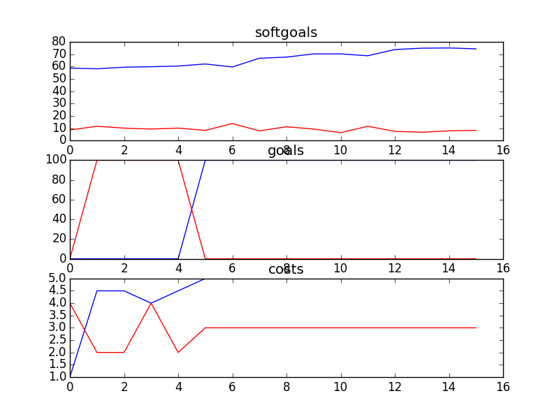
