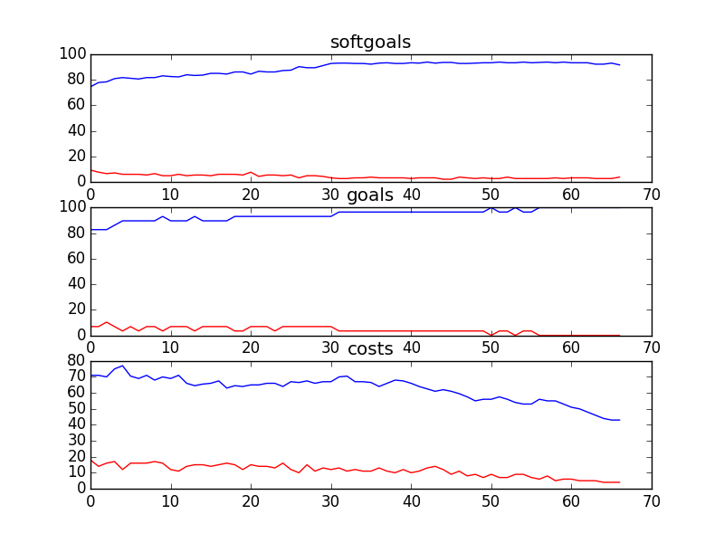

## CSCounselling
```

rank ,         name ,    med   ,   iqr 
----------------------------------------------------
   1 ,      gen0_f1 ,    80.66  ,   7.74 (    -----     *| --           ),71.82, 76.80, 81.22, 83.98, 86.19
   2 ,     gen20_f1 ,    83.98  ,   4.42 (       --------| * ---        ),74.59, 82.32, 83.98, 86.19, 88.95
   3 ,     gen40_f1 ,    85.64  ,   4.42 (        -------|   *----      ),75.14, 83.43, 85.64, 86.74, 90.61
   3 ,     gen60_f1 ,    85.64  ,   4.98 (            ---|-  * -----    ),79.56, 83.98, 85.64, 87.85, 92.82
   3 ,     gen80_f1 ,    86.74  ,   4.97 (            ---|--  *-----    ),79.56, 85.08, 86.74, 88.40, 92.82
   3 ,    gen100_f1 ,    86.74  ,   6.63 (            ---|--- * ------  ),79.56, 85.64, 86.74, 88.95, 94.48

rank ,         name ,    med   ,   iqr 
----------------------------------------------------
   1 ,      gen0_f2 ,    86.21  ,    6.9 (    ----    *  | --------     ),79.31, 82.76, 86.21, 89.66, 96.55
   1 ,     gen20_f2 ,    89.66  ,  10.34 (    --------   | *   ----     ),79.31, 86.21, 89.66, 93.10, 96.55
   1 ,     gen40_f2 ,    89.66  ,   6.89 (        ----   | *   ----     ),82.76, 86.21, 89.66, 93.10, 96.55
   2 ,     gen60_f2 ,     93.1  ,  10.34 (        ----   |     *        ),82.76, 86.21, 93.10, 96.55, 96.55
   2 ,     gen80_f2 ,     93.1  ,  10.34 (        ----   |     *        ),82.76, 86.21, 93.10, 96.55, 96.55
   2 ,    gen100_f2 ,     93.1  ,  10.34 (        ----   |     *   ---- ),82.76, 86.21, 93.10, 96.55, 100.00

rank ,         name ,    med   ,   iqr 
----------------------------------------------------
   1 ,     gen80_f3 ,     90.0  ,   14.0 (   ---  * ---- |              ),79.00, 86.00, 92.00, 98.00, 107.00
   1 ,    gen100_f3 ,     90.0  ,   14.0 (   --   * ---- |              ),79.00, 85.00, 92.00, 98.00, 106.00
   1 ,     gen60_f3 ,     93.0  ,   16.0 (   ---  *  ----|              ),79.00, 87.00, 93.00, 99.00, 112.00
   2 ,     gen20_f3 ,     94.0  ,   18.0 (    ---  *   --|-             ),81.00, 89.00, 94.00, 105.00, 114.00
   2 ,     gen40_f3 ,     94.0  ,   16.0 (   ---   *  ---|-             ),80.00, 88.00, 94.00, 103.00, 114.00
   2 ,      gen0_f3 ,     99.0  ,   19.0 (    ----    * -|----          ),81.00, 92.00, 101.00, 107.00, 121.00
```
### Time Taken : 202.645773888

```

+------+------------------------------------------------------------+----------+-------+------+
| rank |                            name                            |   type   | value | cost |
+------+------------------------------------------------------------+----------+-------+------+
|  1   |                     *Explore Options1                      |   task   |   1   |  1   |
|  2   | Avoid Tension/Confrontation/ Animosity [Amongst Employees] | softgoal |   1   |  1   |
|  3   |                   Report Outdated Links1                   |   task   |   1   |  4   |
|  4   |            Receive Call Classification Training            |   task   |   -1  |  4   |
|  5   |                  Decrease Kids Isolation                   | softgoal |   1   |  2   |
|  6   |               Provide Information in Binders               |   task   |   1   |  1   |
|  7   |               Provide Resources in E-Library               |   task   |   -1  |  5   |
|  8   |               !Participate in Board Meetings               |   task   |   -1  |  5   |
|  9   |     Include Legal Information in Counselling Resources     |   task   |   -1  |  5   |
|  10  |                   Counselling Workshops                    | resource |   1   |  1   |
|  11  |                  *Edit Counselling Posts                   |   task   |   -1  |  5   |
|  12  |     Include Drug Information in Counselling Resources      |   task   |   1   |  3   |
|  13  |                   Perform Duties Quickly                   | softgoal |   1   |  5   |
|  14  |                  Debrief with Counsellors                  |   task   |   1   |  1   |
|  15  |                    Counselling Policies                    | resource |   1   |  3   |
|  16  |                      Double Headsets                       | resource |   1   |  3   |
|  17  |                   Web Moderator Meetings                   | resource |   1   |  2   |
|  18  |                       Report Abuses                        |   task   |   1   |  4   |
|  19  |                    Refer Parents to PHL                    |   task   |   -1  |  5   |
|  20  |                  Attend Part Time Meeting                  |   task   |   1   |  1   |
|  21  |         Counsellors Engage Emotionally in Session          | softgoal |   1   |  2   |
|  22  |      Support Individuality in Counselling Techniques       | softgoal |   1   |  5   |
|  23  |                           Tapes                            | resource |   1   |  4   |
|  24  |                   Move on to Better Job                    | softgoal |   1   |  4   |
|  25  |            Avoid Being Labelled Anti-Technology            | softgoal |   1   |  1   |
|  26  |                 *Implement Bulletin Board1                 |   task   |   1   |  3   |
|  27  |                     Assess Situation1                      |   task   |   -1  |  5   |
|  28  |            Sign Contract with Counselling Union            |   task   |   1   |  3   |
|  29  |                  Speak at SA Conferences                   |   task   |   -1  |  4   |
|  30  |      Increased Caution [Content of Online Services]2       | softgoal |   1   |  1   |
|  31  |                      Assess Situation                      |   task   |   -1  |  3   |
|  32  |             *Implement Email for Counsellors1              |   task   |   1   |  3   |
|  33  |                Remove Identifying Material                 |   task   |   -1  |  5   |
|  34  |               Enthusiastic [Work Atmosphere]               | softgoal |   1   |  1   |
|  35  |                 Tape Recording Technology                  | resource |   -1  |  5   |
|  36  |          Perform Conference Call with Third Party          |   task   |   1   |  5   |
|  37  |         Provide Information to Other Counselloers          |   task   |   1   |  1   |
|  38  |         Listen to Calls of Experienced Counsellors         |   task   |   -1  |  5   |
|  39  |                Provide Resources in Library                |   task   |   1   |  1   |
|  40  |            Consideration of Feedback [Managers]            | softgoal |   1   |  3   |
|  41  |              *Receive Training from Managment              |   task   |   -1  |  5   |
|  42  |                       Record Stories                       |   task   |   1   |  1   |
|  43  |                 Consistent Resource Links2                 | softgoal |   1   |  5   |
|  44  |                        Training CDs                        | resource |   1   |  2   |
|  45  |                  Speak Publicly about Job                  |   task   |   1   |  3   |
|  46  |               ! Write Articles for Website 1               |   task   |   -1  |  3   |
|  47  |                      *Explore Options                      |   task   |   1   |  3   |
|  48  |       Block Kids who Display Inappropriate Behavoir        |   task   |   1   |  1   |
|  49  |       ! Counselor Speak on Kids Issues in General 1        |   task   |   1   |  4   |
|  50  |                   Participate in events1                   |   task   |   -1  |  1   |
|  51  |                       Request Shifts                       |   task   |   -1  |  2   |
|  52  |                    Find Effective Cues                     | softgoal |   -1  |  3   |
|  53  |              Provide Resources in One Source               |   task   |   1   |  1   |
|  54  |              Encourage Kids to Talk to Others              |   task   |   1   |  1   |
|  55  |                Diffuse Conflict with Parent                |   task   |   -1  |  3   |
|  56  |              ! Write Articles for Magazines 1              |   task   |   -1  |  2   |
|  57  |      *Encourage Kids to Talk to Different Counsellors      |   task   |   1   |  1   |
|  58  |      Facilitate Faster Changes in Counsellor Duties1       | softgoal |   -1  |  5   |
|  59  |           Comment on Technology Usability Issues           |   task   |   -1  |  5   |
|  60  |                  !Undergo Media Training                   |   task   |   1   |  3   |
|  61  |              !Participate in Sponsor Meetings              |   task   |   -1  |  2   |
|  62  |               *Implement Categorization Tool               |   task   |   -1  |  4   |
|  63  |                          Feedback                          | resource |   -1  |  5   |
|  64  |                      Listen for Cues                       |   task   |   -1  |  3   |
|  65  |                   Learn Web Technologies                   |   task   |   1   |  2   |
|  66  |                 Encourage Kids to Call CS                  |   task   |   -1  |  5   |
|  67  |                Perform Crisis Intervention                 |   task   |   -1  |  3   |
+------+------------------------------------------------------------+----------+-------+------+
```
