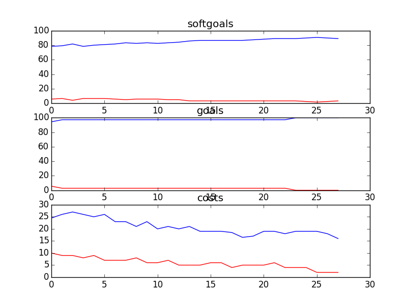

## CSCounsellingManagement
```

rank ,         name ,    med   ,   iqr 
----------------------------------------------------
   1 ,      gen0_f1 ,    81.82  ,   7.43 (  -------    * | ------       ),75.21, 79.34, 81.82, 84.30, 87.60
   2 ,     gen20_f1 ,    85.95  ,   2.48 (              -|-   *----     ),82.64, 84.30, 85.95, 86.78, 89.26
   3 ,     gen40_f1 ,    86.78  ,   2.48 (               | --- *  ---   ),84.30, 85.95, 86.78, 88.43, 90.08
   4 ,     gen60_f1 ,     87.6  ,   3.31 (               |    -   *--   ),85.95, 86.78, 88.43, 89.26, 90.08
   4 ,     gen80_f1 ,    88.43  ,   2.48 (               |    --- *--   ),85.95, 87.60, 88.43, 89.26, 90.08
   4 ,    gen100_f1 ,    89.26  ,   1.66 (               |    ---  *-   ),85.95, 87.60, 89.26, 89.26, 90.08

rank ,         name ,    med   ,   iqr 
----------------------------------------------------
   1 ,      gen0_f2 ,    97.22  ,   2.78 (               |   *--------- ),94.44, 94.44, 97.22, 97.22, 100.00
   1 ,     gen20_f2 ,    97.22  ,   2.78 (         ------|---*          ),94.44, 97.22, 97.22, 100.00, 100.00
   1 ,     gen40_f2 ,    97.22  ,   2.78 (         ------|---*          ),94.44, 97.22, 97.22, 100.00, 100.00
   1 ,     gen60_f2 ,    97.22  ,   2.78 (         ------|---*          ),94.44, 97.22, 97.22, 100.00, 100.00
   1 ,     gen80_f2 ,    97.22  ,   2.78 (         ------|---*          ),94.44, 97.22, 97.22, 100.00, 100.00
   1 ,    gen100_f2 ,    97.22  ,   2.78 (         ------|---*          ),94.44, 97.22, 97.22, 100.00, 100.00

rank ,         name ,    med   ,   iqr 
----------------------------------------------------
   1 ,    gen100_f3 ,     21.0  ,    9.0 (    ---    *  -|-             ),13.00, 17.00, 21.00, 25.00, 29.00
   1 ,     gen80_f3 ,     21.0  ,    8.0 (     ----  *   |---           ),14.00, 19.00, 22.00, 26.00, 31.00
   2 ,     gen60_f3 ,     22.0  ,   10.0 (     ----    * | ----         ),14.00, 19.00, 24.00, 28.00, 33.00
   2 ,     gen40_f3 ,     25.0  ,   10.0 (      -----   *| ----         ),16.00, 21.00, 25.00, 29.00, 33.00
   3 ,     gen20_f3 ,     26.0  ,   10.0 (       -----   *    ---       ),17.00, 23.00, 26.00, 32.00, 36.00
   4 ,      gen0_f3 ,     31.0  ,   10.0 (           ----|    * ---     ),22.00, 27.00, 32.00, 34.00, 38.00
```
### Time Taken : 67.4508948326

```

+------+-----------------------------------------------------+----------+-------+------+
| rank |                         name                        |   type   | value | cost |
+------+-----------------------------------------------------+----------+-------+------+
|  1   |      Communicate CS Information to Counsellors      |   task   |   1   |  2   |
|  2   |               Set Counselling Policies              |   task   |   -1  |  5   |
|  3   |                   Call Statistics                   | resource |   -1  |  5   |
|  4   |           Negotiate with Counsellors Union          |   task   |   -1  |  1   |
|  5   |      Put on Orientation Process for Cousellors      |   task   |   1   |  1   |
|  6   | Write Yearly Peformance Evaluations for Counsellors |   task   |   -1  |  5   |
|  7   |                    Debrief Calls                    |   task   |   -1  |  3   |
|  8   |                   Use Blue Pumpkin                  |   task   |   -1  |  5   |
|  9   |      Provide One-on-One Support to Counsellors      |   task   |   1   |  1   |
|  10  |                     Review Tape                     |   task   |   1   |  3   |
|  11  |         Acquire Web Training from Operations        |   task   |   1   |  1   |
|  12  |              Attend Part Time Meetings              |   task   |   1   |  2   |
|  13  |                Counselling Resources                | resource |   -1  |  2   |
|  14  |                  Debrief Web Posts                  |   task   |   -1  |  3   |
|  15  |                 Counsellors Be Paid                 |   task   |   1   |  1   |
|  16  |             Put On Counselling Workshops            |   task   |   -1  |  5   |
|  17  |           Historical Data of Call Volumes           | resource |   -1  |  2   |
|  18  |                    Request Shifts                   |   task   |   -1  |  4   |
|  19  |              !Hire Counselling Managers             |   task   |   1   |  2   |
|  20  |            Put on Web Moderator Meetings            |   task   |   1   |  3   |
|  21  |        Create Call Classification Catagories        |   task   |   -1  |  1   |
|  22  |                   Double Head Set                   | resource |   -1  |  5   |
|  23  |                  !Hire Counsellors                  |   task   |   -1  |  1   |
+------+-----------------------------------------------------+----------+-------+------+
```
