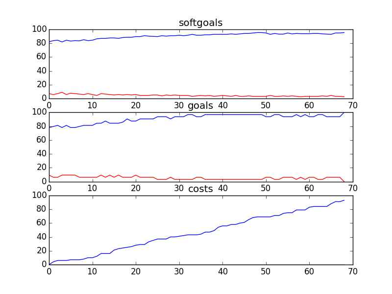

## CSFDandMarketing
```

rank ,         name ,    med   ,   iqr 
----------------------------------------------------
   1 ,      gen0_f1 ,    85.06  ,   6.49 (         ----  |* ---         ),78.57, 82.47, 85.06, 87.66, 90.26
   2 ,     gen20_f1 ,    86.36  ,   6.49 (            ---|  *   --      ),81.82, 85.06, 87.66, 90.91, 92.86
   2 ,     gen40_f1 ,    89.61  ,    6.5 (              -|-   *  --     ),83.77, 86.36, 89.61, 91.56, 93.51
   3 ,     gen60_f1 ,    90.26  ,    6.5 (              -|--   * --     ),83.77, 87.66, 90.26, 92.21, 94.16
   3 ,     gen80_f1 ,    90.26  ,    6.5 (               |----  * ---   ),84.42, 89.61, 90.91, 92.86, 95.45
   3 ,    gen100_f1 ,    90.26  ,    6.5 (               |----  * ---   ),84.42, 89.61, 90.91, 92.86, 95.45

rank ,         name ,    med   ,   iqr 
----------------------------------------------------
   1 ,      gen0_f2 ,    81.25  ,   6.25 (     ----  *   |-----         ),75.00, 78.13, 81.25, 84.38, 90.63
   2 ,     gen20_f2 ,    84.38  ,   6.25 (     ------    * ------       ),75.00, 81.25, 84.38, 87.50, 93.75
   2 ,     gen40_f2 ,    84.38  ,   9.38 (         --    *     --       ),78.13, 81.25, 84.38, 90.63, 93.75
   2 ,     gen60_f2 ,    84.38  ,   12.5 (         ------*     ------   ),78.13, 84.38, 84.38, 90.63, 96.88
   3 ,     gen80_f2 ,     87.5  ,   9.37 (           ----| *     ----   ),81.25, 84.38, 87.50, 93.75, 96.88
   3 ,    gen100_f2 ,     87.5  ,   9.37 (           ----| *     ----   ),81.25, 84.38, 87.50, 93.75, 96.88

rank ,         name ,    med   ,   iqr 
----------------------------------------------------
   1 ,     gen80_f3 ,     94.0  ,   13.0 (       ----  * |-----         ),81.00, 90.00, 94.00, 101.00, 110.00
   1 ,    gen100_f3 ,     94.0  ,   13.0 (       ----  * |-----         ),81.00, 90.00, 94.00, 99.00, 110.00
   1 ,     gen60_f3 ,     95.0  ,   14.0 (       -----  *| -----        ),82.00, 91.00, 95.00, 102.00, 113.00
   2 ,     gen40_f3 ,     97.0  ,   14.0 (        ----   *  ----        ),83.00, 91.00, 98.00, 104.00, 113.00
   2 ,     gen20_f3 ,     99.0  ,   15.0 (        -----  |* -----       ),83.00, 93.00, 100.00, 105.00, 116.00
   2 ,      gen0_f3 ,    102.0  ,   18.0 (        -----  | * -------    ),83.00, 94.00, 102.00, 107.00, 122.00

+------+--------------------------------------------------------------------------+----------+-------+
| rank |                                   name                                   |   type   | value |
+------+--------------------------------------------------------------------------+----------+-------+
|  1   |              ! Counselor Speak on Kids Issues in General 1               |   task   |   1   |
|  2   |                   !Train counselors on public speaking                   |   task   |   1   |
|  3   |                          Participate in events                           |   task   |   1   |
|  4   |                          Provide free services                           |   task   |   1   |
|  5   |                             Reach agreement                              |   task   |   1   |
|  6   |                            Free advertisement                            | resource |   1   |
|  7   |                Write Down Corporate Sponsors Objectives                  |   task   |   -1  |
|  8   |                       Inform Sponsors of Progress                        |   task   |   1   |
|  9   |                          Provide free services1                          |   task   |   1   |
|  10  |                           Pledge\nDuring event                           |   task   |   -1  |
|  11  |                       ! Provide money for services                       |   task   |   1   |
|  12  |                  Store donor information into database                   |   task   |   -1  |
|  13  |   Put on Orientation Process for Fund Development and Marketing Staff    |   task   |   1   |
|  14  |                       Give philanthropic donation                        |   task   |   -1  |
|  15  |                              Pledge\nonline                              |   task   |   1   |
|  16  |            Create posters, flyers and informational material             |   task   |   -1  |
|  17  |                       Get philanthropic donations                        |   task   |   1   |
|  18  |                      ! Write Articles for Website 1                      |   task   |   -1  |
|  19  |                    Market [Only For Serious Issues]                      |   task   |   -1  |
|  20  |                            Get donor database                            |   task   |   -1  |
|  21  |                        Run Fundraiser in Schools                         |   task   |   -1  |
|  22  |           Provide Promotional Material to Student Ambassadors            |   task   |   1   |
|  23  |                Pay Fund Development and Marketing Staff                  |   task   |   1   |
|  24  |                  Store donor transactions into database                  |   task   |   1   |
|  25  |                            Minimize expenses                             | softgoal |   1   |
|  26  |                              Track budgets                               |   task   |   -1  |
|  27  |                      Elaborate Fundraising targets1                      |   task   |   -1  |
|  28  |                     Develop national event calendar                      |   task   |   -1  |
|  29  |                  Single charitable registration number1                  | resource |   1   |
|  30  |                      ! Provide compiled call data                        |   task   |   1   |
|  31  |      Email Corporate Partners Interesting and Relevant News Pieces       |   task   |   -1  |
|  32  |                     Implement Stay in Touch program                      |   task   |   1   |
|  33  |                    Organize discussions with Sponsors                    |   task   |   -1  |
|  34  |                        Get web event technology1                         |   task   |   1   |
|  35  |                         Create branded products                          |   task   |   1   |
|  36  |          Bring Regional Fundraising Staff Together Once a Year           |   task   |   -1  |
|  37  |                  Communicate through Internet and phone                  |   task   |   1   |
|  38  |                          Give CS Presentations                           |   task   |   -1  |
|  39  |                Work with the Regions to Implement Events                 |   task   |   -1  |
|  40  |                          Use volunteer services                          |   task   |   -1  |
|  41  |                      Provide philanthropic donation                      |   task   |   1   |
|  42  |                           Speak at Fundraisers                           |   task   |   -1  |
|  43  |                          Conflicts Be Managed                            |   task   |   1   |
|  44  |                         Send recognition letters                         |   task   |   1   |
|  45  |                     Provide Real Time Tax Receipts                       |   task   |   1   |
|  46  |                       Bi-Weekly Conference Calls                         |   task   |   1   |
|  47  |                     ! Write Articles for Magazines 1                     |   task   |   1   |
|  48  |      Sponsors Include CS Logos and Descriptions on their Products        |   task   |   1   |
|  49  |              Put Together Proposals for Corporate Sponsors               |   task   |   1   |
|  50  |                              Provide funds                               |   task   |   1   |
|  51  |                       Exclusive Brand and Logo use                       | resource |   -1  |
|  52  |                       Market through own channels                        |   task   |   -1  |
|  53  |                         Create General Ledgers                           |   task   |   1   |
|  54  |                             Manage Accounts                              |   task   |   1   |
|  55  |                      Place Sponsor Logos in Events                       |   task   |   -1  |
|  56  | Pitch to National Corporate Sponsors the Sponsorship of Regional Events  |   task   |   1   |
|  57  |                        Collect donor information                         |   task   |   1   |
|  58  |                            Provide Logo to CS                            |   task   |   1   |
|  59  |                          Reallocate resources1                           |   task   |   1   |
|  60  |                Get Corporate Partner Information from DL1                |   task   |   -1  |
|  61  |                     Provide Online Donor Technology                      |   task   |   1   |
|  62  |                     Provide Document Library System                      |   task   |   1   |
|  63  |                           Reallocate resources                           |   task   |   1   |
|  64  |                           Manage Receivables                             |   task   |   -1  |
|  65  |                      Share PAP in Document Library1                      |   task   |   1   |
|  66  |                        Donor/Accounting Database                         | resource |   1   |
|  67  |                          Create Thank you ads                            |   task   |   -1  |
|  68  |                    Put on orientation for volunteers                     |   task   |   1   |
|  69  |                      Share PAP in Document Library                       |   task   |   -1  |
|  70  |                       National Marketing Strategy                        | resource |   1   |
+------+--------------------------------------------------------------------------+----------+-------+
```
### Time Taken : 223.357296228

