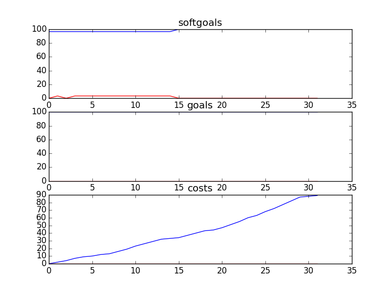

## CSFDandMarketingSD
```

rank ,         name ,    med   ,   iqr 
----------------------------------------------------
   1 ,      gen0_f1 ,    96.67  ,    0.0 (*--------------|------------- ),96.67, 96.67, 96.67, 96.67, 100.00
   1 ,     gen20_f1 ,    96.67  ,   3.33 (*              |              ),96.67, 96.67, 96.67, 100.00, 100.00
   2 ,     gen40_f1 ,    100.0  ,   3.33 (               |             *),96.67, 96.67, 100.00, 100.00, 100.00
   2 ,     gen60_f1 ,    100.0  ,    0.0 (---------------|-------------*),96.67, 100.00, 100.00, 100.00, 100.00
   2 ,     gen80_f1 ,    100.0  ,    0.0 (---------------|-------------*),96.67, 100.00, 100.00, 100.00, 100.00
   2 ,    gen100_f1 ,    100.0  ,    0.0 (---------------|-------------*),96.67, 100.00, 100.00, 100.00, 100.00

rank ,         name ,    med   ,   iqr 
----------------------------------------------------
   1 ,      gen0_f2 ,    100.0  ,    0.0 (*              |              ),100.00, 100.00, 100.00, 100.00, 100.00
   1 ,     gen20_f2 ,    100.0  ,    0.0 (*              |              ),100.00, 100.00, 100.00, 100.00, 100.00
   1 ,     gen40_f2 ,    100.0  ,    0.0 (*              |              ),100.00, 100.00, 100.00, 100.00, 100.00
   1 ,     gen60_f2 ,    100.0  ,    0.0 (*              |              ),100.00, 100.00, 100.00, 100.00, 100.00
   1 ,     gen80_f2 ,    100.0  ,    0.0 (*              |              ),100.00, 100.00, 100.00, 100.00, 100.00
   1 ,    gen100_f2 ,    100.0  ,    0.0 (*              |              ),100.00, 100.00, 100.00, 100.00, 100.00

rank ,         name ,    med   ,   iqr 
----------------------------------------------------
   1 ,    gen100_f3 ,      6.0  ,    2.0 (--*            |              ), 1.00,  5.00,  6.00,  7.00,  7.00
   1 ,     gen80_f3 ,      7.0  ,    2.0 (-- *           |              ), 2.00,  6.00,  7.00,  7.00,  8.00
   2 ,     gen60_f3 ,     10.0  ,    4.0 (  --*-         |              ), 6.00,  9.00, 10.00, 11.00, 13.00
   3 ,     gen40_f3 ,     19.0  ,    6.0 (      -- *--   |              ),14.00, 17.00, 19.00, 21.00, 26.00
   4 ,     gen20_f3 ,     29.0  ,    7.0 (          -- * |-             ),23.00, 26.00, 29.00, 32.00, 36.00
   5 ,      gen0_f3 ,     41.0  ,   12.0 (               |-- *  --      ),32.00, 38.00, 41.00, 48.00, 52.00
```
### Time Taken : 7.25703215599

```

+------+----------------------------------------------+----------+-------+------+
| rank |                     name                     |   type   | value | cost |
+------+----------------------------------------------+----------+-------+------+
|  1   |            Provide free services             |   task   |   -1  |  2   |
|  2   |             Manage Receivables               |   task   |   -1  |  2   |
|  3   |  Get Corporate Partner Information from DL   |   task   |   1   |  3   |
|  4   |               Manage Accounts                |   task   |   -1  |  2   |
|  5   |       Provide Document Library System        |   task   |   -1  |  1   |
|  6   |             ! Market CS Service              |   task   |   -1  |  2   |
|  7   |                    Funds                     | resource |   -1  |  1   |
|  8   |                  Agreement                   | resource |   -1  |  3   |
|  9   |           Philanthropic donations            |   task   |   -1  |  3   |
|  10  |              Free advertisement              | resource |   -1  |  4   |
|  11  |                 Sponsor Logo                 | resource |   -1  |  3   |
|  12  |         Provide fundraising services         |   task   |   -1  |  3   |
|  13  |         Provide fundraising services         |   task   |   -1  |  3   |
|  14  |         Manage\nPartner Relationship         |   task   |   -1  |  1   |
|  15  |    Single charitable registration number     | resource |   1   |  1   |
|  16  |        Use sponsor marketing channels        |   task   |   -1  |  3   |
|  17  |             Sponsorship proposal             |   task   |   -1  |  3   |
|  18  |               Provide receipts               |   task   |   -1  |  3   |
|  19  |        ! Provide compiled call data          |   task   |   -1  |  1   |
|  20  |            Participate in events             |   task   |   -1  |  3   |
|  21  | ! Counselor Speak on Kids Issues in General  |   task   |   -1  |  4   |
|  22  |            Collect Pledge online             |   task   |   -1  |  4   |
|  23  |           Get sponsors for events            |   task   |   -1  |  5   |
|  24  |                Pledge online                 |   task   |   -1  |  3   |
|  25  |           National Event Calendar            | resource |   -1  |  5   |
|  26  |           Create General Ledgers             |   task   |   -1  |  4   |
|  27  |        ! Write Articles for Website          |   task   |   -1  |  5   |
|  28  |       ! Write Articles for Magazines         |   task   |   -1  |  5   |
|  29  |         ! Provide money for services         |   task   |   -1  |  5   |
|  30  |                Provide funds                 |   task   |   1   |  1   |
|  31  |       Provide Online Donor Technology        |   task   |   1   |  1   |
|  32  |             Pledge\nDuring event             |   task   |   -1  |  1   |
+------+----------------------------------------------+----------+-------+------+
```
