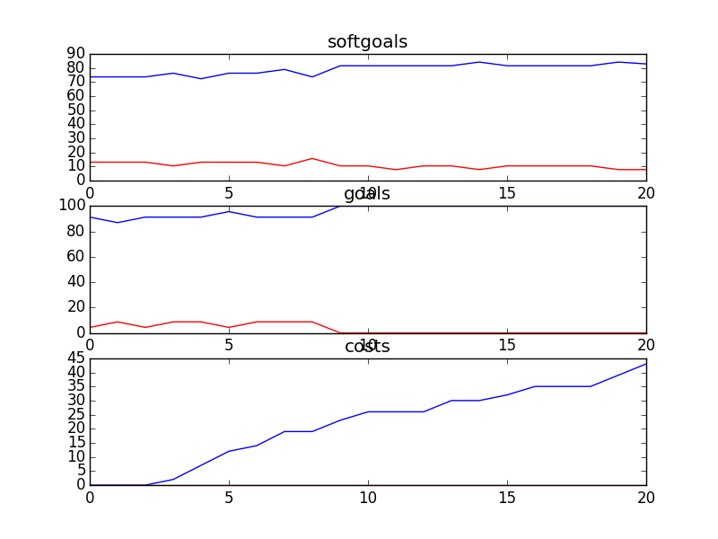

## CSITDepartment
```

rank ,         name ,    med   ,   iqr 
----------------------------------------------------
   1 ,      gen0_f1 ,    81.58  ,  10.52 (  --------    *| -----        ),71.05, 78.95, 84.21, 86.84, 92.11
   2 ,     gen20_f1 ,    89.47  ,   5.27 (            ---|-  *  -----   ),81.58, 86.84, 89.47, 92.11, 97.37
   2 ,     gen40_f1 ,    89.47  ,   5.27 (               | --*  -----   ),86.84, 89.47, 89.47, 92.11, 97.37
   2 ,     gen60_f1 ,    89.47  ,   5.27 (               | --*  -----   ),86.84, 89.47, 89.47, 92.11, 97.37
   2 ,     gen80_f1 ,    89.47  ,   5.27 (               | --*     --   ),86.84, 89.47, 89.47, 94.74, 97.37
   3 ,    gen100_f1 ,    92.11  ,   5.27 (               | --   *  ---- ),86.84, 89.47, 92.11, 94.74, 100.00

rank ,         name ,    med   ,   iqr 
----------------------------------------------------
   1 ,      gen0_f2 ,     91.3  ,   8.69 (               | *     ------ ),86.96, 86.96, 91.30, 95.65, 100.00
   2 ,     gen20_f2 ,    95.65  ,   4.35 (               |       *----- ),91.30, 91.30, 95.65, 95.65, 100.00
   2 ,     gen40_f2 ,    95.65  ,    0.0 (               | ------*----- ),91.30, 95.65, 95.65, 95.65, 100.00
   2 ,     gen60_f2 ,    95.65  ,    0.0 (               | ------*----- ),91.30, 95.65, 95.65, 95.65, 100.00
   2 ,     gen80_f2 ,    95.65  ,    0.0 (               | ------*----- ),91.30, 95.65, 95.65, 95.65, 100.00
   2 ,    gen100_f2 ,    95.65  ,    0.0 (               | ------*----- ),91.30, 95.65, 95.65, 95.65, 100.00

rank ,         name ,    med   ,   iqr 
----------------------------------------------------
   1 ,    gen100_f3 ,     26.0  ,    8.0 (  ---   * ---  |              ),20.00, 23.00, 27.00, 30.00, 35.00
   1 ,     gen80_f3 ,     28.0  ,    9.0 (    --  *  ----|              ),22.00, 25.00, 28.00, 32.00, 38.00
   2 ,     gen60_f3 ,     31.0  ,    9.0 (     ---  *  --|              ),24.00, 27.00, 31.00, 35.00, 39.00
   2 ,     gen40_f3 ,     33.0  ,    8.0 (       ---  * -|--            ),26.00, 31.00, 33.00, 36.00, 41.00
   3 ,     gen20_f3 ,     35.0  ,    7.0 (        ---   *|-----         ),27.00, 32.00, 36.00, 38.00, 45.00
   4 ,      gen0_f3 ,     40.0  ,   11.0 (        -----  |   *------    ),28.00, 34.00, 42.00, 44.00, 52.00
```
### Time Taken : 21.1506860256

```

+------+--------------------------------------------------------------------+----------+-------+------+
| rank |                                name                                |   type   | value | cost |
+------+--------------------------------------------------------------------+----------+-------+------+
|  1   |                               Use T1                               |   task   |   1   |  5   |
|  2   |          Provide Technology to Create and Send Documents           |   task   |   -1  |  3   |
|  3   |           Perform Donor/Accounting Data Base Maintenance           |   task   |   -1  |  5   |
|  4   |                     !Implement Phone Feedback1                     |   task   |   -1  |  5   |
|  5   |                         Use Current Method                         |   task   |   -1  |  5   |
|  6   |                      *Cost Effective Training                      | softgoal |   1   |  3   |
|  7   |               Use Informal Buddy System for Training               |   task   |   -1  |  5   |
|  8   |                  Provide Online Donor Technology1                  |   task   |   -1  |  5   |
|  9   |                            Web Server1                             | resource |   -1  |  4   |
|  10  |                              Use VPN                               |   task   |   -1  |  4   |
|  11  |                          Free Web Server                           | resource |   1   |  2   |
|  12  |                  *Implement Email for Counsellors                  |   task   |   -1  |  4   |
|  13  |                               Oracle                               | resource |   1   |  1   |
|  14  |                           Free Hardware                            | resource |   1   |  1   |
|  15  |                            Network PCs                             |   task   |   -1  |  3   |
|  16  |                           Free Software                            | resource |   1   |  2   |
|  17  |                              Software                              | resource |   1   |  1   |
|  18  |                     Cost Effective Technology                      | softgoal |   1   |  5   |
|  19  |                           Free Upgrades                            | resource |   1   |  1   |
|  20  |                            IT Resources                            | resource |   -1  |  3   |
|  21  |                              Hardware                              | resource |   -1  |  2   |
|  22  | Properly and Suitably Equipped in IT [to Accomplish Service Goals] | softgoal |   -1  |  5   |
|  23  |                     Put Content Onto Website1                      |   task   |   -1  |  3   |
|  24  |                    Keep Up With New Technology                     | softgoal |   -1  |  5   |
|  25  |                              Upgrades                              | resource |   -1  |  2   |
+------+--------------------------------------------------------------------+----------+-------+------+
```
