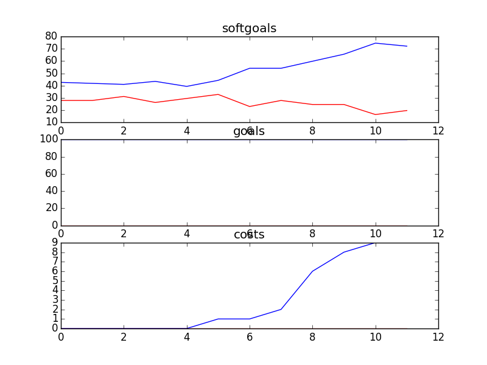

## CSSAProgram
```

rank ,         name ,    med   ,   iqr 
----------------------------------------------------
   1 ,      gen0_f1 ,    60.66  ,  16.39 (     --------- |*   ----      ),32.79, 55.74, 60.66, 70.49, 81.97
   2 ,     gen20_f1 ,    78.69  ,  18.04 (             --|----   * -    ),52.46, 70.49, 78.69, 83.61, 86.89
   2 ,     gen40_f1 ,    80.33  ,  14.76 (               |-----   *     ),60.66, 72.13, 80.33, 85.25, 86.89
   3 ,     gen60_f1 ,    81.97  ,  13.12 (               | -----  * --  ),62.30, 77.05, 81.97, 86.89, 90.16
   3 ,     gen80_f1 ,    81.97  ,  11.48 (               | -----  * --- ),62.30, 77.05, 81.97, 86.89, 93.44
   3 ,    gen100_f1 ,    83.61  ,  11.48 (               | ------- *--- ),62.30, 80.33, 83.61, 86.89, 93.44

rank ,         name ,    med   ,   iqr 
----------------------------------------------------
   1 ,      gen0_f2 ,    100.0  ,    0.0 (*              |              ),100.00, 100.00, 100.00, 100.00, 100.00
   1 ,     gen20_f2 ,    100.0  ,    0.0 (*              |              ),100.00, 100.00, 100.00, 100.00, 100.00
   1 ,     gen40_f2 ,    100.0  ,    0.0 (*              |              ),100.00, 100.00, 100.00, 100.00, 100.00
   1 ,     gen60_f2 ,    100.0  ,    0.0 (*              |              ),100.00, 100.00, 100.00, 100.00, 100.00
   1 ,     gen80_f2 ,    100.0  ,    0.0 (*              |              ),100.00, 100.00, 100.00, 100.00, 100.00
   1 ,    gen100_f2 ,    100.0  ,    0.0 (*              |              ),100.00, 100.00, 100.00, 100.00, 100.00

rank ,         name ,    med   ,   iqr 
----------------------------------------------------
   1 ,    gen100_f3 ,     14.0  ,    7.0 (        -   * -|              ),10.00, 12.00, 15.00, 17.00, 19.00
   1 ,     gen60_f3 ,     15.0  ,    6.0 (        -   * -|-             ),10.00, 12.00, 15.00, 18.00, 21.00
   1 ,     gen80_f3 ,     15.0  ,    6.0 (        -   * -|              ),10.00, 12.00, 15.00, 18.00, 20.00
   1 ,     gen40_f3 ,     16.0  ,    7.0 (        --   *-|---           ),10.00, 13.00, 16.00, 18.00, 23.00
   2 ,     gen20_f3 ,     17.0  ,    8.0 (         ---  *|----          ),11.00, 15.00, 17.00, 19.00, 25.00
   3 ,      gen0_f3 ,     20.0  ,    7.0 (          ---- |*  -----      ),13.00, 17.00, 20.00, 24.00, 29.00
```
### Time Taken : 23.8379340172

```

+------+------------------------------------+----------+-------+------+
| rank |                name                |   type   | value | cost |
+------+------------------------------------+----------+-------+------+
|  1   |         Attend CS Meetings         |   task   |   -1  |  5   |
|  2   |         Plan Social Events         |   task   |   -1  |  5   |
|  3   |      Help with Presentations       |   task   |   1   |  3   |
|  4   |   School Initiates Presenation1    |   task   |   -1  |  3   |
|  5   |        Promotion Resources1        | resource |   -1  |  3   |
|  6   |          Send out Emails           |   task   |   1   |  1   |
|  7   |         Attend SA Meetings         |   task   |   -1  |  4   |
|  8   |          Provide Speaches          |   task   |   -1  |  3   |
|  9   |             Train SA s             |   task   |   1   |  2   |
|  10  | More Promotion Resources Available | softgoal |   1   |  2   |
|  11  |     Run Fundraiser in Schools1     |   task   |   1   |  4   |
|  12  |    Write Articles for Newspaper    |   task   |   -1  |  5   |
|  13  |            Retrain SA s            |   task   |   -1  |  4   |
+------+------------------------------------+----------+-------+------+
```
