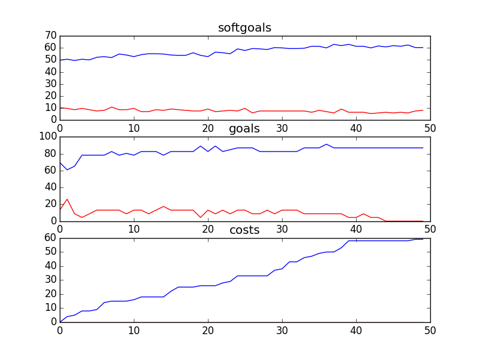

## CSServices
```

rank ,         name ,    med   ,   iqr 
----------------------------------------------------
   1 ,      gen0_f1 ,    54.84  ,   9.14 (   -------   * |---           ),43.01, 51.08, 54.84, 57.53, 61.83
   2 ,     gen20_f1 ,    56.45  ,    8.6 (        ----- *|  ---         ),48.39, 54.84, 56.45, 60.75, 65.05
   3 ,     gen40_f1 ,    60.22  ,   8.06 (         ----- | * ----       ),50.00, 55.91, 60.22, 62.90, 67.20
   3 ,     gen60_f1 ,    61.29  ,   6.45 (          -----|   *----      ),51.61, 58.06, 61.83, 63.98, 68.82
   4 ,     gen80_f1 ,    61.83  ,   5.92 (              -|   *-----     ),55.91, 59.14, 61.83, 63.98, 69.35
   4 ,    gen100_f1 ,     62.9  ,   5.91 (              -|--  * -----   ),56.45, 61.29, 63.44, 66.13, 72.04

rank ,         name ,    med   ,   iqr 
----------------------------------------------------
   1 ,      gen0_f2 ,    69.57  ,  30.43 (--           * |  -------     ),43.48, 47.83, 69.57, 78.26, 91.30
   1 ,     gen20_f2 ,    73.91  ,  26.09 (  -----------  |*   -----     ),47.83, 69.57, 73.91, 82.61, 91.30
   2 ,     gen40_f2 ,    78.26  ,  13.04 (  -------------|  * -----     ),47.83, 73.91, 78.26, 82.61, 91.30
   2 ,     gen60_f2 ,    78.26  ,  13.05 (           ----|  * -----     ),65.22, 73.91, 78.26, 82.61, 91.30
   2 ,     gen80_f2 ,    78.26  ,  13.05 (           ----|  * -------   ),65.22, 73.91, 78.26, 82.61, 95.65
   2 ,    gen100_f2 ,    78.26  ,  13.05 (           ----|--  *  ----   ),65.22, 78.26, 82.61, 86.96, 95.65

rank ,         name ,    med   ,   iqr 
----------------------------------------------------
   1 ,    gen100_f3 ,     62.0  ,   13.0 (     ----  *  -|-             ),50.00, 58.00, 63.00, 68.00, 75.00
   1 ,     gen80_f3 ,     63.0  ,   11.0 (     ----   * -|--            ),50.00, 58.00, 65.00, 68.00, 76.00
   1 ,     gen60_f3 ,     65.0  ,   13.0 (     ----   * -|---           ),50.00, 58.00, 65.00, 69.00, 78.00
   1 ,     gen40_f3 ,     66.0  ,   13.0 (      -----  * |---           ),52.00, 62.00, 66.00, 71.00, 79.00
   2 ,     gen20_f3 ,     68.0  ,   11.0 (      ------  *|----          ),53.00, 64.00, 68.00, 73.00, 81.00
   2 ,      gen0_f3 ,     70.0  ,   12.0 (       ------  *  ---         ),55.00, 66.00, 71.00, 76.00, 83.00
```
### Time Taken : 258.430530071

```

+------+------------------------------------------------------------+----------+-------+------+
| rank |                            name                            |   type   | value | cost |
+------+------------------------------------------------------------+----------+-------+------+
|  1   |                     Service Resources                      | resource |   1   |  4   |
|  2   |                         Web Server                         | resource |   1   |  1   |
|  3   |             Provide Web Counselling with Video             |   task   |   1   |  3   |
|  4   |         Kids use get Informed Section of Web Site          |   task   |   -1  |  5   |
|  5   |                  Create Counselling Posts                  |   task   |   1   |  1   |
|  6   |               Voice Counselling be Performed               |   task   |   1   |  5   |
|  7   |                Provide Written Counselling                 |   task   |   1   |  1   |
|  8   |                Implement Board with Replies                |   task   |   -1  |  5   |
|  9   |                          Feedback                          | resource |   -1  |  3   |
|  10  |                Kids Use Voice Counselling1                 |   task   |   1   |  1   |
|  11  |               Implement Information Section                |   task   |   1   |  2   |
|  12  |      Kids Use Bulletin Board with Delayed Moderation1      |   task   |   -1  |  3   |
|  13  |                !Kids Read Polls about Kids1                |   task   |   -1  |  1   |
|  14  |                   Feedback Form Software                   | resource |   -1  |  4   |
|  15  |                !Moderate Discussion Boards                 |   task   |   1   |  4   |
|  16  |                Implement Voice Counselling1                |   task   |   1   |  3   |
|  17  |                      Web Site Content                      | resource |   -1  |  4   |
|  18  |                 Put Content Onto Website1                  |   task   |   -1  |  4   |
|  19  |           Implement Bulletin Board with Replies1           |   task   |   1   |  1   |
|  20  |     Implement Bulletin Board with Delayed Moderation1      |   task   |   -1  |  5   |
|  21  |                        Trace Calls                         |   task   |   -1  |  1   |
|  22  |              Schedule Chat at Specific Times               |   task   |   1   |  2   |
|  23  |                      Implement Delay                       |   task   |   1   |  1   |
|  24  |                Kids Use Phone Counselling1                 |   task   |   1   |  4   |
|  25  |              Parents Use Information Section1              |   task   |   -1  |  5   |
|  26  |  !Implement\nTool to Allow Parents to Talk to Each Other   |   task   |   -1  |  4   |
|  27  |           Kids Use Bulletin Board with Replies1            |   task   |   -1  |  3   |
|  28  |                        Web Software                        | resource |   -1  |  3   |
|  29  |    Inform Kids about Anonymity [Kids] of Web Services1     |   task   |   1   |  4   |
|  30  |           Kids Use Cyber Café/Portal/Chat Room1            |   task   |   1   |  1   |
|  31  |          Kids Read General Questions and Answers1          |   task   |   1   |  5   |
|  32  |              Implement Anti-Pranking Message               |   task   |   -1  |  3   |
|  33  |                    Strategic Blue Print                    | resource |   1   |  3   |
|  34  |             Provide Web Counselling with Audio             |   task   |   1   |  1   |
|  35  |                Kids Use Video Counselling1                 |   task   |   1   |  2   |
|  36  | Parents Use\nTool to Allow Parents to Talk to Each Other 1 |   task   |   1   |  1   |
|  37  |                      !Moderate a Chat                      |   task   |   -1  |  5   |
|  38  |                 *Provide Recorded Messages                 |   task   |   1   |  3   |
|  39  |             !Implement One-On-One Chat Rooms1              |   task   |   1   |  5   |
|  40  |               *Maintain PHL Phone Services4                |   task   |   -1  |  1   |
|  41  |                     Implement Filters                      |   task   |   -1  |  2   |
|  42  |           Kids Use Ask a Counsellor Section\ns1            |   task   |   -1  |  5   |
|  43  |             Maintain Ask a Counsellor Section1             |   task   |   -1  |  3   |
|  44  |                Kids Use Email Counselling1                 |   task   |   -1  |  3   |
|  45  |                 !Implement Text Messaging1                 |   task   |   -1  |  3   |
|  46  |                 !Implement Phone Feedback3                 |   task   |   -1  |  3   |
|  47  |                 !Perform Email Counselling                 |   task   |   -1  |  2   |
|  48  |                         Feedback1                          | resource |   1   |  1   |
|  49  |          Parents Use Bulletin Board with Replies1          |   task   |   -1  |  2   |
|  50  |       Block Kids who Display Inappropriate Behavoir        |   task   |   -1  |  2   |
+------+------------------------------------------------------------+----------+-------+------+
```
