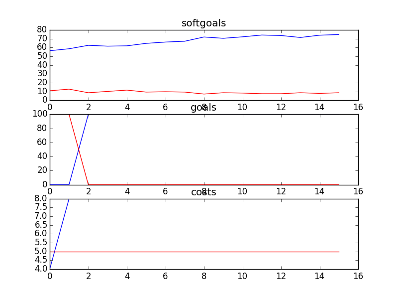

## DelayModeratedBulletinBoard
```

rank ,         name ,    med   ,   iqr 
----------------------------------------------------
   1 ,      gen0_f1 ,    61.71  ,  10.78 (   -------    *| ----         ),49.44, 58.36, 62.83, 66.54, 71.38
   2 ,     gen20_f1 ,    68.77  ,   8.18 (             --|-  * ---      ),61.34, 66.91, 69.14, 71.75, 75.09
   2 ,     gen40_f1 ,    69.52  ,   5.58 (              -|--  * ---     ),63.20, 67.66, 69.89, 72.12, 75.46
   3 ,     gen60_f1 ,    70.26  ,   7.07 (               |--  *  --     ),63.94, 68.03, 70.26, 73.98, 75.84
   3 ,     gen80_f1 ,    70.63  ,   6.69 (               |---  *  -     ),64.68, 68.40, 70.63, 74.35, 76.58
   3 ,    gen100_f1 ,    70.63  ,   7.06 (               |---  *  --    ),64.68, 68.40, 71.00, 74.35, 77.32

rank ,         name ,    med   ,   iqr 
----------------------------------------------------
   1 ,      gen0_f2 ,      0.0  ,    0.0 (*--------------|------------- ), 0.00,  0.00,  0.00,  0.00, 100.00
   1 ,     gen20_f2 ,      0.0  ,  100.0 (*              |              ), 0.00,  0.00,  0.00, 100.00, 100.00
   1 ,     gen40_f2 ,      0.0  ,  100.0 (*              |              ), 0.00,  0.00,  0.00, 100.00, 100.00
   1 ,     gen60_f2 ,      0.0  ,  100.0 (*              |              ), 0.00,  0.00,  0.00, 100.00, 100.00
   1 ,     gen80_f2 ,      0.0  ,  100.0 (*              |              ), 0.00,  0.00,  0.00, 100.00, 100.00
   1 ,    gen100_f2 ,      0.0  ,  100.0 (*              |              ), 0.00,  0.00,  0.00, 100.00, 100.00

rank ,         name ,    med   ,   iqr 
----------------------------------------------------
   1 ,     gen60_f3 ,     18.0  ,    9.0 (     ---  *   -|-----         ),12.00, 15.00, 18.00, 22.00, 31.00
   1 ,     gen80_f3 ,     18.0  ,    8.0 (     --   *  --|----          ),12.00, 14.00, 18.00, 21.00, 30.00
   1 ,    gen100_f3 ,     18.0  ,    8.0 (     --   *  --|---           ),12.00, 14.00, 18.00, 21.00, 28.00
   1 ,     gen40_f3 ,     18.0  ,    9.0 (      ---  *   |-----         ),13.00, 16.00, 19.00, 24.00, 31.00
   1 ,     gen20_f3 ,     20.0  ,    9.0 (       ---  *  |-----         ),14.00, 18.00, 20.00, 24.00, 31.00
   2 ,      gen0_f3 ,     22.0  ,    8.0 (         --   *|  ------      ),16.00, 19.00, 22.00, 27.00, 35.00
```
### Time Taken : 120.8108778

```

+------+-------------------------------------------------+----------+-------+------+
| rank |                       name                      |   type   | value | cost |
+------+-------------------------------------------------+----------+-------+------+
|  1   |            Create Counselling Posts1            |   task   |   1   |  3   |
|  2   |           !Moderate Discussion Boards1          |   task   |   1   |  1   |
|  3   |            Acquire Service Resources            |   task   |   -1  |  5   |
|  4   |               Sustainable Services              | softgoal |   1   |  1   |
|  5   |              Move on to Better Job1             | softgoal |   -1  |  1   |
|  6   |                 Avoid Bad Advice                | softgoal |   1   |  2   |
|  7   |                    Immediacy4                   | softgoal |   1   |  2   |
|  8   |                   Reduce Cost                   | softgoal |   -1  |  4   |
|  9   |              Control [Web Services]             | softgoal |   -1  |  5   |
|  10  |           Avoid Presence of Pedofiles           | softgoal |   1   |  2   |
|  11  |              Perform Duties Quickly             | softgoal |   -1  |  4   |
|  12  |   Reduce Contagion Effect [Of Harmful Actions]  | softgoal |   -1  |  5   |
|  13  | Increased Caution [Content of Online Services]2 | softgoal |   1   |  4   |
|  14  |          Enthusiastic [Work Atmosphere]         | softgoal |   1   |  2   |
|  15  |             Decrease Kids Isolation             | softgoal |   1   |  4   |
|  16  |             Anonymity [Counsellors]             | softgoal |   -1  |  4   |
+------+-------------------------------------------------+----------+-------+------+
```
