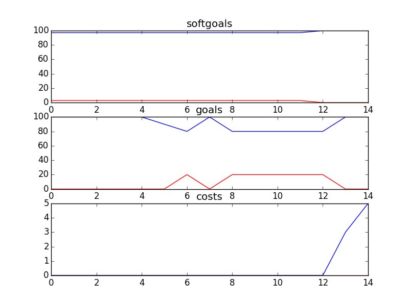

## Kids and Youth
```

rank ,         name ,    med   ,   iqr 
----------------------------------------------------
   1 ,      gen0_f1 ,    97.14  ,   2.85 (               |   *--------- ),94.29, 94.29, 97.14, 97.14, 100.00
   1 ,     gen20_f1 ,    97.14  ,   2.86 (               |   *          ),97.14, 97.14, 97.14, 100.00, 100.00
   2 ,     gen40_f1 ,    100.0  ,   2.86 (               |             *),97.14, 97.14, 100.00, 100.00, 100.00
   2 ,     gen60_f1 ,    100.0  ,   2.86 (               |   ----------*),97.14, 100.00, 100.00, 100.00, 100.00
   2 ,     gen80_f1 ,    100.0  ,   2.86 (               |   ----------*),97.14, 100.00, 100.00, 100.00, 100.00
   2 ,    gen100_f1 ,    100.0  ,   2.86 (               |   ----------*),97.14, 100.00, 100.00, 100.00, 100.00

rank ,         name ,    med   ,   iqr 
----------------------------------------------------
   1 ,      gen0_f2 ,    100.0  ,    0.0 (               |             *),100.00, 100.00, 100.00, 100.00, 100.00
   1 ,     gen20_f2 ,    100.0  ,    0.0 (               |             *),100.00, 100.00, 100.00, 100.00, 100.00
   1 ,     gen40_f2 ,    100.0  ,    0.0 (               |             *),100.00, 100.00, 100.00, 100.00, 100.00
   1 ,     gen60_f2 ,    100.0  ,    0.0 (               |             *),100.00, 100.00, 100.00, 100.00, 100.00
   1 ,     gen80_f2 ,    100.0  ,    0.0 (               |             *),100.00, 100.00, 100.00, 100.00, 100.00
   1 ,    gen100_f2 ,    100.0  ,    0.0 (               |             *),100.00, 100.00, 100.00, 100.00, 100.00

rank ,         name ,    med   ,   iqr 
----------------------------------------------------
   1 ,     gen80_f3 ,     12.0  ,    4.0 (      *        |              ), 9.00, 10.00, 12.00, 13.00, 15.00
   1 ,    gen100_f3 ,     12.0  ,    4.0 (   -  *        |              ), 8.00, 10.00, 12.00, 13.00, 15.00
   1 ,     gen60_f3 ,     12.0  ,    4.0 (    - *-       |              ), 9.00, 11.00, 13.00, 15.00, 16.00
   2 ,     gen40_f3 ,     16.0  ,    5.0 (     -- *--    |              ),11.00, 14.00, 16.00, 18.00, 21.00
   3 ,     gen20_f3 ,     21.0  ,    8.0 (        --  * -|              ),16.00, 19.00, 22.00, 26.00, 29.00
   4 ,      gen0_f3 ,     30.0  ,   11.0 (             --| *   --       ),24.00, 27.00, 31.00, 37.00, 41.00
```
### Time Taken : 9.00992202759

```

+------+-------------------------------------------+----------+-------+------+
| rank |                    name                   |   type   | value | cost |
+------+-------------------------------------------+----------+-------+------+
|  1   |        Implement Email Counselling        |   task   |   -1  |  4   |
|  2   |   !Implement Bulletin Board with Replies  |   task   |   -1  |  4   |
|  3   |       Comfortableness with service        | softgoal |   1   |  1   |
|  4   |           Contact CS in Crisis            |   task   |   -1  |  5   |
|  5   | Maintain Get Informed Section of Web Site |   task   |   -1  |  5   |
|  6   |              Provide Feedback             |   task   |   -1  |  5   |
|  7   |         !Implement Text Messaging         |   task   |   -1  |  5   |
|  8   |        Implement Video Counselling        |   task   |   -1  |  5   |
|  9   |  !Implement General Questions and Answers |   task   |   -1  |  5   |
|  10  |        Implement Voice Counselling        |   task   |   -1  |  5   |
|  11  |                  *Privacy                 | softgoal |   1   |  2   |
|  12  |        !Implement Polls about Kids        |   task   |   1   |  5   |
|  13  |   Contact CS about Non-Crisis Situation   |   task   |   -1  |  4   |
|  14  |         Maintain Phone Counselling        |   task   |   -1  |  4   |
|  15  |     Maintain Ask a Counsellor Section     |   task   |   1   |  3   |
|  16  |   !Implement Cyber Café/Portal/Chat Room  |   task   |   -1  |  3   |
|  17  |      !Implement One-On-One Chat Rooms     |   task   |   -1  |  1   |
+------+-------------------------------------------+----------+-------+------+
```
