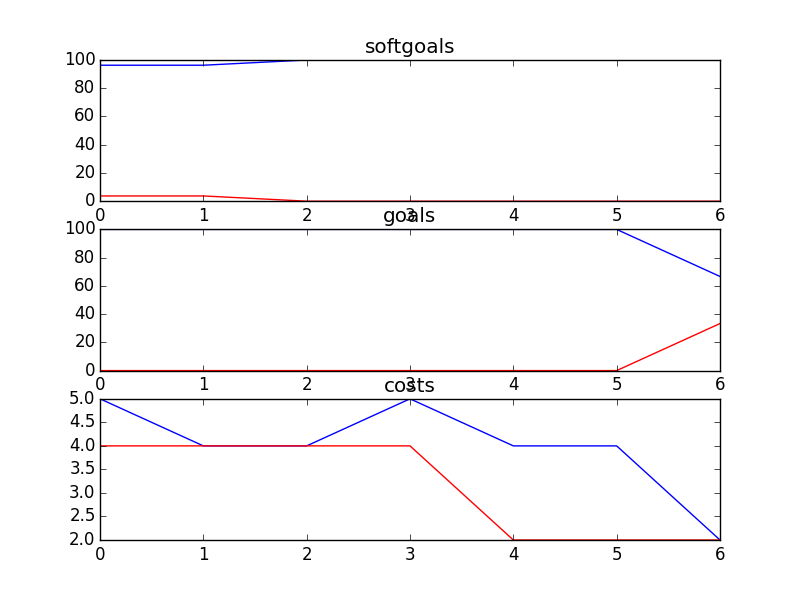

## Parents
```

rank ,         name ,    med   ,   iqr 
----------------------------------------------------
   1 ,      gen0_f1 ,     96.3  ,    3.7 (               |      *       ),96.30, 96.30, 96.30, 100.00, 100.00
   1 ,     gen20_f1 ,     96.3  ,    3.7 (               |      *       ),96.30, 96.30, 96.30, 100.00, 100.00
   1 ,     gen40_f1 ,     96.3  ,    3.7 (               |      *       ),96.30, 96.30, 96.30, 100.00, 100.00
   1 ,     gen60_f1 ,     96.3  ,    3.7 (               |      *       ),96.30, 96.30, 96.30, 100.00, 100.00
   1 ,     gen80_f1 ,     96.3  ,    3.7 (               |      *       ),96.30, 96.30, 96.30, 100.00, 100.00
   1 ,    gen100_f1 ,     96.3  ,    3.7 (               |      *       ),96.30, 96.30, 96.30, 100.00, 100.00

rank ,         name ,    med   ,   iqr 
----------------------------------------------------
   1 ,      gen0_f2 ,    100.0  ,    0.0 (               |             *),100.00, 100.00, 100.00, 100.00, 100.00
   1 ,     gen20_f2 ,    100.0  ,    0.0 (               |             *),100.00, 100.00, 100.00, 100.00, 100.00
   1 ,     gen40_f2 ,    100.0  ,    0.0 (               |             *),100.00, 100.00, 100.00, 100.00, 100.00
   1 ,     gen60_f2 ,    100.0  ,    0.0 (               |             *),100.00, 100.00, 100.00, 100.00, 100.00
   1 ,     gen80_f2 ,    100.0  ,    0.0 (               |             *),100.00, 100.00, 100.00, 100.00, 100.00
   1 ,    gen100_f2 ,    100.0  ,    0.0 (               |             *),100.00, 100.00, 100.00, 100.00, 100.00

rank ,         name ,    med   ,   iqr 
----------------------------------------------------
   1 ,     gen60_f3 ,      6.0  ,    3.0 (   ---- *   ---|              ), 3.00,  5.00,  6.00,  8.00, 10.00
   1 ,     gen80_f3 ,      6.0  ,    3.0 (   ---- *   ---|              ), 3.00,  5.00,  6.00,  8.00, 10.00
   1 ,    gen100_f3 ,      6.0  ,    3.0 (   ---- *   ---|              ), 3.00,  5.00,  6.00,  8.00, 10.00
   1 ,     gen20_f3 ,      7.0  ,    4.0 (   ----   * ---|-             ), 3.00,  5.00,  7.00,  8.00, 11.00
   1 ,     gen40_f3 ,      7.0  ,    3.0 (   ----   * ---|              ), 3.00,  5.00,  7.00,  8.00, 10.00
   2 ,      gen0_f3 ,      9.0  ,    6.0 (     -----    *|   ---        ), 4.00,  7.00,  9.00, 12.00, 14.00
```
### Time Taken : 4.06427001953

```

+------+----------------------------------------------------------+----------+-------+------+
| rank |                           name                           |   type   | value | cost |
+------+----------------------------------------------------------+----------+-------+------+
|  1   |               *Maintain PHL Phone Services               |   task   |   -1  |  4   |
|  2   |                         *Privacy                         | softgoal |   1   |  4   |
|  3   | !Implement\nTool to Allow Parents to Talk to Each Other  |   task   |   -1  |  4   |
|  4   |           Maintain Bulletin Board with Replies           |   task   |   -1  |  2   |
|  5   |                     Provide feedback                     |   task   |   -1  |  1   |
|  6   |              Implement Information Section               |   task   |   -1  |  1   |
|  7   |            Phone Library of Recorded Messages            | resource |   -1  |  2   |
+------+----------------------------------------------------------+----------+-------+------+
```
