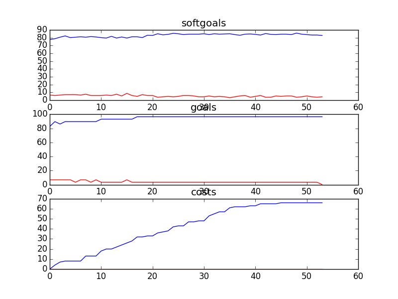

## CSCounselling
```

rank ,         name ,    med   ,   iqr 
----------------------------------------------------
   1 ,      gen0_f1 ,    82.32  ,   6.07 (         ----- |*  --         ),76.24, 80.11, 82.32, 84.53, 86.74
   2 ,     gen20_f1 ,    84.53  ,   4.42 (             --|-  * ----     ),79.56, 82.87, 84.53, 86.19, 90.06
   3 ,     gen40_f1 ,    85.64  ,   5.52 (               |--  *  ---    ),82.32, 83.98, 85.64, 87.85, 91.16
   3 ,     gen60_f1 ,    86.74  ,   4.42 (               | --  *  --    ),82.87, 85.08, 86.74, 88.95, 91.16
   3 ,     gen80_f1 ,    86.74  ,   4.98 (               | --- *   --   ),82.87, 85.64, 86.74, 90.06, 91.71
   4 ,    gen100_f1 ,    88.95  ,   4.42 (               |  ---   * --  ),83.98, 86.74, 88.95, 90.61, 92.27

rank ,         name ,    med   ,   iqr 
----------------------------------------------------
   1 ,      gen0_f2 ,    86.21  ,    6.9 (    --------*  | --------     ),79.31, 86.21, 86.21, 89.66, 96.55
   1 ,     gen20_f2 ,    86.21  ,   3.45 (        ----*  | --------     ),82.76, 86.21, 86.21, 89.66, 96.55
   1 ,     gen40_f2 ,    86.21  ,   6.89 (        ----*  | --------     ),82.76, 86.21, 86.21, 89.66, 96.55
   2 ,     gen60_f2 ,    89.66  ,   6.89 (        ----   | *   ----     ),82.76, 86.21, 89.66, 93.10, 96.55
   2 ,     gen80_f2 ,    89.66  ,   6.89 (        ----   | *   ----     ),82.76, 86.21, 89.66, 93.10, 96.55
   2 ,    gen100_f2 ,    89.66  ,   6.89 (            ---|-*   ----     ),86.21, 89.66, 89.66, 93.10, 96.55

rank ,         name ,    med   ,   iqr 
----------------------------------------------------
   1 ,    gen100_f3 ,     68.0  ,   17.0 (    ----    *  | ---          ),54.00, 62.00, 68.00, 77.00, 82.00
   1 ,     gen60_f3 ,     68.0  ,   17.0 (    -----   *  |  ----        ),54.00, 64.00, 69.00, 78.00, 86.00
   1 ,     gen80_f3 ,     68.0  ,   16.0 (    ----    *  | ----         ),54.00, 62.00, 69.00, 77.00, 83.00
   1 ,     gen40_f3 ,     70.0  ,   18.0 (    ------    *|  ------      ),54.00, 65.00, 71.00, 79.00, 88.00
   2 ,     gen20_f3 ,     72.0  ,   17.0 (    -------   *|   -----      ),55.00, 66.00, 72.00, 80.00, 88.00
   2 ,      gen0_f3 ,     73.0  ,   19.0 (     -------   *     ------   ),56.00, 69.00, 74.00, 83.00, 94.00
```
### Time Taken : 206.013066053

```

+------+----------------------------------------------------+----------+-------+------+
| rank |                        name                        |   type   | value | cost |
+------+----------------------------------------------------+----------+-------+------+
|  1   |                Counselling Policies                | resource |   1   |  4   |
|  2   |          Provide Resources in One Source           |   task   |   1   |  3   |
|  3   |              Debrief with Counsellors              |   task   |   1   |  1   |
|  4   |          !Participate in Sponsor Meetings          |   task   |   -1  |  4   |
|  5   |                      Feedback                      | resource |   -1  |  5   |
|  6   |                    Training CDs                    | resource |   -1  |  5   |
|  7   |                       Tapes                        | resource |   1   |  5   |
|  8   |                  *Explore Options                  |   task   |   -1  |  4   |
|  9   |         *Implement Email for Counsellors1          |   task   |   -1  |  4   |
|  10  |        Sign Contract with Counselling Union        |   task   |   1   |  5   |
|  11  |           Provide Resources in E-Library           |   task   |   1   |  2   |
|  12  |                  Assess Situation                  |   task   |   -1  |  5   |
|  13  |          Encourage Kids to Talk to Others          |   task   |   1   |  2   |
|  14  |               Web Moderator Meetings               | resource |   1   |  2   |
|  15  | Include Legal Information in Counselling Resources |   task   |   1   |  2   |
|  16  |            Perform Crisis Intervention             |   task   |   1   |  2   |
|  17  |                  Double Headsets                   | resource |   1   |  4   |
|  18  |             *Implement Bulletin Board1             |   task   |   -1  |  4   |
|  19  |               Report Outdated Links1               |   task   |   1   |  1   |
|  20  |     Provide Information to Other Counselloers      |   task   |   -1  |  5   |
|  21  |   ! Counselor Speak on Kids Issues in General 1    |   task   |   1   |  3   |
|  22  |           *Implement Categorization Tool           |   task   |   1   |  1   |
|  23  |            Diffuse Conflict with Parent            |   task   |   1   |  1   |
|  24  |                 Assess Situation1                  |   task   |   1   |  4   |
|  25  |               Counselling Workshops                | resource |   1   |  1   |
|  26  |              Speak Publicly about Job              |   task   |   -1  |  2   |
|  27  |                Refer Parents to PHL                |   task   |   1   |  4   |
|  28  |              Speak at SA Conferences               |   task   |   -1  |  1   |
|  29  | Include Drug Information in Counselling Resources  |   task   |   1   |  1   |
|  30  |           ! Write Articles for Website 1           |   task   |   -1  |  3   |
|  31  |           Provide Information in Binders           |   task   |   1   |  5   |
|  32  |           !Participate in Board Meetings           |   task   |   1   |  2   |
|  33  |             Encourage Kids to Call CS              |   task   |   1   |  2   |
|  34  |   Block Kids who Display Inappropriate Behavoir    |   task   |   -1  |  3   |
|  35  |          *Receive Training from Managment          |   task   |   1   |  4   |
|  36  |          ! Write Articles for Magazines 1          |   task   |   1   |  1   |
|  37  |                   Request Shifts                   |   task   |   -1  |  1   |
|  38  |                   Record Stories                   |   task   |   -1  |  5   |
|  39  |              Attend Part Time Meeting              |   task   |   1   |  1   |
|  40  |       Comment on Technology Usability Issues       |   task   |   -1  |  2   |
|  41  |        Receive Call Classification Training        |   task   |   1   |  2   |
|  42  |               Learn Web Technologies               |   task   |   -1  |  1   |
|  43  |               Participate in events1               |   task   |   -1  |  2   |
|  44  |                   Report Abuses                    |   task   |   -1  |  2   |
|  45  |            Remove Identifying Material             |   task   |   1   |  1   |
|  46  |              *Edit Counselling Posts               |   task   |   -1  |  5   |
|  47  |             Tape Recording Technology              | resource |   -1  |  5   |
|  48  |      Perform Conference Call with Third Party      |   task   |   -1  |  3   |
|  49  |  *Encourage Kids to Talk to Different Counsellors  |   task   |   -1  |  3   |
|  50  |                  Listen for Cues                   |   task   |   -1  |  5   |
|  51  |              !Undergo Media Training               |   task   |   -1  |  5   |
|  52  |     Listen to Calls of Experienced Counsellors     |   task   |   -1  |  2   |
|  53  |                 *Explore Options1                  |   task   |   -1  |  2   |
|  54  |            Provide Resources in Library            |   task   |   -1  |  2   |
+------+----------------------------------------------------+----------+-------+------+
```
