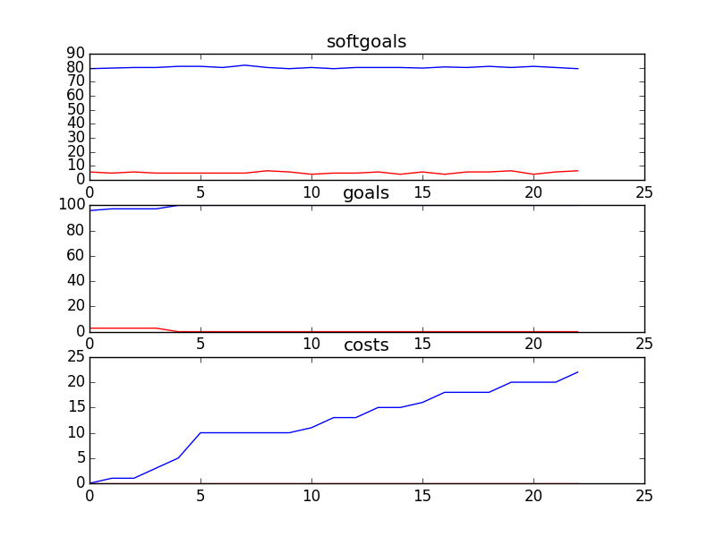

## CSCounsellingManagement
```

rank ,         name ,    med   ,   iqr 
----------------------------------------------------
   1 ,      gen0_f1 ,    81.82  ,   7.43 (  -------    * | ------       ),75.21, 79.34, 81.82, 84.30, 87.60
   2 ,     gen20_f1 ,    85.95  ,    3.3 (              -|--- *  -      ),82.64, 85.12, 85.95, 87.60, 88.43
   2 ,     gen40_f1 ,    86.78  ,   3.31 (               |---  *  -     ),83.47, 85.12, 86.78, 88.43, 89.26
   3 ,     gen60_f1 ,     87.6  ,   2.48 (               | ---   *-     ),84.30, 85.95, 87.60, 88.43, 89.26
   3 ,     gen80_f1 ,     87.6  ,   0.83 (               |    ---*-     ),85.95, 87.60, 87.60, 88.43, 89.26
   3 ,    gen100_f1 ,    88.43  ,   1.66 (               |    --- *     ),85.95, 87.60, 88.43, 88.43, 89.26

rank ,         name ,    med   ,   iqr 
----------------------------------------------------
   1 ,      gen0_f2 ,    97.22  ,   2.78 (               |   *--------- ),94.44, 94.44, 97.22, 97.22, 100.00
   1 ,     gen20_f2 ,    97.22  ,   5.56 (         ------|---*          ),94.44, 97.22, 97.22, 100.00, 100.00
   1 ,     gen40_f2 ,    97.22  ,   2.78 (         ------|---*          ),94.44, 97.22, 97.22, 100.00, 100.00
   1 ,     gen60_f2 ,    97.22  ,   2.78 (         ------|---*          ),94.44, 97.22, 97.22, 100.00, 100.00
   1 ,     gen80_f2 ,    97.22  ,   2.78 (               |   *          ),97.22, 97.22, 97.22, 100.00, 100.00
   2 ,    gen100_f2 ,    100.0  ,   2.78 (               |             *),97.22, 97.22, 100.00, 100.00, 100.00

rank ,         name ,    med   ,   iqr 
----------------------------------------------------
   1 ,    gen100_f3 ,     24.0  ,   11.0 (    ---   *   -|----          ),17.00, 20.00, 24.00, 29.00, 35.00
   1 ,     gen80_f3 ,     26.0  ,   13.0 (    ---     *  |----          ),17.00, 20.00, 26.00, 31.00, 35.00
   2 ,     gen60_f3 ,     27.0  ,   10.0 (     ----    * | ----         ),18.00, 23.00, 27.00, 32.00, 36.00
   2 ,     gen40_f3 ,     28.0  ,    9.0 (       ----   *|   ---        ),21.00, 25.00, 28.00, 34.00, 37.00
   3 ,     gen20_f3 ,     30.0  ,   11.0 (       ------  |*   -----     ),21.00, 27.00, 31.00, 35.00, 41.00
   4 ,      gen0_f3 ,     36.0  ,    7.0 (          -----|-    *-----   ),24.00, 32.00, 36.00, 38.00, 43.00

+------+-----------------------------------------------------+----------+-------+
| rank |                         name                        |   type   | value |
+------+-----------------------------------------------------+----------+-------+
|  1   |              !Hire Counselling Managers             |   task   |   -1  |
|  2   |           Negotiate with Counsellors Union          |   task   |   -1  |
|  3   |      Communicate CS Information to Counsellors      |   task   |   1   |
|  4   |                   Call Statistics                   | resource |   -1  |
|  5   |                  !Hire Counsellors                  |   task   |   -1  |
|  6   |            Put on Web Moderator Meetings            |   task   |   1   |
|  7   |               Set Counselling Policies              |   task   |   -1  |
|  8   |        Create Call Classification Catagories        |   task   |   1   |
|  9   |      Provide One-on-One Support to Counsellors      |   task   |   -1  |
|  10  |                    Debrief Calls                    |   task   |   -1  |
|  11  |      Put on Orientation Process for Cousellors      |   task   |   -1  |
|  12  |                    Request Shifts                   |   task   |   1   |
|  13  |             Put On Counselling Workshops            |   task   |   1   |
|  14  |           Historical Data of Call Volumes           | resource |   -1  |
|  15  |              Attend Part Time Meetings              |   task   |   1   |
|  16  |                Counselling Resources                | resource |   -1  |
|  17  |                  Debrief Web Posts                  |   task   |   -1  |
|  18  | Write Yearly Peformance Evaluations for Counsellors |   task   |   -1  |
|  19  |         Acquire Web Training from Operations        |   task   |   1   |
|  20  |                 Counsellors Be Paid                 |   task   |   -1  |
|  21  |                   Use Blue Pumpkin                  |   task   |   -1  |
|  22  |                     Review Tape                     |   task   |   1   |
|  23  |                   Double Head Set                   | resource |   -1  |
+------+-----------------------------------------------------+----------+-------+
```
### Time Taken : 74.9254000187

