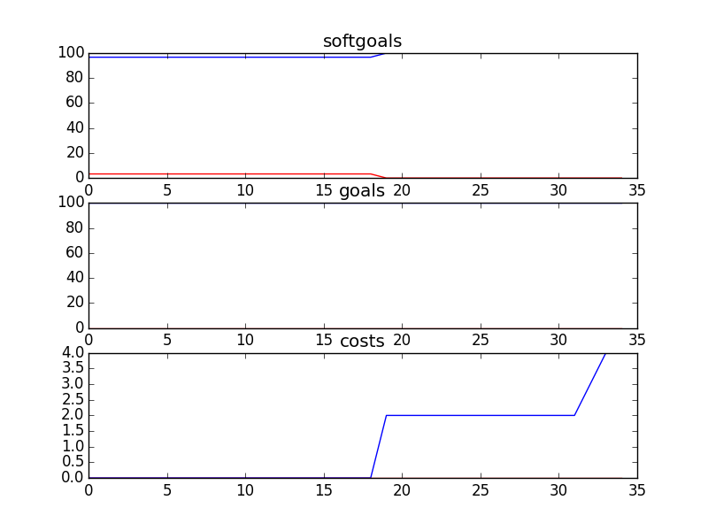

## CSCounsellingSD
```

rank ,         name ,    med   ,   iqr 
----------------------------------------------------
   1 ,      gen0_f1 ,    100.0  ,   3.28 (               |             *),96.72, 96.72, 100.00, 100.00, 100.00
   1 ,     gen20_f1 ,    100.0  ,   3.28 (---------------|-------------*),96.72, 100.00, 100.00, 100.00, 100.00
   1 ,     gen40_f1 ,    100.0  ,    0.0 (---------------|-------------*),96.72, 100.00, 100.00, 100.00, 100.00
   1 ,     gen60_f1 ,    100.0  ,    0.0 (---------------|-------------*),96.72, 100.00, 100.00, 100.00, 100.00
   1 ,     gen80_f1 ,    100.0  ,    0.0 (               |             *),100.00, 100.00, 100.00, 100.00, 100.00
   1 ,    gen100_f1 ,    100.0  ,    0.0 (               |             *),100.00, 100.00, 100.00, 100.00, 100.00

rank ,         name ,    med   ,   iqr 
----------------------------------------------------
   1 ,      gen0_f2 ,    100.0  ,    0.0 (*              |              ),100.00, 100.00, 100.00, 100.00, 100.00
   1 ,     gen20_f2 ,    100.0  ,    0.0 (*              |              ),100.00, 100.00, 100.00, 100.00, 100.00
   1 ,     gen40_f2 ,    100.0  ,    0.0 (*              |              ),100.00, 100.00, 100.00, 100.00, 100.00
   1 ,     gen60_f2 ,    100.0  ,    0.0 (*              |              ),100.00, 100.00, 100.00, 100.00, 100.00
   1 ,     gen80_f2 ,    100.0  ,    0.0 (*              |              ),100.00, 100.00, 100.00, 100.00, 100.00
   1 ,    gen100_f2 ,    100.0  ,    0.0 (*              |              ),100.00, 100.00, 100.00, 100.00, 100.00

rank ,         name ,    med   ,   iqr 
----------------------------------------------------
   1 ,    gen100_f3 ,      5.0  ,    2.0 ( *             |              ), 3.00,  4.00,  5.00,  5.00,  6.00
   2 ,     gen80_f3 ,      7.0  ,    2.0 (  *            |              ), 5.00,  6.00,  7.00,  8.00, 10.00
   3 ,     gen60_f3 ,     16.0  ,    4.0 (    -* -       |              ),12.00, 15.00, 16.00, 19.00, 23.00
   4 ,     gen40_f3 ,     26.0  ,    4.0 (        - *-   |              ),22.00, 24.00, 26.00, 28.00, 32.00
   5 ,     gen20_f3 ,     37.0  ,    9.0 (           -- *|---           ),29.00, 34.00, 37.00, 42.00, 47.00
   6 ,      gen0_f3 ,     49.0  ,   10.0 (               |-- * -----    ),39.00, 45.00, 49.00, 53.00, 65.00
```
### Time Taken : 12.5694320202

```

+------+----------------------------------------------+----------+-------+------+
| rank |                     name                     |   type   | value | cost |
+------+----------------------------------------------+----------+-------+------+
|  1   |                  Promote CS                  |   task   |   -1  |  3   |
|  2   |            Information/Resources             | resource |   -1  |  2   |
|  3   |          Tape Recording Technoloyg           | resource |   -1  |  2   |
|  4   |      Provide Web Counselling with Video      |   task   |   -1  |  2   |
|  5   |                 Training CDs                 | resource |   -1  |  2   |
|  6   |       *Implement Email for Counsellors       |   task   |   -1  |  3   |
|  7   |            Participate in events             |   task   |   -1  |  2   |
|  8   |               Web Site Content               | resource |   -1  |  3   |
|  9   |       Information Binders at Stations        | resource |   -1  |  4   |
|  10  |           Undergo Clinical Review            |   task   |   -1  |  3   |
|  11  | ! Counselor Speak on Kids Issues in General  |   task   |   -1  |  5   |
|  12  |      Provide Web Counselling with Audio      |   task   |   -1  |  3   |
|  13  |                   Feedback                   | resource |   -1  |  1   |
|  14  |             Provide Counselling              |   task   |   -1  |  4   |
|  15  |          *Implement Bulletin Board           |   task   |   -1  |  4   |
|  16  |           Resources in the Library           | resource |   -1  |  3   |
|  17  |          !Perform Email Counselling          |   task   |   -1  |  3   |
|  18  |         !Moderate Discussion Boards          |   task   |   -1  |  4   |
|  19  |        *Implement Categorization Tool        |   task   |   1   |  2   |
|  20  |             Counselling Policies             | resource |   -1  |  5   |
|  21  |            Report Outdated Links             |   task   |   -1  |  3   |
|  22  |                    Tapes                     | resource |   -1  |  3   |
|  23  |         Web Counselling be Performed         |   task   |   -1  |  4   |
|  24  |            Counsellor Experience             | resource |   -1  |  4   |
|  25  |            Counselling Workshops             | resource |   -1  |  3   |
|  26  |            Web Moderator Meetings            | resource |   -1  |  3   |
|  27  |             Provide Information              |   task   |   -1  |  4   |
|  28  |           Information in E-Library           | resource |   -1  |  4   |
|  29  |        ! Write Articles for Website          |   task   |   -1  |  4   |
|  30  |       ! Write Articles for Magazines         |   task   |   -1  |  4   |
|  31  |               !Moderate a Chat               |   task   |   -1  |  5   |
|  32  |         Provide Written Counselling          |   task   |   1   |  1   |
|  33  |           Create Counselling Posts           |   task   |   1   |  1   |
|  34  |               Double Headsets                | resource |   -1  |  1   |
|  35  |                Sign Contract                 |   task   |   1   |  1   |
+------+----------------------------------------------+----------+-------+------+
```
