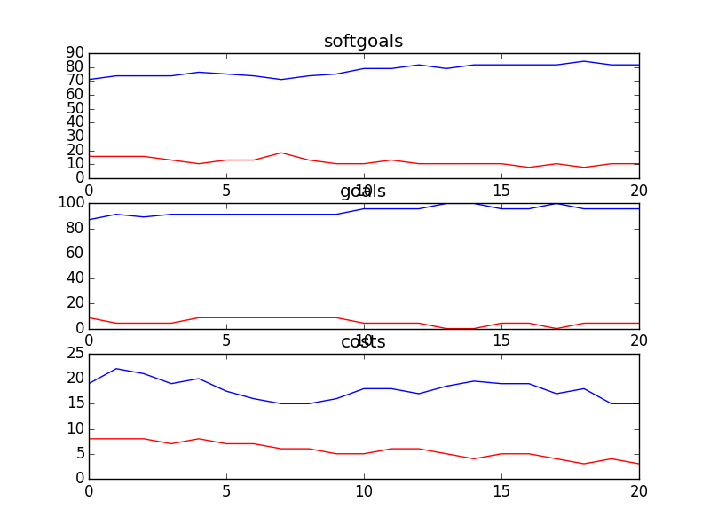

## CSITDepartment
```

rank ,         name ,    med   ,   iqr 
----------------------------------------------------
   1 ,      gen0_f1 ,    78.95  ,  10.53 (      ----  *  | ------       ),71.05, 76.32, 78.95, 84.21, 92.11
   2 ,     gen20_f1 ,    92.11  ,  10.53 (          -----|---    * --   ),76.32, 86.84, 92.11, 94.74, 97.37
   2 ,     gen40_f1 ,    92.11  ,   5.27 (            ---|-----  * --   ),78.95, 89.47, 92.11, 94.74, 97.37
   2 ,     gen60_f1 ,    92.11  ,    7.9 (               | ----  * --   ),84.21, 89.47, 92.11, 94.74, 97.37
   3 ,     gen80_f1 ,    94.74  ,    7.9 (               |     --  *    ),89.47, 92.11, 94.74, 97.37, 97.37
   3 ,    gen100_f1 ,    94.74  ,   5.26 (               |     --  *    ),89.47, 92.11, 94.74, 97.37, 97.37

rank ,         name ,    med   ,   iqr 
----------------------------------------------------
   1 ,      gen0_f2 ,     91.3  ,   8.69 (            ---|-*            ),86.96, 91.30, 91.30, 95.65, 95.65
   2 ,     gen20_f2 ,    95.65  ,   4.35 (            ---|-      *----- ),86.96, 91.30, 95.65, 95.65, 100.00
   2 ,     gen40_f2 ,    95.65  ,   4.35 (               |       *----- ),91.30, 91.30, 95.65, 95.65, 100.00
   2 ,     gen60_f2 ,    95.65  ,   4.35 (               | ------*----- ),91.30, 95.65, 95.65, 95.65, 100.00
   2 ,     gen80_f2 ,    95.65  ,    0.0 (               | ------*----- ),91.30, 95.65, 95.65, 95.65, 100.00
   2 ,    gen100_f2 ,    95.65  ,   4.35 (               | ------*----- ),91.30, 95.65, 95.65, 95.65, 100.00

rank ,         name ,    med   ,   iqr 
----------------------------------------------------
   1 ,    gen100_f3 ,     16.0  ,    7.0 (   --   *  --- |              ),12.00, 14.00, 17.00, 20.00, 23.00
   1 ,     gen60_f3 ,     17.0  ,    7.0 (    --- *    --|-             ),13.00, 16.00, 17.00, 22.00, 26.00
   1 ,     gen80_f3 ,     17.0  ,    6.0 (   ---  *  ----|              ),12.00, 15.00, 17.00, 20.00, 25.00
   1 ,     gen40_f3 ,     18.0  ,    6.0 (    ----  *   -|--            ),13.00, 17.00, 19.00, 23.00, 27.00
   2 ,     gen20_f3 ,     21.0  ,    8.0 (    -----    * |----          ),13.00, 18.00, 22.00, 25.00, 29.00
   2 ,      gen0_f3 ,     24.0  ,    9.0 (       ----    *  ------      ),16.00, 20.00, 24.00, 27.00, 33.00

+------+-------------------------------------------------+----------+-------+
| rank |                       name                      |   type   | value |
+------+-------------------------------------------------+----------+-------+
|  1   |                      Use T1                     |   task   |   1   |
|  2   |                     Use VPN                     |   task   |   -1  |
|  3   |  Perform Donor/Accounting Data Base Maintenance |   task   |   -1  |
|  4   |                     Upgrades                    | resource |   1   |
|  5   |         Provide Online Donor Technology1        |   task   |   -1  |
|  6   |            !Implement Phone Feedback1           |   task   |   -1  |
|  7   |                   IT Resources                  | resource |   -1  |
|  8   |                   Network PCs                   |   task   |   1   |
|  9   |                Use Current Method               |   task   |   1   |
|  10  |                  Free Software                  | resource |   1   |
|  11  |      Use Informal Buddy System for Training     |   task   |   1   |
|  12  | Provide Technology to Create and Send Documents |   task   |   -1  |
|  13  |                 Free Web Server                 | resource |   1   |
|  14  |                  Free Upgrades                  | resource |   1   |
|  15  |            Put Content Onto Website1            |   task   |   1   |
|  16  |                   Web Server1                   | resource |   -1  |
|  17  |                     Software                    | resource |   -1  |
|  18  |                     Hardware                    | resource |   -1  |
|  19  |                      Oracle                     | resource |   -1  |
|  20  |         *Implement Email for Counsellors        |   task   |   -1  |
|  21  |                  Free Hardware                  | resource |   -1  |
+------+-------------------------------------------------+----------+-------+
```
### Time Taken : 31.061745882

