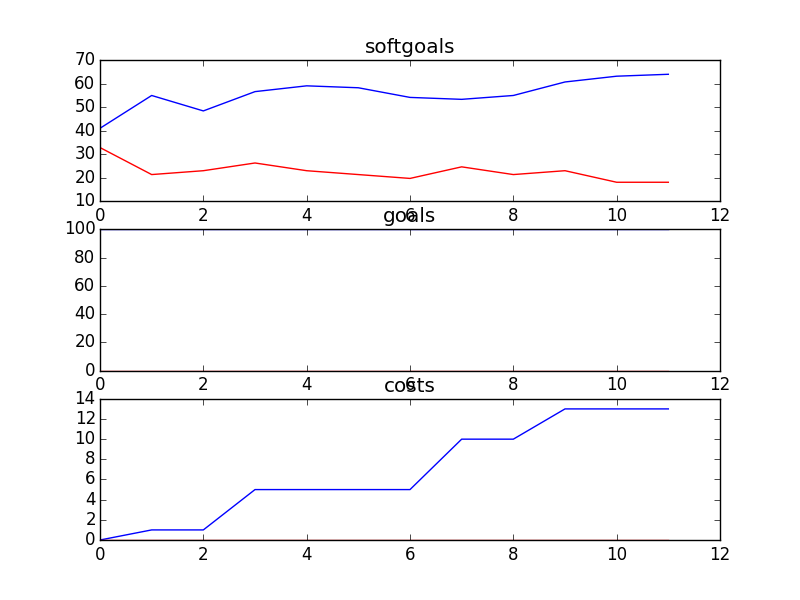

## CSSAProgram
```

rank ,         name ,    med   ,   iqr 
----------------------------------------------------
   1 ,      gen0_f1 ,    47.54  ,  22.95 (    ---- *     |---------     ),36.07, 44.26, 47.54, 63.93, 83.61
   2 ,     gen20_f1 ,    73.77  ,  21.31 (         ------|     *   ---  ),47.54, 63.93, 75.41, 83.61, 91.80
   2 ,     gen40_f1 ,    77.05  ,  21.31 (             --|--     *  --- ),55.74, 68.85, 78.69, 86.89, 95.08
   3 ,     gen60_f1 ,    81.97  ,  18.03 (               |----    * --- ),63.93, 73.77, 81.97, 86.89, 95.08
   3 ,     gen80_f1 ,    81.97  ,  14.75 (               |  -----  *--- ),67.21, 78.69, 83.61, 86.89, 95.08
   3 ,    gen100_f1 ,    83.61  ,   9.83 (               |  -----  *--- ),67.21, 80.33, 83.61, 86.89, 95.08

rank ,         name ,    med   ,   iqr 
----------------------------------------------------
   1 ,      gen0_f2 ,    100.0  ,    0.0 (*              |              ),100.00, 100.00, 100.00, 100.00, 100.00
   1 ,     gen20_f2 ,    100.0  ,    0.0 (*              |              ),100.00, 100.00, 100.00, 100.00, 100.00
   1 ,     gen40_f2 ,    100.0  ,    0.0 (*              |              ),100.00, 100.00, 100.00, 100.00, 100.00
   1 ,     gen60_f2 ,    100.0  ,    0.0 (*              |              ),100.00, 100.00, 100.00, 100.00, 100.00
   1 ,     gen80_f2 ,    100.0  ,    0.0 (*              |              ),100.00, 100.00, 100.00, 100.00, 100.00
   1 ,    gen100_f2 ,    100.0  ,    0.0 (*              |              ),100.00, 100.00, 100.00, 100.00, 100.00

rank ,         name ,    med   ,   iqr 
----------------------------------------------------
   1 ,     gen80_f3 ,     14.0  ,    8.0 (    --  *  --- |              ), 8.00, 11.00, 14.00, 18.00, 22.00
   1 ,    gen100_f3 ,     14.0  ,    8.0 (   ---  *  --- |              ), 7.00, 11.00, 14.00, 18.00, 22.00
   1 ,     gen60_f3 ,     15.0  ,    8.0 (    --   * ----|-             ), 8.00, 11.00, 15.00, 18.00, 25.00
   1 ,     gen40_f3 ,     16.0  ,    9.0 (     --   *  --|--            ),10.00, 12.00, 16.00, 20.00, 27.00
   2 ,     gen20_f3 ,     18.0  ,    8.0 (     ----   * -|---           ),10.00, 15.00, 19.00, 21.00, 28.00
   2 ,      gen0_f3 ,     20.0  ,    8.0 (        --   * |------        ),13.00, 16.00, 20.00, 24.00, 32.00

+------+-------------------------------+----------+-------+
| rank |              name             |   type   | value |
+------+-------------------------------+----------+-------+
|  1   |  Write Articles for Newspaper |   task   |   1   |
|  2   |       Plan Social Events      |   task   |   -1  |
|  3   |      Promotion Resources1     | resource |   -1  |
|  4   |        Send out Emails        |   task   |   1   |
|  5   |       Attend SA Meetings      |   task   |   -1  |
|  6   |        Provide Speaches       |   task   |   -1  |
|  7   | School Initiates Presenation1 |   task   |   -1  |
|  8   |    Help with Presentations    |   task   |   1   |
|  9   |   Run Fundraiser in Schools1  |   task   |   1   |
|  10  |          Retrain SA s         |   task   |   1   |
|  11  |           Train SA s          |   task   |   -1  |
|  12  |       Attend CS Meetings      |   task   |   -1  |
+------+-------------------------------+----------+-------+
```
### Time Taken : 31.5074589252

