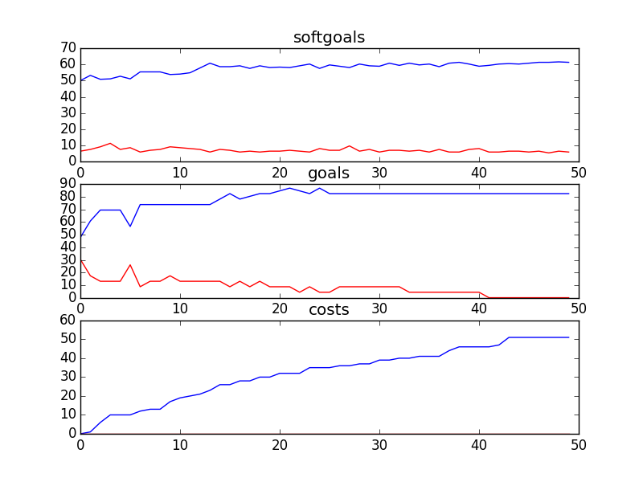

## CSServices
```

rank ,         name ,    med   ,   iqr 
----------------------------------------------------
   1 ,      gen0_f1 ,    54.84  ,   9.14 (   ------   * -|-             ),43.01, 51.08, 54.84, 57.53, 61.83
   2 ,     gen20_f1 ,    56.99  ,   9.68 (       -----  *|---           ),48.92, 54.30, 57.53, 60.75, 64.52
   3 ,     gen40_f1 ,     58.6  ,   8.06 (         ----  |* --          ),50.54, 55.91, 59.68, 62.37, 65.59
   4 ,     gen60_f1 ,    61.29  ,   6.99 (            ---| * ---        ),54.30, 58.60, 61.29, 64.52, 68.82
   4 ,     gen80_f1 ,    62.37  ,   7.52 (            ---|  *---        ),54.84, 59.14, 62.90, 65.05, 68.82
   4 ,    gen100_f1 ,     62.9  ,   6.99 (            ---|  * ---       ),55.38, 59.68, 62.90, 65.59, 69.89

rank ,         name ,    med   ,   iqr 
----------------------------------------------------
   1 ,      gen0_f2 ,    69.57  ,  30.43 (--           * |  -------     ),43.48, 47.83, 69.57, 78.26, 91.30
   1 ,     gen20_f2 ,    73.91  ,  17.39 (  -----------  |*   -----     ),47.83, 69.57, 73.91, 82.61, 91.30
   2 ,     gen40_f2 ,    78.26  ,  17.39 (  -------------|  *    ----   ),47.83, 73.91, 78.26, 86.96, 95.65
   2 ,     gen60_f2 ,    78.26  ,  13.05 (           ----|  *    ----   ),65.22, 73.91, 78.26, 86.96, 95.65
   2 ,     gen80_f2 ,    78.26  ,  13.05 (           ----|  *    ----   ),65.22, 73.91, 78.26, 86.96, 95.65
   2 ,    gen100_f2 ,    78.26  ,  13.05 (           ----|  *    ----   ),65.22, 73.91, 78.26, 86.96, 95.65

rank ,         name ,    med   ,   iqr 
----------------------------------------------------
   1 ,    gen100_f3 ,     70.0  ,   16.0 (   -----   *   |---           ),56.00, 66.00, 72.00, 80.00, 87.00
   1 ,     gen80_f3 ,     73.0  ,   17.0 (    -----   *  |---           ),57.00, 67.00, 74.00, 80.00, 87.00
   1 ,     gen60_f3 ,     74.0  ,   17.0 (    -----    * |---           ),57.00, 67.00, 75.00, 81.00, 88.00
   1 ,     gen40_f3 ,     75.0  ,   18.0 (     -----   * | ---          ),59.00, 70.00, 75.00, 84.00, 89.00
   2 ,     gen20_f3 ,     77.0  ,   16.0 (     ------   *|  -----       ),60.00, 72.00, 78.00, 85.00, 95.00
   2 ,      gen0_f3 ,     80.0  ,   16.0 (        -----  *   -----      ),65.00, 75.00, 80.00, 88.00, 97.00
```
### Time Taken : 301.924596071

```

+------+------------------------------------------------------------+----------+-------+------+
| rank |                            name                            |   type   | value | cost |
+------+------------------------------------------------------------+----------+-------+------+
|  1   |                Implement Voice Counselling1                |   task   |   1   |  1   |
|  2   |                Provide Written Counselling                 |   task   |   1   |  5   |
|  3   |                Implement Board with Replies                |   task   |   -1  |  4   |
|  4   |                     Implement Filters                      |   task   |   1   |  1   |
|  5   |                     Service Resources                      | resource |   1   |  4   |
|  6   |           Kids Use Cyber Café/Portal/Chat Room1            |   task   |   -1  |  5   |
|  7   |               *Maintain PHL Phone Services4                |   task   |   1   |  1   |
|  8   |                         Feedback1                          | resource |   -1  |  1   |
|  9   |               Voice Counselling be Performed               |   task   |   1   |  5   |
|  10  |                !Moderate Discussion Boards                 |   task   |   1   |  2   |
|  11  |                Kids Use Video Counselling1                 |   task   |   1   |  4   |
|  12  |          Kids Read General Questions and Answers1          |   task   |   -1  |  3   |
|  13  |                      Implement Delay                       |   task   |   -1  |  5   |
|  14  |           Kids Use Bulletin Board with Replies1            |   task   |   1   |  2   |
|  15  |                        Web Software                        | resource |   -1  |  5   |
|  16  |                        Trace Calls                         |   task   |   -1  |  5   |
|  17  |                 !Perform Email Counselling                 |   task   |   1   |  2   |
|  18  |              Implement Anti-Pranking Message               |   task   |   1   |  4   |
|  19  |             Provide Web Counselling with Audio             |   task   |   -1  |  5   |
|  20  |       Block Kids who Display Inappropriate Behavoir        |   task   |   -1  |  4   |
|  21  |                !Kids Read Polls about Kids1                |   task   |   1   |  2   |
|  22  |                      !Moderate a Chat                      |   task   |   -1  |  5   |
|  23  |             !Implement One-On-One Chat Rooms1              |   task   |   1   |  2   |
|  24  |             Provide Web Counselling with Video             |   task   |   1   |  4   |
|  25  |                 *Provide Recorded Messages                 |   task   |   -1  |  5   |
|  26  |                         Web Server                         | resource |   -1  |  5   |
|  27  |                 !Implement Phone Feedback3                 |   task   |   -1  |  2   |
|  28  |      Kids Use Bulletin Board with Delayed Moderation1      |   task   |   1   |  3   |
|  29  |                Kids Use Phone Counselling1                 |   task   |   1   |  2   |
|  30  |                   Feedback Form Software                   | resource |   1   |  3   |
|  31  |             Maintain Ask a Counsellor Section1             |   task   |   1   |  2   |
|  32  |  !Implement\nTool to Allow Parents to Talk to Each Other   |   task   |   -1  |  5   |
|  33  |         Kids use get Informed Section of Web Site          |   task   |   1   |  1   |
|  34  |     Implement Bulletin Board with Delayed Moderation1      |   task   |   -1  |  3   |
|  35  |                 !Implement Text Messaging1                 |   task   |   -1  |  5   |
|  36  |          Parents Use Bulletin Board with Replies1          |   task   |   1   |  2   |
|  37  |                Kids Use Voice Counselling1                 |   task   |   -1  |  3   |
|  38  |              Schedule Chat at Specific Times               |   task   |   -1  |  4   |
|  39  |               Implement Information Section                |   task   |   1   |  3   |
|  40  |                 Put Content Onto Website1                  |   task   |   -1  |  5   |
|  41  |                          Feedback                          | resource |   1   |  4   |
|  42  |              Parents Use Information Section1              |   task   |   -1  |  5   |
|  43  | Parents Use\nTool to Allow Parents to Talk to Each Other 1 |   task   |   -1  |  2   |
|  44  |                Kids Use Email Counselling1                 |   task   |   -1  |  2   |
|  45  |                    Strategic Blue Print                    | resource |   -1  |  5   |
|  46  |           Kids Use Ask a Counsellor Section\ns1            |   task   |   -1  |  2   |
|  47  |                      Web Site Content                      | resource |   -1  |  5   |
|  48  |           Implement Bulletin Board with Replies1           |   task   |   -1  |  4   |
|  49  |    Inform Kids about Anonymity [Kids] of Web Services1     |   task   |   -1  |  2   |
|  50  |                  Create Counselling Posts                  |   task   |   -1  |  3   |
+------+------------------------------------------------------------+----------+-------+------+
```
