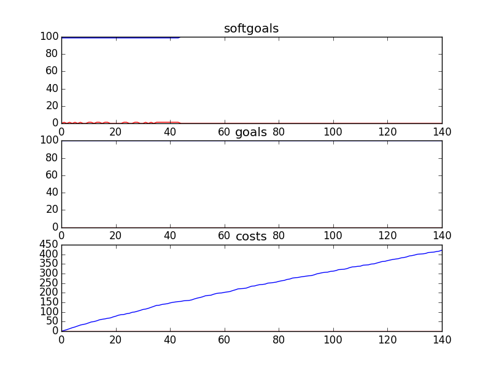

## CSSimplified
```

rank ,         name ,    med   ,   iqr 
----------------------------------------------------
   1 ,      gen0_f1 ,    98.69  ,    0.0 (*--------------|------------- ),98.69, 98.69, 98.69, 98.69, 100.00
   1 ,     gen20_f1 ,    98.69  ,    0.0 (*--------------|------------- ),98.69, 98.69, 98.69, 98.69, 100.00
   1 ,     gen40_f1 ,    98.69  ,    0.0 (*--------------|------------- ),98.69, 98.69, 98.69, 98.69, 100.00
   1 ,     gen60_f1 ,    98.69  ,   1.31 (*--------------|------------- ),98.69, 98.69, 98.69, 98.69, 100.00
   1 ,     gen80_f1 ,    98.69  ,   1.31 (*              |              ),98.69, 98.69, 98.69, 100.00, 100.00
   1 ,    gen100_f1 ,    98.69  ,   1.31 (*              |              ),98.69, 98.69, 98.69, 100.00, 100.00

rank ,         name ,    med   ,   iqr 
----------------------------------------------------
   1 ,      gen0_f2 ,    100.0  ,    0.0 (*              |              ),100.00, 100.00, 100.00, 100.00, 100.00
   1 ,     gen20_f2 ,    100.0  ,    0.0 (*              |              ),100.00, 100.00, 100.00, 100.00, 100.00
   1 ,     gen40_f2 ,    100.0  ,    0.0 (*              |              ),100.00, 100.00, 100.00, 100.00, 100.00
   1 ,     gen60_f2 ,    100.0  ,    0.0 (*              |              ),100.00, 100.00, 100.00, 100.00, 100.00
   1 ,     gen80_f2 ,    100.0  ,    0.0 (*              |              ),100.00, 100.00, 100.00, 100.00, 100.00
   1 ,    gen100_f2 ,    100.0  ,    0.0 (*              |              ),100.00, 100.00, 100.00, 100.00, 100.00

rank ,         name ,    med   ,   iqr 
----------------------------------------------------
   1 ,    gen100_f3 ,    197.0  ,   15.0 (   --   * ---  |              ),184.00, 190.00, 198.00, 204.00, 216.00
   1 ,     gen80_f3 ,    201.0  ,   19.0 (   ---   *  ---|              ),184.00, 194.00, 201.00, 211.00, 220.00
   2 ,     gen60_f3 ,    209.0  ,   22.0 (     ---   *  -|              ),191.00, 200.00, 210.00, 217.00, 225.00
   3 ,     gen40_f3 ,    210.0  ,   24.0 (      ----  *  |--            ),193.00, 204.00, 211.00, 225.00, 231.00
   3 ,     gen20_f3 ,    215.0  ,   26.0 (      ----   * | ----         ),194.00, 206.00, 215.00, 228.00, 241.00
   3 ,      gen0_f3 ,    220.0  ,   31.0 (       ----    *    ----      ),195.00, 210.00, 221.00, 237.00, 249.00
```
### Time Taken : 135.935557127

```

+------+----------------------------------------------------------+----------+-------+------+
| rank |                           name                           |   type   | value | cost |
+------+----------------------------------------------------------+----------+-------+------+
|  1   |      Help Plan and Put on Reconnection Conferences       |   task   |   -1  |  4   |
|  2   |                 Put Content Onto Website                 |   task   |   -1  |  5   |
|  3   |                   Provide Information                    |   task   |   -1  |  3   |
|  4   |                  Web Moderator Meetings                  | resource |   1   |  2   |
|  5   |                        Agreement                         | resource |   -1  |  2   |
|  6   |                  Provide free services                   |   task   |   -1  |  5   |
|  7   |                *Implement Bulletin Board                 |   task   |   -1  |  3   |
|  8   |                Donor/Accounting Data Base                | resource |   1   |  4   |
|  9   |             ! Write Articles for Magazines               |   task   |   -1  |  1   |
|  10  |                         Software                         | resource |   -1  |  3   |
|  11  |            Provide Web Counselling with Video            |   task   |   1   |  1   |
|  12  |                        Promote CS                        |   task   |   1   |  1   |
|  13  |                    Service Resources                     | resource |   -1  |  3   |
|  14  |               Second Reading of Web Posts                |   task   |   -1  |  5   |
|  15  |               !Implement Polls about Kids                |   task   |   -1  |  3   |
|  16  |                   Manage Receivables                     |   task   |   -1  |  5   |
|  17  |            Provide Web Counselling with Audio            |   task   |   1   |  2   |
|  18  |                         Upgrades                         | resource |   -1  |  5   |
|  19  |                    Caller Statistics                     | resource |   -1  |  4   |
|  20  |              Implement Information Section               |   task   |   -1  |  5   |
|  21  |                     Send out Emails                      |   task   |   -1  |  5   |
|  22  |              Put on SA Training Conferences              |   task   |   -1  |  5   |
|  23  |                     Provide receipts                     |   task   |   1   |  1   |
|  24  |                Run Fundraiser in Schools                 |   task   |   -1  |  4   |
|  25  |           Kids Use Bulletin Board with Replies           |   task   |   1   |  5   |
|  26  |                Maintain Phone Counselling                |   task   |   1   |  2   |
|  27  |             Maintain/ Implement PHL Services             |   task   |   1   |  2   |
|  28  |                 Help with Presentations                  |   task   |   -1  |  5   |
|  29  |           Help Put on SA Training Conferences            |   task   |   -1  |  3   |
|  30  |                         Feedback                         | resource |   1   |  2   |
|  31  |               ! Provide money for services               |   task   |   -1  |  3   |
|  32  |               School Initiates Presenation               |   task   |   -1  |  3   |
|  33  |              Kids Use One-On-One Chat Rooms              |   task   |   1   |  1   |
|  34  |             !Implement One-On-One Chat Rooms             |   task   |   -1  |  4   |
|  35  |                  Counselling Workshops                   | resource |   1   |  1   |
|  36  |            Phone Library of Recorded Messages            | resource |   -1  |  3   |
|  37  |              Voice Counselling be Performed              |   task   |   -1  |  3   |
|  38  |              ! Write Articles for Website                |   task   |   1   |  1   |
|  39  |          Single charitable registration number           | resource |   1   |  3   |
|  40  |                  Participate in events                   |   task   |   -1  |  4   |
|  41  |               Provide Written Counselling                |   task   |   -1  |  2   |
|  42  |                   Provide Counselling                    |   task   |   -1  |  1   |
|  43  |               Diffuse Conflict with Parent               |   task   |   -1  |  4   |
|  44  |               Implement Video Counselling                |   task   |   1   |  1   |
|  45  |                 *Maintain Phone Services                 |   task   |   -1  |  3   |
|  46  |        Get Corporate Partner Information from DL         |   task   |   1   |  4   |
|  47  |                      Provide funds                       |   task   |   -1  |  5   |
|  48  |                       Training CDs                       | resource |   1   |  1   |
|  49  |                       IT Resources                       | resource |   1   |  3   |
|  50  |                          Oracle                          | resource |   1   |  2   |
|  51  |              Maintain/Implement CS Services              |   task   |   -1  |  5   |
|  52  |                      Free Software                       | resource |   1   |  1   |
|  53  |                 Philanthropic donations                  |   task   |   -1  |  4   |
|  54  |              *Implement Categorization Tool              |   task   |   -1  |  4   |
|  55  |               Implement Board with Replies               |   task   |   -1  |  5   |
|  56  |           Kids Use Ask a Counsellor Section\ns           |   task   |   -1  |  3   |
|  57  |                   ! Market CS Service                    |   task   |   -1  |  4   |
|  58  |                   Pledge\nDuring event                   |   task   |   -1  |  3   |
|  59  |               Provide fundraising services               |   task   |   1   |  2   |
|  60  |             Negotiate with Counsellors Union             |   task   |   -1  |  4   |
|  61  |                          Tapes                           | resource |   -1  |  5   |
|  62  |                !Perform Email Counselling                |   task   |   -1  |  4   |
|  63  |                  Counsellor Experience                   | resource |   1   |  5   |
|  64  |                     Call Statistics                      | resource |   -1  |  5   |
|  65  |                        Feedback1                         | resource |   -1  |  5   |
|  66  |             *Implement Email for Counsellors             |   task   |   1   |  3   |
|  67  |                  Feedback Form Software                  | resource |   -1  |  2   |
|  68  |               !Moderate Discussion Boards                |   task   |   1   |  4   |
|  69  |          Inform kids about anonymity of service          |   task   |   -1  |  2   |
|  70  |                         Hardware                         | resource |   -1  |  4   |
|  71  |                Kids Use Email Counselling                |   task   |   -1  |  5   |
|  72  |              Parents Use Phone Counselling               |   task   |   1   |  2   |
|  73  |                      Free Hardware                       | resource |   1   |  1   |
|  74  |                  Maintain Web Services                   |   task   |   1   |  2   |
|  75  |                         Speaches                         | resource |   -1  |  1   |
|  76  |                      Free Upgrades                       | resource |   1   |  5   |
|  77  |             Parents Use Information Section              |   task   |   -1  |  4   |
|  78  |                       Sponsor Logo                       | resource |   -1  |  1   |
|  79  |                Kids read Polls about Kids                |   task   |   -1  |  5   |
|  80  |               *Maintain PHL Phone Services               |   task   |   -1  |  1   |
|  81  |             Provide Online Donor Technology              |   task   |   1   |  5   |
|  82  |                   Sponsorship proposal                   |   task   |   1   |  2   |
|  83  |          !Implement Cyber Café/Portal/Chat Room          |   task   |   -1  |  5   |
|  84  |        Maintain Get Informed Section of Web Site         |   task   |   -1  |  4   |
|  85  |                !Implement Phone Feedback                 |   task   |   1   |  5   |
|  86  |                     Free Web Server                      | resource |   -1  |  4   |
|  87  |                       Web Software                       | resource |   -1  |  3   |
|  88  |         Plan and Put on Reconnection Conferences         |   task   |   1   |  2   |
|  89  |       !Parents Use Service to Talk to Each Other         |   task   |   -1  |  4   |
|  90  |                          Funds                           | resource |   1   |  2   |
|  91  |                !Implement Text Messaging                 |   task   |   1   |  3   |
|  92  | !Implement\nTool to Allow Parents to Talk to Each Other  |   task   |   -1  |  4   |
|  93  |              ! Provide compiled call data                |   task   |   -1  |  5   |
|  94  |         !Implement General Questions and Answers         |   task   |   1   |  2   |
|  95  |            Maintain Ask a Counsellor Section             |   task   |   1   |  4   |
|  96  |                Kids Use Video Counselling                |   task   |   1   |  1   |
|  97  |                 Kids Use Text Messaging                  |   task   |   1   |  4   |
|  98  |             Historical Data of Call Volumes              | resource |   -1  |  5   |
|  99  |               Implement Email Counselling                |   task   |   -1  |  5   |
| 100  |                   Counselling Policies                   | resource |   -1  |  5   |
| 101  |                     !Moderate a Chat                     |   task   |   1   |  1   |
| 102  |               Find Help with Presentations               |   task   |   -1  |  5   |
| 103  |              Elaborate Fundraising targets               |   task   |   -1  |  4   |
| 104  |         Parents Use Bulletin Board with Replies          |   task   |   -1  |  4   |
| 105  |       ! Counselor Speak on Kids Issues in General        |   task   |   1   |  4   |
| 106  |               Implement Voice Counselling                |   task   |   1   |  4   |
| 107  |                 Create Counselling Posts                 |   task   |   1   |  2   |
| 108  |                Kids Use Phone Counselling                |   task   |   1   |  5   |
| 109  |                       Web Server1                        | resource |   1   |  3   |
| 110  |         Kids read General Questions and Answers          |   task   |   -1  |  1   |
| 111  |                       Information                        | resource |   -1  |  4   |
| 112  |           Kids Use Cyber Café/Portal/Chat Room           |   task   |   -1  |  3   |
| 113  |                  Give CS Presentations1                  |   task   |   1   |  1   |
| 114  |                  Collect Pledge online                   |   task   |   -1  |  4   |
| 115  |                 Get sponsors for events                  |   task   |   -1  |  4   |
| 116  |                   Promotion Resources1                   | resource |   -1  |  5   |
| 117  |             Provide Document Library System              |   task   |   1   |  2   |
| 118  |                 Create General Ledgers                   |   task   |   1   |  5   |
| 119  |          !Implement Bulletin Board with Replies          |   task   |   -1  |  1   |
| 120  |                   Speak at Fundraisers                   |   task   |   -1  |  3   |
| 121  |                      Sign Contract                       |   task   |   1   |  3   |
| 122  |                   Promotion Resources                    | resource |   1   |  3   |
| 123  |               Write Articles for Newspaper               |   task   |   1   |  3   |
| 124  |                 Get web event technology                 |   task   |   -1  |  2   |
| 125  |                Tape Recording Technology                 | resource |   -1  |  2   |
| 126  |                     Web Site Content                     | resource |   -1  |  5   |
| 127  |        Kids use get Informed Section of Web Site         |   task   |   1   |  2   |
| 128  |                  Speak at Fundraisers1                   |   task   |   1   |  4   |
| 129  |              Use sponsor marketing channels              |   task   |   -1  |  3   |
| 130  |                     Manage Accounts                      |   task   |   -1  |  5   |
| 131  |                    Free advertisement                    | resource |   1   |  2   |
| 132  |                         *Salary                          | resource |   1   |  2   |
| 133  |                   Strategic Blue Print                   | resource |   1   |  2   |
| 134  |                 Undergo Clinical Review                  |   task   |   1   |  2   |
| 135  |                        Web Server                        | resource |   -1  |  1   |
| 136  |                     Double Head Set                      | resource |   -1  |  4   |
| 137  |                Kids Use Voice Counselling                |   task   |   1   |  1   |
| 138  |                  Give CS Presentations                   |   task   |   1   |  1   |
| 139  |              Share PAP in Document Library               |   task   |   1   |  4   |
| 140  |                      Pledge online                       |   task   |   1   |  1   |
| 141  |               Manage\nPartner Relationship               |   task   |   1   |  2   |
+------+----------------------------------------------------------+----------+-------+------+
```
