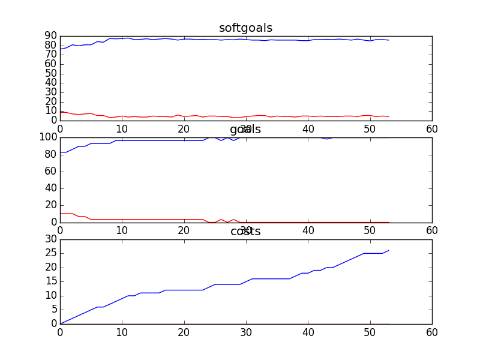

## CSCounselling
```

rank ,         name ,    med   ,   iqr 
----------------------------------------------------
   1 ,      gen0_f1 ,    82.32  ,   6.07 (        ----  *|---           ),76.24, 80.11, 82.32, 84.53, 86.74
   2 ,     gen20_f1 ,    85.08  ,   5.53 (          -----|  *---        ),78.45, 82.87, 85.64, 87.29, 90.06
   3 ,     gen40_f1 ,    86.74  ,   4.98 (             --|   *--        ),81.22, 83.98, 86.74, 87.85, 90.61
   3 ,     gen60_f1 ,    87.29  ,   4.42 (              -|-- * ----     ),82.32, 86.19, 87.29, 88.95, 93.37
   3 ,     gen80_f1 ,    87.85  ,   4.98 (              -|--  * ---     ),82.32, 86.19, 87.85, 90.06, 93.37
   3 ,    gen100_f1 ,     88.4  ,   4.42 (               |--- * ---     ),82.87, 86.74, 88.40, 90.06, 93.37

rank ,         name ,    med   ,   iqr 
----------------------------------------------------
   1 ,      gen0_f2 ,    86.21  ,    6.9 (    --------*  | --------     ),79.31, 86.21, 86.21, 89.66, 96.55
   1 ,     gen20_f2 ,    86.21  ,   6.89 (        ----   | *   ----     ),82.76, 86.21, 89.66, 93.10, 96.55
   2 ,     gen40_f2 ,    89.66  ,   6.89 (        ----   | *   -------- ),82.76, 86.21, 89.66, 93.10, 100.00
   2 ,     gen60_f2 ,    89.66  ,   6.89 (        ----   | *   -------- ),82.76, 86.21, 89.66, 93.10, 100.00
   2 ,     gen80_f2 ,    89.66  ,   6.89 (        -------|-*   -------- ),82.76, 89.66, 89.66, 93.10, 100.00
   2 ,    gen100_f2 ,    89.66  ,  10.34 (        -------|-*   -------- ),82.76, 89.66, 89.66, 93.10, 100.00

rank ,         name ,    med   ,   iqr 
----------------------------------------------------
   1 ,     gen40_f3 ,     25.0  ,    5.0 (        ----  *|   ---        ),22.00, 24.00, 25.00, 28.00, 30.00
   1 ,     gen60_f3 ,     25.0  ,    5.0 (       ---    *| -----        ),21.00, 23.00, 25.00, 27.00, 30.00
   1 ,     gen80_f3 ,     25.0  ,    5.0 (       ---    *| -----        ),21.00, 23.00, 25.00, 27.00, 30.00
   1 ,    gen100_f3 ,     25.0  ,    5.0 (       ---    *| ----         ),21.00, 23.00, 25.00, 27.00, 29.00
   1 ,     gen20_f3 ,     26.0  ,    5.0 (        ----   *   ---        ),22.00, 24.00, 26.00, 28.00, 30.00
   1 ,      gen0_f3 ,     26.0  ,    4.0 (        ------ | * -------    ),22.00, 25.00, 27.00, 28.00, 32.00
```
### Time Taken : 224.045278072

```

+------+----------------------------------------------------+----------+-------+------+
| rank |                        name                        |   type   | value | cost |
+------+----------------------------------------------------+----------+-------+------+
|  1   |        Sign Contract with Counselling Union        |   task   |   1   |  1   |
|  2   |              !Undergo Media Training               |   task   |   1   |  1   |
|  3   |                Counselling Policies                | resource |   1   |  1   |
|  4   |              Debrief with Counsellors              |   task   |   1   |  1   |
|  5   |                  Double Headsets                   | resource |   1   |  1   |
|  6   |               Report Outdated Links1               |   task   |   1   |  1   |
|  7   |     Provide Information to Other Counselloers      |   task   |   -1  |  1   |
|  8   |          Provide Resources in One Source           |   task   |   1   |  1   |
|  9   |                 *Explore Options1                  |   task   |   1   |  1   |
|  10  |           Provide Resources in E-Library           |   task   |   1   |  1   |
|  11  |          Encourage Kids to Talk to Others          |   task   |   1   |  1   |
|  12  |               Counselling Workshops                | resource |   -1  |  1   |
|  13  |             Encourage Kids to Call CS              |   task   |   1   |  1   |
|  14  |   Block Kids who Display Inappropriate Behavoir    |   task   |   -1  |  1   |
|  15  |       Comment on Technology Usability Issues       |   task   |   -1  |  1   |
|  16  |            Provide Resources in Library            |   task   |   -1  |  1   |
|  17  |                       Tapes                        | resource |   1   |  1   |
|  18  |         *Implement Email for Counsellors1          |   task   |   -1  |  1   |
|  19  |                  Assess Situation                  |   task   |   -1  |  1   |
|  20  |                   Request Shifts                   |   task   |   -1  |  1   |
|  21  |           ! Write Articles for Website 1           |   task   |   -1  |  1   |
|  22  |          !Participate in Sponsor Meetings          |   task   |   -1  |  1   |
|  23  |               Learn Web Technologies               |   task   |   -1  |  1   |
|  24  |              Attend Part Time Meeting              |   task   |   1   |  1   |
|  25  |               Web Moderator Meetings               | resource |   1   |  1   |
|  26  |             *Implement Bulletin Board1             |   task   |   -1  |  1   |
|  27  | Include Legal Information in Counselling Resources |   task   |   -1  |  1   |
|  28  |                 Assess Situation1                  |   task   |   -1  |  1   |
|  29  |        Receive Call Classification Training        |   task   |   -1  |  1   |
|  30  |           !Participate in Board Meetings           |   task   |   1   |  1   |
|  31  |                  *Explore Options                  |   task   |   1   |  1   |
|  32  |              Speak Publicly about Job              |   task   |   -1  |  1   |
|  33  |              Speak at SA Conferences               |   task   |   -1  |  1   |
|  34  |                  Listen for Cues                   |   task   |   -1  |  1   |
|  35  |      Perform Conference Call with Third Party      |   task   |   -1  |  1   |
|  36  |               Participate in events1               |   task   |   -1  |  1   |
|  37  |                   Record Stories                   |   task   |   -1  |  1   |
|  38  |            Perform Crisis Intervention             |   task   |   1   |  1   |
|  39  |                   Report Abuses                    |   task   |   1   |  1   |
|  40  |          *Receive Training from Managment          |   task   |   -1  |  1   |
|  41  |            Remove Identifying Material             |   task   |   1   |  1   |
|  42  |     Listen to Calls of Experienced Counsellors     |   task   |   -1  |  1   |
|  43  |   ! Counselor Speak on Kids Issues in General 1    |   task   |   1   |  1   |
|  44  |          ! Write Articles for Magazines 1          |   task   |   -1  |  1   |
|  45  |           *Implement Categorization Tool           |   task   |   1   |  1   |
|  46  |           Provide Information in Binders           |   task   |   1   |  1   |
|  47  |                    Training CDs                    | resource |   1   |  1   |
|  48  |              *Edit Counselling Posts               |   task   |   1   |  1   |
|  49  | Include Drug Information in Counselling Resources  |   task   |   1   |  1   |
|  50  |  *Encourage Kids to Talk to Different Counsellors  |   task   |   -1  |  1   |
|  51  |             Tape Recording Technology              | resource |   -1  |  1   |
|  52  |                Refer Parents to PHL                |   task   |   -1  |  1   |
|  53  |            Diffuse Conflict with Parent            |   task   |   1   |  1   |
|  54  |                      Feedback                      | resource |   -1  |  1   |
+------+----------------------------------------------------+----------+-------+------+
```
