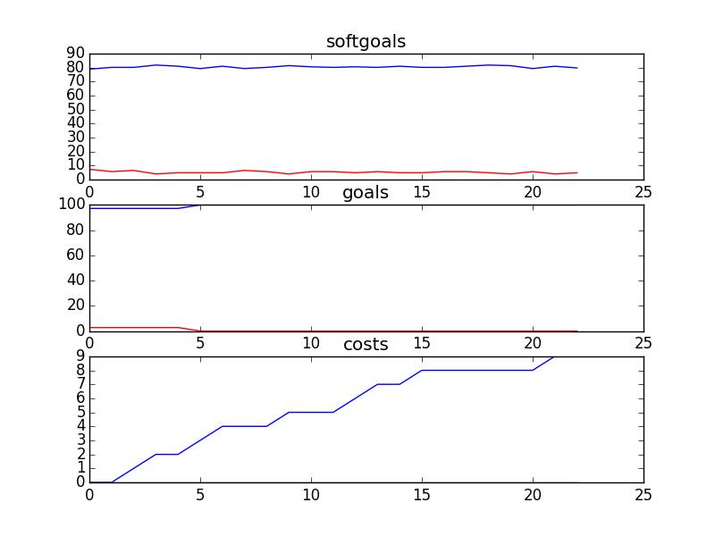

## CSCounsellingManagement
```

rank ,         name ,    med   ,   iqr 
----------------------------------------------------
   1 ,      gen0_f1 ,    81.82  ,   7.43 (  -------    * | ------       ),75.21, 79.34, 81.82, 84.30, 87.60
   2 ,     gen20_f1 ,    85.95  ,   4.13 (              -|    *  --     ),82.64, 83.47, 85.95, 87.60, 89.26
   2 ,     gen40_f1 ,     87.6  ,   3.31 (               | ---   *-     ),84.30, 85.95, 87.60, 88.43, 89.26
   3 ,     gen60_f1 ,     87.6  ,   3.31 (               |   --   *     ),85.12, 86.78, 88.43, 88.43, 89.26
   3 ,     gen80_f1 ,    88.43  ,   2.48 (               |    --- *     ),85.95, 87.60, 88.43, 89.26, 89.26
   3 ,    gen100_f1 ,    88.43  ,   1.66 (               |    --- *--   ),85.95, 87.60, 88.43, 89.26, 90.08

rank ,         name ,    med   ,   iqr 
----------------------------------------------------
   1 ,      gen0_f2 ,    97.22  ,   2.78 (               |   *--------- ),94.44, 94.44, 97.22, 97.22, 100.00
   1 ,     gen20_f2 ,    97.22  ,   5.56 (         ------|---*          ),94.44, 97.22, 97.22, 100.00, 100.00
   1 ,     gen40_f2 ,    97.22  ,   5.56 (         ------|---*          ),94.44, 97.22, 97.22, 100.00, 100.00
   1 ,     gen60_f2 ,    97.22  ,   2.78 (         ------|---*          ),94.44, 97.22, 97.22, 100.00, 100.00
   1 ,     gen80_f2 ,    97.22  ,   2.78 (         ------|---*          ),94.44, 97.22, 97.22, 100.00, 100.00
   1 ,    gen100_f2 ,    97.22  ,   2.78 (         ------|---*          ),94.44, 97.22, 97.22, 100.00, 100.00

rank ,         name ,    med   ,   iqr 
----------------------------------------------------
   1 ,     gen80_f3 ,      9.0  ,    2.0 (     ---  *  --|---           ), 7.00,  8.00,  9.00, 10.00, 12.00
   1 ,    gen100_f3 ,      9.0  ,    3.0 (     ---  *  --|---           ), 7.00,  8.00,  9.00, 10.00, 12.00
   1 ,     gen60_f3 ,      9.0  ,    3.0 (     -----   * |-----         ), 7.00,  9.00, 10.00, 11.00, 13.00
   1 ,     gen20_f3 ,     10.0  ,    2.0 (     -----   * |-----         ), 7.00,  9.00, 10.00, 11.00, 13.00
   1 ,     gen40_f3 ,     10.0  ,    2.0 (     -----   * |-----         ), 7.00,  9.00, 10.00, 11.00, 13.00
   2 ,      gen0_f3 ,     11.0  ,    2.0 (        -----  |*  -----      ), 8.00, 10.00, 11.00, 12.00, 14.00
```
### Time Taken : 60.7756540775

```

+------+-----------------------------------------------------+----------+-------+------+
| rank |                         name                        |   type   | value | cost |
+------+-----------------------------------------------------+----------+-------+------+
|  1   |           Negotiate with Counsellors Union          |   task   |   -1  |  1   |
|  2   |      Provide One-on-One Support to Counsellors      |   task   |   1   |  1   |
|  3   |      Communicate CS Information to Counsellors      |   task   |   1   |  1   |
|  4   |           Historical Data of Call Volumes           | resource |   -1  |  1   |
|  5   |             Put On Counselling Workshops            |   task   |   1   |  1   |
|  6   |                   Double Head Set                   | resource |   1   |  1   |
|  7   |                   Use Blue Pumpkin                  |   task   |   -1  |  1   |
|  8   |                     Review Tape                     |   task   |   -1  |  1   |
|  9   |               Set Counselling Policies              |   task   |   1   |  1   |
|  10  |      Put on Orientation Process for Cousellors      |   task   |   -1  |  1   |
|  11  |                   Call Statistics                   | resource |   -1  |  1   |
|  12  |                Counselling Resources                | resource |   1   |  1   |
|  13  |              Attend Part Time Meetings              |   task   |   1   |  1   |
|  14  |        Create Call Classification Catagories        |   task   |   -1  |  1   |
|  15  |                 Counsellors Be Paid                 |   task   |   1   |  1   |
|  16  |              !Hire Counselling Managers             |   task   |   -1  |  1   |
|  17  |                    Debrief Calls                    |   task   |   -1  |  1   |
|  18  | Write Yearly Peformance Evaluations for Counsellors |   task   |   -1  |  1   |
|  19  |                    Request Shifts                   |   task   |   -1  |  1   |
|  20  |         Acquire Web Training from Operations        |   task   |   -1  |  1   |
|  21  |            Put on Web Moderator Meetings            |   task   |   1   |  1   |
|  22  |                  !Hire Counsellors                  |   task   |   -1  |  1   |
|  23  |                  Debrief Web Posts                  |   task   |   -1  |  1   |
+------+-----------------------------------------------------+----------+-------+------+
```
