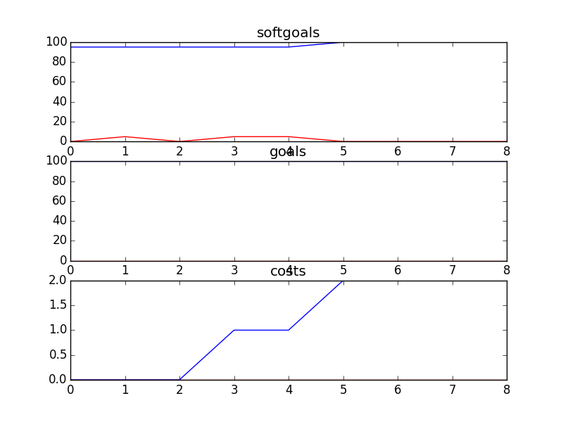

## CSCounsellingManagementSD
```

rank ,         name ,    med   ,   iqr 
----------------------------------------------------
   1 ,      gen0_f1 ,    95.12  ,    0.0 (*--------------|------------- ),95.12, 95.12, 95.12, 95.12, 100.00
   1 ,     gen20_f1 ,    95.12  ,   4.88 (*              |              ),95.12, 95.12, 95.12, 100.00, 100.00
   1 ,     gen40_f1 ,    95.12  ,   4.88 (*              |              ),95.12, 95.12, 95.12, 100.00, 100.00
   1 ,     gen60_f1 ,    95.12  ,   4.88 (*              |              ),95.12, 95.12, 95.12, 100.00, 100.00
   1 ,     gen80_f1 ,    95.12  ,   4.88 (*              |              ),95.12, 95.12, 95.12, 100.00, 100.00
   1 ,    gen100_f1 ,    95.12  ,   4.88 (*              |              ),95.12, 95.12, 95.12, 100.00, 100.00

rank ,         name ,    med   ,   iqr 
----------------------------------------------------
   1 ,      gen0_f2 ,    100.0  ,    0.0 (*              |              ),100.00, 100.00, 100.00, 100.00, 100.00
   1 ,     gen20_f2 ,    100.0  ,    0.0 (*              |              ),100.00, 100.00, 100.00, 100.00, 100.00
   1 ,     gen40_f2 ,    100.0  ,    0.0 (*              |              ),100.00, 100.00, 100.00, 100.00, 100.00
   1 ,     gen60_f2 ,    100.0  ,    0.0 (*              |              ),100.00, 100.00, 100.00, 100.00, 100.00
   1 ,     gen80_f2 ,    100.0  ,    0.0 (*              |              ),100.00, 100.00, 100.00, 100.00, 100.00
   1 ,    gen100_f2 ,    100.0  ,    0.0 (*              |              ),100.00, 100.00, 100.00, 100.00, 100.00

rank ,         name ,    med   ,   iqr 
----------------------------------------------------
   1 ,     gen40_f3 ,      2.0  ,    1.0 (   ---*  ----  |              ), 1.00,  2.00,  2.00,  3.00,  4.00
   1 ,     gen60_f3 ,      2.0  ,    1.0 (   ---*  ----  |              ), 1.00,  2.00,  2.00,  3.00,  4.00
   1 ,     gen80_f3 ,      2.0  ,    1.0 (   ---*  ----  |              ), 1.00,  2.00,  2.00,  3.00,  4.00
   1 ,    gen100_f3 ,      2.0  ,    1.0 (   ---*  ----  |              ), 1.00,  2.00,  2.00,  3.00,  4.00
   1 ,     gen20_f3 ,      3.0  ,    1.0 (   ---   *---  |              ), 1.00,  2.00,  3.00,  3.00,  4.00
   2 ,      gen0_f3 ,      5.0  ,    3.0 (      ---      |*  ----       ), 2.00,  3.00,  5.00,  6.00,  7.00
```
### Time Taken : 4.67114400864

```

+------+----------------------------------+----------+-------+------+
| rank |               name               |   type   | value | cost |
+------+----------------------------------+----------+-------+------+
|  1   |         Double Head Set          | resource |   -1  |  1   |
|  2   |       Counselling Policies       | resource |   -1  |  1   |
|  3   |   Second Reading of Web Posts    |   task   |   1   |  1   |
|  4   |      Counselling Resources       | resource |   -1  |  1   |
|  5   | Negotiate with Counsellors Union |   task   |   1   |  1   |
|  6   | Historical Data of Call Volumes  | resource |   -1  |  1   |
|  7   |     Analyze Call Statistics      |   task   |   -1  |  1   |
|  8   |      Web Moderator Meetings      | resource |   -1  |  1   |
|  9   |         Call Statistics          | resource |   -1  |  1   |
+------+----------------------------------+----------+-------+------+
```
