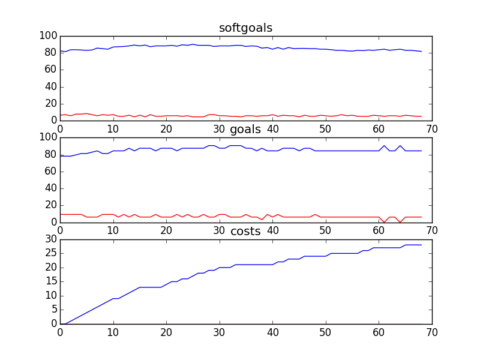

## CSFDandMarketing
```

rank ,         name ,    med   ,   iqr 
----------------------------------------------------
   1 ,      gen0_f1 ,    84.42  ,   6.49 (       ----    *  ----        ),77.92, 81.82, 85.06, 87.66, 90.91
   1 ,     gen20_f1 ,    86.36  ,   6.49 (           ----|  *   ----    ),81.17, 85.06, 87.01, 90.26, 93.51
   2 ,     gen40_f1 ,    87.01  ,   7.79 (           ----|  *   ----    ),81.82, 85.06, 87.66, 90.91, 93.51
   2 ,     gen60_f1 ,    89.61  ,    6.5 (               |-    *  --    ),84.42, 86.36, 89.61, 92.21, 93.51
   3 ,     gen80_f1 ,    90.91  ,    5.2 (               |---   * ---   ),85.06, 88.31, 90.91, 92.21, 94.81
   3 ,    gen100_f1 ,    90.91  ,   5.85 (               |----  *  --   ),85.06, 88.96, 90.91, 92.86, 94.81

rank ,         name ,    med   ,   iqr 
----------------------------------------------------
   1 ,      gen0_f2 ,    81.25  ,   6.25 (      ----   * |---           ),75.00, 78.13, 81.25, 84.38, 87.50
   2 ,     gen20_f2 ,    84.38  ,   6.25 (      -------  |*  ----       ),75.00, 81.25, 84.38, 87.50, 90.63
   2 ,     gen40_f2 ,    84.38  ,   6.25 (      -------  |*  -------    ),75.00, 81.25, 84.38, 87.50, 93.75
   2 ,     gen60_f2 ,    84.38  ,   6.25 (      -------  |   *------    ),75.00, 81.25, 87.50, 87.50, 93.75
   2 ,     gen80_f2 ,     87.5  ,   6.25 (          ---  |   *------    ),78.13, 81.25, 87.50, 87.50, 93.75
   2 ,    gen100_f2 ,     87.5  ,   9.38 (          ---  |   *   ---    ),78.13, 81.25, 87.50, 90.63, 93.75

rank ,         name ,    med   ,   iqr 
----------------------------------------------------
   1 ,     gen20_f3 ,     33.0  ,    5.0 (           ----| *  -----     ),29.00, 32.00, 33.00, 35.00, 38.00
   1 ,     gen40_f3 ,     33.0  ,    4.0 (           ----| *  -----     ),29.00, 32.00, 33.00, 35.00, 38.00
   1 ,     gen60_f3 ,     33.0  ,    4.0 (           ----| *  -----     ),29.00, 32.00, 33.00, 35.00, 38.00
   1 ,     gen80_f3 ,     33.0  ,    6.0 (           --- | *  ---       ),29.00, 31.00, 33.00, 35.00, 37.00
   1 ,    gen100_f3 ,     33.0  ,    6.0 (           --- | *  ---       ),29.00, 31.00, 33.00, 35.00, 37.00
   1 ,      gen0_f3 ,     34.0  ,    4.0 (            ---|- *   ----    ),30.00, 33.00, 34.00, 36.00, 39.00
```
### Time Taken : 238.134423018

```

+------+--------------------------------------------------------------------------+----------+-------+------+
| rank |                                   name                                   |   type   | value | cost |
+------+--------------------------------------------------------------------------+----------+-------+------+
|  1   |                      Elaborate Fundraising targets1                      |   task   |   -1  |  1   |
|  2   |                    Market [Only For Serious Issues]                      |   task   |   1   |  1   |
|  3   |                          Participate in events                           |   task   |   1   |  1   |
|  4   |                              Pledge\nonline                              |   task   |   1   |  1   |
|  5   |                          Provide free services                           |   task   |   1   |  1   |
|  6   |      Email Corporate Partners Interesting and Relevant News Pieces       |   task   |   1   |  1   |
|  7   |                         Create branded products                          |   task   |   1   |  1   |
|  8   |                            Provide Logo to CS                            |   task   |   1   |  1   |
|  9   |                Get Corporate Partner Information from DL1                |   task   |   1   |  1   |
|  10  |                   !Train counselors on public speaking                   |   task   |   1   |  1   |
|  11  |                            Free advertisement                            | resource |   -1  |  1   |
|  12  |                              Provide funds                               |   task   |   1   |  1   |
|  13  |                             Reach agreement                              |   task   |   1   |  1   |
|  14  |                          Conflicts Be Managed                            |   task   |   1   |  1   |
|  15  |                  Store donor information into database                   |   task   |   1   |  1   |
|  16  |                           Manage Receivables                             |   task   |   -1  |  1   |
|  17  |                          Reallocate resources1                           |   task   |   -1  |  1   |
|  18  |                        Collect donor information                         |   task   |   -1  |  1   |
|  19  |                        Get web event technology1                         |   task   |   -1  |  1   |
|  20  |                      ! Write Articles for Website 1                      |   task   |   1   |  1   |
|  21  |                           Pledge\nDuring event                           |   task   |   1   |  1   |
|  22  |   Put on Orientation Process for Fund Development and Marketing Staff    |   task   |   -1  |  1   |
|  23  |      Sponsors Include CS Logos and Descriptions on their Products        |   task   |   1   |  1   |
|  24  |            Create posters, flyers and informational material             |   task   |   -1  |  1   |
|  25  |                            Get donor database                            |   task   |   1   |  1   |
|  26  |                         Create General Ledgers                           |   task   |   1   |  1   |
|  27  |                        Run Fundraiser in Schools                         |   task   |   -1  |  1   |
|  28  |                          Provide free services1                          |   task   |   1   |  1   |
|  29  |                         Send recognition letters                         |   task   |   -1  |  1   |
|  30  |                          Use volunteer services                          |   task   |   1   |  1   |
|  31  |                       Get philanthropic donations                        |   task   |   -1  |  1   |
|  32  |                      ! Provide compiled call data                        |   task   |   -1  |  1   |
|  33  |                       Inform Sponsors of Progress                        |   task   |   1   |  1   |
|  34  |                       Give philanthropic donation                        |   task   |   -1  |  1   |
|  35  |          Bring Regional Fundraising Staff Together Once a Year           |   task   |   -1  |  1   |
|  36  |                     Provide Document Library System                      |   task   |   -1  |  1   |
|  37  |                       Exclusive Brand and Logo use                       | resource |   -1  |  1   |
|  38  |                       ! Provide money for services                       |   task   |   -1  |  1   |
|  39  |                           Speak at Fundraisers                           |   task   |   -1  |  1   |
|  40  |                          Give CS Presentations                           |   task   |   -1  |  1   |
|  41  |                      Share PAP in Document Library                       |   task   |   1   |  1   |
|  42  |              Put Together Proposals for Corporate Sponsors               |   task   |   -1  |  1   |
|  43  |           Provide Promotional Material to Student Ambassadors            |   task   |   1   |  1   |
|  44  |                        Donor/Accounting Database                         | resource |   -1  |  1   |
|  45  |                     Provide Real Time Tax Receipts                       |   task   |   -1  |  1   |
|  46  |                    Put on orientation for volunteers                     |   task   |   1   |  1   |
|  47  |                Pay Fund Development and Marketing Staff                  |   task   |   -1  |  1   |
|  48  |                  Single charitable registration number1                  | resource |   -1  |  1   |
|  49  |                  Communicate through Internet and phone                  |   task   |   -1  |  1   |
|  50  |                          Create Thank you ads                            |   task   |   -1  |  1   |
|  51  | Pitch to National Corporate Sponsors the Sponsorship of Regional Events  |   task   |   1   |  1   |
|  52  |                      Provide philanthropic donation                      |   task   |   -1  |  1   |
|  53  |                       National Marketing Strategy                        | resource |   -1  |  1   |
|  54  |                       Bi-Weekly Conference Calls                         |   task   |   -1  |  1   |
|  55  |                      Place Sponsor Logos in Events                       |   task   |   -1  |  1   |
|  56  |                  Store donor transactions into database                  |   task   |   -1  |  1   |
|  57  |                Work with the Regions to Implement Events                 |   task   |   1   |  1   |
|  58  |                     Provide Online Donor Technology                      |   task   |   -1  |  1   |
|  59  |                      Share PAP in Document Library1                      |   task   |   1   |  1   |
|  60  |                     Implement Stay in Touch program                      |   task   |   -1  |  1   |
|  61  |                              Track budgets                               |   task   |   -1  |  1   |
|  62  |                             Manage Accounts                              |   task   |   -1  |  1   |
|  63  |                     ! Write Articles for Magazines 1                     |   task   |   -1  |  1   |
|  64  |                           Reallocate resources                           |   task   |   -1  |  1   |
|  65  |                       Market through own channels                        |   task   |   1   |  1   |
|  66  |                    Organize discussions with Sponsors                    |   task   |   -1  |  1   |
|  67  |              ! Counselor Speak on Kids Issues in General 1               |   task   |   -1  |  1   |
|  68  |                Write Down Corporate Sponsors Objectives                  |   task   |   -1  |  1   |
|  69  |                     Develop national event calendar                      |   task   |   -1  |  1   |
+------+--------------------------------------------------------------------------+----------+-------+------+
```
