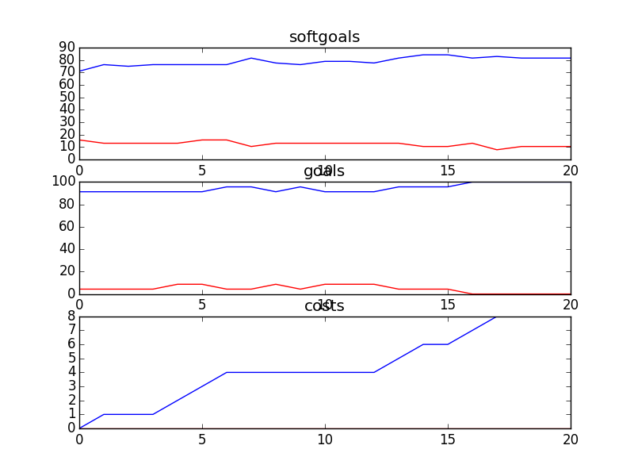

## CSITDepartment
```

rank ,         name ,    med   ,   iqr 
----------------------------------------------------
   1 ,      gen0_f1 ,    78.95  ,  10.53 (      ----  *  | ------       ),71.05, 76.32, 78.95, 84.21, 92.11
   2 ,     gen20_f1 ,    89.47  ,    7.9 (          -----|---  * ----   ),76.32, 86.84, 89.47, 92.11, 97.37
   3 ,     gen40_f1 ,    92.11  ,   5.27 (              -|-----  * --   ),81.58, 89.47, 92.11, 94.74, 97.37
   3 ,     gen60_f1 ,    92.11  ,   5.27 (               |   --  * --   ),86.84, 89.47, 92.11, 94.74, 97.37
   3 ,     gen80_f1 ,    92.11  ,   2.63 (               |   ----* --   ),86.84, 92.11, 92.11, 94.74, 97.37
   3 ,    gen100_f1 ,    92.11  ,   2.63 (               |   ----  *-   ),86.84, 92.11, 94.74, 94.74, 97.37

rank ,         name ,    med   ,   iqr 
----------------------------------------------------
   1 ,      gen0_f2 ,     91.3  ,   8.69 (            ---|-*            ),86.96, 91.30, 91.30, 95.65, 95.65
   2 ,     gen20_f2 ,    95.65  ,   4.35 (            ---|-      *----- ),86.96, 91.30, 95.65, 95.65, 100.00
   2 ,     gen40_f2 ,    95.65  ,    0.0 (               | ------*----- ),91.30, 95.65, 95.65, 95.65, 100.00
   2 ,     gen60_f2 ,    95.65  ,   4.35 (               | ------*      ),91.30, 95.65, 95.65, 100.00, 100.00
   2 ,     gen80_f2 ,    95.65  ,   4.35 (               | ------*      ),91.30, 95.65, 95.65, 100.00, 100.00
   2 ,    gen100_f2 ,    95.65  ,   4.35 (               | ------*      ),91.30, 95.65, 95.65, 100.00, 100.00

rank ,         name ,    med   ,   iqr 
----------------------------------------------------
   1 ,     gen80_f3 ,      8.0  ,    3.0 (     ---     * |-----         ), 6.00,  7.00,  9.00, 10.00, 12.00
   1 ,    gen100_f3 ,      8.0  ,    2.0 (     ---     *-|---           ), 6.00,  7.00,  9.00,  9.00, 11.00
   2 ,     gen20_f3 ,      9.0  ,    3.0 (     -----   * |   --         ), 6.00,  8.00,  9.00, 11.00, 12.00
   2 ,     gen40_f3 ,      9.0  ,    3.0 (     -----   * |-----         ), 6.00,  8.00,  9.00, 10.00, 12.00
   2 ,     gen60_f3 ,      9.0  ,    3.0 (     ---     * |-----         ), 6.00,  7.00,  9.00, 10.00, 12.00
   3 ,      gen0_f3 ,      9.0  ,    4.0 (        -----  |*    ------   ), 7.00,  9.00, 10.00, 12.00, 14.00
```
### Time Taken : 25.737046957

```

+------+-------------------------------------------------+----------+-------+------+
| rank |                       name                      |   type   | value | cost |
+------+-------------------------------------------------+----------+-------+------+
|  1   |                      Use T1                     |   task   |   1   |  1   |
|  2   |         Provide Online Donor Technology1        |   task   |   -1  |  1   |
|  3   |                   Network PCs                   |   task   |   -1  |  1   |
|  4   |                  Free Hardware                  | resource |   1   |  1   |
|  5   |      Use Informal Buddy System for Training     |   task   |   1   |  1   |
|  6   |                 Free Web Server                 | resource |   1   |  1   |
|  7   |                  Free Upgrades                  | resource |   -1  |  1   |
|  8   |         *Implement Email for Counsellors        |   task   |   -1  |  1   |
|  9   |            !Implement Phone Feedback1           |   task   |   -1  |  1   |
|  10  |                   Web Server1                   | resource |   -1  |  1   |
|  11  |                     Hardware                    | resource |   -1  |  1   |
|  12  |            Put Content Onto Website1            |   task   |   -1  |  1   |
|  13  |                  Free Software                  | resource |   1   |  1   |
|  14  | Provide Technology to Create and Send Documents |   task   |   1   |  1   |
|  15  |                Use Current Method               |   task   |   -1  |  1   |
|  16  |                     Upgrades                    | resource |   1   |  1   |
|  17  |                     Software                    | resource |   1   |  1   |
|  18  |                     Use VPN                     |   task   |   -1  |  1   |
|  19  |  Perform Donor/Accounting Data Base Maintenance |   task   |   -1  |  1   |
|  20  |                   IT Resources                  | resource |   -1  |  1   |
|  21  |                      Oracle                     | resource |   -1  |  1   |
+------+-------------------------------------------------+----------+-------+------+
```
