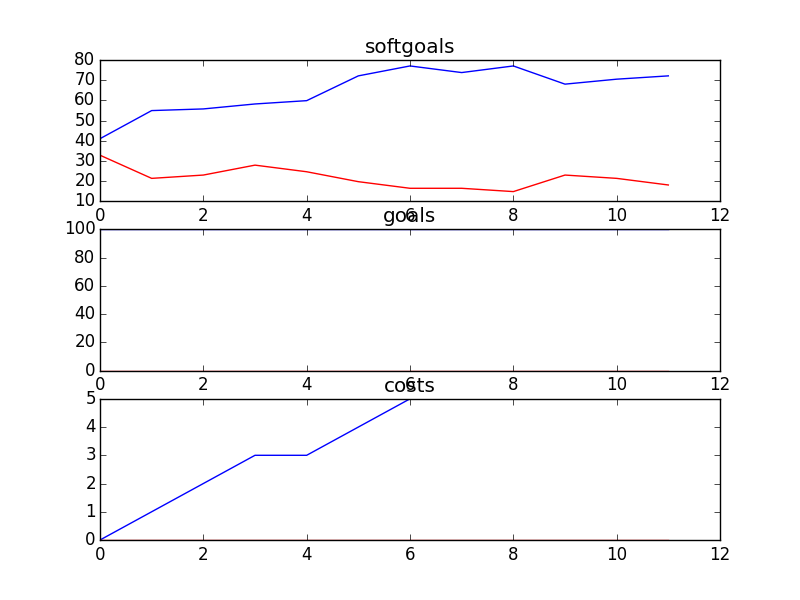

## CSSAProgram
```

rank ,         name ,    med   ,   iqr 
----------------------------------------------------
   1 ,      gen0_f1 ,    47.54  ,  22.95 (    ---- *     |---------     ),36.07, 44.26, 47.54, 63.93, 83.61
   2 ,     gen20_f1 ,    77.05  ,  18.04 (           ----|---   *  ---  ),52.46, 70.49, 77.05, 85.25, 91.80
   2 ,     gen40_f1 ,    80.33  ,   16.4 (               |----    * --- ),63.93, 72.13, 81.97, 86.89, 95.08
   3 ,     gen60_f1 ,    81.97  ,  18.03 (               |----    *  -- ),63.93, 73.77, 81.97, 90.16, 95.08
   3 ,     gen80_f1 ,    81.97  ,  16.39 (               | ------  * -- ),65.57, 78.69, 83.61, 90.16, 95.08
   3 ,    gen100_f1 ,    83.61  ,  14.75 (               |  -----  * -- ),68.85, 78.69, 85.25, 90.16, 95.08

rank ,         name ,    med   ,   iqr 
----------------------------------------------------
   1 ,      gen0_f2 ,    100.0  ,    0.0 (*              |              ),100.00, 100.00, 100.00, 100.00, 100.00
   1 ,     gen20_f2 ,    100.0  ,    0.0 (*              |              ),100.00, 100.00, 100.00, 100.00, 100.00
   1 ,     gen40_f2 ,    100.0  ,    0.0 (*              |              ),100.00, 100.00, 100.00, 100.00, 100.00
   1 ,     gen60_f2 ,    100.0  ,    0.0 (*              |              ),100.00, 100.00, 100.00, 100.00, 100.00
   1 ,     gen80_f2 ,    100.0  ,    0.0 (*              |              ),100.00, 100.00, 100.00, 100.00, 100.00
   1 ,    gen100_f2 ,    100.0  ,    0.0 (*              |              ),100.00, 100.00, 100.00, 100.00, 100.00

rank ,         name ,    med   ,   iqr 
----------------------------------------------------
   1 ,     gen80_f3 ,      4.0  ,    2.0 (     ---*    --|              ), 3.00,  4.00,  4.00,  6.00,  7.00
   1 ,    gen100_f3 ,      4.0  ,    2.0 (     ---* -----|              ), 3.00,  4.00,  4.00,  5.00,  7.00
   1 ,     gen20_f3 ,      5.0  ,    2.0 (     ---  *  --|              ), 3.00,  4.00,  5.00,  6.00,  7.00
   1 ,     gen40_f3 ,      5.0  ,    2.0 (     ---  *  --|              ), 3.00,  4.00,  5.00,  6.00,  7.00
   1 ,     gen60_f3 ,      5.0  ,    2.0 (     ---  *  --|              ), 3.00,  4.00,  5.00,  6.00,  7.00
   2 ,      gen0_f3 ,      6.0  ,    3.0 (        --   *-|-----         ), 4.00,  5.00,  6.00,  6.00,  9.00
```
### Time Taken : 25.5219151974

```

+------+-------------------------------+----------+-------+------+
| rank |              name             |   type   | value | cost |
+------+-------------------------------+----------+-------+------+
|  1   |          Retrain SA s         |   task   |   1   |  1   |
|  2   |  Write Articles for Newspaper |   task   |   1   |  1   |
|  3   |        Send out Emails        |   task   |   1   |  1   |
|  4   | School Initiates Presenation1 |   task   |   -1  |  1   |
|  5   |           Train SA s          |   task   |   1   |  1   |
|  6   |   Run Fundraiser in Schools1  |   task   |   1   |  1   |
|  7   |       Plan Social Events      |   task   |   -1  |  1   |
|  8   |       Attend SA Meetings      |   task   |   -1  |  1   |
|  9   |       Attend CS Meetings      |   task   |   -1  |  1   |
|  10  |      Promotion Resources1     | resource |   -1  |  1   |
|  11  |        Provide Speaches       |   task   |   -1  |  1   |
|  12  |    Help with Presentations    |   task   |   1   |  1   |
+------+-------------------------------+----------+-------+------+
```
