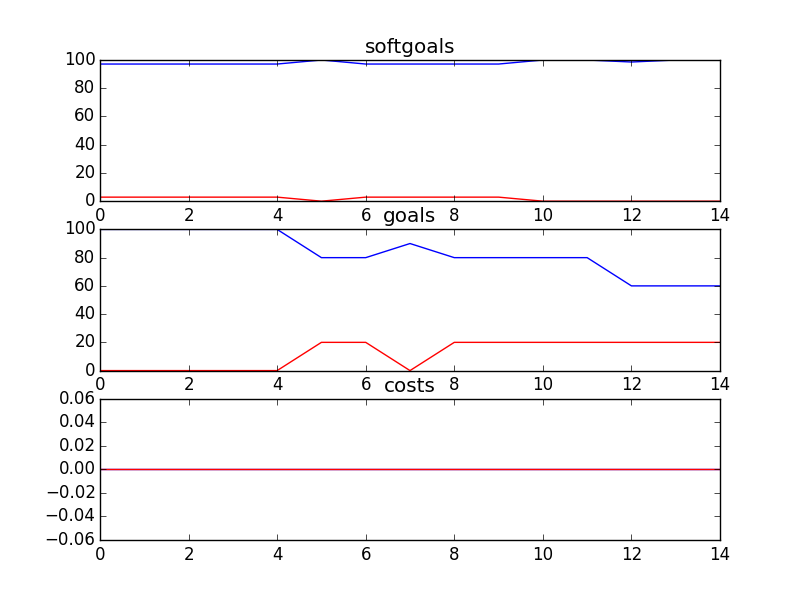

## Kids and Youth
```

rank ,         name ,    med   ,   iqr 
----------------------------------------------------
   1 ,      gen0_f1 ,    100.0  ,   2.86 (               |             *),97.14, 97.14, 100.00, 100.00, 100.00
   1 ,     gen20_f1 ,    100.0  ,    0.0 (               |             *),100.00, 100.00, 100.00, 100.00, 100.00
   1 ,     gen40_f1 ,    100.0  ,    0.0 (               |             *),100.00, 100.00, 100.00, 100.00, 100.00
   1 ,     gen60_f1 ,    100.0  ,    0.0 (               |             *),100.00, 100.00, 100.00, 100.00, 100.00
   1 ,     gen80_f1 ,    100.0  ,    0.0 (               |             *),100.00, 100.00, 100.00, 100.00, 100.00
   1 ,    gen100_f1 ,    100.0  ,    0.0 (               |             *),100.00, 100.00, 100.00, 100.00, 100.00

rank ,         name ,    med   ,   iqr 
----------------------------------------------------
   1 ,      gen0_f2 ,    100.0  ,    0.0 (---------------|-------------*),80.00, 100.00, 100.00, 100.00, 100.00
   1 ,     gen20_f2 ,    100.0  ,    0.0 (               |             *),100.00, 100.00, 100.00, 100.00, 100.00
   1 ,     gen40_f2 ,    100.0  ,    0.0 (               |             *),100.00, 100.00, 100.00, 100.00, 100.00
   1 ,     gen60_f2 ,    100.0  ,    0.0 (               |             *),100.00, 100.00, 100.00, 100.00, 100.00
   1 ,     gen80_f2 ,    100.0  ,    0.0 (               |             *),100.00, 100.00, 100.00, 100.00, 100.00
   1 ,    gen100_f2 ,    100.0  ,    0.0 (               |             *),100.00, 100.00, 100.00, 100.00, 100.00

rank ,         name ,    med   ,   iqr 
----------------------------------------------------
   1 ,     gen40_f3 ,      3.0  ,    1.0 (  ---*         |              ), 2.00,  3.00,  3.00,  4.00,  4.00
   1 ,     gen60_f3 ,      3.0  ,    1.0 (     *         |              ), 2.00,  2.00,  3.00,  3.00,  3.00
   1 ,     gen80_f3 ,      3.0  ,    1.0 (     *         |              ), 2.00,  2.00,  3.00,  3.00,  3.00
   1 ,    gen100_f3 ,      3.0  ,    1.0 (     *         |              ), 2.00,  2.00,  3.00,  3.00,  3.00
   2 ,     gen20_f3 ,      5.0  ,    2.0 (     ---   *  -|-             ), 3.00,  4.00,  5.00,  6.00,  7.00
   3 ,      gen0_f3 ,      7.0  ,    3.0 (           --- | *     ---    ), 5.00,  6.00,  7.00,  9.00, 10.00
```
### Time Taken : 9.43991589546

```

+------+-------------------------------------------+------+-------+------+
| rank |                    name                   | type | value | cost |
+------+-------------------------------------------+------+-------+------+
|  1   |        Implement Video Counselling        | task |   -1  |  1   |
|  2   |      !Implement One-On-One Chat Rooms     | task |   -1  |  1   |
|  3   | Maintain Get Informed Section of Web Site | task |   -1  |  1   |
|  4   |     Maintain Ask a Counsellor Section     | task |   -1  |  1   |
|  5   |         !Implement Text Messaging         | task |   -1  |  1   |
|  6   |   !Implement Bulletin Board with Replies  | task |   -1  |  1   |
|  7   |           Contact CS in Crisis            | task |   -1  |  1   |
|  8   |         Maintain Phone Counselling        | task |   -1  |  1   |
|  9   |        Implement Voice Counselling        | task |   -1  |  1   |
|  10  |              Provide Feedback             | task |   -1  |  1   |
|  11  |   !Implement Cyber Café/Portal/Chat Room  | task |   -1  |  1   |
|  12  |        Implement Email Counselling        | task |   -1  |  1   |
|  13  |        !Implement Polls about Kids        | task |   -1  |  1   |
|  14  |   Contact CS about Non-Crisis Situation   | task |   -1  |  1   |
|  15  |  !Implement General Questions and Answers | task |   -1  |  1   |
+------+-------------------------------------------+------+-------+------+
```
