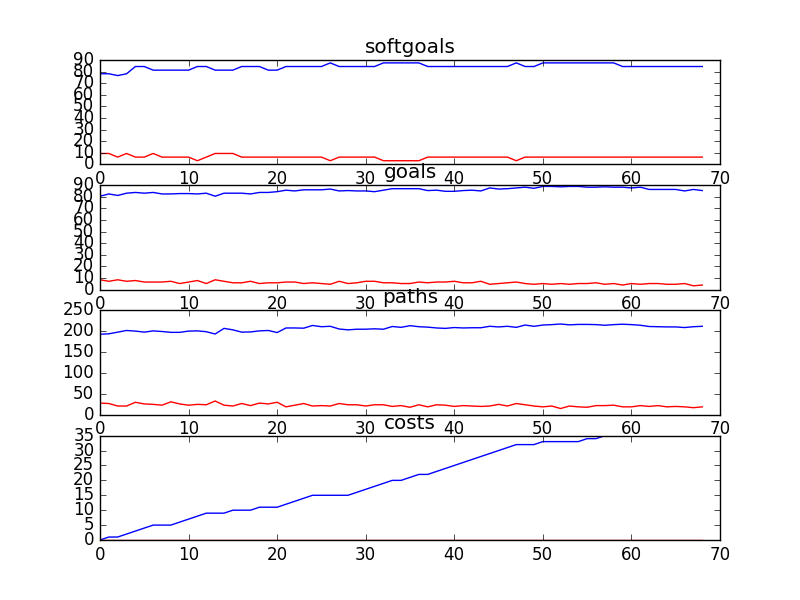

## CSFDandMarketing
```

rank ,         name ,    med   ,   iqr 
----------------------------------------------------
   1 ,      gen0_f1 ,    83.33  ,   5.91 (       -----   |*  -----      ),77.42, 81.18, 83.87, 86.02, 89.78
   1 ,      gen1_f1 ,    83.33  ,   5.91 (       -----   |*  -----      ),77.42, 81.18, 83.87, 86.02, 89.78
   1 ,      gen2_f1 ,    83.33  ,   5.91 (       -----   | * -----      ),77.42, 81.18, 84.95, 86.02, 89.78
   1 ,      gen3_f1 ,    83.33  ,   5.91 (       -----   | * -----      ),77.42, 81.18, 84.95, 86.02, 89.78
   1 ,      gen4_f1 ,    83.33  ,   5.91 (       -----   | * -----      ),77.42, 81.18, 84.95, 86.02, 89.78
   1 ,      gen5_f1 ,    83.33  ,   5.91 (       ------  | * -----      ),77.42, 81.72, 84.95, 86.02, 89.78
   1 ,      gen6_f1 ,    83.33  ,   6.45 (       ------  | * -----      ),77.42, 81.72, 84.95, 86.56, 89.78
   1 ,      gen7_f1 ,    83.33  ,   6.45 (       ------  | *  ----      ),77.42, 81.72, 84.95, 87.10, 89.78
   1 ,      gen8_f1 ,    83.33  ,   6.45 (       ------  | *  ----      ),77.42, 81.72, 84.95, 87.10, 89.78
   1 ,      gen9_f1 ,    83.33  ,   6.45 (       ------  | *  ----      ),77.42, 81.72, 84.95, 87.10, 89.78
   1 ,     gen10_f1 ,    83.33  ,   6.45 (       ------  | *  ----      ),77.42, 81.72, 84.95, 87.10, 89.78

rank ,         name ,    med   ,   iqr 
----------------------------------------------------
   1 ,      gen8_f2 ,    206.0  ,   29.0 (       ------  |*  -----      ),179.00, 196.00, 207.00, 217.00, 232.00
   1 ,      gen9_f2 ,    206.0  ,   29.0 (       ------  |*  -----      ),179.00, 196.00, 207.00, 217.00, 232.00
   1 ,     gen10_f2 ,    206.0  ,   29.0 (       ------  |*  ----       ),179.00, 196.00, 207.00, 217.00, 229.00
   1 ,      gen5_f2 ,    207.0  ,   30.0 (       ------  |*  -----      ),179.00, 196.00, 207.00, 217.00, 232.00
   1 ,      gen6_f2 ,    207.0  ,   30.0 (       ------  |*  -----      ),179.00, 196.00, 207.00, 217.00, 232.00
   1 ,      gen7_f2 ,    207.0  ,   30.0 (       ------  |*  -----      ),179.00, 196.00, 207.00, 217.00, 232.00
   1 ,      gen0_f2 ,    207.0  ,   30.0 (       ------  | *  ----      ),179.00, 196.00, 209.00, 218.00, 232.00
   1 ,      gen1_f2 ,    207.0  ,   30.0 (       ------  | *  ----      ),179.00, 196.00, 209.00, 218.00, 232.00
   1 ,      gen2_f2 ,    207.0  ,   30.0 (       ------  | * -----      ),179.00, 196.00, 209.00, 217.00, 232.00
   1 ,      gen3_f2 ,    207.0  ,   30.0 (       ------  | * -----      ),179.00, 196.00, 209.00, 217.00, 232.00
   1 ,      gen4_f2 ,    207.0  ,   30.0 (       ------  | * -----      ),179.00, 196.00, 209.00, 217.00, 232.00

rank ,         name ,    med   ,   iqr 
----------------------------------------------------
   1 ,      gen0_f3 ,     34.0  ,    4.0 (            ---|- *   ----    ),30.00, 33.00, 34.00, 36.00, 39.00
   1 ,      gen1_f3 ,     34.0  ,    4.0 (            ---|- *   ----    ),30.00, 33.00, 34.00, 36.00, 39.00
   1 ,      gen2_f3 ,     34.0  ,    4.0 (            ---|  *   ----    ),30.00, 32.00, 34.00, 36.00, 39.00
   1 ,      gen3_f3 ,     34.0  ,    4.0 (            ---|  *   ----    ),30.00, 32.00, 34.00, 36.00, 39.00
   1 ,      gen4_f3 ,     34.0  ,    4.0 (            ---|  *   ----    ),30.00, 32.00, 34.00, 36.00, 39.00
   1 ,      gen5_f3 ,     34.0  ,    5.0 (            ---|  *   ----    ),30.00, 32.00, 34.00, 36.00, 39.00
   1 ,      gen6_f3 ,     34.0  ,    5.0 (            ---|  *   ----    ),30.00, 32.00, 34.00, 36.00, 39.00
   1 ,      gen7_f3 ,     34.0  ,    5.0 (            ---|  *   ----    ),30.00, 32.00, 34.00, 36.00, 39.00
   1 ,      gen8_f3 ,     34.0  ,    5.0 (            ---|  *   ----    ),30.00, 32.00, 34.00, 36.00, 39.00
   1 ,      gen9_f3 ,     34.0  ,    5.0 (            ---|  *   ----    ),30.00, 32.00, 34.00, 36.00, 39.00
   1 ,     gen10_f3 ,     34.0  ,    5.0 (            ---|  *   ----    ),30.00, 32.00, 34.00, 36.00, 39.00
```

### Time Taken : 176.692273855


### Decisions Ranked
```
+------+--------------------------------------------------------------------------+----------+-------+------+
| rank |                                   name                                   |   type   | value | cost |
+------+--------------------------------------------------------------------------+----------+-------+------+
|  1   |                    Put on orientation for volunteers                     |   task   |   1   |  1   |
|  2   |                      Provide philanthropic donation                      |   task   |   -1  |  1   |
|  3   |                             Reach agreement                              |   task   |   1   |  1   |
|  4   |                      Share PAP in Document Library1                      |   task   |   1   |  1   |
|  5   |                     ! Write Articles for Magazines 1                     |   task   |   1   |  1   |
|  6   |                       Market through own channels                        |   task   |   1   |  1   |
|  7   |                   !Train counselors on public speaking                   |   task   |   -1  |  1   |
|  8   |                      Elaborate Fundraising targets1                      |   task   |   -1  |  1   |
|  9   |                  Store donor information into database                   |   task   |   1   |  1   |
|  10  |                        Get web event technology1                         |   task   |   1   |  1   |
|  11  |                         Create General Ledgers                           |   task   |   1   |  1   |
|  12  |                          Use volunteer services                          |   task   |   1   |  1   |
|  13  |                        Collect donor information                         |   task   |   -1  |  1   |
|  14  |                        Donor/Accounting Database                         | resource |   -1  |  1   |
|  15  |           Provide Promotional Material to Student Ambassadors            |   task   |   1   |  1   |
|  16  |                          Reallocate resources1                           |   task   |   -1  |  1   |
|  17  |                      ! Write Articles for Website 1                      |   task   |   -1  |  1   |
|  18  |                    Market [Only For Serious Issues]                      |   task   |   1   |  1   |
|  19  |                     Provide Real Time Tax Receipts                       |   task   |   -1  |  1   |
|  20  |                      Place Sponsor Logos in Events                       |   task   |   -1  |  1   |
|  21  |                          Participate in events                           |   task   |   1   |  1   |
|  22  |                Work with the Regions to Implement Events                 |   task   |   1   |  1   |
|  23  |                      Share PAP in Document Library                       |   task   |   1   |  1   |
|  24  |                              Pledge\nonline                              |   task   |   1   |  1   |
|  25  |                          Provide free services1                          |   task   |   -1  |  1   |
|  26  |                     Implement Stay in Touch program                      |   task   |   -1  |  1   |
|  27  |          Bring Regional Fundraising Staff Together Once a Year           |   task   |   -1  |  1   |
|  28  |      Email Corporate Partners Interesting and Relevant News Pieces       |   task   |   -1  |  1   |
|  29  |                           Pledge\nDuring event                           |   task   |   1   |  1   |
|  30  |                       ! Provide money for services                       |   task   |   1   |  1   |
|  31  |            Create posters, flyers and informational material             |   task   |   1   |  1   |
|  32  |      Sponsors Include CS Logos and Descriptions on their Products        |   task   |   1   |  1   |
|  33  |                       Exclusive Brand and Logo use                       | resource |   1   |  1   |
|  34  |                            Free advertisement                            | resource |   -1  |  1   |
|  35  |                       National Marketing Strategy                        | resource |   1   |  1   |
|  36  |              Put Together Proposals for Corporate Sponsors               |   task   |   1   |  1   |
|  37  |                           Speak at Fundraisers                           |   task   |   -1  |  1   |
|  38  |                       Give philanthropic donation                        |   task   |   1   |  1   |
|  39  |                       Get philanthropic donations                        |   task   |   1   |  1   |
|  40  |                         Create branded products                          |   task   |   1   |  1   |
|  41  |                           Reallocate resources                           |   task   |   1   |  1   |
|  42  |                            Get donor database                            |   task   |   1   |  1   |
|  43  |                            Provide Logo to CS                            |   task   |   1   |  1   |
|  44  |                Pay Fund Development and Marketing Staff                  |   task   |   1   |  1   |
|  45  |                          Conflicts Be Managed                            |   task   |   1   |  1   |
|  46  | Pitch to National Corporate Sponsors the Sponsorship of Regional Events  |   task   |   1   |  1   |
|  47  |                       Bi-Weekly Conference Calls                         |   task   |   1   |  1   |
|  48  |                           Manage Receivables                             |   task   |   -1  |  1   |
|  49  |                        Run Fundraiser in Schools                         |   task   |   -1  |  1   |
|  50  |                       Inform Sponsors of Progress                        |   task   |   1   |  1   |
|  51  |                  Communicate through Internet and phone                  |   task   |   -1  |  1   |
|  52  |                              Provide funds                               |   task   |   -1  |  1   |
|  53  |                     Provide Document Library System                      |   task   |   -1  |  1   |
|  54  |                         Send recognition letters                         |   task   |   -1  |  1   |
|  55  |                             Manage Accounts                              |   task   |   1   |  1   |
|  56  |                      ! Provide compiled call data                        |   task   |   -1  |  1   |
|  57  |                          Provide free services                           |   task   |   1   |  1   |
|  58  |                              Track budgets                               |   task   |   -1  |  1   |
|  59  |                  Single charitable registration number1                  | resource |   -1  |  1   |
|  60  |   Put on Orientation Process for Fund Development and Marketing Staff    |   task   |   -1  |  1   |
|  61  |                Get Corporate Partner Information from DL1                |   task   |   -1  |  1   |
|  62  |              ! Counselor Speak on Kids Issues in General 1               |   task   |   -1  |  1   |
|  63  |                     Provide Online Donor Technology                      |   task   |   -1  |  1   |
|  64  |                          Give CS Presentations                           |   task   |   -1  |  1   |
|  65  |                Write Down Corporate Sponsors Objectives                  |   task   |   -1  |  1   |
|  66  |                     Develop national event calendar                      |   task   |   -1  |  1   |
|  67  |                    Organize discussions with Sponsors                    |   task   |   -1  |  1   |
|  68  |                          Create Thank you ads                            |   task   |   -1  |  1   |
|  69  |                  Store donor transactions into database                  |   task   |   -1  |  1   |
+------+--------------------------------------------------------------------------+----------+-------+------+
```

### Top 28 Decisions from above table.
```
+--------------------------------------------------------------------------+----------+-------+
|                                   name                                   |   type   | value |
+--------------------------------------------------------------------------+----------+-------+
|                        Sponsorship Be Beneficial                         | softgoal |  0.5  |
|                        Market fundraising events2                        | softgoal |  0.5  |
|                     Provide Online Donor Technology                      |   task   |   -1  |
|                   Counselors attend fundraising events                   |   goal   |   1   |
|                             Manage\nprojects                             |   task   |   1   |
|                         Acquire\n [CS Stories]                           | softgoal |   1   |
|               Up to Date [Corporate Partner Information]                 | softgoal |   -1  |
|                       Regional Staff feel included                       | softgoal |  0.5  |
|          Bring Regional Fundraising Staff Together Once a Year           |   task   |   -1  |
|                      Proactive [Media relationship]                      | softgoal |  0.5  |
|                               CS\nServices                               | softgoal |   1   |
|                    High Response [Individual Donors]                     | softgoal |  0.5  |
|                         Record donor information                         |   task   |   1   |
|                       Accountability of services1                        | softgoal |   1   |
|           Provide Promotional Material to Student Ambassadors            |   task   |   1   |
|                            Contribute online                             |   task   |  0.5  |
|                            Happiness [Staff]                             | softgoal |  -0.5 |
|                                CS Stories                                | softgoal |   1   |
|                        Contribute [to a  Cause]                          |   goal   |  0.5  |
|               Exclusive Relationships [Official Partners]                | softgoal |  0.5  |
|                          Conflicts Be Managed                            |   task   |   -1  |
|                           Receipt be provided                            |   goal   |   -1  |
|                        Reach More Kids [Sponsors]                        | softgoal |  0.5  |
|                             *Manage projects                             |   task   |   1   |
|                          Use volunteer services                          |   task   |   1   |
|                           Pledges be collected                           |   goal   |   1   |
|                           Sponsorship proposal                           |   task   |  0.5  |
|                    Follow Highest Ethical Guidelines                     | softgoal |   1   |
|                 Reduce Internal Communication Confusion                  | softgoal |  -0.5 |
|                        Project deadlines be met1                         |   goal   |   1   |
|                      ! Provide compiled call data                        |   task   |   1   |
|                Pay Fund Development and Marketing Staff                  |   task   |   -1  |
|                Get Corporate Partner Information from DL                 |   task   |   -1  |
|                           Manage Receivables                             |   task   |   -1  |
|                          Create Thank you ads                            |   task   |   1   |
|                             Reach agreement                              |   task   |   1   |
|                        Get web event technology1                         |   task   |   1   |
|                       ! Provide money for services                       |   task   |   -1  |
|            Commitment [To CS Cause from Sponsors Employees]              | softgoal |  0.5  |
|                Present proposal convincingly to sponsors                 | softgoal |  0.5  |
|                            Successful events                             | softgoal |  0.5  |
|            Create posters, flyers and informational material             |   task   |   -1  |
|                           *Good media exposure                           | softgoal |  0.5  |
|               Quick [Response to questions and concerns]                 | softgoal |   1   |
|                        Positive Internal Opinion                         | softgoal |   1   |
|                     Provide Document Library System                      |   task   |   -1  |
|                         Credibility [CS Brand]                           | softgoal |   1   |
|                      Elaborate Fundraising targets                       |   task   |   -1  |
|                       *Engage employees in events1                       | softgoal |  0.5  |
|                       Sponsors for events be found                       |   goal   |   1   |
|                        Sponsor partner\ncontacts2                        | softgoal |   1   |
|                 ! Marketing from government be acquired                  |   goal   |   1   |
|                        Become a Official Partner                         |   task   |  0.5  |
|                          Presentation Skills 1                           | softgoal |   1   |
|                         Create branded products                          |   task   |   1   |
|                        Run Fundraiser in Schools                         |   task   |   -1  |
|                               Recognition                                | softgoal |  0.5  |
|                   Sponsors marketing channels be used                    |   goal   |   1   |
|                         Credibility [CS Brand] 2                         | softgoal |   1   |
|                        Sponsor partner\ncontacts                         | softgoal |   1   |
|                           Reallocate resources                           |   task   |   -1  |
|                    Create Life Long Volunteer Spirit1                    | softgoal |   1   |
|                     !Acquire public speaking skills                      | softgoal |   -1  |
|             Company Relationship be retained  after Mergers              |   goal   |   1   |
|                           Increase [Awareness]                           | softgoal |  0.5  |
|              Not for Profit Partners Be Involved in Events               |   goal   |   1   |
|          *Engagement Student Ambassadors in promoting awareness          | softgoal |   1   |
|                    Responsible Usage [Sponsor Funds]                     | softgoal |   1   |
|                            Happiness [Staff]3                            | softgoal |  -0.5 |
|                         SA Give CS Presentations                         |   task   |   1   |
|                   High Response [Individual Donors] 1                    | softgoal |  0.5  |
|                      Elaborate Fundraising targets1                      |   task   |   -1  |
|                           Staff Be Supported                             |   goal   |   1   |
|                          Give CS Presentations                           |   task   |   1   |
|                           Speak at Fundraisers                           |   task   |   -1  |
|                      Avoid Over-Marketing Services                       | softgoal |   1   |
|         Get Corporate Partner Information from Document Library1         |   task   |   1   |
|                Engagement [Sponsors in the Cause of CS]                  | softgoal |  0.5  |
|                          Positive [Reputation]                           | softgoal |   1   |
|                  Single charitable registration number                   | resource |   -1  |
|                         National Event Calendar                          | softgoal |   -1  |
|                       Inform Sponsors of Progress                        |   task   |   -1  |
|                            Get donor database                            |   task   |   1   |
|              *Single charitable registration number be used              |   goal   |   -1  |
|                            Free advertisement                            | resource |   1   |
|                             Use sponsor logo                             |   task   |   -1  |
|                     Implement Stay in Touch program                      |   task   |   -1  |
|             Involvement [Not For Profit Partners in Events]              | softgoal |   1   |
|           Engagement of Sponsor Employees in Fund Development            | softgoal |  0.5  |
|                         Credibility [CS Brand] 1                         | softgoal |   1   |
|                          Reallocate resources1                           |   task   |   -1  |
|              Exclusive Relationships [Official Partners] 1               | softgoal |   1   |
|                           Contribution be made                           |   goal   |  0.5  |
|                      Quick [Response to Sponsors] 1                      | softgoal |   1   |
|                    Appear as Good Corporate Citizens                     | softgoal |  0.5  |
|                        Engage Employees in events                        | softgoal |  0.5  |
|                         *Good project management                         | softgoal |   1   |
|   Put on Orientation Process for Fund Development and Marketing Staff    |   task   |   1   |
|                                Cobranding                                | softgoal |   1   |
|                    Organize discussions with Sponsors                    |   task   |   -1  |
|             Provide PAP to Staff\nUsing the Document Library             |   task   |   1   |
|                        Match fundraising targets                         | softgoal |  0.5  |
|                             Funds Be Raised                              |   goal   |   1   |
|                       National Marketing Strategy                        | resource |   1   |
|                             Market CS Brand                              | softgoal |  0.5  |
|                           Long Term [Funding]                            | softgoal |  0.5  |
|                               Free services                              | resource |   -1  |
|                          Improve Image to Kids                           | softgoal |  0.5  |
|                      Acquire [Government funding]                        | softgoal |   -1  |
|                        Market fundraising events1                        | softgoal |  0.5  |
|                  Engage Employees in Fundraising events                  | softgoal |  0.5  |
|                          Get PAP Information  1                          |   task   |   1   |
|                      Meet Corporate Sponsors Needs                       | softgoal |  0.5  |
|                     Trust [of Sponsors towards CS] 2                     | softgoal |  0.5  |
|                       Make contribution to charity                       |   goal   |   1   |
|                      Contribute [to a Good Cause]                        | softgoal |  0.5  |
|                           Increase Volunteers1                           | softgoal |   1   |
|                        Collect donor information                         |   task   |   -1  |
|                         Get sponsorship proposal                         |   task   |  0.5  |
|                      ! Write Articles for Website 1                      |   task   |   -1  |
|          Agreement [Staff Over Corporate Partner Expectations]           | softgoal |  -0.5 |
|                         Project deadlines be met                         |   goal   |   1   |
|                          Provide free services                           |   task   |   1   |
|                        Match Fundraising targets                         | softgoal |  0.5  |
|         Engagement [Sponsor Employees in Promoting Awareness] 1          | softgoal |   1   |
|                Work with the Regions to Implement Events                 |   task   |   1   |
|                        Project Management Skills                         | softgoal |   1   |
|                        Positive Internal Opinion1                        | softgoal |   1   |
|                           Retain [Sponsors] 1                            | softgoal |  0.5  |
|                  Up to Date [Information on programs] 1                  | softgoal |   -1  |
|                         Get sponsors for events                          |   task   |   1   |
|              Increased Involvement [Counselors in Events]                | softgoal |  0.5  |
|                      Unite volunteers and sponsors                       | softgoal |  0.5  |
|                        *Good project management                          | softgoal |   1   |
|                        Put on Fundraising Events                         |   task   |   1   |
|                        Donor/Accounting Database                         | resource |   -1  |
|                           Presentation Skills                            | softgoal |   1   |
|                           ! Market CS Service                            |   task   |   1   |
|                           Quality [Services] 1                           | softgoal |   1   |
|                Involve Not for Profit Partners in Events                 |   goal   |   1   |
|              Increased Involvement [Counselors in Events] 1              | softgoal |  0.5  |
|                    *Corporate sponsors feel included                     | softgoal |  -0.5 |
|                    Recognize\nSponsor contribution 1                     | softgoal |  0.5  |
|                            Happiness [Staff]1                            | softgoal |  -0.5 |
|                      Quick [Response to Sponsors]                        | softgoal |   1   |
|                            Provide Logo to CS                            |   task   |   -1  |
|             Increase Connection [Counselors and Community]               | softgoal |  0.5  |
|                             Timely services                              | softgoal |   1   |
|                      Share PAP in Document Library                       |   task   |   1   |
|                          Long Term [Funding] 1                           | softgoal |  0.5  |
|                Get Corporate Partner Information from DL1                |   task   |   -1  |
|                           Retain [Sponsors] 2                            | softgoal |   1   |
|                    Experienced [Marketing Partners]                      | softgoal |   1   |
|      Sponsors Include CS Logos and Descriptions on their Products        |   task   |   1   |
|                      Regional Staff feel included1                       | softgoal |  0.5  |
|                       Bi-Weekly Conference Calls                         |   task   |   1   |
|                     Recognize\nSponsor contribution                      | softgoal |  0.5  |
|              ! Marketing be made using dedicated counselor               |   goal   |   1   |
|                       Give philanthropic donation                        |   task   |   1   |
|                       Exclusive Brand and Logo use                       | resource |   1   |
|                           Quality [Services]                             | softgoal |   1   |
|                   Responsible Usage [Sponsor Funds] 2                    | softgoal |   1   |
|                       Collect  pledge during event                       |   task   |   1   |
|                      Get [Corporate Sponsor Funds]                       |   task   |   -1  |
|                                Manage PAP                                |   task   |   1   |
|             Involvement [Not For Profit Partners in Events]1             | softgoal |   1   |
|                           *Events be marketed                            |   goal   |  0.5  |
|                         Create General Ledgers                           |   task   |   1   |
|      Increase Access Speed [  Regional Offices to Document Library]      | softgoal |   1   |
|                      Develop external comunications                      |   task   |   1   |
|                    Increased availability to sponsors                    | softgoal |   1   |
|                        Accountability of services                        | softgoal |   1   |
|                   High Response [Individual Donors] 2                    | softgoal |  0.5  |
|                    Be informed of fundraising events                     |   goal   |  0.5  |
|                         SA Speak at Fundraisers                          |   task   |   -1  |
|                            Happiness [Staff]2                            | softgoal |  -0.5 |
|         Get Corporate Partner Information from Document Library          |   task   |   1   |
|                         Increase [Free Services]                         | softgoal |  0.5  |
|                            Trust [of Donor]                              | softgoal |  0.5  |
|                      Positive Image [To Employees]                       | softgoal |  0.5  |
|                    Recognize\nSponsor contribution 2                     | softgoal |  0.5  |
|         Engagement [Sponsor Employees in Promoting Awareness] 2          | softgoal |   1   |
|   Include Corporate Partners [In the Development of Press Releases]      | softgoal |   1   |
|                          Provide free services1                          |   task   |   -1  |
|                      Place Sponsor Logos in Events                       |   task   |   -1  |
|                   Follow Highest Ethical Guidelines 1                    | softgoal |   1   |
|                          Get PAP Information                             |   task   |   1   |
|                   Answers be provided to media queries                   |   goal   |   1   |
|                      Contribute [to a Good Cause] 1                      | softgoal |  0.5  |
|                     Trust [of Sponsors towards CS] 1                     | softgoal |  0.5  |
|                              Pledge\nonline                              |   task   |   1   |
|                    Increase [Philanthropic Donations]                    | softgoal |  0.5  |
|              Increased Interaction [Counselors with Media]               | softgoal |  0.5  |
|                      Share PAP in Document Library1                      |   task   |   1   |
|                  Store donor transactions into database                  |   task   |   1   |
|                        Sponsor partner\ncontacts1                        | softgoal |   1   |
|                          Provincial government                           | softgoal |   1   |
|                   Responsible Usage [Sponsor Funds] 1                    | softgoal |   1   |
|                            Minimize expenses                             | softgoal |  0.5  |
|                              Track budgets                               |   task   |   -1  |
|                       Accountability of services2                        | softgoal |   1   |
|                            Market PHL Brand                              | softgoal |  0.5  |
|                          Improve Image to Kids1                          | softgoal |  0.5  |
|              Counselors who want a public voice be trained               |   goal   |   -1  |
|                          Increase [Awareness]1                           | softgoal |  0.5  |
|      Email Corporate Partners Interesting and Relevant News Pieces       |   task   |   -1  |
|                         Send recognition letters                         |   task   |   1   |
|                       Manage\nPartner Relationship                       |   task   |   1   |
|                  Up to Date [Information on programs]                    | softgoal |   -1  |
|                          Increase\n[Awareness]                           | softgoal |   1   |
|                           [Increase] Awareness                           | softgoal |   1   |
|                   Information be shared with sponsors                    |   goal   |   -1  |
|                      Regional Staff feel included2                       | softgoal |  0.5  |
|          Increase Involvement [Sponsors in Putting on Events]            | softgoal |   1   |
|              Exclusive Relationships [Official Partners] 2               | softgoal |   1   |
|                  Single charitable registration number1                  | resource |   -1  |
|                Maintain 20% costs against revenues ratio                 |   goal   |   1   |
|                          Acquire free services                           | softgoal |  0.5  |
|                        Market fundraising events                         | softgoal |  0.5  |
|                    Timely provision of free services1                    | softgoal |   1   |
| Pitch to National Corporate Sponsors the Sponsorship of Regional Events  |   task   |   -1  |
|                      Provide philanthropic donation                      |   task   |   -1  |
|                      *Successful marketing campaign                      | softgoal |  0.5  |
|           Engagement of Sponsor Employees in Fund Development1           | softgoal |  0.5  |
|                           Pledge\nDuring event                           |   task   |   1   |
|                    * Corporate sponsor feel included                     | softgoal |  0.5  |
|                  Grant exclusive use of brand and logo                   |   task   |   1   |
|           Corporate Partner fundraising expectations be known            |   goal   |   1   |
|              Put Together Proposals for Corporate Sponsors               |   task   |   1   |
|                      Manage\nPartner Relationship1                       |   task   |   1   |
|                 Subscribe to Document Library Folders 2                  |   task   |   -1  |
|                   Follow Highest Ethical Guidelines 2                    | softgoal |   1   |
|                       *Engage employees in events                        | softgoal |   1   |
|              ! Counselor Speak on Kids Issues in General 1               |   task   |   1   |
|                     Provide Real Time Tax Receipts                       |   task   |   -1  |
|                             Provide receipts                             |   task   |   -1  |
|                         Demonstrable Services 1                          | softgoal |   1   |
|          Increased Availability [Counselors to Public/Sponsors]          | softgoal |  0.5  |
|    Availability for Administration and Accounting Purposes Across CS     | softgoal |  0.5  |
|                           Published CS Stories                           | softgoal |   1   |
|                           Attract [Sponsors]1                            | softgoal |  0.5  |
|                            Attract [Sponsors]                            | softgoal |  0.5  |
|                           Increase Volunteers                            | softgoal |  0.5  |
|                 Up to date corporate partner information                 | softgoal |   1   |
|          Engagement [Sponsor Employees in Promoting Awareness]           | softgoal |   1   |
|                    Put on orientation for volunteers                     |   task   |   1   |
|                Write Down Corporate Sponsors Objectives                  |   task   |   1   |
|                    Timely provision of free services                     | softgoal |   1   |
|                 Engage Employees in Promoting Awareness                  | softgoal |   1   |
|            Corporate Partner Marketing Expectations be known             |   goal   |   1   |
|                               Sponsor Logo                               | resource |   -1  |
|                     Develop national event calendar                      |   task   |   -1  |
|                          Demonstrable Services                           | softgoal |   1   |
|       *Periodical Communication with regional staff be maintained        |   goal   |   1   |
|                              Provide funds1                              |   task   |   -1  |
|                        Attract event participants                        | softgoal |  0.5  |
|                             Hear CS stories                              | softgoal |   1   |
|                             Manage Accounts                              |   task   |   -1  |
|               ! Counselor Speak on Kids Issues in General                |   task   |   1   |
|                    Create Life Long Volunteer Spirit                     | softgoal |   1   |
|                  Communicate through Internet and phone                  |   task   |   1   |
|                    Sponsor Relationships Be Managed                      |   goal   |   1   |
|                              Provide funds                               |   task   |   -1  |
|               Front End for Income Recording be supported                |   goal   |   1   |
|                        Minimize [Cost of Events]                         | softgoal |  0.5  |
|                          Pledge\nDuring event1                           |   task   |   1   |
|            Corporate Partner Expectations be shared with staff           |   goal   |   1   |
|                     Trust [of Sponsors towards CS]                       | softgoal |  0.5  |
|              ! Services be provided for Kids Bullying Line               |   goal   |   1   |
|                    Market [Only For Serious Issues]                      |   task   |   1   |
|                            Retain [Sponsors]                             | softgoal |  0.5  |
|                     Experienced [marketing partners]                     | softgoal |   1   |
|                   !Train counselors on public speaking                   |   task   |   -1  |
|                         Demonstrable Services 2                          | softgoal |   1   |
|                     ! Write Articles for Magazines 1                     |   task   |   1   |
|                  Store donor information into database                   |   task   |   1   |
|         *Engagement Student Ambassadors in promoting awareness1          | softgoal |   1   |
|                            Quality [Services]                            | softgoal |   1   |
|                          Get free advertisement                          |   task   |   1   |
|                       Positive [Reputation of CS]                        | softgoal |   1   |
|                       Market through own channels                        |   task   |   1   |
|             Up to Date [ Information on Corporate Sponsors]              | softgoal |  0.5  |
|                  Positive Association\n[by Consumers]                    | softgoal |  0.5  |
|                   Attract                 [Sponsors]                     | softgoal |  0.5  |
|                       Get philanthropic donations                        |   task   |   1   |
|                            Use free services                             |   task   |   -1  |
|                       Positive [Reputation of CS]                        | softgoal |  0.5  |
|                              Inspired staff                              | softgoal |  0.5  |
|                      Donor Information be recorded                       |   goal   |   1   |
|                   Increased [Corporate sponsor funds]                    | softgoal |  -0.5 |
|                     Avoid Over-Marketing Services 1                      | softgoal |   1   |
|                          Participate in events                           |   task   |   1   |
+--------------------------------------------------------------------------+----------+-------+
```
