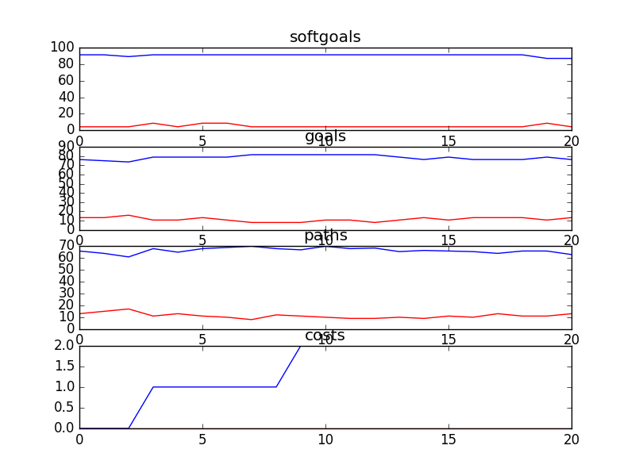

## CSITDepartment
```

rank ,         name ,    med   ,   iqr 
----------------------------------------------------
   1 ,      gen0_f1 ,    85.25  ,   8.19 (      -------- | *  --        ),73.77, 81.97, 85.25, 88.52, 90.16
   2 ,     gen40_f1 ,    90.16  ,   4.92 (               |----  *  ---  ),83.61, 88.52, 90.16, 93.44, 96.72
   2 ,     gen20_f1 ,    90.16  ,   4.92 (               | ---   * -    ),85.25, 88.52, 91.80, 93.44, 95.08
   2 ,     gen60_f1 ,     91.8  ,   4.92 (               |  ---- * ---  ),86.89, 90.16, 91.80, 93.44, 96.72
   2 ,     gen80_f1 ,     91.8  ,   4.92 (               | ----- * ---  ),85.25, 90.16, 91.80, 93.44, 96.72
   2 ,    gen100_f1 ,     91.8  ,   4.92 (               |------ * -    ),83.61, 90.16, 91.80, 93.44, 95.08

rank ,         name ,    med   ,   iqr 
----------------------------------------------------
   1 ,      gen0_f2 ,     69.0  ,   13.0 (     --------  * ----         ),52.00, 65.00, 69.00, 73.00, 80.00
   2 ,     gen20_f2 ,     75.0  ,    6.0 (              -|-- * -----    ),67.00, 74.00, 75.00, 79.00, 88.00
   2 ,     gen40_f2 ,     75.0  ,    9.0 (               |-  *----      ),69.00, 72.00, 75.00, 78.00, 84.00
   3 ,     gen60_f2 ,     77.0  ,    9.0 (               |--- *  --     ),70.00, 75.00, 77.00, 82.00, 86.00
   3 ,     gen80_f2 ,     77.0  ,    9.0 (               |--  *  --     ),70.00, 74.00, 78.00, 82.00, 87.00
   3 ,    gen100_f2 ,     78.0  ,    9.0 (               |--  *  --     ),70.00, 74.00, 78.00, 82.00, 86.00

rank ,         name ,    med   ,   iqr 
----------------------------------------------------
   1 ,     gen80_f3 ,      5.0  ,    2.0 (  ----*    --  |              ), 3.00,  5.00,  5.00,  7.00,  8.00
   1 ,    gen100_f3 ,      5.0  ,    2.0 (  --  *  --    |              ), 3.00,  4.00,  5.00,  6.00,  7.00
   2 ,     gen60_f3 ,      6.0  ,    2.0 (    --   * ----|              ), 4.00,  5.00,  6.00,  7.00,  9.00
   3 ,     gen40_f3 ,      7.0  ,    2.0 (      -----  *-|              ), 5.00,  7.00,  8.00,  8.00,  9.00
   4 ,     gen20_f3 ,      9.0  ,    1.0 (         ----  |*---          ), 6.00,  8.00,  9.00,  9.00, 11.00
   5 ,      gen0_f3 ,      9.0  ,    4.0 (           ----|  *    ----   ), 7.00,  9.00, 10.00, 12.00, 14.00
```

### Time Taken : 28.1828091145


### Decisions Ranked
```
+------+-------------------------------------------------+----------+-------+------+
| rank |                       name                      |   type   | value | cost |
+------+-------------------------------------------------+----------+-------+------+
|  1   |                  Free Upgrades                  | resource |   -1  |  1   |
|  2   |         Provide Online Donor Technology1        |   task   |   -1  |  1   |
|  3   |                  Free Software                  | resource |   1   |  1   |
|  4   |                   Network PCs                   |   task   |   -1  |  1   |
|  5   | Provide Technology to Create and Send Documents |   task   |   -1  |  1   |
|  6   |            Put Content Onto Website1            |   task   |   -1  |  1   |
|  7   |                     Use VPN                     |   task   |   -1  |  1   |
|  8   |                   Web Server1                   | resource |   -1  |  1   |
|  9   |                      Use T1                     |   task   |   1   |  1   |
|  10  |  Perform Donor/Accounting Data Base Maintenance |   task   |   -1  |  1   |
|  11  |                      Oracle                     | resource |   -1  |  1   |
|  12  |                 Free Web Server                 | resource |   -1  |  1   |
|  13  |                   IT Resources                  | resource |   -1  |  1   |
|  14  |                     Software                    | resource |   -1  |  1   |
|  15  |      Use Informal Buddy System for Training     |   task   |   -1  |  1   |
|  16  |         *Implement Email for Counsellors        |   task   |   -1  |  1   |
|  17  |                Use Current Method               |   task   |   -1  |  1   |
|  18  |            !Implement Phone Feedback1           |   task   |   -1  |  1   |
|  19  |                  Free Hardware                  | resource |   -1  |  1   |
|  20  |                     Hardware                    | resource |   -1  |  1   |
|  21  |                     Upgrades                    | resource |   -1  |  1   |
+------+-------------------------------------------------+----------+-------+------+
```

### Top 14 Decisions from above table.
```
+------------------------------------------------------------------------+----------+-------+
|                                  name                                  |   type   | value |
+------------------------------------------------------------------------+----------+-------+
|               Easily Accessable Technology Instructions1               | softgoal |   1   |
|     Properly and Suitably Equipped in IT [to Accomplish CS Needs]1     | softgoal |  -0.5 |
|                             Free Upgrades                              | resource |   -1  |
|            Increase Access Speed [  Regional Offices to DL]            | softgoal |   1   |
|                       Put Content Onto Website1                        |   task   |   -1  |
|                  Improve Quality Assurance Technology                  | softgoal |  0.5  |
|                     Hardware Be Acquired for Free                      |   task   |   -1  |
|                                Use VPN                                 |   task   |   -1  |
|    Sensitive to the Environment IT Equipment will Be Introduced to     | softgoal |  0.5  |
|                  !Calls Be Recorded into a Data Base1                  |   goal   |   1   |
|               IT Training/Support Be Given to Employees                |   goal   |   1   |
|                              IT Resources                              | resource |   -1  |
|   Properly and Suitably Equipped in IT [to Accomplish Service Goals]   | softgoal |  0.5  |
|                                 Oracle                                 | resource |   -1  |
|                    Decrease Clumsiness [Technology]                    | softgoal |   1   |
|                        Use Oracle for Data Base                        |   task   |   -1  |
|                    Provide Document Library System1                    |   task   |   1   |
|                       Cost Effective Technology                        | softgoal |  0.5  |
|                           *Pay for Upgrades                            |   task   |   -1  |
|         Call Center Server and Scheduling System Be Integrated         |   goal   |   1   |
|                  Improve [Call Recording Equipment]1                   | softgoal |   1   |
|          Fit Between System Capabilities and CS Requirements           | softgoal |  0.5  |
|     Properly and Suitably Equipped in IT [to Accomplish CS Needs]      | softgoal |  -0.5 |
|                         !Integrate IT Systems                          |   goal   |   1   |
|       !Performance Review Information Be Collected in Data Base        |   goal   |   1   |
|                          CS Be Not for Profit                          |   goal   |   1   |
|                *Increase [IT Training for Counsellors]1                | softgoal |  0.5  |
|                       !An IT Trainer Be Present1                       |   goal   |   1   |
|                        *Cost Effective Training                        | softgoal |  -0.5 |
|       *IT Providers have Knowledge of Fundraising and Marketing        |   goal   |   1   |
|                            Free Web Server                             | resource |   -1  |
|               Easily Accessable Technology Instructions                | softgoal |   1   |
|                         *Hardware Be Acquired                          |   goal   |   1   |
|                     *Implement Categorization Tool                     |   task   |   1   |
|                       !An IT Trainer Be Present                        |   goal   |   1   |
|                      Feedback Form Be Implemented                      |   task   |   1   |
|                       !Implement Phone Feedback1                       |   task   |   1   |
|                  Support Analysis [Counsellors Time]1                  | softgoal |  0.5  |
|            Provide Technology to Create and Send Documents             |   task   |   -1  |
|                              Network PCs                               |   task   |   -1  |
|                             Free Software                              | resource |   1   |
|                          Simple [Technology]1                          | softgoal |  0.5  |
|                Increase IT Methods to Acquire Feedback                 | softgoal |  0.5  |
|                           *Pay for Software                            |   task   |   -1  |
|          Implement Director Enterprise through Blue Pumpkin            |   task   |   1   |
|                 Telephony Be Implemented and Managed1                  |   goal   |   1   |
|                      *Implement Activity Manager                       |   task   |   1   |
|                Adequately Customizable [CS Technology]                 | softgoal |   1   |
|                             Implement IVR                              |   task   |   1   |
|                          Simple [Technology]                           | softgoal |  0.5  |
|                           Use Current Method                           |   task   |   -1  |
| Properly and Suitably Equipped in IT [to Accomplish Fundraising Needs] | softgoal |  0.5  |
|                 Improve Quality Assurance Technology1                  | softgoal |  0.5  |
|      Increased Emphasis on IT in Hiring Process [of Counsellors]       | softgoal |   1   |
|           Increase Access Speed [  Regional Offices to DL]1            | softgoal |   1   |
|                    *Implement Email for Counsellors                    |   task   |   -1  |
|                      Keep Up With New Technology                       | softgoal |  -0.5 |
|                          Acquire IT Resources                          |   task   |   -1  |
|                                 Use T1                                 |   task   |   1   |
|                         *Effective IT Training                         | softgoal |  0.5  |
|                        Install Desktop Software                        |   task   |   1   |
|                   Decrease Clumsiness [Technology]1                    | softgoal |   1   |
|                 Use Informal Buddy System for Training                 |   task   |   1   |
|                       *Acquire Software for Free                       |   task   |   1   |
|                    !A Training Computer Be Present1                    |   goal   |   1   |
|                       Adjust to Software Changes                       | softgoal |  0.5  |
|                             Free Hardware                              | resource |   -1  |
|                Consideration of Feedback [IT Providers]                | softgoal |   1   |
|                         Increase IT Resources1                         | softgoal |   1   |
|                  Telephony Be Implemented and Managed                  |   task   |   1   |
|                                Software                                | resource |   -1  |
|                            Pay for Hardware                            |   task   |   1   |
|                   Manage Donor/ Accounting Data Base                   |   task   |   -1  |
|                              Web Server1                               | resource |   -1  |
|              *IT Providers have Knowledge of Counselling               |   goal   |   1   |
|       !Performance Review Information Be Collected in Data Base1       |   goal   |   1   |
|                       !IT Systems Be Integrated                        |   goal   |   1   |
|                          Expand IT Department                          | softgoal |  0.5  |
|                            Acquire Software                            |   goal   |   1   |
|                        *Web Server Be Acquired                         |   goal   |   -1  |
|                         CS Be Not for Profit1                          |   goal   |   1   |
|      Increased Emphasis on IT in Hiring Process [of Counsellors]1      | softgoal |   1   |
|                         Increase IT Resources                          | softgoal |  -0.5 |
|                      *Acquire Web Server for Free                      |   task   |   -1  |
|                   Improve [Call Recording Equipment]                   | softgoal |   1   |
|                                Hardware                                | resource |   1   |
|                                Upgrades                                | resource |   -1  |
|                  !Calls Be Recorded into a Data Base                   |   goal   |   1   |
|                       *Implement Bulletin Board                        |   task   |   1   |
|                             IT Be Upgraded                             |   goal   |   -1  |
|             Perform Donor/Accounting Data Base Maintenance             |   task   |   -1  |
|              Consideration of Feedback [from Counsellors]              | softgoal |   1   |
|                *Increase [IT Training for Counsellors]                 | softgoal |  0.5  |
|                          *Pay for Web Server                           |   task   |   -1  |
|                  Support Analysis [Counsellors Time]                   | softgoal |  0.5  |
|                    Provide Online Donor Technology1                    |   task   |   -1  |
|               IT Dept Provides Orientation and Training                |   task   |   1   |
|                       *Web Software Be Acquired                        |   goal   |   1   |
|                    !A Training Computer Be Present                     |   goal   |   1   |
|                     Increase IT Training Resources                     | softgoal |  0.5  |
|              Provide Peer-to-Peer Access Regional Offices              |   goal   |   1   |
|                Increase IT Methods to Acquire Feedback1                | softgoal |  0.5  |
+------------------------------------------------------------------------+----------+-------+
```
