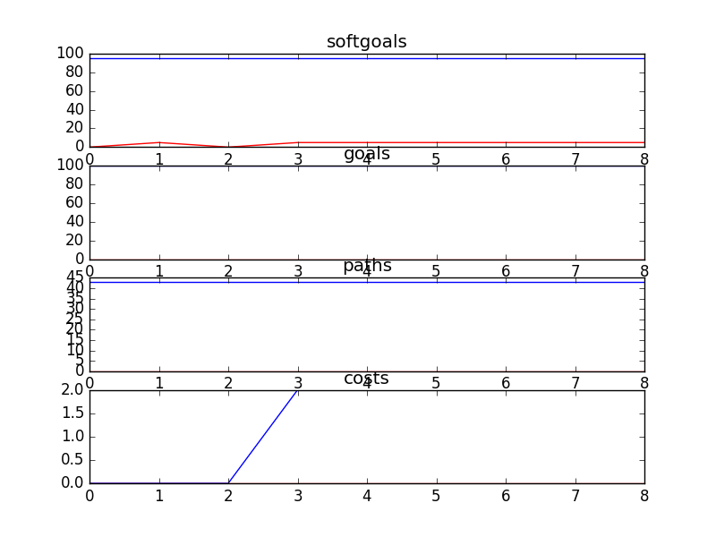

## CSCounsellingManagementSD
```

rank ,         name ,    med   ,   iqr 
----------------------------------------------------
   1 ,      gen0_f1 ,    95.12  ,    0.0 (*--------------|------------- ),95.12, 95.12, 95.12, 95.12, 100.00
   1 ,     gen20_f1 ,    95.12  ,    0.0 (*--------------|------------- ),95.12, 95.12, 95.12, 95.12, 100.00
   1 ,     gen40_f1 ,    95.12  ,    0.0 (*--------------|------------- ),95.12, 95.12, 95.12, 95.12, 100.00
   1 ,     gen60_f1 ,    95.12  ,    0.0 (*--------------|------------- ),95.12, 95.12, 95.12, 95.12, 100.00
   1 ,     gen80_f1 ,    95.12  ,    0.0 (*--------------|------------- ),95.12, 95.12, 95.12, 95.12, 100.00
   1 ,    gen100_f1 ,    95.12  ,    0.0 (*--------------|------------- ),95.12, 95.12, 95.12, 95.12, 100.00

rank ,         name ,    med   ,   iqr 
----------------------------------------------------
   1 ,      gen0_f2 ,    100.0  ,    0.0 (*              |              ),100.00, 100.00, 100.00, 100.00, 100.00
   1 ,     gen20_f2 ,    100.0  ,    0.0 (*              |              ),100.00, 100.00, 100.00, 100.00, 100.00
   1 ,     gen40_f2 ,    100.0  ,    0.0 (*              |              ),100.00, 100.00, 100.00, 100.00, 100.00
   1 ,     gen60_f2 ,    100.0  ,    0.0 (*              |              ),100.00, 100.00, 100.00, 100.00, 100.00
   1 ,     gen80_f2 ,    100.0  ,    0.0 (*              |              ),100.00, 100.00, 100.00, 100.00, 100.00
   1 ,    gen100_f2 ,    100.0  ,    0.0 (*              |              ),100.00, 100.00, 100.00, 100.00, 100.00

rank ,         name ,    med   ,   iqr 
----------------------------------------------------
   1 ,      gen0_f3 ,     43.0  ,    0.0 (*              |              ),43.00, 43.00, 43.00, 43.00, 43.00
   1 ,     gen20_f3 ,     43.0  ,    0.0 (*              |              ),43.00, 43.00, 43.00, 43.00, 43.00
   1 ,     gen40_f3 ,     43.0  ,    0.0 (*              |              ),43.00, 43.00, 43.00, 43.00, 43.00
   1 ,     gen60_f3 ,     43.0  ,    0.0 (*              |              ),43.00, 43.00, 43.00, 43.00, 43.00
   1 ,     gen80_f3 ,     43.0  ,    0.0 (*              |              ),43.00, 43.00, 43.00, 43.00, 43.00
   1 ,    gen100_f3 ,     43.0  ,    0.0 (*              |              ),43.00, 43.00, 43.00, 43.00, 43.00

rank ,         name ,    med   ,   iqr 
----------------------------------------------------
   1 ,     gen60_f4 ,      7.0  ,    3.0 (   -- *--      |              ), 4.00,  6.00,  7.00,  8.00, 11.00
   1 ,     gen80_f4 ,      7.0  ,    3.0 (   -- *--      |              ), 4.00,  6.00,  7.00,  8.00, 11.00
   1 ,    gen100_f4 ,      7.0  ,    3.0 (   -- *--      |              ), 4.00,  6.00,  7.00,  8.00, 11.00
   1 ,     gen40_f4 ,      7.0  ,    3.0 (   --  *-      |              ), 4.00,  6.00,  8.00,  9.00, 11.00
   1 ,     gen20_f4 ,      8.0  ,    4.0 (   --  * -     |              ), 4.00,  6.00,  8.00, 10.00, 12.00
   2 ,      gen0_f4 ,     17.0  ,    9.0 (        ---    *  -----       ), 9.00, 13.00, 17.00, 20.00, 26.00
```

### Time Taken : 5.5079240799


### Decisions Ranked
```
+------+----------------------------------+----------+-------+------+
| rank |               name               |   type   | value | cost |
+------+----------------------------------+----------+-------+------+
|  1   |      Counselling Resources       | resource |   -1  |  5   |
|  2   |         Call Statistics          | resource |   -1  |  5   |
|  3   |   Second Reading of Web Posts    |   task   |   1   |  2   |
|  4   |     Analyze Call Statistics      |   task   |   -1  |  5   |
|  5   |      Web Moderator Meetings      | resource |   -1  |  4   |
|  6   |         Double Head Set          | resource |   -1  |  2   |
|  7   |       Counselling Policies       | resource |   -1  |  4   |
|  8   | Historical Data of Call Volumes  | resource |   -1  |  2   |
|  9   | Negotiate with Counsellors Union |   task   |   -1  |  4   |
+------+----------------------------------+----------+-------+------+
```

### Top 5 Decisions from above table.
```
+-----------------------------------------------------------------+----------+-------+
|                               name                              |   type   | value |
+-----------------------------------------------------------------+----------+-------+
|                    !An IT Trainer Be Present                    |   goal   |   1   |
|               Consideration of Feedback [Managers]              | softgoal |   1   |
|                 Negotiate with Counsellors Union                |   task   |   -1  |
|                Happiness [Counselling Management]               | softgoal |   -1  |
|                       Counselling Manager                       | softgoal |   -1  |
|                      Web Moderator Meetings                     | resource |   -1  |
|                     Avoid Liability Problems                    | softgoal |   1   |
|               Accommodate Schedules [Counsellors]               | softgoal |   1   |
|                             *Salary                             | softgoal |   1   |
|                  Bilingual Counsellors Be Hired                 |   goal   |   1   |
|         Support Day to Day Clinical Needs of Counsellors        | softgoal |   1   |
|                 Counselling Policies Be Followed                |   goal   |   1   |
|                 Historical Data of Call Volumes                 | resource |   1   |
|                       Improve [IT Skills]                       | softgoal |   1   |
|                Improve [Call Recording Equipment]               | softgoal |   1   |
|                  Professional Work Environment                  | softgoal |   1   |
|                  Increase Funding for Training                  | softgoal |   1   |
|           Accommodate Schedules [Counselling Managers]          | softgoal |   1   |
|                 Professional Counsellors Be Used                |   goal   |   1   |
| Improved Quality Assurance [Counselling Reviews and Evaluation] | softgoal |   1   |
|            *Effective Use of Technology [Counsellors]           | softgoal |   1   |
|                  Reduce Staggering of Schedules                 | softgoal |   1   |
|            Continual Improvement [Counselling Skills]           | softgoal |   1   |
|        Pressure Counsellors [to Provide Online Services]        | softgoal |   1   |
|               !Calls Be Recorded into a Data Base               |   goal   |   1   |
|                  *Help as Many Kids as Possible                 | softgoal |   1   |
|             !Improve Hiring Process [of Counsellors]            | softgoal |   1   |
|              Clearer Call Classification Catagories             | softgoal |   1   |
|                      Counselling Resources                      | resource |   -1  |
|                         Call Statistics                         | resource |   -1  |
|   !Increased Emphasis on IT in Hiring Process [of Counsellors]  | softgoal |   1   |
|             Increase IT Methods to Acquire Feedback             | softgoal |   1   |
|             *Increase [IT Training for Counsellors]             | softgoal |   1   |
|                *Sufficient Counselling Resources                | softgoal |   1   |
|                Improve [IT Skills of Counsellors]               | softgoal |   1   |
|                   Second Reading of Web Posts                   |   task   |   1   |
|    !Performance Review Information Be Collected in Data Base    |   goal   |   1   |
|                    Positive Internal Opinion                    | softgoal |   1   |
|               Support Analysis [Counsellors Time]               | softgoal |   1   |
|                       Effective Scheduling                      | softgoal |   1   |
|                       Counselling Policies                      | resource |   -1  |
|                         Double Head Set                         | resource |   1   |
|               Feedback to Counsellors Be Provided               |   goal   |   1   |
|                    *High Quality Counselling                    | softgoal |   1   |
|           Avoid Relationships with Specific Counsellor          | softgoal |   1   |
|                 Increase Number [of Counsellors]                | softgoal |   1   |
|                 Counselling Training Management                 | softgoal |   1   |
|              Improved Writing Skills [Counsellors]              | softgoal |   1   |
|  Perform Counselling as Instructed By Supervisor [Counsellors]  | softgoal |   1   |
|                 !A Training Computer Be Present                 |   goal   |   1   |
|         Supervision Be Performed At Least Every 3 Months        |   goal   |   1   |
|                  Reduce Cost of Counselling HR                  | softgoal |   1   |
|                    Accountability [Services]                    | softgoal |   1   |
|                 Increased Counselling Resources                 | softgoal |   1   |
|                     Analyze Call Statistics                     |   task   |   -1  |
|          Facilitate Faster Changes in Counsellor Duties         | softgoal |   1   |
|   Increased Emphasis on IT in Hiring Process [of Counsellors]   | softgoal |   1   |
|              Improved Writing Skills [Counsellors]1             | softgoal |   1   |
|                     Happiness [Counsellors]                     | softgoal |   1   |
+-----------------------------------------------------------------+----------+-------+
```
