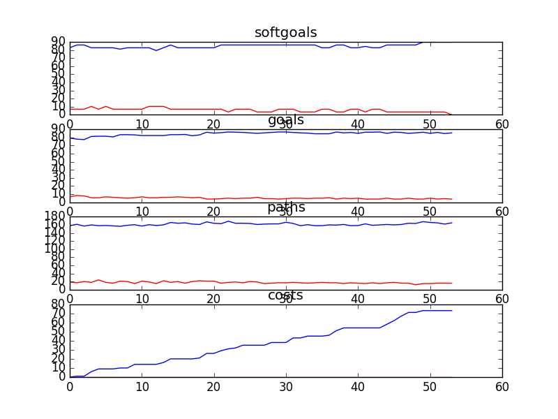

## CSCounselling
```

rank ,         name ,    med   ,   iqr 
----------------------------------------------------
   1 ,      gen0_f1 ,    82.38  ,   7.15 (        ------ | *   ---      ),75.71, 80.95, 82.86, 86.19, 89.05
   2 ,     gen20_f1 ,    87.14  ,   4.28 (               |---   * -     ),81.43, 84.76, 87.14, 88.57, 90.00
   2 ,     gen40_f1 ,    87.14  ,   4.76 (               |----  * -     ),81.43, 85.24, 87.14, 89.05, 90.00
   2 ,     gen60_f1 ,    87.14  ,   4.29 (               |----- * -     ),82.38, 86.67, 87.14, 89.05, 90.00
   2 ,     gen80_f1 ,    87.14  ,   3.34 (               |----- * ---   ),82.38, 86.67, 87.14, 89.05, 91.43
   2 ,    gen100_f1 ,    87.62  ,   3.33 (               | ---- *  --   ),82.86, 86.67, 87.62, 89.52, 91.43

rank ,         name ,    med   ,   iqr 
----------------------------------------------------
   1 ,      gen0_f2 ,    164.0  ,   25.0 (   ---    *   -|--            ),148.00, 157.00, 166.00, 179.00, 189.00
   2 ,     gen80_f2 ,    174.0  ,   20.0 (        --   * |--            ),160.00, 167.00, 175.00, 184.00, 189.00
   2 ,    gen100_f2 ,    175.0  ,   18.0 (       ---   * |--            ),159.00, 168.00, 177.00, 184.00, 189.00
   2 ,     gen40_f2 ,    177.0  ,   17.0 (        ---  * |--            ),160.00, 170.00, 177.00, 182.00, 190.00
   2 ,     gen60_f2 ,    177.0  ,   19.0 (        --   * |--            ),160.00, 168.00, 177.00, 184.00, 190.00
   2 ,     gen20_f2 ,    178.0  ,   16.0 (        ---   *|--            ),162.00, 171.00, 178.00, 184.00, 190.00

rank ,         name ,    med   ,   iqr 
----------------------------------------------------
   1 ,    gen100_f3 ,     76.0  ,   13.0 (      ---  *  -|-             ),63.00, 71.00, 76.00, 83.00, 89.00
   1 ,     gen80_f3 ,     77.0  ,   14.0 (      ----- *  |--            ),63.00, 74.00, 78.00, 85.00, 92.00
   1 ,     gen60_f3 ,     79.0  ,   14.0 (        ---  * |---           ),68.00, 74.00, 79.00, 85.00, 93.00
   1 ,     gen40_f3 ,     81.0  ,   14.0 (        ----  *| ---          ),68.00, 77.00, 83.00, 89.00, 96.00
   2 ,     gen20_f3 ,     85.0  ,   16.0 (        -----  *   --         ),68.00, 79.00, 85.00, 93.00, 98.00
   2 ,      gen0_f3 ,     90.0  ,   17.0 (          ---  |  * -----     ),72.00, 80.00, 91.00, 95.00, 107.00
```

### Time Taken : 221.217132092


### Decisions Ranked
```
+------+----------------------------------------------------+----------+-------+------+
| rank |                        name                        |   type   | value | cost |
+------+----------------------------------------------------+----------+-------+------+
|  1   |                  *Explore Options                  |   task   |   1   |  1   |
|  2   |                  Assess Situation                  |   task   |   -1  |  4   |
|  3   |               Report Outdated Links1               |   task   |   1   |  5   |
|  4   |          *Receive Training from Managment          |   task   |   1   |  3   |
|  5   |            Provide Resources in Library            |   task   |   -1  |  5   |
|  6   |              Attend Part Time Meeting              |   task   |   -1  |  5   |
|  7   |              !Undergo Media Training               |   task   |   1   |  1   |
|  8   |            Diffuse Conflict with Parent            |   task   |   -1  |  5   |
|  9   |  *Encourage Kids to Talk to Different Counsellors  |   task   |   1   |  4   |
|  10  |                Refer Parents to PHL                |   task   |   -1  |  4   |
|  11  |             *Implement Bulletin Board1             |   task   |   -1  |  5   |
|  12  |          !Participate in Sponsor Meetings          |   task   |   -1  |  1   |
|  13  |        Sign Contract with Counselling Union        |   task   |   1   |  2   |
|  14  |            Remove Identifying Material             |   task   |   1   |  4   |
|  15  |                  Double Headsets                   | resource |   -1  |  4   |
|  16  |   Block Kids who Display Inappropriate Behavoir    |   task   |   -1  |  3   |
|  17  |          Encourage Kids to Talk to Others          |   task   |   -1  |  3   |
|  18  |           *Implement Categorization Tool           |   task   |   1   |  1   |
|  19  |          Provide Resources in One Source           |   task   |   1   |  5   |
|  20  |                   Report Abuses                    |   task   |   -1  |  4   |
|  21  |                Counselling Policies                | resource |   1   |  3   |
|  22  |                  Listen for Cues                   |   task   |   1   |  2   |
|  23  |                   Request Shifts                   |   task   |   1   |  1   |
|  24  |               Learn Web Technologies               |   task   |   1   |  3   |
|  25  |           Provide Resources in E-Library           |   task   |   -1  |  4   |
|  26  |                 Assess Situation1                  |   task   |   -1  |  4   |
|  27  |          ! Write Articles for Magazines 1          |   task   |   -1  |  4   |
|  28  |            Perform Crisis Intervention             |   task   |   1   |  3   |
|  29  |        Receive Call Classification Training        |   task   |   -1  |  5   |
|  30  |              Speak at SA Conferences               |   task   |   -1  |  5   |
|  31  |   ! Counselor Speak on Kids Issues in General 1    |   task   |   1   |  5   |
|  32  |                 *Explore Options1                  |   task   |   -1  |  4   |
|  33  |             Encourage Kids to Call CS              |   task   |   1   |  2   |
|  34  |              *Edit Counselling Posts               |   task   |   -1  |  4   |
|  35  |                    Training CDs                    | resource |   -1  |  3   |
|  36  |               Counselling Workshops                | resource |   1   |  1   |
|  37  |              Debrief with Counsellors              |   task   |   1   |  5   |
|  38  |         *Implement Email for Counsellors1          |   task   |   1   |  3   |
|  39  |             Tape Recording Technology              | resource |   -1  |  1   |
|  40  |      Perform Conference Call with Third Party      |   task   |   -1  |  5   |
|  41  | Include Legal Information in Counselling Resources |   task   |   -1  |  1   |
|  42  |                   Record Stories                   |   task   |   -1  |  3   |
|  43  |       Comment on Technology Usability Issues       |   task   |   -1  |  1   |
|  44  |           ! Write Articles for Website 1           |   task   |   1   |  4   |
|  45  |           !Participate in Board Meetings           |   task   |   1   |  4   |
|  46  |               Participate in events1               |   task   |   1   |  5   |
|  47  |           Provide Information in Binders           |   task   |   1   |  4   |
|  48  |     Provide Information to Other Counselloers      |   task   |   -1  |  4   |
|  49  |               Web Moderator Meetings               | resource |   1   |  2   |
|  50  |                      Feedback                      | resource |   -1  |  2   |
|  51  |     Listen to Calls of Experienced Counsellors     |   task   |   -1  |  3   |
|  52  |              Speak Publicly about Job              |   task   |   -1  |  4   |
|  53  |                       Tapes                        | resource |   -1  |  3   |
|  54  | Include Drug Information in Counselling Resources  |   task   |   1   |  3   |
+------+----------------------------------------------------+----------+-------+------+
```

### Top 9 Decisions from above table.
```
+----------------------------------------------------------------------+----------+-------+
|                                 name                                 |   type   | value |
+----------------------------------------------------------------------+----------+-------+
|                 Consideration of Feedback [Managers]                 | softgoal |   1   |
|                        Learn Web Technologies                        |   task   |   1   |
|                  Increase Number [of Counsellors]1                   | softgoal |   1   |
|                    Enthusiastic [Work Atmosphere]                    | softgoal |  0.5  |
|                   Reduce Monitoring of Activities                    | softgoal |  0.5  |
|         Cutting and Pasting Be Added to Web Posting Software         |   goal   |   1   |
|                           Get Rid of Union                           |   goal   |   1   |
|                       Complete Resource Links4                       | softgoal |  0.5  |
|                  Decrease Clumsiness [Technology]2                   | softgoal |   1   |
|           *Encourage Kids to Talk to Different Counsellors           |   task   |   1   |
|                    Information/Resources Be Found                    |   goal   |   1   |
|           Support Individuality in Counselling Techniques            | softgoal |  -0.5 |
|                        Move on to Better Job                         | softgoal |  0.5  |
|                       Undergo Clinical Review1                       |   task   |   1   |
|               Avoid Pressure to Perform Duties Quickly               | softgoal |  -0.5 |
|                   *Receive Training from Managment                   |   task   |   1   |
|                           *Explore Options                           |   task   |   1   |
|                        Participate in events1                        |   task   |   -1  |
|                             Training CDs                             | resource |   -1  |
|                   *Implement Email for Counsellors                   |   task   |   -1  |
|                      Tape Recording Technology                       | resource |   -1  |
|                         Patient [Counselor]                          | softgoal |  0.5  |
|                         Increase [Feedback]                          | softgoal |  0.5  |
|                   Be Consulted about New Policies                    |   goal   |   1   |
|                   *Help As Many Kids as Possible2                    | softgoal |  -0.5 |
|                         Simple [Technology]1                         | softgoal |   1   |
|              Provide Information to Other Counselloers               |   task   |   -1  |
|                      Log into Activity Manager                       |   task   |   1   |
|                             Recognition2                             | softgoal |  0.5  |
|                            Record Stories                            |   task   |   -1  |
|                       Current Resource Links2                        | softgoal |  0.5  |
|                     !Moderate Discussion Boards                      |   task   |   -1  |
|                       Increased Peer Support1                        | softgoal |  0.5  |
|                        Accommodate Schedules                         | softgoal |   1   |
|                    Provide Support to Counsellors                    |   task   |   1   |
|                 Accessible Resources for Counselors                  | softgoal |  -0.5 |
|                 Empowering Kids to Help Themselves2                  | softgoal |  0.5  |
|                     Improve Counselling Skills1                      | softgoal |  0.5  |
|                     Provide Resources in Library                     |   task   |   -1  |
|                    Acquire Public Speaking Skills                    | softgoal |   1   |
|                      Consistent Resource Links                       | softgoal |  -0.5 |
|            Easier to Find Posts [Web Posting Technology]1            | softgoal |   1   |
|                 Accessible Resources for Counselors2                 | softgoal |  -0.5 |
|                         Improve [IT Skills]3                         | softgoal |  0.5  |
|                 Avoid Being Labelled Anti-Technology                 | softgoal |  0.5  |
|                        Perform Duties Quickly                        | softgoal |  -0.5 |
|                Improve Quality Assurance Technology2                 | softgoal |  0.5  |
|                           Listen for Cues                            |   task   |   -1  |
|                       Speak at SA Conferences                        |   task   |   1   |
|                  Provide Web Counselling with Video                  |   task   |   -1  |
|                      *High Quality Counselling                       | softgoal |  0.5  |
|                   Remember Locations of Resouces2                    | softgoal |   1   |
|              Counsellors Engage Emotionally in Session               | softgoal |  0.5  |
|                     Control of Counselling Work1                     | softgoal |   1   |
|           Increased Caution [Content of Online Services]1            | softgoal |  -0.5 |
|                     Control of Floor Operations                      | softgoal |   1   |
|                   !Participate in Sponsor Meetings                   |   task   |   1   |
|                   *Improve Web Posting Technology1                   | softgoal |  0.5  |
|                *Decrease Difficulties with Technology                | softgoal |  0.5  |
|               Tools to Burn Negative Energy Be Present               |   goal   |  0.5  |
|                       Complete Resource Links1                       | softgoal |  0.5  |
|                  Provide Web Counselling with Audio                  |   task   |   -1  |
|                       Counsellors Be Unionized                       |   goal   |   1   |
|                        *Allow User to Log In1                        |   goal   |   1   |
|                      !IT Systems Be Integrated1                      |   goal   |   1   |
|                       *High Quality Resources2                       | softgoal |  0.5  |
|                             !Retain Job                              | softgoal |  0.5  |
|                   *Improve Web Posting Technology                    | softgoal |  0.5  |
|                    Reduce Staggering of Schedules                    | softgoal |   1   |
|                        Training Be Received2                         |   goal   |   1   |
|               *Increase [IT Training for Counsellors]                | softgoal |   1   |
|                   Acquire Public Speaking Skills2                    | softgoal |   1   |
|                       Happiness [Counsellors]                        | softgoal |  -0.5 |
|                         Refer Parents to PHL                         |   task   |   -1  |
|                      Improve Counselling Skills                      | softgoal |  0.5  |
|            Avoid Relationships with Specific Counsellor1             | softgoal |  0.5  |
|                           Acquire Feedback                           |   task   |   -1  |
|                         Reduce Prank Calls1                          | softgoal |   1   |
|       Receive Additional Training as an Experienced Cousnellor       |   task   |   1   |
|              Easily Accessable Technology Instructions1              | softgoal |   1   |
|                             Recognition1                             | softgoal |   1   |
|                 Improve Quality Assurance Technology                 | softgoal |  0.5  |
|                 Accessible Resources for Counselors6                 | softgoal |  -0.5 |
|                    Web Counselling be Performed1                     |   task   |   -1  |
|                 Clinical Supervisors Listen to Calls                 |   goal   |   1   |
|                 A Resolution Focus Approach Be Used                  |   goal   |   1   |
|              Listen to Calls of Experienced Counsellors              |   task   |   -1  |
|                         Effective Debriefing                         | softgoal |  -0.5 |
|                              CS Stories                              | softgoal |   -1  |
|                    ! Write Articles for Website 1                    |   task   |   -1  |
|            Increased Caution [Content of Online Services]            | softgoal |  -0.5 |
|                           Assess Situation                           |   task   |   -1  |
|                    Provide Resources in E-Library                    |   task   |   -1  |
|                      *Decrease Work Difficulty                       | softgoal |  0.5  |
|                          Voice Counselling                           | softgoal |   1   |
|                 Accessible Resources for Counselors1                 | softgoal |  -0.5 |
|                      Feedback on Calls Be Given                      |   goal   |   -1  |
|                Improved Writing Skills [Counsellors]                 | softgoal |   1   |
|                  Decrease Clumsiness [Technology]1                   | softgoal |   1   |
|            Facilitate Faster Changes in Counsellor Duties            | softgoal |  0.5  |
|           Icons for Counselling Information Be on Desktop            |   goal   |   1   |
|              Easily Accessable Technology Instructions               | softgoal |   1   |
|                      Avoid Liability Problems1                       | softgoal |  -0.5 |
|              Receive Information from Other Counsellors              |   task   |   -1  |
|         Kids Be Prepared for Formal Abuse Reporting Process          |   goal   |   1   |
|                      Consistent Resource Links1                      | softgoal |  -0.5 |
|          Include Legal Information in Counselling Resources          |   task   |   1   |
|                       Anonymity [Counsellors]                        | softgoal |   1   |
|                   Avoid Dialogues [Web Services]1                    | softgoal |   1   |
|                        Report Outdated Links1                        |   task   |   1   |
|                   Remember Locations of Resouces1                    | softgoal |   1   |
|                   *Improve Web Posting Technology2                   | softgoal |  0.5  |
|              Consideration of Feedback [IT Providers]1               | softgoal |   1   |
|                       Complete Resource Links2                       | softgoal |  0.5  |
|           Perform Counselling as Instructed By Supervisor            | softgoal |   1   |
|                        Counselling Workshops                         | resource |   -1  |
|                 *Prepare Technical Phone Environment                 |   task   |   1   |
|        High Degree of Similarity [Between Services Provided]         | softgoal |  -0.5 |
|                   *Help As Many Kids as Possible3                    | softgoal |  -0.5 |
|                  Engage in Dialog [with Counselled]                  | softgoal |   1   |
|                    *Help As Many Kids as Possible                    | softgoal |  -0.5 |
|              Acquire Recognizable Employment Experience              | softgoal |  0.5  |
|                   Counselling Policies Be Followed                   |   goal   |   -1  |
|                        Web Moderator Meetings                        | resource |   1   |
|               Consideration of Feedback [IT Providers]               | softgoal |  0.5  |
|                Comment on Technology Usability Issues                |   task   |   1   |
|             Improve Communication [Between Counsellors]              | softgoal |  -0.5 |
|                      Consistent Resource Links2                      | softgoal |  -0.5 |
|                      Edit Online Posts of Kids                       |   task   |   -1  |
|                      Encourage Kids to Call CS                       |   task   |   -1  |
|                         Improve [IT Skills]1                         | softgoal |  0.5  |
|                 Accessible Resources for Counselors5                 | softgoal |  -0.5 |
|                  Decrease Factory Worker Atmosphere                  | softgoal |  0.5  |
|                   Increase Number [of Counsellors]                   | softgoal |   1   |
|                    Remove Inappropriate Material                     |   task   |   -1  |
|                   Pass Probation within Six Months                   |   goal   |   1   |
|           Comfortable with Perceived Purpose of Technology           | softgoal |  0.5  |
|                       Happiness [Counsellors]1                       | softgoal |  -0.5 |
|                  Listen to Calls of New Counsellors                  |   task   |   -1  |
|                        *!Promote Counselling                         |   task   |   1   |
|                       Situation Be Dealt with                        |   goal   |   1   |
|      Avoid Tension/Confrontation/ Animosity [Amongst Employees]      | softgoal |  0.5  |
|                       Current Resource Links3                        | softgoal |  0.5  |
|                       Decrease Kids Isolation                        | softgoal |  0.5  |
|                      !IT Systems Be Integrated                       |   goal   |   1   |
|           Increased Caution [Content of Online Services]2            | softgoal |  -0.5 |
|           Perform Counselling as Instructed By Supervisor1           | softgoal |   1   |
|                            Request Shifts                            |   task   |   -1  |
|                    Voice Counselling be Performed                    |   task   |   1   |
|                    Be a Mentor to New Counsellors                    |   goal   |   1   |
|                        Information/Resources                         | resource |   -1  |
|                              Help Kids1                              | softgoal |  0.5  |
|                  Improve [Call Recording Equipment]                  | softgoal |   1   |
|           Reduce Number of Steps [Web Posting Technology]1           | softgoal |   1   |
|                      *High Quality Counselling1                      | softgoal |  -0.5 |
|                        Avoid Being Directive                         | softgoal |  0.5  |
|                    Counsellors Police Themselves                     | softgoal |   1   |
|                        Increased Peer Support                        | softgoal |  0.5  |
|              *Have Clinical Supervisors Listen to Calls              |   task   |   -1  |
|                Clearer Call Classification Catagories                | softgoal |   1   |
|                       *High Quality Resources3                       | softgoal |  0.5  |
|                  Counselling Policies Be Followed1                   |   goal   |   -1  |
|               Increase IT Methods to Acquire Feedback1               | softgoal |   1   |
|                         Counselling Policies                         | resource |   -1  |
|              Increase Emphasis on Online Feedback Form1              | softgoal |   1   |
|                     Control of Counselling Work                      | softgoal |   1   |
|                     Perform Crisis Intervention                      |   task   |   -1  |
|            Reduce Contagion Effect [Of Harmful Actions]1             | softgoal |  -0.5 |
|                                Safety                                | softgoal |  0.5  |
|                   Acquire Public Speaking Skills1                    | softgoal |   1   |
|                       Attend Part Time Meeting                       |   task   |   -1  |
|              Perform First Reading of Counselling Posts              |   task   |   -1  |
|                 Improve [Call Recording Equipment]1                  | softgoal |   1   |
|                    Web Counselling be Performed2                     |   task   |   -1  |
|               Perform Conference Call with Third Party               |   task   |   1   |
|        High Degree of Similarity [Between Services Provided]2        | softgoal |  -0.5 |
|                Consideration of Feedback [Managers]1                 | softgoal |   1   |
|            Block Kids who Display Inappropriate Behavoir             |   task   |   -1  |
|                   Encourage Kids to Talk to Others                   |   task   |   1   |
|                     Find Information in Binders                      |   task   |   1   |
|                   Voice Counselling be Performed1                    |   task   |   1   |
|                               Feedback                               | resource |   -1  |
|          Include Drug Information in Counselling Resources           |   task   |   -1  |
|                    *Implement Categorization Tool                    |   task   |   1   |
|                       !Undergo Media Training                        |   task   |   1   |
|                         Improve [IT Skills]                          | softgoal |  0.5  |
|                    Professional Work Environment                     | softgoal |  -0.5 |
|                   Consistent Counselling Responses                   | softgoal |  0.5  |
|           Perform Counselling as Instructed By Supervisor2           | softgoal |   1   |
|                    !Participate in Board Meetings                    |   task   |   1   |
|                            Pride [In Job]                            | softgoal |  0.5  |
| Reduce Physical Observation/Hearing by Staff Not in Counselling Team | softgoal |   1   |
|             Reduce Contagion Effect [Of Harmful Actions]             | softgoal |  -0.5 |
|                 Sign Contract with Counselling Union                 |   task   |   1   |
|                       Situation Be Dealt with1                       |   goal   |   -1  |
|                          Assess Situation1                           |   task   |   -1  |
|                 Receive Call Classification Training                 |   task   |   -1  |
|             *Effective Use of Technology [Counsellors]1              | softgoal |  0.5  |
|                   Positive [Employment Evaluation]                   | softgoal |  0.5  |
|                         Simple [Technology]                          | softgoal |   1   |
|                  Brief Therapy Counselling Be Used                   |   goal   |   1   |
|                      *High Quality Counselling2                      | softgoal |  -0.5 |
|                   Reduce Staggering of Schedules1                    | softgoal |   1   |
|                             Recognition                              | softgoal |   1   |
|                       Complete Resource Links3                       | softgoal |  0.5  |
|                               *Salary                                | softgoal |   1   |
|                          Reduce Prank Calls                          | softgoal |   1   |
|                       Increased Peer Support2                        | softgoal |  0.5  |
|                  Correct Interpretation of Counsel                   | softgoal |   1   |
|                      Accountability of services                      | softgoal |  -0.5 |
|                  *Implement Email for Counsellors2                   |   task   |   -1  |
|                       *Increase [IT Training]                        | softgoal |   1   |
|                       Increased Peer Support3                        | softgoal |  0.5  |
|             Web Posts Be Reviewed by Clinical Supervisor             |   goal   |   1   |
|                       *Edit Counselling Posts                        |   task   |   -1  |
|                        *Allow User to Log In                         |   goal   |   1   |
|                       Undergo Clinical Review                        |   task   |   1   |
|                     Diffuse Conflict with Parent                     |   task   |   -1  |
|                         *Decrease Work Load                          | softgoal |  0.5  |
|                              Help Kids                               | softgoal |  0.5  |
|                            Report Abuses                             |   task   |   -1  |
|        High Degree of Similarity [Between Services Provided]1        | softgoal |  -0.5 |
|                     Remove Identifying Material                      |   task   |   -1  |
|                         Find Effective Cues                          | softgoal |  0.5  |
|                     Improve Counselling Skills3                      | softgoal |  0.5  |
|                    Professional Work Environment1                    | softgoal |  -0.5 |
|                 Accessible Resources for Counselors4                 | softgoal |  -0.5 |
|                                Tapes                                 | resource |   1   |
|                           Release Tension                            | softgoal |  0.5  |
|                        Report Outdated Links                         |   task   |   1   |
|                      Web Responses Be Generic1                       | softgoal |   1   |
|                       Current Resource Links4                        | softgoal |  0.5  |
|                         Training Be Received                         |   goal   |   1   |
|          Mentoring Be Received from Experienced Counsellors          |   goal   |   1   |
|              Increase Emphasis on Online Feedback Form               | softgoal |   1   |
|                         *Meeting Be Attended                         |   goal   |   1   |
|                     Provide Written Counselling                      |   task   |   -1  |
|                       Speak Publicly about Job                       |   task   |   1   |
|                          *Explore Options1                           |   task   |   -1  |
|                     Accountability of services1                      | softgoal |  -0.5 |
|                  Empowering Kids to Help Themselves                  | softgoal |  0.5  |
|                        Current Resource Links                        | softgoal |  0.5  |
|                   Decrease Clumsiness [Technology]                   | softgoal |   1   |
|                    Attend Web Moderator Meetings                     |   task   |   1   |
|             *Effective Use of Technology [Counsellors]2              | softgoal |  0.5  |
|       Increase Connection [Between Counsellors and Counselled]       | softgoal |  0.5  |
|                       Debrief with Counsellors                       |   task   |   -1  |
|                        Accommodate Schedules1                        | softgoal |   1   |
|                       Improved Writing Skills                        | softgoal |   1   |
|                           Double Headsets                            | resource |   -1  |
|                      *Implement Bulletin Board1                      |   task   |   -1  |
|                         Provide Information2                         |   task   |   1   |
|                       Current Resource Links1                        | softgoal |  0.5  |
|                    Web Counselling be Performed3                     |   task   |   -1  |
|                    Avoid Dialogues [Web Services]                    | softgoal |   1   |
|                         Improve [IT Skills]2                         | softgoal |  0.5  |
|           Reduce Number of Steps [Web Posting Technology]            | softgoal |   1   |
|                    Provide Information in Binders                    |   task   |   1   |
|                    Diffuse Conflict with Parent1                     |   task   |   -1  |
|                   Voice Counselling be Performed2                    |   task   |   1   |
|                 Empowering Kids to Help Themselves1                  | softgoal |  0.5  |
|                 Accessible Resources for Counselors3                 | softgoal |  -0.5 |
|                           Variety in Work                            | softgoal |  -0.5 |
|               Increase IT Methods to Acquire Feedback                | softgoal |   1   |
|                       Avoid Liability Problems                       | softgoal |  -0.5 |
|                    Web Counselling be Performed4                     |   task   |   -1  |
|               Clearer Call Classification Catagories1                | softgoal |   1   |
|                Improve Quality Assurance Technology1                 | softgoal |  0.5  |
|                       Complete Resource Links                        | softgoal |  0.5  |
|                           !Moderate a Chat                           |   task   |   -1  |
|                              Anonymity                               | softgoal |   1   |
|                            Avoid Burnout                             | softgoal |  0.5  |
|                      !Perform Email Counselling                      |   task   |   -1  |
|                       Web Responses Be Generic                       | softgoal |   1   |
|            ! Counselor Speak on Kids Issues in General 1             |   task   |   1   |
|                        Increase CS Awareness1                        | softgoal |   1   |
|                        Resources Be Provided                         |   goal   |   1   |
|                       Create Counselling Posts                       |   task   |   -1  |
|                   Information Binders at Stations                    | resource |   1   |
|                      *High Quality Counselling3                      | softgoal |  0.5  |
|            Easier to Find Posts [Web Posting Technology]             | softgoal |   1   |
|                       *High Quality Resources                        | softgoal |  0.5  |
|                        Increase CS Awareness                         | softgoal |   1   |
|              *Effective Use of Technology [Counsellors]              | softgoal |  0.5  |
|                     Accountability of services2                      | softgoal |  -0.5 |
|           Facilitate Faster Changes in Counsellor Duties1            | softgoal |  0.5  |
|                       *High Quality Resources1                       | softgoal |  0.5  |
|                   Provide Resources in One Source                    |   task   |   -1  |
|                  *Implement Email for Counsellors1                   |   task   |   -1  |
|                        Update Outdated Links                         |   task   |   1   |
|                     Deepen [Counselling Session]                     | softgoal |   1   |
|                   *Help As Many Kids as Possible1                    | softgoal |  -0.5 |
|                        Training Be Received1                         |   goal   |   1   |
|                  Correct Interpretation of Counsel1                  | softgoal |   1   |
|                         Avoid Short Staffing                         | softgoal |  0.5  |
|                   Acquire Public Speaking Skills3                    | softgoal |   1   |
|                    Make Tapes for Clinical Review                    |   task   |   1   |
|                     Web Counselling be Performed                     |   task   |   -1  |
|                     Improve Counselling Skills2                      | softgoal |  0.5  |
|                       Undergo Clinical Review2                       |   task   |   1   |
|                      *Implement Bulletin Board                       |   task   |   -1  |
|             Avoid Relationships with Specific Counsellor             | softgoal |  0.5  |
|                    Remember Locations of Resouces                    | softgoal |   1   |
|                 Provide Resources as Currently Done                  |   task   |   1   |
|                   ! Write Articles for Magazines 1                   |   task   |   -1  |
|                        Patient [Counselor] 1                         | softgoal |  0.5  |
|                      Web Responses Be Generic2                       | softgoal |   1   |
|                    Diffuse Conflict with Parent2                     |   task   |   -1  |
+----------------------------------------------------------------------+----------+-------+
```
