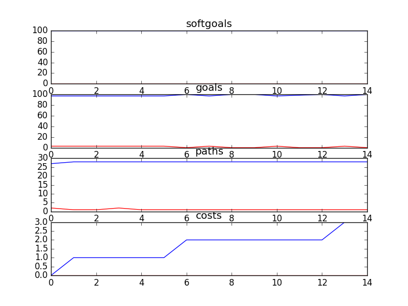

## Kids and Youth
```

rank ,         name ,    med   ,   iqr 
----------------------------------------------------
   1 ,      gen0_f1 ,    100.0  ,    2.5 (               |             *),97.50, 97.50, 100.00, 100.00, 100.00
   1 ,     gen20_f1 ,    100.0  ,    2.5 (               |             *),97.50, 97.50, 100.00, 100.00, 100.00
   1 ,     gen40_f1 ,    100.0  ,    2.5 (         ------|---          *),95.00, 97.50, 100.00, 100.00, 100.00
   1 ,     gen60_f1 ,    100.0  ,    2.5 (               |             *),97.50, 97.50, 100.00, 100.00, 100.00
   1 ,     gen80_f1 ,    100.0  ,    2.5 (               |             *),97.50, 97.50, 100.00, 100.00, 100.00
   1 ,    gen100_f1 ,    100.0  ,    2.5 (               |             *),97.50, 97.50, 100.00, 100.00, 100.00

rank ,         name ,    med   ,   iqr 
----------------------------------------------------
   1 ,     gen20_f2 ,     28.0  ,    2.0 (        ----   | *   ----     ),26.00, 27.00, 28.00, 29.00, 30.00
   1 ,     gen40_f2 ,     28.0  ,    2.0 (        ----   | *            ),26.00, 27.00, 28.00, 29.00, 29.00
   1 ,     gen60_f2 ,     28.0  ,    2.0 (        ----   | *            ),26.00, 27.00, 28.00, 29.00, 29.00
   1 ,     gen80_f2 ,     28.0  ,    2.0 (        ----   | *            ),26.00, 27.00, 28.00, 29.00, 29.00
   1 ,    gen100_f2 ,     28.0  ,    2.0 (        ----   | *            ),26.00, 27.00, 28.00, 29.00, 29.00
   2 ,      gen0_f2 ,     29.0  ,    1.0 (            ---|-    *---     ),27.00, 28.00, 29.00, 29.00, 30.00

rank ,         name ,    med   ,   iqr 
----------------------------------------------------
   1 ,     gen80_f3 ,      4.0  ,    3.0 ( - *---        |              ), 2.00,  3.00,  4.00,  6.00,  9.00
   1 ,    gen100_f3 ,      4.0  ,    3.0 ( - *---        |              ), 2.00,  3.00,  4.00,  6.00,  9.00
   1 ,     gen60_f3 ,      4.0  ,    4.0 ( - *---        |              ), 2.00,  3.00,  5.00,  6.00,  9.00
   1 ,     gen40_f3 ,      5.0  ,    4.0 ( - * --        |              ), 2.00,  3.00,  5.00,  7.00,  9.00
   2 ,     gen20_f3 ,      8.0  ,    6.0 (   -  * ---    |              ), 4.00,  6.00,  8.00, 11.00, 15.00
   3 ,      gen0_f3 ,     24.0  ,   10.0 (            ---|  *   ----    ),16.00, 21.00, 24.00, 29.00, 33.00
```

### Time Taken : 10.2855489254


### Decisions Ranked
```
+------+-------------------------------------------+------+-------+------+
| rank |                    name                   | type | value | cost |
+------+-------------------------------------------+------+-------+------+
|  1   | Maintain Get Informed Section of Web Site | task |   1   |  1   |
|  2   |         !Implement Text Messaging         | task |   -1  |  4   |
|  3   |   !Implement Cyber Café/Portal/Chat Room  | task |   -1  |  4   |
|  4   |              Provide Feedback             | task |   -1  |  5   |
|  5   |        !Implement Polls about Kids        | task |   -1  |  5   |
|  6   |         Maintain Phone Counselling        | task |   1   |  1   |
|  7   |   !Implement Bulletin Board with Replies  | task |   -1  |  3   |
|  8   |     Maintain Ask a Counsellor Section     | task |   -1  |  4   |
|  9   |  !Implement General Questions and Answers | task |   -1  |  5   |
|  10  |        Implement Email Counselling        | task |   -1  |  5   |
|  11  |           Contact CS in Crisis            | task |   -1  |  4   |
|  12  |        Implement Video Counselling        | task |   -1  |  5   |
|  13  |      !Implement One-On-One Chat Rooms     | task |   1   |  1   |
|  14  |   Contact CS about Non-Crisis Situation   | task |   -1  |  2   |
|  15  |        Implement Voice Counselling        | task |   -1  |  1   |
+------+-------------------------------------------+------+-------+------+
```

### Top 4 Decisions from above table.
```
+-------------------------------------------+----------+-------+
|                    name                   |   type   | value |
+-------------------------------------------+----------+-------+
|            *Get Effective Help            | softgoal |  0.5  |
|              Help be acquired             |   goal   |   1   |
|              Services Be Free             |   goal   |   1   |
|        Implement Voice Counselling        |   task   |   1   |
|         Maintain Phone Counselling        |   task   |   1   |
|          *Safety of service usage         | softgoal |  0.5  |
|        Implement Video Counselling        |   task   |   -1  |
|        Implement Email Counselling        |   task   |   1   |
|          High Quality [Service]           | softgoal |   1   |
|     Maintain Ask a Counsellor Section     |   task   |   1   |
|        Ownership of Service [Kids]        | softgoal |   1   |
|        Easy [Access to Post Reply]        | softgoal |   1   |
|               Vent Emotions               | softgoal |  0.5  |
|   !Implement Cyber Café/Portal/Chat Room  |   task   |   -1  |
|                  *Privacy                 | softgoal |  0.5  |
|            Patient [Counselor]            | softgoal |   1   |
|   Contact CS about Non-Crisis Situation   |   task   |   1   |
|        Confidentiality [Services]         | softgoal |   1   |
|       Decrease [Phone Waiting Time]       | softgoal |   1   |
|         Confidentiality [Service]         | softgoal |   1   |
|         !Implement Text Messaging         |   task   |   -1  |
|  Children Decide When to Hang Up and Call | softgoal |   1   |
| Maintain Get Informed Section of Web Site |   task   |   1   |
|           Use voice Counselling           |   task   |   1   |
|           Friendly [Web site] 1           | softgoal |   1   |
|          High Quality [Services]          | softgoal |   1   |
|          Availability [Service]           | softgoal |   1   |
|      Connect Back to the Community 1      | softgoal |   1   |
|            Anonymity [Service]            | softgoal |   1   |
|            Immediacy [Service]            | softgoal |   1   |
|        !Implement Polls about Kids        |   task   |   1   |
|   Similarity with other kids  problems    | softgoal |   1   |
|   !Implement Bulletin Board with Replies  |   task   |   -1  |
|  Support and Be Supported By Other Kids   | softgoal |  0.5  |
|     Read General Questions and Answers    |   task   |   1   |
|   Similarity with other kids  problems 1  | softgoal |   1   |
|       Ownership of Services [Kids]        | softgoal |   1   |
|          Availability [Services]          | softgoal |   1   |
|      Decrease [Phone Waiting Time] 1      | softgoal |   1   |
|  !Implement General Questions and Answers |   task   |   1   |
|     Information be acquired on website    |   goal   |   1   |
|      !Implement One-On-One Chat Rooms     |   task   |   1   |
|              Provide Feedback             |   task   |   -1  |
|           Anonymity [Services]            | softgoal |   1   |
|             Services Be Free1             |   goal   |   1   |
|           Contact CS in Crisis            |   task   |   1   |
|          Effective Help in Crisis         | softgoal |  0.5  |
|   Effective Help in Non Crisis Situation  | softgoal |  0.5  |
|       Connect Back to the Community       | softgoal |   1   |
|         Connect with Other Kids 1         | softgoal |   1   |
|            Friendly [Web site]            | softgoal |   1   |
|           Immediacy [Services]            | softgoal |   1   |
|           Patient [Counselor] 1           | softgoal |   1   |
|       Easy [Access to Post Reply] 1       | softgoal |   1   |
|      Be informed of service anonymity     |   goal   |   1   |
|       Comfortableness with service        | softgoal |  0.5  |
|          Connect with Other Kids          | softgoal |   1   |
+-------------------------------------------+----------+-------+
```
