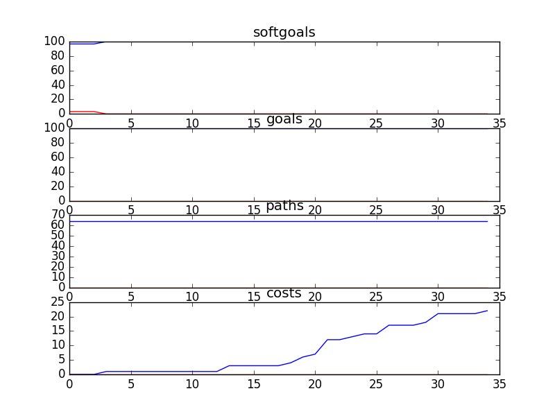

## CSCounsellingSD
```

rank ,         name ,    med   ,   iqr 
----------------------------------------------------
   1 ,      gen0_f1 ,    100.0  ,   3.28 (               |             *),96.72, 96.72, 100.00, 100.00, 100.00
   1 ,     gen20_f1 ,    100.0  ,   3.28 (               |             *),96.72, 96.72, 100.00, 100.00, 100.00
   1 ,     gen40_f1 ,    100.0  ,   3.28 (---------------|-------------*),96.72, 100.00, 100.00, 100.00, 100.00
   1 ,     gen60_f1 ,    100.0  ,    0.0 (---------------|-------------*),96.72, 100.00, 100.00, 100.00, 100.00
   1 ,     gen80_f1 ,    100.0  ,    0.0 (---------------|-------------*),96.72, 100.00, 100.00, 100.00, 100.00
   1 ,    gen100_f1 ,    100.0  ,    0.0 (---------------|-------------*),96.72, 100.00, 100.00, 100.00, 100.00

rank ,         name ,    med   ,   iqr 
----------------------------------------------------
   1 ,      gen0_f2 ,    100.0  ,    0.0 (*              |              ),100.00, 100.00, 100.00, 100.00, 100.00
   1 ,     gen20_f2 ,    100.0  ,    0.0 (*              |              ),100.00, 100.00, 100.00, 100.00, 100.00
   1 ,     gen40_f2 ,    100.0  ,    0.0 (*              |              ),100.00, 100.00, 100.00, 100.00, 100.00
   1 ,     gen60_f2 ,    100.0  ,    0.0 (*              |              ),100.00, 100.00, 100.00, 100.00, 100.00
   1 ,     gen80_f2 ,    100.0  ,    0.0 (*              |              ),100.00, 100.00, 100.00, 100.00, 100.00
   1 ,    gen100_f2 ,    100.0  ,    0.0 (*              |              ),100.00, 100.00, 100.00, 100.00, 100.00

rank ,         name ,    med   ,   iqr 
----------------------------------------------------
   1 ,      gen0_f3 ,     64.0  ,    0.0 (*              |              ),64.00, 64.00, 64.00, 64.00, 64.00
   1 ,     gen20_f3 ,     64.0  ,    0.0 (*              |              ),64.00, 64.00, 64.00, 64.00, 64.00
   1 ,     gen40_f3 ,     64.0  ,    0.0 (*              |              ),64.00, 64.00, 64.00, 64.00, 64.00
   1 ,     gen60_f3 ,     64.0  ,    0.0 (*              |              ),64.00, 64.00, 64.00, 64.00, 64.00
   1 ,     gen80_f3 ,     64.0  ,    0.0 (*              |              ),64.00, 64.00, 64.00, 64.00, 64.00
   1 ,    gen100_f3 ,     64.0  ,    0.0 (*              |              ),64.00, 64.00, 64.00, 64.00, 64.00

rank ,         name ,    med   ,   iqr 
----------------------------------------------------
   1 ,    gen100_f4 ,     26.0  ,    7.0 (  --- * -      |              ),19.00, 24.00, 26.00, 29.00, 31.00
   2 ,     gen80_f4 ,     28.0  ,    6.0 (    --  *--    |              ),23.00, 26.00, 29.00, 31.00, 34.00
   3 ,     gen60_f4 ,     31.0  ,    6.0 (     --- * --  |              ),24.00, 29.00, 31.00, 34.00, 39.00
   4 ,     gen40_f4 ,     34.0  ,    9.0 (      ---  * --|              ),26.00, 32.00, 34.00, 39.00, 43.00
   5 ,     gen20_f4 ,     40.0  ,   11.0 (        ----  *|---           ),30.00, 36.00, 40.00, 43.00, 50.00
   5 ,      gen0_f4 ,     44.0  ,   11.0 (         ----  |* -----       ),32.00, 39.00, 44.00, 47.00, 57.00
```

### Time Taken : 13.6581261158


### Decisions Ranked
```
+------+----------------------------------------------+----------+-------+------+
| rank |                     name                     |   type   | value | cost |
+------+----------------------------------------------+----------+-------+------+
|  1   |                Sign Contract                 |   task   |   -1  |  2   |
|  2   |       ! Write Articles for Magazines         |   task   |   -1  |  5   |
|  3   |        *Implement Categorization Tool        |   task   |   1   |  1   |
|  4   |                    Tapes                     | resource |   -1  |  5   |
|  5   |            Counselling Workshops             | resource |   -1  |  4   |
|  6   |        ! Write Articles for Website          |   task   |   -1  |  1   |
|  7   |                  Promote CS                  |   task   |   -1  |  5   |
|  8   |           Create Counselling Posts           |   task   |   -1  |  2   |
|  9   |      Provide Web Counselling with Audio      |   task   |   -1  |  2   |
|  10  |             Counselling Policies             | resource |   -1  |  5   |
|  11  |            Web Moderator Meetings            | resource |   -1  |  2   |
|  12  |            Report Outdated Links             |   task   |   -1  |  3   |
|  13  |      Provide Web Counselling with Video      |   task   |   1   |  2   |
|  14  |           Undergo Clinical Review            |   task   |   -1  |  4   |
|  15  |               Double Headsets                | resource |   -1  |  3   |
|  16  |             Provide Information              |   task   |   -1  |  2   |
|  17  |            Information/Resources             | resource |   -1  |  3   |
|  18  |         Web Counselling be Performed         |   task   |   1   |  1   |
|  19  |           Information in E-Library           | resource |   1   |  2   |
|  20  |            Participate in events             |   task   |   1   |  1   |
|  21  |         Provide Written Counselling          |   task   |   1   |  5   |
|  22  |               !Moderate a Chat               |   task   |   -1  |  2   |
|  23  |       Information Binders at Stations        | resource |   1   |  1   |
|  24  |          Tape Recording Technoloyg           | resource |   1   |  1   |
|  25  |                   Feedback                   | resource |   -1  |  3   |
|  26  | ! Counselor Speak on Kids Issues in General  |   task   |   1   |  3   |
|  27  |             Provide Counselling              |   task   |   -1  |  3   |
|  28  |           Resources in the Library           | resource |   -1  |  2   |
|  29  |               Web Site Content               | resource |   1   |  1   |
|  30  |                 Training CDs                 | resource |   1   |  3   |
|  31  |          *Implement Bulletin Board           |   task   |   -1  |  4   |
|  32  |            Counsellor Experience             | resource |   -1  |  1   |
|  33  |         !Moderate Discussion Boards          |   task   |   -1  |  1   |
|  34  |       *Implement Email for Counsellors       |   task   |   1   |  1   |
|  35  |          !Perform Email Counselling          |   task   |   -1  |  2   |
+------+----------------------------------------------+----------+-------+------+
```

### Top 18 Decisions from above table.
```
+-------------------------------------------------------+----------+-------+
|                          name                         |   type   | value |
+-------------------------------------------------------+----------+-------+
|          Consideration of Feedback [Managers]         | softgoal |   1   |
|              Control of Counselling Work              | softgoal |   1   |
|          Improve Quality Assurance Technology         | softgoal |   1   |
|                       CS Stories                      | softgoal |   1   |
|           Empowering Kids to Help Themselves          | softgoal |   1   |
|                 Current Resource Links                | softgoal |   1   |
|     Increased Caution [Content of Online Services]    | softgoal |   1   |
|            Decrease Clumsiness [Technology]           | softgoal |   1   |
|                       Promote CS                      |   task   |   -1  |
|                   Voice Counselling                   | softgoal |   1   |
|          Accessible Resources for Counselors1         | softgoal |   1   |
|                    Double Headsets                    | resource |   -1  |
|               Tape Recording Technoloyg               | resource |   1   |
|         Improved Writing Skills [Counsellors]         | softgoal |   1   |
|            ! Write Articles for Magazines             |   task   |   -1  |
|     Facilitate Faster Changes in Counsellor Duties    | softgoal |   1   |
|                Information in E-Library               | resource |   1   |
|       Easily Accessable Technology Instructions       | softgoal |   1   |
|                Current Resource Links1                | softgoal |   1   |
|                        Feedback                       | resource |   1   |
|                     Sign Contract                     |   task   |   -1  |
|                      Training CDs                     | resource |   -1  |
|             Avoid Dialogues [Web Services]            | softgoal |   1   |
|            *Implement Email for Counsellors           |   task   |   1   |
|                  Patient [Counselor]                  | softgoal |   1   |
|                  Improve [IT Skills]                  | softgoal |   1   |
|             Professional Work Environment             | softgoal |   1   |
|              !Moderate Discussion Boards              |   task   |   1   |
|    Reduce Number of Steps [Web Posting Technology]    | softgoal |   1   |
|                Anonymity [Counsellors]                | softgoal |   1   |
|      ! Counselor Speak on Kids Issues in General      |   task   |   -1  |
|        Increase IT Methods to Acquire Feedback        | softgoal |   1   |
|                Create Counselling Posts               |   task   |   -1  |
|                  Provide Information                  |   task   |   -1  |
|      Reduce Contagion Effect [Of Harmful Actions]     | softgoal |   1   |
|    Perform Counselling as Instructed By Supervisor    | softgoal |   1   |
|                 Accommodate Schedules                 | softgoal |   1   |
|                Avoid Liability Problems               | softgoal |   1   |
|                 Counselling Workshops                 | resource |   -1  |
|                Undergo Clinical Review                |   task   |   -1  |
|                       Help Kids                       | softgoal |   1   |
|                  Simple [Technology]                  | softgoal |   1   |
| High Degree of Similarity [Between Services Provided] | softgoal |   1   |
|                Complete Resource Links                | softgoal |   1   |
|          Accessible Resources for Counselors          | softgoal |   1   |
|                    !Moderate a Chat                   |   task   |   1   |
|             Acquire Public Speaking Skills            | softgoal |   1   |
|               Consistent Resource Links               | softgoal |   1   |
|             *Help As Many Kids as Possible            | softgoal |   1   |
|          Accessible Resources for Counselors2         | softgoal |   1   |
|                Web Responses Be Generic               | softgoal |   1   |
|                      Recognition                      | softgoal |   1   |
|                        *Salary                        | softgoal |   1   |
|                   Reduce Prank Calls                  | softgoal |   1   |
|            Counselling Policies Be Followed           |   goal   |   1   |
|           Correct Interpretation of Counsel           | softgoal |   1   |
|               Accountability of services              | softgoal |   1   |
|                 Web Moderator Meetings                | resource |   -1  |
|        Consideration of Feedback [IT Providers]       | softgoal |   1   |
|            Information Binders at Stations            | resource |   -1  |
|                    Web Site Content                   | resource |   -1  |
|                  Improve [IT Skills]1                 | softgoal |   1   |
|                 *Allow User to Log In                 |   goal   |   1   |
|     Easier to Find Posts [Web Posting Technology]     | softgoal |   1   |
|                  Counselling Policies                 | resource |   -1  |
|                *High Quality Resources                | softgoal |   1   |
|                 Increase CS Awareness                 | softgoal |   1   |
|              Provide Written Counselling              |   task   |   -1  |
|       *Effective Use of Technology [Counsellors]      | softgoal |   1   |
|             *Implement Categorization Tool            |   task   |   1   |
|             ! Write Articles for Website              |   task   |   -1  |
|               !IT Systems Be Integrated               |   goal   |   1   |
|            *Help As Many Kids as Possible1            | softgoal |   1   |
|           Provide Web Counselling with Audio          |   task   |   -1  |
|                Complete Resource Links1               | softgoal |   1   |
|                         Tapes                         | resource |   -1  |
|                 Information/Resources                 | resource |   -1  |
|           Improve [Call Recording Equipment]          | softgoal |   1   |
|              Web Counselling be Performed             |   task   |   1   |
|             Reduce Staggering of Schedules            | softgoal |   1   |
|               *High Quality Counselling1              | softgoal |   1   |
|                 Report Outdated Links                 |   task   |   -1  |
|                 Counsellor Experience                 | resource |   -1  |
|               *Implement Bulletin Board               |   task   |   -1  |
|           Provide Web Counselling with Video          |   task   |   1   |
|                 *Allow User to Log In1                |   goal   |   1   |
|        *Increase [IT Training for Counsellors]        | softgoal |   1   |
|                  Training Be Received                 |   goal   |   1   |
|                Happiness [Counsellors]                | softgoal |   1   |
|            Increase Number [of Counsellors]           | softgoal |   1   |
|               !Perform Email Counselling              |   task   |   1   |
|               *High Quality Counselling               | softgoal |   1   |
|      Avoid Relationships with Specific Counsellor     | softgoal |   1   |
|         Clearer Call Classification Catagories        | softgoal |   1   |
|             Remember Locations of Resouces            | softgoal |   1   |
|       Increase Emphasis on Online Feedback Form       | softgoal |   1   |
|               Improve Counselling Skills              | softgoal |   1   |
|                Resources in the Library               | resource |   -1  |
|                  Provide Counselling                  |   task   |   1   |
|                 Increased Peer Support                | softgoal |   1   |
|                 Participate in events                 |   task   |   -1  |
+-------------------------------------------------------+----------+-------+
```
