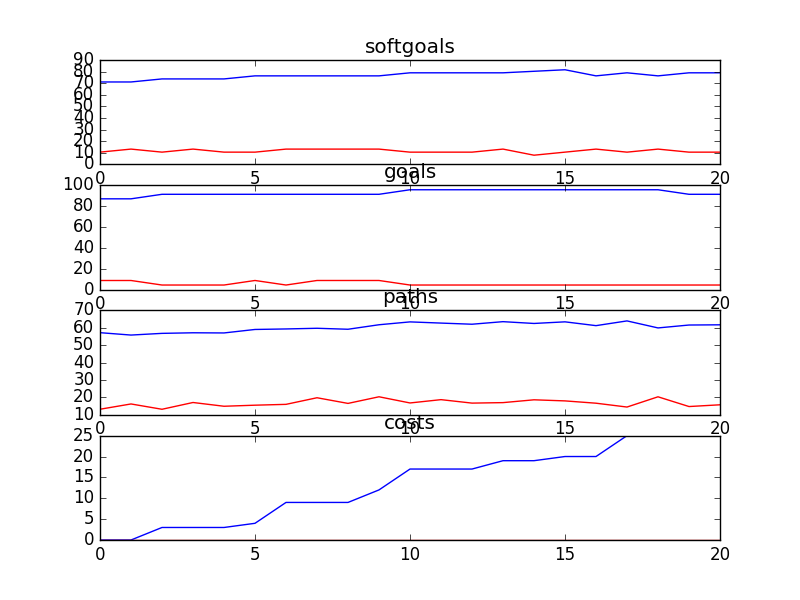

## CSITDepartment
```

rank ,         name ,    med   ,   iqr 
----------------------------------------------------
   1 ,      gen0_f1 ,    76.32  ,   5.27 (    ----  * ---|-----         ),68.42, 73.68, 76.32, 78.95, 89.47
   2 ,     gen20_f1 ,    89.47  ,  10.53 (            ---|-    * ----   ),78.95, 84.21, 89.47, 92.11, 97.37
   2 ,     gen40_f1 ,    92.11  ,  10.53 (            ---|---    * --   ),78.95, 86.84, 92.11, 94.74, 97.37
   2 ,     gen60_f1 ,    92.11  ,    7.9 (               | --    * --   ),84.21, 86.84, 92.11, 94.74, 97.37
   2 ,     gen80_f1 ,    92.11  ,    7.9 (               | ----  * --   ),84.21, 89.47, 92.11, 94.74, 97.37
   2 ,    gen100_f1 ,    92.11  ,    7.9 (               |   --  * --   ),86.84, 89.47, 92.11, 94.74, 97.37

rank ,         name ,    med   ,   iqr 
----------------------------------------------------
   1 ,      gen0_f2 ,     91.3  ,   8.69 (            ---|-*            ),86.96, 91.30, 91.30, 95.65, 95.65
   2 ,     gen20_f2 ,    95.65  ,   4.35 (               |       *----- ),91.30, 91.30, 95.65, 95.65, 100.00
   2 ,     gen40_f2 ,    95.65  ,   4.35 (               |       *----- ),91.30, 91.30, 95.65, 95.65, 100.00
   2 ,     gen60_f2 ,    95.65  ,   4.35 (               |       *----- ),91.30, 91.30, 95.65, 95.65, 100.00
   2 ,     gen80_f2 ,    95.65  ,   4.35 (               |       *----- ),91.30, 91.30, 95.65, 95.65, 100.00
   2 ,    gen100_f2 ,    95.65  ,   4.35 (               |       *----- ),91.30, 91.30, 95.65, 95.65, 100.00

rank ,         name ,    med   ,   iqr 
----------------------------------------------------
   1 ,      gen0_f3 ,    63.23  ,  14.35 (   ---  *   ---|---           ),53.17, 58.69, 63.43, 70.45, 84.21
   2 ,     gen20_f3 ,    79.07  ,  15.27 (          ---  | *   ---      ),66.67, 72.37, 79.60, 86.63, 92.46
   2 ,     gen40_f3 ,    81.84  ,  14.39 (           --- |  *  ---      ),67.49, 73.88, 82.14, 86.74, 93.51
   2 ,     gen60_f3 ,    81.84  ,  13.17 (             --|  *  ---      ),71.32, 76.61, 82.14, 87.36, 93.94
   2 ,     gen80_f3 ,    83.24  ,  12.07 (             --|-  * ---      ),72.06, 79.24, 83.87, 87.36, 93.94
   2 ,    gen100_f3 ,    83.24  ,  12.07 (             --|-  * ----     ),72.23, 79.24, 83.87, 87.26, 94.59

rank ,         name ,    med   ,   iqr 
----------------------------------------------------
   1 ,     gen60_f4 ,     28.0  ,   10.0 (   -----  *   -|---           ),19.00, 25.00, 28.00, 33.00, 40.00
   1 ,     gen80_f4 ,     28.0  ,   10.0 (    ----  * ---|---           ),20.00, 25.00, 28.00, 31.00, 40.00
   1 ,    gen100_f4 ,     28.0  ,   10.0 (   ----   * ---|---           ),19.00, 24.00, 28.00, 31.00, 40.00
   1 ,     gen40_f4 ,     29.0  ,   10.0 (    ----   *   |---           ),20.00, 26.00, 29.00, 35.00, 40.00
   2 ,     gen20_f4 ,     31.0  ,   12.0 (      ----  *  | -----        ),23.00, 28.00, 31.00, 38.00, 44.00
   2 ,      gen0_f4 ,     32.0  ,   13.0 (      ---     *| -----        ),23.00, 27.00, 33.00, 38.00, 44.00
```

### Time Taken : 28.7896649837


### Decisions Ranked
```
+------+-------------------------------------------------+----------+-------+------+
| rank |                       name                      |   type   | value | cost |
+------+-------------------------------------------------+----------+-------+------+
|  1   |         Provide Online Donor Technology1        |   task   |   -1  |  4   |
|  2   |                      Use T1                     |   task   |   1   |  3   |
|  3   | Provide Technology to Create and Send Documents |   task   |   -1  |  1   |
|  4   |            Put Content Onto Website1            |   task   |   -1  |  3   |
|  5   |      Use Informal Buddy System for Training     |   task   |   1   |  1   |
|  6   |                 Free Web Server                 | resource |   1   |  5   |
|  7   |                   Web Server1                   | resource |   -1  |  3   |
|  8   |         *Implement Email for Counsellors        |   task   |   -1  |  4   |
|  9   |            !Implement Phone Feedback1           |   task   |   1   |  3   |
|  10  |                  Free Software                  | resource |   1   |  5   |
|  11  |  Perform Donor/Accounting Data Base Maintenance |   task   |   -1  |  4   |
|  12  |                  Free Upgrades                  | resource |   -1  |  3   |
|  13  |                     Use VPN                     |   task   |   1   |  2   |
|  14  |                   IT Resources                  | resource |   -1  |  3   |
|  15  |                Use Current Method               |   task   |   1   |  1   |
|  16  |                      Oracle                     | resource |   -1  |  4   |
|  17  |                     Software                    | resource |   1   |  5   |
|  18  |                  Free Hardware                  | resource |   -1  |  3   |
|  19  |                     Hardware                    | resource |   -1  |  4   |
|  20  |                   Network PCs                   |   task   |   -1  |  4   |
|  21  |                     Upgrades                    | resource |   -1  |  5   |
+------+-------------------------------------------------+----------+-------+------+
```

### Top 14 Decisions from above table.
```
+------------------------------------------------------------------------+----------+-------+
|                                  name                                  |   type   | value |
+------------------------------------------------------------------------+----------+-------+
|               Easily Accessable Technology Instructions1               | softgoal |   1   |
|     Properly and Suitably Equipped in IT [to Accomplish CS Needs]1     | softgoal |  0.5  |
|                             Free Upgrades                              | resource |   -1  |
|            Increase Access Speed [  Regional Offices to DL]            | softgoal |   1   |
|                       Put Content Onto Website1                        |   task   |   -1  |
|                  Improve Quality Assurance Technology                  | softgoal |  0.5  |
|                     Hardware Be Acquired for Free                      |   task   |   -1  |
|                                Use VPN                                 |   task   |   1   |
|    Sensitive to the Environment IT Equipment will Be Introduced to     | softgoal |  0.5  |
|                  !Calls Be Recorded into a Data Base1                  |   goal   |   1   |
|               IT Training/Support Be Given to Employees                |   goal   |   1   |
|                              IT Resources                              | resource |   -1  |
|   Properly and Suitably Equipped in IT [to Accomplish Service Goals]   | softgoal |  0.5  |
|                                 Oracle                                 | resource |   -1  |
|                    Decrease Clumsiness [Technology]                    | softgoal |   1   |
|                        Use Oracle for Data Base                        |   task   |   -1  |
|                    Provide Document Library System1                    |   task   |   1   |
|                       Cost Effective Technology                        | softgoal |  0.5  |
|                           *Pay for Upgrades                            |   task   |   1   |
|         Call Center Server and Scheduling System Be Integrated         |   goal   |   1   |
|                  Improve [Call Recording Equipment]1                   | softgoal |   1   |
|          Fit Between System Capabilities and CS Requirements           | softgoal |  0.5  |
|     Properly and Suitably Equipped in IT [to Accomplish CS Needs]      | softgoal |  0.5  |
|                         !Integrate IT Systems                          |   goal   |   1   |
|       !Performance Review Information Be Collected in Data Base        |   goal   |   1   |
|                          CS Be Not for Profit                          |   goal   |   1   |
|                *Increase [IT Training for Counsellors]1                | softgoal |  0.5  |
|                       !An IT Trainer Be Present1                       |   goal   |   1   |
|                        *Cost Effective Training                        | softgoal |  -0.5 |
|       *IT Providers have Knowledge of Fundraising and Marketing        |   goal   |   1   |
|                            Free Web Server                             | resource |   1   |
|               Easily Accessable Technology Instructions                | softgoal |   1   |
|                         *Hardware Be Acquired                          |   goal   |   1   |
|                     *Implement Categorization Tool                     |   task   |   1   |
|                       !An IT Trainer Be Present                        |   goal   |   1   |
|                      Feedback Form Be Implemented                      |   task   |   1   |
|                       !Implement Phone Feedback1                       |   task   |   1   |
|                  Support Analysis [Counsellors Time]1                  | softgoal |  0.5  |
|            Provide Technology to Create and Send Documents             |   task   |   -1  |
|                              Network PCs                               |   task   |   1   |
|                             Free Software                              | resource |   1   |
|                          Simple [Technology]1                          | softgoal |  0.5  |
|                Increase IT Methods to Acquire Feedback                 | softgoal |  0.5  |
|                           *Pay for Software                            |   task   |   1   |
|          Implement Director Enterprise through Blue Pumpkin            |   task   |   1   |
|                 Telephony Be Implemented and Managed1                  |   goal   |   1   |
|                      *Implement Activity Manager                       |   task   |   1   |
|                Adequately Customizable [CS Technology]                 | softgoal |   1   |
|                          Simple [Technology]                           | softgoal |  0.5  |
|                           Use Current Method                           |   task   |   -1  |
| Properly and Suitably Equipped in IT [to Accomplish Fundraising Needs] | softgoal |  0.5  |
|                 Improve Quality Assurance Technology1                  | softgoal |  0.5  |
|      Increased Emphasis on IT in Hiring Process [of Counsellors]       | softgoal |   1   |
|           Increase Access Speed [  Regional Offices to DL]1            | softgoal |   1   |
|                    *Implement Email for Counsellors                    |   task   |   -1  |
|                      Keep Up With New Technology                       | softgoal |  0.5  |
|                          Acquire IT Resources                          |   task   |   -1  |
|                                 Use T1                                 |   task   |   1   |
|                         *Effective IT Training                         | softgoal |  -0.5 |
|                        Install Desktop Software                        |   task   |   1   |
|                   Decrease Clumsiness [Technology]1                    | softgoal |   1   |
|                 Use Informal Buddy System for Training                 |   task   |   1   |
|                       *Acquire Software for Free                       |   task   |   1   |
|                    !A Training Computer Be Present1                    |   goal   |   1   |
|                       Adjust to Software Changes                       | softgoal |  -0.5 |
|                             Free Hardware                              | resource |   -1  |
|                Consideration of Feedback [IT Providers]                | softgoal |   1   |
|                         Increase IT Resources1                         | softgoal |   1   |
|                  Telephony Be Implemented and Managed                  |   task   |   1   |
|                                Software                                | resource |   1   |
|                            Pay for Hardware                            |   task   |   1   |
|                   Manage Donor/ Accounting Data Base                   |   task   |   -1  |
|                              Web Server1                               | resource |   -1  |
|              *IT Providers have Knowledge of Counselling               |   goal   |   1   |
|       !Performance Review Information Be Collected in Data Base1       |   goal   |   1   |
|                       !IT Systems Be Integrated                        |   goal   |   1   |
|                          Expand IT Department                          | softgoal |  -0.5 |
|                            Acquire Software                            |   goal   |   1   |
|                        *Web Server Be Acquired                         |   goal   |   1   |
|                         CS Be Not for Profit1                          |   goal   |   1   |
|      Increased Emphasis on IT in Hiring Process [of Counsellors]1      | softgoal |   1   |
|                         Increase IT Resources                          | softgoal |  -0.5 |
|                      *Acquire Web Server for Free                      |   task   |   1   |
|                   Improve [Call Recording Equipment]                   | softgoal |   1   |
|                                Hardware                                | resource |   1   |
|                                Upgrades                                | resource |   1   |
|                  !Calls Be Recorded into a Data Base                   |   goal   |   1   |
|                       *Implement Bulletin Board                        |   task   |   1   |
|                             IT Be Upgraded                             |   goal   |   1   |
|             Perform Donor/Accounting Data Base Maintenance             |   task   |   -1  |
|                        Acquire Telephone Switch                        |   task   |   1   |
|              Consideration of Feedback [from Counsellors]              | softgoal |   1   |
|                *Increase [IT Training for Counsellors]                 | softgoal |  0.5  |
|                          *Pay for Web Server                           |   task   |   -1  |
|                  Support Analysis [Counsellors Time]                   | softgoal |  0.5  |
|                    Provide Online Donor Technology1                    |   task   |   -1  |
|               IT Dept Provides Orientation and Training                |   task   |   1   |
|                       *Web Software Be Acquired                        |   goal   |   1   |
|                    !A Training Computer Be Present                     |   goal   |   1   |
|                     Increase IT Training Resources                     | softgoal |  -0.5 |
|              Provide Peer-to-Peer Access Regional Offices              |   goal   |   1   |
|                Increase IT Methods to Acquire Feedback1                | softgoal |  0.5  |
+------------------------------------------------------------------------+----------+-------+
```
