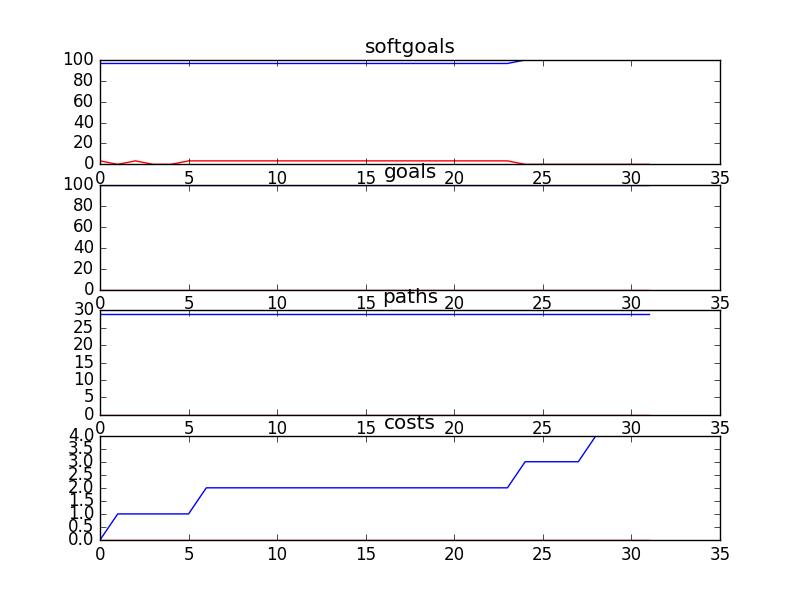

## CSFDandMarketingSD
```

rank ,         name ,    med   ,   iqr 
----------------------------------------------------
   1 ,      gen0_f1 ,    96.67  ,    0.0 (*--------------|------------- ),96.67, 96.67, 96.67, 96.67, 100.00
   1 ,     gen20_f1 ,    96.67  ,    0.0 (*--------------|------------- ),96.67, 96.67, 96.67, 96.67, 100.00
   1 ,     gen40_f1 ,    96.67  ,    0.0 (*--------------|------------- ),96.67, 96.67, 96.67, 96.67, 100.00
   1 ,     gen60_f1 ,    96.67  ,    0.0 (*--------------|------------- ),96.67, 96.67, 96.67, 96.67, 100.00
   1 ,     gen80_f1 ,    96.67  ,   3.33 (*--------------|------------- ),96.67, 96.67, 96.67, 96.67, 100.00
   1 ,    gen100_f1 ,    96.67  ,   3.33 (*              |              ),96.67, 96.67, 96.67, 100.00, 100.00

rank ,         name ,    med   ,   iqr 
----------------------------------------------------
   1 ,      gen0_f2 ,    100.0  ,    0.0 (*              |              ),100.00, 100.00, 100.00, 100.00, 100.00
   1 ,     gen20_f2 ,    100.0  ,    0.0 (*              |              ),100.00, 100.00, 100.00, 100.00, 100.00
   1 ,     gen40_f2 ,    100.0  ,    0.0 (*              |              ),100.00, 100.00, 100.00, 100.00, 100.00
   1 ,     gen60_f2 ,    100.0  ,    0.0 (*              |              ),100.00, 100.00, 100.00, 100.00, 100.00
   1 ,     gen80_f2 ,    100.0  ,    0.0 (*              |              ),100.00, 100.00, 100.00, 100.00, 100.00
   1 ,    gen100_f2 ,    100.0  ,    0.0 (*              |              ),100.00, 100.00, 100.00, 100.00, 100.00

rank ,         name ,    med   ,   iqr 
----------------------------------------------------
   1 ,      gen0_f3 ,     29.0  ,    0.0 (*              |              ),29.00, 29.00, 29.00, 29.00, 29.00
   1 ,     gen20_f3 ,     29.0  ,    0.0 (*              |              ),29.00, 29.00, 29.00, 29.00, 29.00
   1 ,     gen40_f3 ,     29.0  ,    0.0 (*              |              ),29.00, 29.00, 29.00, 29.00, 29.00
   1 ,     gen60_f3 ,     29.0  ,    0.0 (*              |              ),29.00, 29.00, 29.00, 29.00, 29.00
   1 ,     gen80_f3 ,     29.0  ,    0.0 (*              |              ),29.00, 29.00, 29.00, 29.00, 29.00
   1 ,    gen100_f3 ,     29.0  ,    0.0 (*              |              ),29.00, 29.00, 29.00, 29.00, 29.00

rank ,         name ,    med   ,   iqr 
----------------------------------------------------
   1 ,     gen80_f4 ,     11.0  ,    3.0 (      --*   -- |              ),10.00, 11.00, 11.00, 13.00, 14.00
   1 ,    gen100_f4 ,     11.0  ,    2.0 (  ----  * --   |              ), 8.00, 10.00, 11.00, 12.00, 13.00
   2 ,     gen60_f4 ,     12.0  ,    3.0 (      --  *   -|-             ),10.00, 11.00, 12.00, 14.00, 15.00
   2 ,     gen40_f4 ,     13.0  ,    3.0 (      --    * -|-             ),10.00, 11.00, 13.00, 14.00, 15.00
   3 ,     gen20_f4 ,     14.0  ,    4.0 (      ------  *| --           ),10.00, 13.00, 14.00, 15.00, 16.00
   4 ,      gen0_f4 ,     15.0  ,    2.0 (        ------ | * ------     ),11.00, 14.00, 15.00, 16.00, 19.00
```

### Time Taken : 7.66199994087


### Decisions Ranked
```
+------+----------------------------------------------+----------+-------+------+
| rank |                     name                     |   type   | value | cost |
+------+----------------------------------------------+----------+-------+------+
|  1   |            Collect Pledge online             |   task   |   1   |  1   |
|  2   |             ! Market CS Service              |   task   |   -1  |  1   |
|  3   |                 Sponsor Logo                 | resource |   -1  |  1   |
|  4   |                  Agreement                   | resource |   -1  |  1   |
|  5   |            Participate in events             |   task   |   -1  |  1   |
|  6   |  Get Corporate Partner Information from DL   |   task   |   1   |  1   |
|  7   | ! Counselor Speak on Kids Issues in General  |   task   |   -1  |  1   |
|  8   |           Philanthropic donations            |   task   |   -1  |  1   |
|  9   |                Provide funds                 |   task   |   -1  |  1   |
|  10  |        ! Provide compiled call data          |   task   |   -1  |  1   |
|  11  |               Manage Accounts                |   task   |   -1  |  1   |
|  12  |           Get sponsors for events            |   task   |   -1  |  1   |
|  13  |                    Funds                     | resource |   -1  |  1   |
|  14  |           Create General Ledgers             |   task   |   -1  |  1   |
|  15  |             Pledge\nDuring event             |   task   |   -1  |  1   |
|  16  |             Manage Receivables               |   task   |   -1  |  1   |
|  17  |              Free advertisement              | resource |   -1  |  1   |
|  18  |            Provide free services             |   task   |   -1  |  1   |
|  19  |       ! Write Articles for Magazines         |   task   |   -1  |  1   |
|  20  |               Provide receipts               |   task   |   -1  |  1   |
|  21  |        Use sponsor marketing channels        |   task   |   -1  |  1   |
|  22  |           National Event Calendar            | resource |   -1  |  1   |
|  23  |         Manage\nPartner Relationship         |   task   |   -1  |  1   |
|  24  |    Single charitable registration number     | resource |   1   |  1   |
|  25  |       Provide Document Library System        |   task   |   -1  |  1   |
|  26  |        ! Write Articles for Website          |   task   |   -1  |  1   |
|  27  |       Provide Online Donor Technology        |   task   |   -1  |  1   |
|  28  |             Sponsorship proposal             |   task   |   1   |  1   |
|  29  |         ! Provide money for services         |   task   |   -1  |  1   |
|  30  |                Pledge online                 |   task   |   -1  |  1   |
|  31  |         Provide fundraising services         |   task   |   -1  |  1   |
|  32  |         Provide fundraising services         |   task   |   -1  |  1   |
+------+----------------------------------------------+----------+-------+------+
```

### Top 26 Decisions from above table.
```
+----------------------------------------------------------------+----------+-------+
|                              name                              |   type   | value |
+----------------------------------------------------------------+----------+-------+
|                      ! Market CS Service                       |   task   |   -1  |
|          Exclusive Relationships [Official Partners]           | softgoal |   1   |
|            Up to date corporate partner information            | softgoal |   1   |
|                Provide Online Donor Technology                 |   task   |   1   |
|                      Pledge\nDuring event                      |   task   |   -1  |
|                   Accountability of services                   | softgoal |   1   |
|                Recognize\nSponsor contribution                 | softgoal |   1   |
|                ! Write Articles for Magazines                  |   task   |   -1  |
|                  Exclusive Brand and Logo use                  | softgoal |   1   |
|               High Response [Individual Donors]                | softgoal |   1   |
|             Single charitable registration number              | resource |   1   |
|                    National Event Calendar                     | resource |   -1  |
|                      Quality [Services]                        | softgoal |   1   |
|                  *Engage employees in events                   | softgoal |   1   |
|                           CS Stories                           | softgoal |   1   |
|                        Provide receipts                        |   task   |   -1  |
|                     Collect Pledge online                      |   task   |   1   |
|                       Free advertisement                       | resource |   -1  |
|                      Published CS Stories                      | softgoal |   1   |
| Increase Access Speed [  Regional Offices to Document Library] | softgoal |   1   |
|                   Engage Employees in events                   | softgoal |   1   |
|                             Funds                              | resource |   -1  |
|                  Regional Staff feel included                  | softgoal |   1   |
|                      Sponsorship proposal                      |   task   |   1   |
|               Follow Highest Ethical Guidelines                | softgoal |   1   |
|                !Acquire public speaking skills                 | softgoal |   1   |
|                    Create General Ledgers                      |   task   |   -1  |
|                  Regional\nContact management                  | softgoal |   1   |
|                  Regional\nContact management                  | softgoal |   1   |
|                          Sponsor Logo                          | resource |   -1  |
|                 ! Provide compiled call data                   |   task   |   -1  |
|                 Use sponsor marketing channels                 |   task   |   -1  |
|           Get Corporate Partner Information from DL            |   task   |   1   |
|                      Manage Receivables                        |   task   |   -1  |
|                     Demonstrable Services                      | softgoal |   1   |
|                  Provide fundraising services                  |   task   |   1   |
|                Provide Document Library System                 |   task   |   -1  |
|                  ! Provide money for services                  |   task   |   1   |
|                        Manage Accounts                         |   task   |   -1  |
|          ! Counselor Speak on Kids Issues in General           |   task   |   -1  |
|                      [Increase] Awareness                      | softgoal |   1   |
|                         Provide funds                          |   task   |   -1  |
|                      Promotion Resources                       | softgoal |   1   |
|                     Provide free services                      |   task   |   -1  |
|                Experienced [marketing partners]                | softgoal |   1   |
|                    Credibility [CS Brand]                      | softgoal |   1   |
|                    Get sponsors for events                     |   task   |   -1  |
|         ! Services be provided for Kids Bullying Line          |   goal   |   1   |
|                         Pledge online                          |   task   |   -1  |
|                       Retain [Sponsors]                        | softgoal |   1   |
|                      Presentation Skills                       | softgoal |   1   |
|                    Philanthropic donations                     |   task   |   -1  |
|                  Manage\nPartner Relationship                  |   task   |   -1  |
|                 ! Write Articles for Website                   |   task   |   -1  |
|                        Timely services                         | softgoal |   1   |
|             Up to Date [Information on programs]               | softgoal |   1   |
|                   Sponsor partner\ncontacts                    | softgoal |   1   |
|                           Agreement                            | resource |   -1  |
|                   Project Management Skills                    | softgoal |   1   |
|                 Quick [Response to Sponsors]                   | softgoal |   1   |
|               Responsible Usage [Sponsor Funds]                | softgoal |   1   |
|                     Participate in events                      |   task   |   -1  |
+----------------------------------------------------------------+----------+-------+
```
