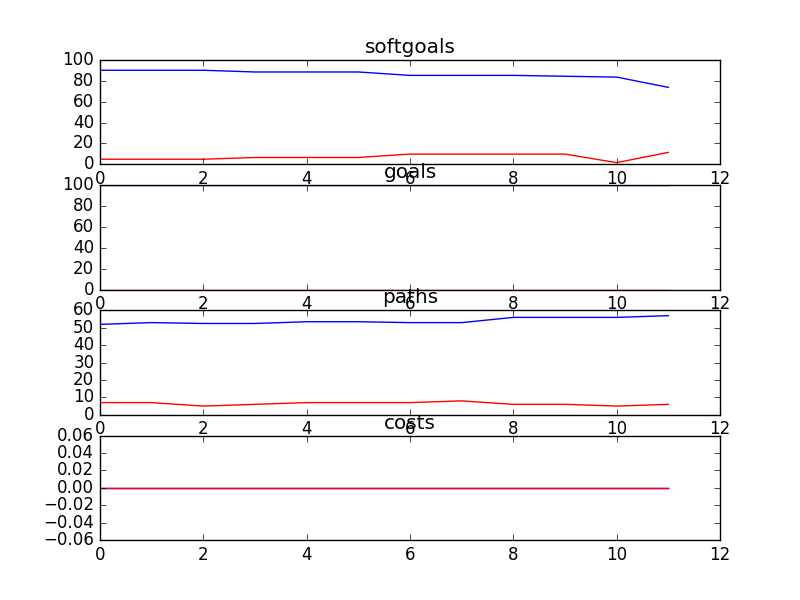

## CSSAProgram
```

rank ,         name ,    med   ,   iqr 
----------------------------------------------------
   1 ,    gen100_f1 ,    90.16  ,   6.56 (               |----   *      ),85.25, 88.52, 90.16, 95.08, 95.08
   1 ,     gen20_f1 ,    90.16  ,   4.92 (               |    ---      *),88.52, 90.16, 95.08, 95.08, 95.08
   1 ,     gen60_f1 ,    90.16  ,   6.56 (               |-------      *),85.25, 90.16, 95.08, 95.08, 95.08
   1 ,     gen80_f1 ,    90.16  ,   6.56 (               |-------      *),85.25, 90.16, 95.08, 95.08, 95.08
   1 ,      gen0_f1 ,    95.08  ,   4.92 (               |    ---      *),88.52, 90.16, 95.08, 95.08, 95.08
   1 ,     gen40_f1 ,    95.08  ,   4.92 (               |    ---      *),88.52, 90.16, 95.08, 95.08, 95.08

rank ,         name ,    med   ,   iqr 
----------------------------------------------------
   1 ,      gen0_f2 ,    100.0  ,    0.0 (*              |              ),100.00, 100.00, 100.00, 100.00, 100.00
   1 ,     gen20_f2 ,    100.0  ,    0.0 (*              |              ),100.00, 100.00, 100.00, 100.00, 100.00
   1 ,     gen40_f2 ,    100.0  ,    0.0 (*              |              ),100.00, 100.00, 100.00, 100.00, 100.00
   1 ,     gen60_f2 ,    100.0  ,    0.0 (*              |              ),100.00, 100.00, 100.00, 100.00, 100.00
   1 ,     gen80_f2 ,    100.0  ,    0.0 (*              |              ),100.00, 100.00, 100.00, 100.00, 100.00
   1 ,    gen100_f2 ,    100.0  ,    0.0 (*              |              ),100.00, 100.00, 100.00, 100.00, 100.00

rank ,         name ,    med   ,   iqr 
----------------------------------------------------
   1 ,      gen0_f3 ,     56.0  ,    7.0 (     -----   * |-----         ),50.00, 54.00, 56.00, 59.00, 63.00
   1 ,     gen20_f3 ,     56.0  ,    5.0 (       ---   * |------        ),51.00, 54.00, 56.00, 59.00, 64.00
   1 ,     gen40_f3 ,     56.0  ,    6.0 (       ---   * | -----        ),51.00, 54.00, 56.00, 60.00, 64.00
   1 ,     gen60_f3 ,     57.0  ,    6.0 (        --    *| ---          ),52.00, 54.00, 57.00, 60.00, 62.00
   1 ,     gen80_f3 ,     57.0  ,    6.0 (        --    *| ---          ),52.00, 54.00, 57.00, 60.00, 62.00
   1 ,    gen100_f3 ,     57.0  ,    6.0 (        --    *| ---          ),52.00, 54.00, 57.00, 60.00, 62.00

rank ,         name ,    med   ,   iqr 
----------------------------------------------------
   1 ,     gen20_f4 ,      3.0  ,    1.0 (    ---* ---   |              ), 2.00,  3.00,  3.00,  4.00,  5.00
   1 ,     gen40_f4 ,      3.0  ,    1.0 (    ---*-      |              ), 2.00,  3.00,  3.00,  3.00,  4.00
   1 ,     gen60_f4 ,      3.0  ,    1.0 (       *       |              ), 2.00,  2.00,  3.00,  3.00,  3.00
   1 ,     gen80_f4 ,      3.0  ,    1.0 (       *       |              ), 2.00,  2.00,  3.00,  3.00,  3.00
   1 ,    gen100_f4 ,      3.0  ,    1.0 (       *       |              ), 2.00,  2.00,  3.00,  3.00,  3.00
   2 ,      gen0_f4 ,      6.0  ,    3.0 (         ---  *|------        ), 4.00,  5.00,  6.00,  6.00,  9.00
```

### Time Taken : 21.9045851231


### Decisions Ranked
```
+------+-------------------------------+----------+-------+------+
| rank |              name             |   type   | value | cost |
+------+-------------------------------+----------+-------+------+
|  1   | School Initiates Presenation1 |   task   |   -1  |  1   |
|  2   |       Attend SA Meetings      |   task   |   -1  |  1   |
|  3   |        Send out Emails        |   task   |   -1  |  1   |
|  4   |      Promotion Resources1     | resource |   -1  |  1   |
|  5   |    Help with Presentations    |   task   |   -1  |  1   |
|  6   |       Plan Social Events      |   task   |   -1  |  1   |
|  7   |        Provide Speaches       |   task   |   -1  |  1   |
|  8   |   Run Fundraiser in Schools1  |   task   |   -1  |  1   |
|  9   |          Retrain SA s         |   task   |   -1  |  1   |
|  10  |           Train SA s          |   task   |   -1  |  1   |
|  11  |       Attend CS Meetings      |   task   |   -1  |  1   |
|  12  |  Write Articles for Newspaper |   task   |   1   |  1   |
+------+-------------------------------+----------+-------+------+
```

### Top 6 Decisions from above table.
```
+--------------------------------------------------------+----------+-------+
|                          name                          |   type   | value |
+--------------------------------------------------------+----------+-------+
|           Acquire Volunteer Outreach Skills1           | softgoal |  0.5  |
|                 Experience for Resume                  | softgoal |  0.5  |
|                 Improve Image to Kids1                 | softgoal |  0.5  |
|                  Speak at Fundraisers                  |   task   |   -1  |
|            Acquire Public Speaking Skills1             | softgoal |  0.5  |
|                   Attend SA Meetings                   |   task   |   -1  |
|                 Increased SA Resources                 | softgoal |   1   |
|               Acquire Fundraising Skills               | softgoal |  0.5  |
|              Increase Involvement of SA s              | softgoal |  0.5  |
|                   Make New Friends1                    | softgoal |  0.5  |
|           Community Service Hours Completed            |   goal   |   1   |
|                    Increase Skills                     | softgoal |  0.5  |
|                    Trust [of Kids]                     | softgoal |  0.5  |
|          Help Put on SA Training Conferences           |   task   |   1   |
|             Write Articles for Newspaper2              |   task   |   1   |
|              Provide Promotion Resources               |   task   |   -1  |
|              Acquire Fundraising Skills2               | softgoal |  0.5  |
|           Create Life Long Volunteer Spirit            | softgoal |  0.5  |
|                  SA s are Organized1                   | softgoal |  0.5  |
|               *Expansion of SA Services                | softgoal |  0.5  |
|             School Initiates Presenation1              |   task   |   -1  |
|           Create Life Long Volunteer Spirit1           | softgoal |  0.5  |
|                 Give CS Presentations1                 |   task   |   1   |
|                   Plan Social Events                   |   task   |   -1  |
|                      Be Confident                      | softgoal |  0.5  |
|                 Give CS Presentations                  |   task   |   1   |
|                Increased SA Resources1                 | softgoal |   1   |
|                   SA s are Outgoing1                   | softgoal |  0.5  |
|                   SA s are Organized                   | softgoal |  0.5  |
|            Happiness [Student Ambassadors]             | softgoal |  0.5  |
|             Keep in Touch with Volunteers              | softgoal |  0.5  |
|       Plan and Put on Reconnection Conferences1        |   task   |   1   |
|                      Retrain SA s                      |   task   |   1   |
|              Find Help with Presentations              |   task   |   -1  |
|                    Be Enthusiastic                     | softgoal |  0.5  |
|                 Have Time for School2                  | softgoal |  -0.5 |
|                 Improve Image to Kids                  | softgoal |  0.5  |
|                Positive Reputation [CS]                | softgoal |   1   |
|                 Have Time for School1                  | softgoal |  -0.5 |
|             Write Articles for Newspaper1              |   task   |   1   |
|                Help with Presentations1                |   task   |   -1  |
|            Ask for Help with Presentations             |   task   |   -1  |
|                   Spread Awareness1                    | softgoal |  0.5  |
|                    Trust [of Kids]1                    | softgoal |  0.5  |
|           Acquire Volunteer Outreach Skills            | softgoal |  0.5  |
|       Plan and Put on Reconnection Conferences2        |   task   |   1   |
|                   SA s are Outgoing                    | softgoal |  0.5  |
|            Happiness [Student Ambassadors]2            | softgoal |  0.5  |
|                      Be Outgoing                       | softgoal |  0.5  |
|             Acquire Public Speaking Skills             | softgoal |  0.5  |
|           Community Service Hours Completed2           |   goal   |   1   |
|                  SA s are Confident1                   | softgoal |  0.5  |
|                       Train SA s                       |   task   |   1   |
|         Permission for Presentations Be Given          |   goal   |   1   |
|           More Promotion Resources Available           | softgoal |  0.5  |
|                   SA s are Confident                   | softgoal |  0.5  |
|                    Provide Speaches                    |   task   |   -1  |
|                  Have Time for School                  | softgoal |  -0.5 |
|                Give Back to Community2                 | softgoal |  0.5  |
|               Run Fundraiser in Schools1               |   task   |   -1  |
|                *Increase Writing Skills                | softgoal |  0.5  |
|      Kids Be Used to Communicate with Other Kids       |   goal   |   1   |
|        Plan and Put on Reconnection Conferences        |   task   |   1   |
|     Help Plan and Put on Reconnection Conferences1     |   task   |   1   |
|               *Increase Writing Skills1                | softgoal |  0.5  |
|                 Speak at Fundraisers2                  |   task   |   -1  |
|                Give Back to Community1                 | softgoal |  0.5  |
|               *Increase Writing Skills2                | softgoal |  0.5  |
|                    Spread Awareness                    | softgoal |  0.5  |
|                    Send out Emails                     |   task   |   -1  |
|                 Reduce Misconceptions                  | softgoal |  0.5  |
|                Help with Presentations                 |   task   |   -1  |
|                   Attend CS Meetings                   |   task   |   1   |
|                      Be Organized                      | softgoal |  0.5  |
|                    Make New Friends                    | softgoal |  0.5  |
|                  Quality SA Services1                  | softgoal |  0.5  |
| *Engagement Student Ambassadors in promoting awareness | softgoal |  0.5  |
|              Acquire Fundraising Skills1               | softgoal |  0.5  |
|                 SA s are Enthusiastic1                 | softgoal |  0.5  |
|                  Promotion Resources1                  | resource |   -1  |
|                Presenation Be Initiated                |   goal   |   1   |
|           Initiate Presentation With Schools           |   task   |   1   |
|                  Quality SA Services                   | softgoal |  0.5  |
|              School Initiates Presenation              |   task   |   -1  |
|              Write Articles for Newspaper              |   task   |   1   |
|            Happiness [Student Ambassadors]1            | softgoal |  0.5  |
|                   Engage Volunteers                    | softgoal |  0.5  |
|                 Give Back to Community                 | softgoal |  0.5  |
|           Acquire Volunteer Outreach Skills2           | softgoal |  0.5  |
|                 Give CS Presentations2                 |   task   |   1   |
|              High Presentation Attendance              | softgoal |  0.5  |
|     Help Plan and Put on Reconnection Conferences      |   task   |   1   |
|           Community Service Hours Completed1           |   goal   |   1   |
|            Acquire Public Speaking Skills2             | softgoal |  0.5  |
|               Positive Reputation [CS]1                | softgoal |   1   |
|             Find Help with Presentations1              |   task   |   -1  |
|                   Make New Friends2                    | softgoal |  0.5  |
|                 Reduce Misconceptions1                 | softgoal |  0.5  |
|                 SA s are Enthusiastic                  | softgoal |  0.5  |
|                 Speak at Fundraisers1                  |   task   |   -1  |
+--------------------------------------------------------+----------+-------+
```
