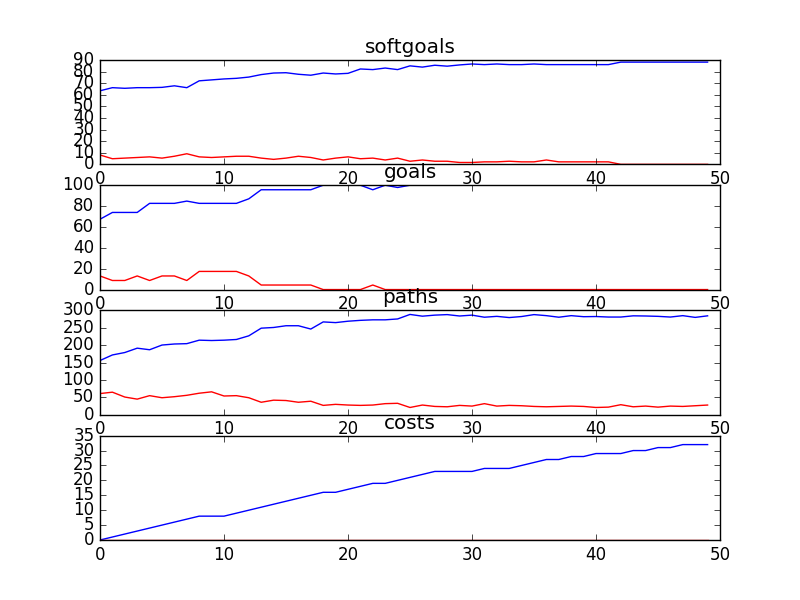

## CSServices
```

rank ,         name ,    med   ,   iqr 
----------------------------------------------------
   1 ,      gen0_f1 ,    66.67  ,   6.99 (     --   *  --|              ),62.37, 64.52, 67.20, 70.43, 74.19
   2 ,     gen20_f1 ,    76.34  ,  10.22 (        ------ |  *   ---     ),65.59, 71.51, 76.34, 80.65, 83.87
   2 ,     gen40_f1 ,    78.49  ,  10.75 (            ---|    *  -----  ),69.89, 73.12, 78.49, 81.72, 87.10
   3 ,     gen60_f1 ,    79.57  ,  12.36 (             --|     *   ---  ),70.43, 73.12, 80.11, 83.87, 87.10
   3 ,     gen80_f1 ,    80.65  ,  10.22 (             --|----  *  ---  ),70.97, 78.49, 80.65, 84.41, 87.10
   3 ,    gen100_f1 ,    81.18  ,   6.99 (              -|-----  *  --  ),72.58, 79.57, 81.72, 84.95, 87.63

rank ,         name ,    med   ,   iqr 
----------------------------------------------------
   1 ,      gen0_f2 ,    69.57  ,  30.43 (--           * |  -------     ),43.48, 47.83, 69.57, 78.26, 91.30
   2 ,     gen20_f2 ,    95.65  ,   8.69 (               |  -----    *- ),78.26, 86.96, 95.65, 95.65, 100.00
   2 ,     gen40_f2 ,    95.65  ,    8.7 (               |    -----  *  ),82.61, 91.30, 95.65, 100.00, 100.00
   2 ,     gen60_f2 ,    95.65  ,   4.35 (               |       ----*  ),86.96, 95.65, 95.65, 100.00, 100.00
   2 ,     gen80_f2 ,    95.65  ,   4.35 (               |         --*  ),91.30, 95.65, 95.65, 100.00, 100.00
   3 ,    gen100_f2 ,    95.65  ,   4.35 (               |         --  *),91.30, 95.65, 100.00, 100.00, 100.00

rank ,         name ,    med   ,   iqr 
----------------------------------------------------
   1 ,      gen0_f3 ,    179.0  ,  102.0 (----      *  --|-             ),91.00, 127.00, 180.00, 202.00, 235.00
   2 ,     gen20_f3 ,    248.0  ,   51.0 (             --|  *  ---      ),201.00, 226.00, 248.00, 274.00, 304.00
   2 ,     gen40_f3 ,    253.0  ,   59.0 (               |   *   -      ),223.00, 234.00, 254.00, 288.00, 304.00
   2 ,     gen60_f3 ,    254.0  ,   53.0 (               |-- *  ---     ),222.00, 244.00, 257.00, 284.00, 306.00
   3 ,     gen80_f3 ,    263.0  ,   40.0 (               |--  * ---     ),232.00, 250.00, 263.00, 281.00, 306.00
   3 ,    gen100_f3 ,    264.0  ,   33.0 (               | -- * ---     ),235.00, 254.00, 267.00, 281.00, 309.00

rank ,         name ,    med   ,   iqr 
----------------------------------------------------
   1 ,      gen0_f4 ,     24.0  ,    5.0 (    ---- *  ---|-             ),20.00, 23.00, 24.00, 26.00, 29.00
   2 ,     gen20_f4 ,     29.0  ,    5.0 (        ----   | * ---        ),23.00, 26.00, 29.00, 31.00, 33.00
   2 ,     gen40_f4 ,     29.0  ,    5.0 (         ----- | * -----      ),24.00, 27.00, 29.00, 31.00, 34.00
   2 ,     gen60_f4 ,     29.0  ,    5.0 (           ----| * --         ),25.00, 28.00, 29.00, 31.00, 32.00
   2 ,     gen80_f4 ,     29.0  ,    4.0 (           ----| * --         ),25.00, 28.00, 29.00, 31.00, 32.00
   2 ,    gen100_f4 ,     29.0  ,    3.0 (           ----| * --         ),25.00, 28.00, 29.00, 31.00, 32.00
```

### Time Taken : 227.615849972


### Decisions Ranked
```
+------+------------------------------------------------------------+----------+-------+------+
| rank |                            name                            |   type   | value | cost |
+------+------------------------------------------------------------+----------+-------+------+
|  1   |                Provide Written Counselling                 |   task   |   1   |  1   |
|  2   |                      Web Site Content                      | resource |   1   |  1   |
|  3   |                  Create Counselling Posts                  |   task   |   1   |  1   |
|  4   |                     Service Resources                      | resource |   1   |  1   |
|  5   |                !Moderate Discussion Boards                 |   task   |   1   |  1   |
|  6   |                Kids Use Phone Counselling1                 |   task   |   1   |  1   |
|  7   |                    Strategic Blue Print                    | resource |   1   |  1   |
|  8   |               Voice Counselling be Performed               |   task   |   1   |  1   |
|  9   |       Block Kids who Display Inappropriate Behavoir        |   task   |   -1  |  1   |
|  10  |      Kids Use Bulletin Board with Delayed Moderation1      |   task   |   -1  |  1   |
|  11  |             Maintain Ask a Counsellor Section1             |   task   |   1   |  1   |
|  12  |               *Maintain PHL Phone Services4                |   task   |   1   |  1   |
|  13  |           Kids Use Ask a Counsellor Section\ns1            |   task   |   1   |  1   |
|  14  |              Schedule Chat at Specific Times               |   task   |   1   |  1   |
|  15  |           Kids Use Bulletin Board with Replies1            |   task   |   1   |  1   |
|  16  |               Implement Information Section                |   task   |   1   |  1   |
|  17  |                     Implement Filters                      |   task   |   1   |  1   |
|  18  |           Implement Bulletin Board with Replies1           |   task   |   1   |  1   |
|  19  |                Kids Use Video Counselling1                 |   task   |   -1  |  1   |
|  20  |              Parents Use Information Section1              |   task   |   1   |  1   |
|  21  |                 *Provide Recorded Messages                 |   task   |   1   |  1   |
|  22  |                 !Perform Email Counselling                 |   task   |   1   |  1   |
|  23  |                Kids Use Voice Counselling1                 |   task   |   -1  |  1   |
|  24  |           Kids Use Cyber Café/Portal/Chat Room1            |   task   |   1   |  1   |
|  25  |             !Implement One-On-One Chat Rooms1              |   task   |   1   |  1   |
|  26  |         Kids use get Informed Section of Web Site          |   task   |   1   |  1   |
|  27  |                 !Implement Phone Feedback3                 |   task   |   1   |  1   |
|  28  |              Implement Anti-Pranking Message               |   task   |   -1  |  1   |
|  29  |                Implement Board with Replies                |   task   |   -1  |  1   |
|  30  |  !Implement\nTool to Allow Parents to Talk to Each Other   |   task   |   -1  |  1   |
|  31  |     Implement Bulletin Board with Delayed Moderation1      |   task   |   1   |  1   |
|  32  |                          Feedback                          | resource |   -1  |  1   |
|  33  |                      Implement Delay                       |   task   |   -1  |  1   |
|  34  | Parents Use\nTool to Allow Parents to Talk to Each Other 1 |   task   |   1   |  1   |
|  35  |          Parents Use Bulletin Board with Replies1          |   task   |   1   |  1   |
|  36  |                   Feedback Form Software                   | resource |   1   |  1   |
|  37  |                 Put Content Onto Website1                  |   task   |   -1  |  1   |
|  38  |          Kids Read General Questions and Answers1          |   task   |   1   |  1   |
|  39  |                         Web Server                         | resource |   -1  |  1   |
|  40  |                !Kids Read Polls about Kids1                |   task   |   1   |  1   |
|  41  |                Implement Voice Counselling1                |   task   |   -1  |  1   |
|  42  |                        Trace Calls                         |   task   |   -1  |  1   |
|  43  |             Provide Web Counselling with Video             |   task   |   1   |  1   |
|  44  |             Provide Web Counselling with Audio             |   task   |   -1  |  1   |
|  45  |                Kids Use Email Counselling1                 |   task   |   1   |  1   |
|  46  |                 !Implement Text Messaging1                 |   task   |   -1  |  1   |
|  47  |                         Feedback1                          | resource |   1   |  1   |
|  48  |                        Web Software                        | resource |   -1  |  1   |
|  49  |    Inform Kids about Anonymity [Kids] of Web Services1     |   task   |   -1  |  1   |
|  50  |                      !Moderate a Chat                      |   task   |   -1  |  1   |
+------+------------------------------------------------------------+----------+-------+------+
```

### Top 21 Decisions from above table.
```
+---------------------------------------------------------------+----------+-------+
|                              name                             |   type   | value |
+---------------------------------------------------------------+----------+-------+
|    Answer 80% of Calls within 30 Seconds of Message Ending    |   goal   |   1   |
|                    Implement Feedback Form                    |   task   |   1   |
|                    Decrease Response TIme1                    | softgoal |   1   |
|                    *Increased Web Services3                   | softgoal |  0.5  |
|                    Increase Web Resources2                    | softgoal |   1   |
|               !Implement One-On-One Chat Rooms1               |   task   |   -1  |
|            Kids Read General Questions and Answers            |   task   |   -1  |
|                       Friendly Web Site1                      | softgoal |  0.5  |
|                   Kids Use Voice Counselling                  |   task   |   -1  |
|              Kids Use Ask a Counsellor Section\ns             |   task   |   1   |
|                    Confidentiality [Kids]6                    | softgoal |  0.5  |
|                 Connect Back to the Community5                | softgoal |  0.5  |
|             Kids Use Cyber Café/Portal/Chat Room1             |   task   |   1   |
|                      Strategic Blue Print                     | resource |   1   |
|                   !Implement Phone Feedback                   |   task   |   1   |
|                    Similarity of Problems1                    | softgoal |  0.5  |
|                           Immediacy2                          | softgoal |  0.5  |
|                 Maintain/Implement CS Services                |   task   |   1   |
|                   Accommodate Phone Traffic                   | softgoal |  0.5  |
|            Similarity with other parents  problems            | softgoal |  0.5  |
|                   !Implement Text Messaging                   |   task   |   1   |
|                 *Anonymous Technology Be Used                 |   goal   |   1   |
|               Maintain Ask a Counsellor Section1              |   task   |   1   |
|                  Accommodate Web Site Traffic                 | softgoal |   1   |
|                 *Maintain PHL Phone Services4                 |   task   |   1   |
|                Kids Have Ownership of Services1               | softgoal |   1   |
|                     Services Be Bilingual1                    |   goal   |   1   |
|                  !Moderate Discussion Boards                  |   task   |   1   |
|              Easier Navigation [CS Web Services]1             | softgoal |  0.5  |
|               *Sufficient Counselling Resources1              | softgoal |   1   |
|                  Measure Success of Services4                 | softgoal |  0.5  |
|                       Anonymity [Kids]3                       | softgoal |   1   |
|                    *High Quality Services2                    | softgoal |  0.5  |
|         Easier to Find Posts [Web Posting Technology]1        | softgoal |  0.5  |
|              Kids Use Cyber Café/Portal/Chat Room             |   task   |   1   |
|                   !Implement Phone Feedback3                  |   task   |   1   |
|                      Quality [Services]                       | softgoal |  0.5  |
|                  Kids Use Phone Counselling1                  |   task   |   1   |
|                    Web Services Self Serve1                   | softgoal |  0.5  |
|                   *Efficient Phone Services                   | softgoal |  0.5  |
|             Counsellors Be Professionally Trained             |   goal   |   1   |
|                        Web Site Content                       | resource |   1   |
|                 Connect Back to the Community8                | softgoal |  0.5  |
|               Provide Web Counselling with Video              |   task   |   1   |
|              Non-Real Time E-Counselling Be Used              |   goal   |   1   |
|                  Control of Counselling Work1                 | softgoal |  -0.5 |
|                    *Increased Web Services4                   | softgoal |  0.5  |
|                    Decrease Response TIme2                    | softgoal |  0.5  |
|                    Increase Web Resources1                    | softgoal |   1   |
|                 !Implement Feedback Collection                |   task   |   1   |
|                 Connect Back to the Community1                | softgoal |  0.5  |
|    Encourage Kids Using Web Services to Use Phone Services1   | softgoal |  0.5  |
|                     Decrease Response TIme                    | softgoal |   1   |
|   Parents Use\nTool to Allow Parents to Talk to Each Other    |   task   |   -1  |
|             Implement Bulletin Board with Replies             |   task   |   1   |
|               Provide Web Counselling with Audio              |   task   |   1   |
|                      Anonymity [Parents]4                     | softgoal |   1   |
|                     Services Be Bilingual                     |   goal   |   1   |
|                    Confidentiality [Kids]1                    | softgoal |   1   |
|             !Implement Cyber Café/Portal/Chat Room            |   task   |   1   |
|                 Connect Back to the Community6                | softgoal |  0.5  |
|                       Avoid Bad Advice2                       | softgoal |  0.5  |
|                    *Obtain Needed Software                    |   task   |   1   |
|                  Effective Chat Room Filters                  | softgoal |   1   |
|              *Maintain/Implement CS Web Services2             |   task   |   1   |
|                    Web Services Self Serve                    | softgoal |  0.5  |
|                     Available [Services] 2                    | softgoal |  -0.5 |
|                Non-Anonymous Technology Be Used               |   goal   |   1   |
|                Kids Have Ownership of Services5               | softgoal |   1   |
|                  *Maintain PHL Web Services2                  |   task   |   1   |
|                       Anonymity [Kids]6                       | softgoal |  0.5  |
|                    Improve Website Content1                   | softgoal |  0.5  |
|         ! Services be provided for Kids Bullying Line         |   goal   |   1   |
|                Confidential Technology Be Used                |   goal   |   1   |
|                   *Efficient Phone Services1                  | softgoal |  0.5  |
|                        Acquire Feedback                       |   task   |   1   |
|                   Kids Use Video Counselling                  |   task   |   -1  |
|                           Immediacy7                          | softgoal |   1   |
|                      Reduce Prank Calls1                      | softgoal |  -0.5 |
|                       Anonymity [Kids]5                       | softgoal |   1   |
|               *Sufficient Counselling Resources2              | softgoal |   1   |
|                    Control [Web Services]2                    | softgoal |  0.5  |
|                  Kids Use Email Counselling1                  |   task   |   -1  |
|               Maintain Ask a Counsellor Section               |   task   |   1   |
|                    *Maintain Phone Services                   |   task   |   1   |
| Technology that Does Not Allow Dialogues Between Kids Be Used |   goal   |   1   |
|                  Confidentiality [Services]                   | softgoal |   -1  |
|         ! Services be provided for Kids Bullying Line1        |   goal   |   1   |
|                        Implement Delay                        |   task   |   -1  |
|           Kids Read Get Informed Section of Web Site          |   task   |   -1  |
|                Implement Anti-Pranking Message                |   task   |   -1  |
|    Encourage Kids Using Web Services to Use Phone Services    | softgoal |  0.5  |
|                     Feedback Form Software                    | resource |   1   |
|                Schedule Chat at Specific Times                |   task   |   1   |
|                   Increase Phone Resources2                   | softgoal |   1   |
|                      Efficient Services1                      | softgoal |  0.5  |
|        Kids Use Bulletin Board with Delayed Moderation        |   task   |   -1  |
|                      Friendly [Web site]                      | softgoal |  -0.5 |
|                   Confidentiality [Parents]5                  | softgoal |  0.5  |
|                    Confidentiality [Kids]5                    | softgoal |   1   |
|                     Available [Services] 1                    | softgoal |  -0.5 |
|            Kids Read General Questions and Answers1           |   task   |   -1  |
|                    Relevance in Kids Lives                    | softgoal |  0.5  |
|              Maintain Services above Competition              | softgoal |  0.5  |
|                   Acquire Service Resources                   |   task   |   1   |
|          Only Online Request from Canadians Accepted          |   goal   |   1   |
|                    Anonymity [Counsellors]                    | softgoal |  0.5  |
|                 Connect Back to the Community2                | softgoal |  0.5  |
|                     Connect to Other Kids                     | softgoal |   1   |
|                           Immediacy3                          | softgoal |  -0.5 |
|                    Direct Response to Kids1                   | softgoal |  0.5  |
|                  Maintain CS Phone Services1                  |   task   |   1   |
|                     Available [Services]                      | softgoal |  -0.5 |
|                    Put Content Onto Website                   |   task   |   1   |
|                     Control [Web Services]                    | softgoal |  0.5  |
|             Implement Bulletin Board with Replies1            |   task   |   1   |
|                    Improve Website Content                    | softgoal |  0.5  |
|              Non-Confidential Technology Be Used              |   goal   |   1   |
|                   *Efficient Phone Services2                  | softgoal |  0.5  |
|                  *Maintain PHL Web Services1                  |   task   |   1   |
|                 Decrease [Phone Waiting Time]                 | softgoal |  0.5  |
|                    Improve Website Content2                   | softgoal |  0.5  |
|                    *High Quality Services1                    | softgoal |  0.5  |
|      Inform Kids about Anonymity [Kids] of Web Services1      |   task   |   1   |
|                       Anonymity [Kids]2                       | softgoal |   1   |
|                  Maintain CS Phone Services2                  |   task   |   1   |
|                    Direct Response to Kids                    | softgoal |  0.5  |
|                           Immediacy4                          | softgoal |  -0.5 |
|              Sufficiently Moderated Web Services1             | softgoal |  0.5  |
|                        Obtain Software                        |   task   |   -1  |
|               *Sufficient Counselling Resources               | softgoal |   1   |
|                Kids Have Ownership of Services6               | softgoal |   1   |
|                   !Implement Phone Feedback2                  |   task   |   1   |
|    !Implement\nTool to Allow Parents to Talk to Each Other    |   task   |   1   |
|          *Kids Get Information through E-Counselling          |   task   |   1   |
|                 Connect Back to the Community                 | softgoal |  0.5  |
|                   Confidentiality [Parents]1                  | softgoal |   -1  |
|                      Anonymity [Parents]2                     | softgoal |  0.5  |
|                     Efficient Web Services                    | softgoal |  0.5  |
|                Maintain/Implement CS Services2                |   task   |   1   |
|                  !Kids Read Polls about Kids                  |   task   |   1   |
|                   Kids Use Phone Counselling                  |   task   |   1   |
|                 Voice Counselling be Performed                |   task   |   1   |
|                        Confidentiality                        | softgoal |  0.5  |
|                     Maintain Web Services                     |   task   |   1   |
|                    Decrease Response TIme3                    | softgoal |   1   |
|           Kids use get Informed Section of Web Site           |   task   |   -1  |
|                    Decrease Response TIme4                    | softgoal |   1   |
|                 Avoid Dialogues [Between Kids]                | softgoal |   1   |
|            Parents Use Bulletin Board with Replies            |   task   |   1   |
|                      Anonymity [Parents]5                     | softgoal |  0.5  |
|              Kids Use Online Information Provided             |   goal   |   1   |
|                   !Perform Email Counselling                  |   task   |   1   |
|                 Connect Back to the Community7                | softgoal |  0.5  |
|                       Avoid Bad Advice3                       | softgoal |  0.5  |
|                     Similarity of Problems                    | softgoal |  0.5  |
|       Implement Bulletin Board with Delayed Moderation1       |   task   |   1   |
|                     Available [Services] 5                    | softgoal |  -0.5 |
|           Increase Emphasis on Online Feedback Form1          | softgoal |   1   |
|                  Control of Counselling Work                  | softgoal |  -0.5 |
|                        Avoid Bad Advice                       | softgoal |  0.5  |
|                Kids Have Ownership of Services4               | softgoal |  0.5  |
|                  Measure Success of Services1                 | softgoal |  0.5  |
|         Reduce Contagion Effect [Of Harmful Actions]1         | softgoal |  0.5  |
|                       Anonymity [Kids]1                       | softgoal |   1   |
|                     Improve Image to Kids1                    | softgoal |  0.5  |
|                  Avoid Presence of Pedofiles                  | softgoal |  0.5  |
|                   Confidentiality [Parents]                   | softgoal |   -1  |
|                  Measure Success of Services                  | softgoal |  0.5  |
|           Similarity with other parents  problems 1           | softgoal |  0.5  |
|                       Avoid Bad Advice4                       | softgoal |  0.5  |
|                 Increase Resources [Services]1                | softgoal |   1   |
|                    Control [Web Services]1                    | softgoal |  0.5  |
|                           Web Server                          | resource |   1   |
|                    Anonymity [Counsellors]1                   | softgoal |  0.5  |
|         Block Kids who Display Inappropriate Behavoir         |   task   |   -1  |
|        Reduce Number of Steps [Web Posting Technology]1       | softgoal |  -0.5 |
|                       Friendly Web Site                       | softgoal |  0.5  |
|                     Increase Web Resources                    | softgoal |  0.5  |
|                   Increase Phone Resources1                   | softgoal |   1   |
|                            Feedback                           | resource |   1   |
|                     *High Quality Services                    | softgoal |  0.5  |
|                    *Increased Web Services1                   | softgoal |  0.5  |
|                 Implement Information Section                 |   task   |   1   |
|                   !Implement Phone Feedback1                  |   task   |   1   |
|              Sufficiently Moderated Web Services              | softgoal |  0.5  |
|     Technology that Allows Dialogues Between Kids Be Used     |   goal   |   1   |
|          Strategic Blue Print for Website Be Followed         |   goal   |   1   |
|   Avoid Dialogues Between [Kids and Counsellors on the Web]   | softgoal |  0.5  |
|                     Friendly [Web site] 1                     | softgoal |  -0.5 |
|                   Confidentiality [Parents]4                  | softgoal |   -1  |
|                     Improve Image to Kids                     | softgoal |  0.5  |
|                 *Increase Number of Services1                 | softgoal |  0.5  |
|                    Confidentiality [Kids]4                    | softgoal |   1   |
|          Reduce Contagion Effect [Of Harmful Actions]         | softgoal |  0.5  |
|                   Confidentiality [Parents]2                  | softgoal |   -1  |
|                Kids Have Ownership of Services                | softgoal |  0.5  |
|               Web Site Content Be Updated Daily               |   goal   |   1   |
|                  Implement Voice Counselling1                 |   task   |   -1  |
|                 Connect Back to the Community3                | softgoal |  0.5  |
|                  !Kids Read Polls about Kids1                 |   task   |   1   |
|               Empowering Kids to Help Themselves              | softgoal |  0.5  |
|                           Feedback1                           | resource |   1   |
|                    Direct Response to Kids2                   | softgoal |  0.5  |
|                    Confidentiality [Kids]3                    | softgoal |   1   |
|                        Anonymity [Kids]                       | softgoal |   1   |
|                 Increase Resources [Services]                 | softgoal |  0.5  |
|                       Reduce Prank Calls                      | softgoal |   1   |
|                   *Maintain PHL Web Services                  |   task   |   1   |
|               Correct Interpretation of Counsel               | softgoal |  0.5  |
|                 *Maintain PHL Phone Services2                 |   task   |   1   |
|                Kids Have Ownership of Services3               | softgoal |  0.5  |
|                       Anonymity [Kids]4                       | softgoal |   1   |
|                  Measure Success of Services2                 | softgoal |  0.5  |
|                  Easier Access to Post Reply                  | softgoal |  0.5  |
|                 Connect Back to the Community9                | softgoal |  0.5  |
|                Real Time E-Counselling Be Used                |   goal   |   1   |
|              Easier Navigation [CS Web Services]2             | softgoal |  0.5  |
|              Easier Navigation [CS Web Services]              | softgoal |  0.5  |
|                           Immediacy5                          | softgoal |   1   |
|                      *Acquire Web Content                     |   task   |   1   |
|                          Web Software                         | resource |   -1  |
|              Sufficiently Moderated Web Services2             | softgoal |  0.5  |
|                  Easier Access to Post Reply1                 | softgoal |  0.5  |
|                      Anonymity [Parents]1                     | softgoal |  0.5  |
|                Parents Use Information Section1               |   task   |   1   |
|                    Relevance in Kids Lives1                   | softgoal |   1   |
|                  Avoid Presence of Pedofiles1                 | softgoal |   1   |
|                    Web Services Self Serve3                   | softgoal |   1   |
|                    Increase Phone Resources                   | softgoal |   1   |
|                Maintain/Implement CS Services1                |   task   |   1   |
|             Counsellors Be Professionally Trained1            |   goal   |   1   |
|                          Trace Calls                          |   task   |   -1  |
|                    *Increased Web Services2                   | softgoal |  0.5  |
|                    Efficient Web Services2                    | softgoal |  0.5  |
|           Increase Emphasis on Online Feedback Form           | softgoal |   1   |
|                  Provide Written Counselling                  |   task   |   1   |
|                 Connect Back to the Community                 | softgoal |  0.5  |
|                   *Provide Recorded Messages                  |   task   |   1   |
|                   Put Content Onto Website1                   |   task   |   1   |
|                    Confidentiality [Kids]7                    | softgoal |   1   |
|                  Kids Use Video Counselling1                  |   task   |   -1  |
|                           Immediacy8                          | softgoal |  -0.5 |
|                  *Increase Number of Services                 | softgoal |  0.5  |
|                 Connect Back to the Community4                | softgoal |  0.5  |
|                     Confidentiality [Kids]                    | softgoal |   1   |
|                     Available [Services] 4                    | softgoal |  -0.5 |
|                  !Implement Polls about Kids                  |   task   |   1   |
|                    *Increased Web Services                    | softgoal |  0.5  |
|              Maintain Services above Competition1             | softgoal |  0.5  |
|                    Kids Use Text Messaging                    |   task   |   1   |
|                 Parents Use Phone Counselling1                |   task   |   1   |
|              Kids Use Bulletin Board with Replies             |   task   |   1   |
|                           Immediacy1                          | softgoal |  -0.5 |
|                       Avoid Bad Advice5                       | softgoal |  0.5  |
|                  Implement Board with Replies                 |   task   |   1   |
|                   !Implement Text Messaging1                  |   task   |   1   |
|                  Kids Use Voice Counselling1                  |   task   |   -1  |
|        Reduce Number of Steps [Web Posting Technology]        | softgoal |  -0.5 |
|                      Anonymity [Parents]                      | softgoal |  0.5  |
|              Empowering Kids to Help Themselves1              | softgoal |  0.5  |
|                       Service Resources                       | resource |   1   |
|             Telephony Be Implemented and Managed1             |   goal   |   1   |
|                       Implement Filters                       |   task   |   1   |
|                Moderated E-Counselling Be Used                |   goal   |   1   |
|                   Kids Use Email Counselling                  |   task   |   -1  |
|                    Relevance in Kids Lives2                   | softgoal |   1   |
|                     Immediacy [Services]                      | softgoal |  -0.5 |
|                      Anonymity [Parents]3                     | softgoal |  0.5  |
|                        !Moderate a Chat                       |   task   |   1   |
|                           Anonymity                           | softgoal |  0.5  |
|                     Available [Services] 3                    | softgoal |   1   |
|                   Maintain CS Phone Services                  |   task   |   1   |
|                Connect Back to the Community10                | softgoal |  0.5  |
|                  Easy [Access to Post Reply]                  | softgoal |  -0.5 |
|                        Avoid Dialogues                        | softgoal |   1   |
|                    Create Counselling Posts                   |   task   |   1   |
|                    Efficient Web Services1                    | softgoal |  0.5  |
|   Parents Use\nTool to Allow Parents to Talk to Each Other 1  |   task   |   -1  |
|                  Decrease Phone Waiting Time                  | softgoal |  0.5  |
|              Telephony Be Implemented and Managed             |   goal   |   1   |
|                    Availability [Services]                    | softgoal |  -0.5 |
|         Easier to Find Posts [Web Posting Technology]         | softgoal |  0.5  |
|                    Confidentiality [Kids]2                    | softgoal |   1   |
|              *Maintain/Implement CS Web Services              |   task   |   1   |
|              *Maintain/Implement CS Web Services3             |   task   |   1   |
|                       Avoid Bad Advice1                       | softgoal |  0.5  |
|                Kids Have Ownership of Services2               | softgoal |  0.5  |
|                       Anonymity [Kids]7                       | softgoal |   1   |
|               Correct Interpretation of Counsel1              | softgoal |   1   |
|                  Decrease Phone Waiting Time1                 | softgoal |  0.5  |
|                     Service Levels Be Met                     |   goal   |   1   |
|                  Measure Success of Services3                 | softgoal |  0.5  |
|             Kids Use Ask a Counsellor Section\ns1             |   task   |   1   |
|                           Immediacy                           | softgoal |  -0.5 |
|                           Immediacy6                          | softgoal |  -0.5 |
|              Sufficiently Moderated Web Services3             | softgoal |  0.5  |
|            Parents Use Bulletin Board with Replies1           |   task   |   1   |
|        Kids Use Bulletin Board with Delayed Moderation1       |   task   |   -1  |
|                    Web Services Self Serve2                   | softgoal |  0.5  |
|                   Confidentiality [Parents]3                  | softgoal |   -1  |
|                  Avoid Presence of Pedofiles2                 | softgoal |   1   |
|                 Easy [Access to Post Reply] 1                 | softgoal |  -0.5 |
|             Kids Use Bulletin Board with Replies1             |   task   |   1   |
|              Sufficiently Moderated Web Services4             | softgoal |  0.5  |
|                       Efficient Services                      | softgoal |  0.5  |
+---------------------------------------------------------------+----------+-------+
```
