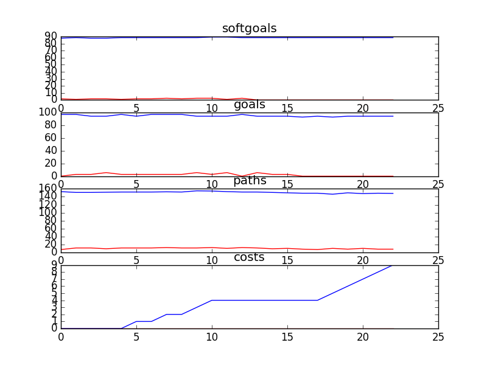

## CSCounsellingManagement
```

rank ,         name ,    med   ,   iqr 
----------------------------------------------------
   1 ,      gen0_f1 ,    88.43  ,   1.66 (    -----*    -|--------      ),87.60, 88.43, 88.43, 89.26, 90.91
   1 ,     gen20_f1 ,    88.43  ,   1.66 (    -----*    -|--------      ),87.60, 88.43, 88.43, 89.26, 90.91
   1 ,     gen40_f1 ,    88.43  ,   1.66 (    -----*    -|--------      ),87.60, 88.43, 88.43, 89.26, 90.91
   1 ,     gen60_f1 ,    88.43  ,   1.66 (    -----*    -|--------      ),87.60, 88.43, 88.43, 89.26, 90.91
   1 ,     gen80_f1 ,    88.43  ,   1.66 (    -----*    -|--------      ),87.60, 88.43, 88.43, 89.26, 90.91
   1 ,    gen100_f1 ,    88.43  ,   1.66 (    -----*    -|--------      ),87.60, 88.43, 88.43, 89.26, 90.91

rank ,         name ,    med   ,   iqr 
----------------------------------------------------
   1 ,      gen0_f2 ,    97.22  ,   2.78 (               |   *--------- ),94.44, 94.44, 97.22, 97.22, 100.00
   1 ,     gen20_f2 ,    97.22  ,   2.78 (               |   *--------- ),94.44, 94.44, 97.22, 97.22, 100.00
   1 ,     gen40_f2 ,    97.22  ,   2.78 (               |   *--------- ),94.44, 94.44, 97.22, 97.22, 100.00
   1 ,     gen60_f2 ,    97.22  ,   2.78 (               |   *--------- ),94.44, 94.44, 97.22, 97.22, 100.00
   1 ,     gen80_f2 ,    97.22  ,   2.78 (               |   *--------- ),94.44, 94.44, 97.22, 97.22, 100.00
   1 ,    gen100_f2 ,    97.22  ,   2.78 (               |   *--------- ),94.44, 94.44, 97.22, 97.22, 100.00

rank ,         name ,    med   ,   iqr 
----------------------------------------------------
   1 ,      gen0_f3 ,    153.0  ,   12.0 (     --  *   --|---           ),147.00, 150.00, 154.00, 160.00, 168.00
   1 ,     gen20_f3 ,    153.0  ,   12.0 (     --  *   --|---           ),147.00, 150.00, 154.00, 160.00, 168.00
   1 ,     gen40_f3 ,    153.0  ,   12.0 (     --  *   --|---           ),147.00, 150.00, 154.00, 160.00, 168.00
   1 ,     gen60_f3 ,    153.0  ,   12.0 (     --  *   --|---           ),147.00, 150.00, 154.00, 160.00, 168.00
   1 ,     gen80_f3 ,    153.0  ,   12.0 (     --  *   --|---           ),147.00, 150.00, 154.00, 160.00, 168.00
   1 ,    gen100_f3 ,    153.0  ,   12.0 (     --  *   --|---           ),147.00, 150.00, 154.00, 160.00, 168.00

rank ,         name ,    med   ,   iqr 
----------------------------------------------------
   1 ,      gen0_f4 ,     11.0  ,    2.0 (     ------   *| ------       ), 8.00, 10.00, 11.00, 12.00, 14.00
   1 ,     gen20_f4 ,     11.0  ,    2.0 (     ------   *| ------       ), 8.00, 10.00, 11.00, 12.00, 14.00
   1 ,     gen40_f4 ,     11.0  ,    2.0 (     ------   *| ------       ), 8.00, 10.00, 11.00, 12.00, 14.00
   1 ,     gen60_f4 ,     11.0  ,    2.0 (     ------   *| ------       ), 8.00, 10.00, 11.00, 12.00, 14.00
   1 ,     gen80_f4 ,     11.0  ,    2.0 (     ------   *| ------       ), 8.00, 10.00, 11.00, 12.00, 14.00
   1 ,    gen100_f4 ,     11.0  ,    2.0 (     ------   *| ------       ), 8.00, 10.00, 11.00, 12.00, 14.00
```

### Time Taken : 73.4718911648


### Decisions Ranked
```
+------+-----------------------------------------------------+----------+-------+------+---------+
| rank |                         name                        |   type   | value | cost | support |
+------+-----------------------------------------------------+----------+-------+------+---------+
|  1   |                  !Hire Counsellors                  |   task   |   -1  |  1   | 0.05786 |
|  2   |               Set Counselling Policies              |   task   |   -1  |  1   |  0.0512 |
|  3   |              !Hire Counselling Managers             |   task   |   -1  |  1   | 0.04455 |
|  4   |                    Debrief Calls                    |   task   |   -1  |  1   | 0.04083 |
|  5   |           Historical Data of Call Volumes           | resource |   1   |  1   |   0.04  |
|  6   |           Negotiate with Counsellors Union          |   task   |   -1  |  1   |  0.0392 |
|  7   |        Create Call Classification Catagories        |   task   |   1   |  1   | 0.03769 |
|  8   |                Counselling Resources                | resource |   -1  |  1   |  0.0363 |
|  9   |                  Debrief Web Posts                  |   task   |   1   |  1   |  0.036  |
|  10  |                 Counsellors Be Paid                 |   task   |   1   |  1   |  0.0313 |
|  11  |      Provide One-on-One Support to Counsellors      |   task   |   -1  |  1   |   0.03  |
|  12  |         Acquire Web Training from Operations        |   task   |   -1  |  1   | 0.02769 |
|  13  |            Put on Web Moderator Meetings            |   task   |   -1  |  1   | 0.02769 |
|  14  |      Put on Orientation Process for Cousellors      |   task   |   -1  |  1   | 0.02769 |
|  15  |             Put On Counselling Workshops            |   task   |   -1  |  1   | 0.02571 |
|  16  |      Communicate CS Information to Counsellors      |   task   |   -1  |  1   | 0.02483 |
|  17  |                   Call Statistics                   | resource |   -1  |  1   | 0.02381 |
|  18  |                   Use Blue Pumpkin                  |   task   |   1   |  1   | 0.02381 |
|  19  |                   Double Head Set                   | resource |   1   |  1   | 0.02174 |
|  20  |                     Review Tape                     |   task   |   1   |  1   | 0.02174 |
|  21  |              Attend Part Time Meetings              |   task   |   1   |  1   |   0.02  |
|  22  |                    Request Shifts                   |   task   |   1   |  1   |   0.02  |
|  23  | Write Yearly Peformance Evaluations for Counsellors |   task   |   1   |  1   |   0.02  |
+------+-----------------------------------------------------+----------+-------+------+---------+
```

### Top 6 Decisions from above table.
```
+--------------------------------------------------------------------+----------+-------+
|                                name                                |   type   | value |
+--------------------------------------------------------------------+----------+-------+
|                     !An IT Trainer Be Present                      |   goal   |   1   |
|                Consideration of Feedback [Managers]                | softgoal |   1   |
|                     *High Quality Counselling1                     | softgoal |  0.5  |
|                 Professional Counsellors Be Used1                  |   goal   |   1   |
|           Accommodate Schedules [Counselling Managers]1            | softgoal |  -0.5 |
|                   Reduce Turnover [Counsellors]                    | softgoal |  0.5  |
|   Perform Counselling as Instructed By Supervisor [Counsellors]1   | softgoal |   1   |
|                 Training Be Given to New Employees                 |   task   |   -1  |
|          Increase Comfortableness [with Learning Process]          | softgoal |   1   |
|                Improve Quality Assurance Technology                | softgoal |  0.5  |
|                    Second Reading of Web Posts                     |   task   |   1   |
|                Accommodate Schedules [Counsellors]                 | softgoal |  -0.5 |
|                      Analyze Call Statistics1                      |   task   |   -1  |
|                   Reduce Cost of Counselling HR1                   | softgoal |  -0.5 |
|                !Calls Be Recorded into a Data Base1                |   goal   |   1   |
|             Communicate CS Information to Counsellors              |   task   |   1   |
|                  Professional Counsellors Be Used                  |   goal   |   1   |
|                Improve [IT Skills of Counsellors]2                 | softgoal |  0.5  |
|            *Effective Use of Technology [Counsellors]2             | softgoal |  0.5  |
|  Improved Quality Assurance [Counselling Reviews and Evaluation]   | softgoal |  0.5  |
|              !Improve Hiring Process [of Counsellors]              | softgoal |  0.5  |
|              *Increase [IT Training for Counsellors]1              | softgoal |  0.5  |
|    Clear Communication About the Purpose of IT [to Counselors]     | softgoal |   1   |
|                       Contracts Be Reviewed                        |   goal   |   1   |
|         Pressure Counsellors [to Provide Online Services]2         | softgoal |   1   |
|           Accommodate Schedules [Counselling Managers]2            | softgoal |  -0.5 |
|                Improve [Call Recording Equipment]1                 | softgoal |   1   |
|                !Improve Training [for Counsellors]                 | softgoal |  0.5  |
|                Acquire Web Training from Operations                |   task   |   1   |
|              !Improve Job Descriptions [Counsellors]               | softgoal |   1   |
|     !Performance Review Information Be Collected in Data Base      |   goal   |   1   |
|                     Positive Internal Opinion                      | softgoal |   1   |
|             !Improve Hiring Process [of Counsellors]2              | softgoal |  0.5  |
|                  Rigorous [Employee Evaluations]                   | softgoal |   1   |
|                         Debrief Web Posts                          |   task   |   1   |
|                          Double Head Set                           | resource |   1   |
|             Provide One-on-One Support to Counsellors              |   task   |   -1  |
|                      Happiness [Counsellors]1                      | softgoal |   1   |
|               Improved Writing Skills [Counsellors]                | softgoal |   1   |
|   Perform Counselling as Instructed By Supervisor [Counsellors]    | softgoal |   1   |
|                     !An IT Trainer Be Present1                     |   goal   |   1   |
|                Improve [IT Skills of Counsellors]1                 | softgoal |  0.5  |
|                     Accountability [Services]                      | softgoal |  0.5  |
|                  Increased Counselling Resources                   | softgoal |   1   |
|                   *Help as Many Kids as Possible                   | softgoal |  0.5  |
|                      Analyze Call Statistics                       |   task   |   -1  |
|                  Bilingual Counsellors Be Hired1                   |   goal   |   1   |
|           Facilitate Faster Changes in Counsellor Duties           | softgoal |   1   |
|                   Reduce Cost of Counselling HR2                   | softgoal |  0.5  |
|              Reduce Turnover [Counselling Management]              | softgoal |  0.5  |
|                   Put on Web Moderator Meetings                    |   task   |   1   |
|                   Consider Counsellors Feedback                    | softgoal |   1   |
|            Counsellors Pass Probation within Six Months            |   goal   |   1   |
|                     Accurate Caller Statistics                     | softgoal |  0.5  |
|               Improved Writing Skills [Counsellors]3               | softgoal |   1   |
|                     Avoid Liability Problems1                      | softgoal |   1   |
|                    Staff Performance Be Managed                    |   goal   |   1   |
|      Increased Understanding of Purposes of IT [Counsellors]       | softgoal |  0.5  |
|              Environment Conductive to Concentration               | softgoal |  0.5  |
|             !Improve Hiring Process [of Counsellors]1              | softgoal |  0.5  |
|        Support Day to Day on the Floor Needs of Counsellors        | softgoal |   1   |
|                  Happiness [Counselling Manager]                   | softgoal |  0.5  |
|                    Put On Counselling Workshops                    |   task   |   -1  |
|                        Improve [IT Skills]                         | softgoal |   1   |
|                   Professional Work Environment                    | softgoal |   1   |
|                   Increase Funding for Training                    | softgoal |   1   |
|            Accommodate Schedules [Counselling Managers]            | softgoal |  -0.5 |
|                Support Analysis [Counsellors Time]1                | softgoal |   1   |
|                  Negotiate with Counsellors Union                  |   task   |   -1  |
|                        Calls Be Monitored                          |   goal   |   1   |
|                 *High Quality [Online Counselling]                 | softgoal |  0.5  |
|     !Performance Review Information Be Collected in Data Base1     |   goal   |   1   |
|                       Counselling Resources                        | resource |   1   |
|                     Attend Part Time Meetings                      |   task   |   1   |
|            Continual Improvement [Counselling Skills]2             | softgoal |  0.5  |
|         Supervision Be Performed At Least Every 3 Months1          |   goal   |   1   |
|                         Track Call Volume                          |   task   |   -1  |
|              Increase IT Methods to Acquire Feedback               | softgoal |   1   |
|                     *High Quality Counselling2                     | softgoal |   1   |
|               Create Call Classification Catagories                |   task   |   -1  |
|                      Analyze Call Statistics2                      |   task   |   -1  |
|               Improved Writing Skills [Counsellors]2               | softgoal |   1   |
|                 *Sufficient Counselling Resources1                 | softgoal |  0.5  |
|                      Avoid Liability Problems                      | softgoal |  0.5  |
|              Call Duration Consistency [Counsellors]               | softgoal |  -0.5 |
|                    !A Training Room Be Present                     |   goal   |   1   |
|                   Increase Funding for Training1                   | softgoal |   1   |
|                  Counselling Training Management                   | softgoal |   1   |
|              Clearer Call Classification Catagories1               | softgoal |   1   |
|            *Effective Use of Technology [Counsellors]1             | softgoal |  0.5  |
|                        Policies Be Reviewed                        |   goal   |   1   |
|    Increased Emphasis on IT in Hiring Process [of Counsellors]     | softgoal |   1   |
|                     Avoid Refusal of Services                      | softgoal |  0.5  |
|                    Second Reading of Web Posts1                    |   task   |   1   |
|              Increase Enthusiasm [Counsellors for IT]              | softgoal |  0.5  |
|         Pressure Counsellors [to Provide Online Services]          | softgoal |   1   |
|  Improved Quality Assurance [Counselling Reviews and Evaluation]2  | softgoal |  0.5  |
|                  Happiness [Counselling Manager]1                  | softgoal |  0.5  |
|               Training Be Given to Current Employees               |   task   |   -1  |
|                  Reduce Staggering of Schedules1                   | softgoal |  -0.5 |
|                       Effective Scheduling2                        | softgoal |   1   |
|                 Increase Number [of Counsellors]1                  | softgoal |  0.5  |
|                              *Salary                               | softgoal |   -1  |
|                 Negotiate with Counsellors Union1                  |   task   |   -1  |
|                   Bilingual Counsellors Be Hired                   |   goal   |   1   |
|                  !A Training Computer Be Present1                  |   goal   |   1   |
|                         Track Call Lengths                         |   task   |   -1  |
|                   Increased Counselling Resource                   | softgoal |  0.5  |
|                  Counselling Policies Be Followed                  |   goal   |   1   |
|                Feedback to Counsellors Be Provided                 |   goal   |   1   |
|            Avoid Relationships with Specific Counsellor            | softgoal |   1   |
|                     !Hire Counselling Managers                     |   task   |   -1  |
|                         !Hire Counsellors                          |   task   |   -1  |
|                    Counsellors Be Kept Informed                    |   goal   |   1   |
|                        Perform Supervision                         |   task   |   1   |
|                  *Help as Many Kids as Possible1                   | softgoal |  0.5  |
|                 *Sufficient Counselling Resources                  | softgoal |  0.5  |
|         Support Day to Day Clinical Needs of Counsellors2          | softgoal |  0.5  |
|   !Increased Emphasis on IT in Hiring Process [of Counsellors]1    | softgoal |   1   |
|         Increase Counsellors Experience [with Technology]          | softgoal |   1   |
|               Reduce Resistance [Counsellors for IT]               | softgoal |  0.5  |
|                  Bilingual Counsellors Be Hired2                   |   goal   |   1   |
|        Advance Notice to Counsellors [About IT Transitions]        | softgoal |  -0.5 |
|                     *High Quality Counselling                      | softgoal |  0.5  |
|                        Effective Scheduling                        | softgoal |   1   |
|                      Analyze Staffing Levels                       |   goal   |   1   |
|                 Negotiate with Counsellors Union2                  |   task   |   -1  |
|             *Effective Use of Technology [Counsellors]             | softgoal |  0.5  |
|                           Debrief Calls                            |   task   |   -1  |
|    !Increased Emphasis on IT in Hiring Process [of Counsellors]    | softgoal |   1   |
|                       Analyze Service Levels                       |   goal   |   1   |
|    Increase Communication [Between Counsellors and Supervisors]    | softgoal |  0.5  |
|                    Second Reading of Web Posts2                    |   task   |   1   |
|                            Review Tape                             |   task   |   1   |
|                   Reduce Cost of Counselling HR                    | softgoal |  -0.5 |
|               Reduce Spending on Employees Salaries                | softgoal |   1   |
|                     Positive Internal Opinion1                     | softgoal |   1   |
|            Continual Improvement [Counselling Skills]1             | softgoal |  0.5  |
|                Feedback to Counsellors Be Provided2                |   goal   |   1   |
|                      Set Counselling Policies                      |   task   |   -1  |
|                        Support Counsellors                         | softgoal |  0.5  |
|                   Professional Work Environment1                   | softgoal |   1   |
|                 Happiness [Counselling Management]                 | softgoal |  0.5  |
|                           Request Shifts                           |   task   |   1   |
|                        Counselling Manager                         | softgoal |   1   |
|              Holes in Operations Managing Be Removed               |   goal   |   1   |
|           Avoid Relationships with Specific Counsellor1            | softgoal |   1   |
|          Facilitate Faster Changes in Counsellor Duties1           | softgoal |   1   |
|                     Accountability [Services]1                     | softgoal |  0.5  |
|          Support Day to Day Clinical Needs of Counsellors          | softgoal |  0.5  |
|        Write Yearly Peformance Evaluations for Counsellors         |   task   |   -1  |
|                  Historical Data of Call Volumes                   | resource |   1   |
|                 Improve [Call Recording Equipment]                 | softgoal |   1   |
|               Full Time Night Complement Be Acquired               |   goal   |   1   |
|                   Reduce Staggering of Schedules                   | softgoal |  -0.5 |
|                Accommodate Schedules [Counsellors]1                | softgoal |  -0.5 |
|             Continual Improvement [Counselling Skills]             | softgoal |  0.5  |
|            *Positive Attitude Towards IT [Counsellors]             | softgoal |  0.5  |
|                !Calls Be Recorded into a Data Base                 |   goal   |   1   |
|                Feedback to Counsellors Be Provided1                |   goal   |   1   |
|             Put on Orientation Process for Cousellors              |   task   |   -1  |
|         Supervision Be Performed At Least Every 3 Months2          |   goal   |   1   |
|                       Effective Scheduling1                        | softgoal |   1   |
|                          Call Statistics                           | resource |   1   |
|          Perform Supervision for Experienced Counsellors           |   task   |   1   |
|                     *Happiness of Counsellors                      | softgoal |  0.5  |
|                Accommodate Schedules [Counsellors]2                | softgoal |  -0.5 |
|  Improved Quality Assurance [Counselling Reviews and Evaluation]1  | softgoal |  0.5  |
|                        Counsellors Be Paid                         |   task   |   -1  |
|              *Increase [IT Training for Counsellors]               | softgoal |   1   |
|                 Improve [IT Skills of Counsellors]                 | softgoal |  0.5  |
|                Increase Training [for Counsellors]                 | softgoal |  0.5  |
|                Support Analysis [Counsellors Time]                 | softgoal |   1   |
|                      Happiness [Counsellors]                       | softgoal |  0.5  |
|                   !A Training Program Be Present                   |   goal   |   1   |
|                           Make Schedules                           |   task   |   1   |
|               Clearer Call Classification Catagories               | softgoal |   1   |
|            *Provide Online Services [All Counsellors]              | softgoal |  0.5  |
|         Support Day to Day Clinical Needs of Counsellors1          | softgoal |  0.5  |
|                 *Sufficient Counselling Resources2                 | softgoal |  0.5  |
|          Supervision Be Performed At Least Every 3 Months          |   goal   |   1   |
| Technology Be Used to Ensure Counsellors are Keeping Correct Hours |   goal   |   1   |
|                      Qualified [Counsellors]                       | softgoal |  0.5  |
|                  !A Training Computer Be Present                   |   goal   |   1   |
|         Three Months of Review Be Given to New Counsellors         |   goal   |   1   |
|             Employee Learning and Training Be Managed              |   goal   |   -1  |
|         Pressure Counsellors [to Provide Online Services]1         | softgoal |   1   |
|                        Increase [Feedback]                         | softgoal |  0.5  |
|                 Increase Number [of Counsellors]2                  | softgoal |  0.5  |
|               Improved Writing Skills [Counsellors]1               | softgoal |   1   |
|                 Counselling Policies Be Followed1                  |   goal   |   1   |
|                          Use Blue Pumpkin                          |   task   |   -1  |
|              Increase IT Methods to Acquire Feedback1              | softgoal |   1   |
|                             Easier Job                             | softgoal |  0.5  |
|                  Increase Number [of Counsellors]                  | softgoal |  0.5  |
+--------------------------------------------------------------------+----------+-------+
```
