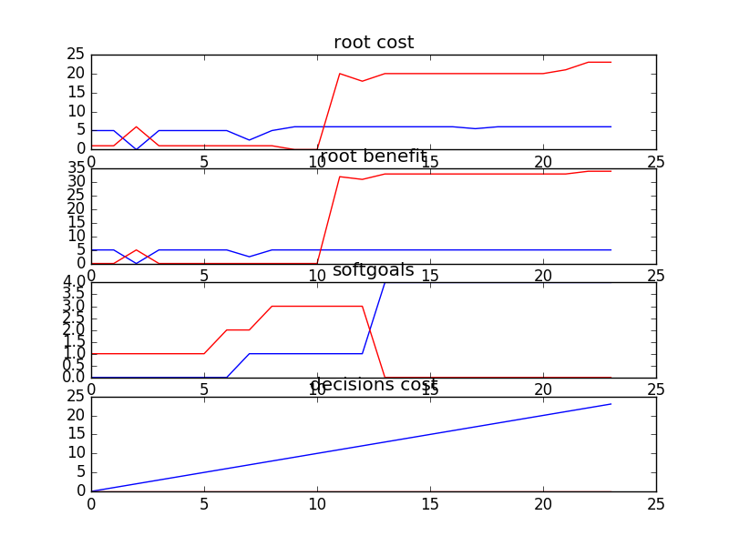

##Results
```
24 38

rank ,         name ,    med   ,   iqr 
----------------------------------------------------
   1 ,      gen0_f1 ,      5.0  ,    1.0 (*              |              ), 5.00,  5.00,  5.00,  6.00,  6.00
   1 ,      gen2_f1 ,      5.0  ,    1.0 (*              |              ), 5.00,  5.00,  5.00,  5.00,  6.00
   1 ,      gen4_f1 ,      5.0  ,    0.0 (*              |              ), 5.00,  5.00,  5.00,  5.00,  6.00
   1 ,      gen6_f1 ,      5.0  ,    0.0 (*              |              ), 5.00,  5.00,  5.00,  5.00,  6.00
   1 ,      gen8_f1 ,      5.0  ,    0.0 (*              |              ), 5.00,  5.00,  5.00,  5.00,  6.00
   1 ,     gen10_f1 ,      5.0  ,    0.0 (*              |              ), 5.00,  5.00,  5.00,  5.00,  5.00

rank ,         name ,    med   ,   iqr 
----------------------------------------------------
   1 ,      gen0_f2 ,      5.0  ,    0.0 (*              |              ), 5.00,  5.00,  5.00,  5.00,  5.00
   1 ,      gen2_f2 ,      5.0  ,    0.0 (*              |              ), 5.00,  5.00,  5.00,  5.00,  5.00
   1 ,      gen4_f2 ,      5.0  ,    0.0 (*              |              ), 5.00,  5.00,  5.00,  5.00,  5.00
   1 ,      gen6_f2 ,      5.0  ,    0.0 (*              |              ), 5.00,  5.00,  5.00,  5.00,  5.00
   1 ,      gen8_f2 ,      5.0  ,    0.0 (*              |              ), 5.00,  5.00,  5.00,  5.00,  5.00
   1 ,     gen10_f2 ,      5.0  ,    0.0 (*              |              ), 5.00,  5.00,  5.00,  5.00,  5.00

rank ,         name ,    med   ,   iqr 
----------------------------------------------------
   1 ,      gen0_f3 ,      0.0  ,    1.0 (*      ------- |              ), 0.00,  0.00,  0.00,  1.00,  2.00
   2 ,      gen2_f3 ,      1.0  ,    2.0 (       *       |              ), 0.00,  0.00,  1.00,  2.00,  2.00
   3 ,      gen4_f3 ,      2.0  ,    1.0 (-------       *|------        ), 0.00,  1.00,  2.00,  2.00,  3.00
   3 ,      gen6_f3 ,      2.0  ,    1.0 (-------       *|------------- ), 0.00,  1.00,  2.00,  2.00,  4.00
   3 ,      gen8_f3 ,      2.0  ,    0.0 (       -------*|------------- ), 1.00,  2.00,  2.00,  2.00,  4.00
   3 ,     gen10_f3 ,      2.0  ,    1.0 (       -------*|------------- ), 1.00,  2.00,  2.00,  2.00,  4.00
```

[Pareto Front](https://github.com/ai-se/softgoals/blob/master/src/csv/ahp/sample.csv)

### Time Taken : 24.4982769489


### Decisions Ranked
```
+------+-------------------------------------------------------+----------+-------+------+---------+
| rank |                          name                         |   type   | value | cost | support |
+------+-------------------------------------------------------+----------+-------+------+---------+
|  1   |                Access Control Assessed                |   task   |   1   |  1   | 0.07245 |
|  2   |                  Access Control Pilot                 |   task   |   1   |  1   | 0.07245 |
|  3   |                    Monitoring Pilot                   |   task   |   1   |  1   | 0.07245 |
|  4   |                   DB Vendor Test Env                  |   task   |   1   |  1   | 0.06735 |
|  5   |                   J2EE Specification                  |   task   |   1   |  1   | 0.06244 |
|  6   |                    General Test Env                   |   task   |   1   |  1   |  0.0622 |
|  7   |                   Documentation Tool                  | resource |   1   |  1   | 0.06208 |
|  8   |                     Bakeoff Result                    |   task   |   1   |  1   | 0.05941 |
|  9   |                      New Database                     |   goal   |   1   |  1   | 0.05399 |
|  10  |        External data model can be extended(19)        |   goal   |   1   |  1   | 0.05251 |
|  11  |                    Data Model Pilot                   |   task   |   1   |  1   |  0.0488 |
|  12  |   External clients get exactly what they request(10)  |   goal   |   1   |  1   | 0.04724 |
|  13  |                   Data Service Spec                   |   task   |   1   |  1   | 0.04528 |
|  14  |                         3 Tier                        |   goal   |   1   |  1   | 0.04495 |
|  15  |                   Data Service Pilot                  |   task   |   1   |  1   | 0.04471 |
|  16  |                     Pnp Framework                     |   goal   |   1   |  1   | 0.04419 |
|  17  | XXX coordinates and external client does whatever(20) |   goal   |   1   |  1   | 0.04372 |
|  18  |                         2 Tier                        |   goal   |   1   |  1   | 0.04277 |
|  19  |       Define data model for all shared data(15)       |   goal   |   1   |  1   | 0.04268 |
|  20  |       Svc layer w/ extracted biz logic in DB(12)      |   goal   |   1   |  1   | 0.04253 |
|  21  |           Define ext mandatory data std(18)           |   goal   |   1   |  1   | 0.04154 |
|  22  |       Provide logical data scheme internally(8)       |   goal   |   1   |  1   | 0.04032 |
|  23  |          Svc layer w/ extracted biz logic(13)         |   goal   |   1   |  1   | 0.03925 |
|  24  | XXX coordinates and internal client does whatever(17) |   goal   |   1   |  1   | 0.03894 |
+------+-------------------------------------------------------+----------+-------+------+---------+
```

##Assumptions
- There are 24 leaf nodes as a result the decision space has 2^24 options. Differential Evolution is not possible to find the ideal pareto frontier. Thus I had to assume 3 of the 24 nodes to be **always satisfied** to get the pareto frontier.
- The three nodes considered were "Access Control Assessed", "Access Control Pilot" and "Monitoring Pilot"
