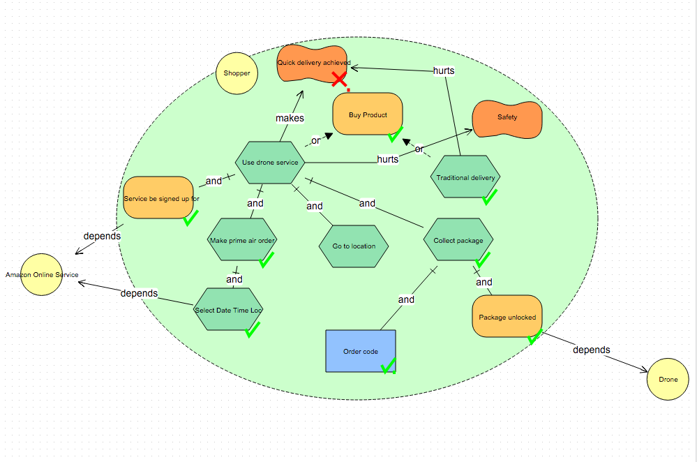
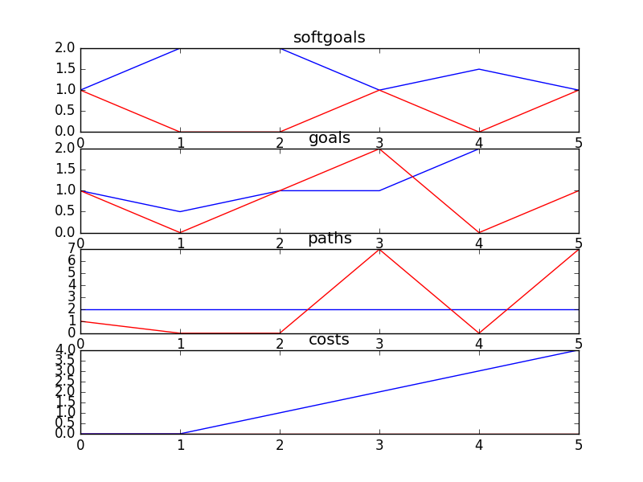

## AmazonDrone
```

rank ,         name ,    med   ,   iqr 
----------------------------------------------------
   1 ,      gen0_f1 ,      1.0  ,    0.0 (*              |              ), 1.00,  1.00,  1.00,  2.00,  2.00
   1 ,      gen2_f1 ,      1.0  ,    0.0 (*              |              ), 1.00,  1.00,  1.00,  2.00,  2.00
   1 ,      gen4_f1 ,      1.0  ,    0.0 (*              |              ), 1.00,  1.00,  1.00,  2.00,  2.00
   1 ,      gen6_f1 ,      1.0  ,    0.0 (*              |              ), 1.00,  1.00,  1.00,  2.00,  2.00
   1 ,      gen8_f1 ,      1.0  ,    0.0 (*              |              ), 1.00,  1.00,  1.00,  2.00,  2.00
   1 ,     gen10_f1 ,      1.0  ,    0.0 (*              |              ), 1.00,  1.00,  1.00,  2.00,  2.00

rank ,         name ,    med   ,   iqr 
----------------------------------------------------
   1 ,      gen0_f2 ,      1.0  ,    1.0 (---------      |   *--------- ), 0.00,  1.00,  2.00,  2.00,  3.00
   1 ,      gen2_f2 ,      2.0  ,    1.0 (---------      |   *--------- ), 0.00,  1.00,  2.00,  2.00,  3.00
   1 ,      gen4_f2 ,      2.0  ,    2.0 (---------      |             *), 0.00,  1.00,  3.00,  3.00,  3.00
   1 ,      gen6_f2 ,      2.0  ,    2.0 (               |             *), 1.00,  1.00,  3.00,  3.00,  3.00
   1 ,      gen8_f2 ,      2.0  ,    1.0 (         ------|---          *), 1.00,  2.00,  3.00,  3.00,  3.00
   1 ,     gen10_f2 ,      3.0  ,    1.0 (         ------|---          *), 1.00,  2.00,  3.00,  3.00,  3.00
```

### Time Taken : 0.0908010005951


### Decisions Ranked
```
+------+--------------------------+----------+-------+------+---------+
| rank |           name           |   type   | value | cost | support |
+------+--------------------------+----------+-------+------+---------+
|  1   |   Traditional delivery   |   task   |   -1  |  1   | 0.06667 |
|  2   | Service be signed up for |   goal   |   1   |  1   | 0.05556 |
|  3   |      Go to location      |   task   |   1   |  1   | 0.04167 |
|  4   |     Package unlocked     |   goal   |   1   |  1   | 0.03704 |
|  5   |   Select Date TIme Loc   |   task   |   1   |  1   | 0.01667 |
|  6   |        Order Code        | resource |   -1  |  1   | 0.01667 |
+------+--------------------------+----------+-------+------+---------+
```
