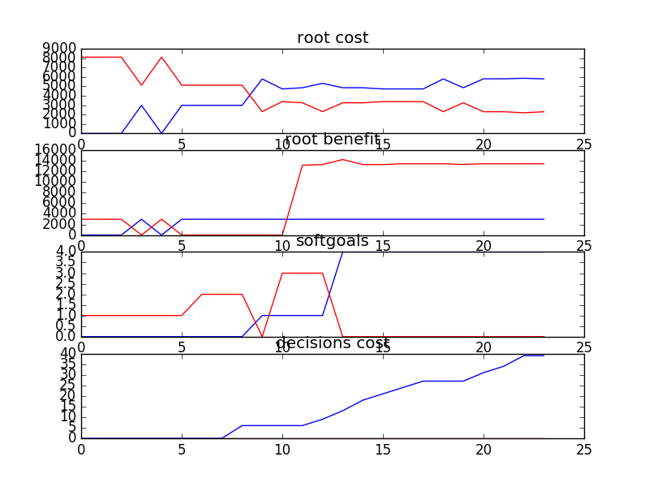

## Objective functions
* Minimize cost - ```e^cost * e^(max_level-level)```
* Maximize benefit - ```e^benefit * e^(max_level-level)```
* Maximize softgoals satisfied

## sample
```
rank ,         name ,    med   ,   iqr 
----------------------------------------------------
   1 ,      gen0_f1 ,    2980.96  ,  5122.12 (*              |              ),2980.96, 2980.96, 2980.96, 8103.08, 8103.08
   1 ,      gen2_f1 ,    2980.96  ,  5122.12 (*--------------|------------- ),2980.96, 2980.96, 2980.96, 2980.96, 8103.08
   1 ,      gen4_f1 ,    2980.96  ,    0.0 (*--------------|------------- ),2980.96, 2980.96, 2980.96, 2980.96, 8103.08
   1 ,      gen6_f1 ,    2980.96  ,    0.0 (*--------------|------------- ),2980.96, 2980.96, 2980.96, 2980.96, 8103.08
   1 ,      gen8_f1 ,    2980.96  ,    0.0 (*--------------|              ),2980.96, 2980.96, 2980.96, 2980.96, 5800.50
   1 ,     gen10_f1 ,    2980.96  ,    0.0 (*---------     |              ),2980.96, 2980.96, 2980.96, 2980.96, 4723.95

rank ,         name ,    med   ,   iqr 
----------------------------------------------------
   1 ,      gen0_f2 ,    2980.96  ,    0.0 (*              |              ),2980.96, 2980.96, 2980.96, 2980.96, 2980.96
   1 ,      gen2_f2 ,    2980.96  ,    0.0 (*              |              ),2980.96, 2980.96, 2980.96, 2980.96, 2980.96
   1 ,      gen4_f2 ,    2980.96  ,    0.0 (*              |              ),2980.96, 2980.96, 2980.96, 2980.96, 2980.96
   1 ,      gen6_f2 ,    2980.96  ,    0.0 (*              |              ),2980.96, 2980.96, 2980.96, 2980.96, 2980.96
   1 ,      gen8_f2 ,    2980.96  ,    0.0 (*              |              ),2980.96, 2980.96, 2980.96, 2980.96, 2980.96
   1 ,     gen10_f2 ,    2980.96  ,    0.0 (*              |              ),2980.96, 2980.96, 2980.96, 2980.96, 2980.96

rank ,         name ,    med   ,   iqr 
----------------------------------------------------
   1 ,      gen0_f3 ,      0.0  ,    1.0 (*      ------- |              ), 0.00,  0.00,  0.00,  1.00,  2.00
   2 ,      gen2_f3 ,      1.0  ,    2.0 (       *       |              ), 0.00,  0.00,  1.00,  2.00,  2.00
   3 ,      gen4_f3 ,      2.0  ,    1.0 (-------       *|------        ), 0.00,  1.00,  2.00,  2.00,  3.00
   3 ,      gen6_f3 ,      2.0  ,    1.0 (-------       *|------------- ), 0.00,  1.00,  2.00,  2.00,  4.00
   3 ,      gen8_f3 ,      2.0  ,    1.0 (       -------*|------------- ), 1.00,  2.00,  2.00,  2.00,  4.00
   3 ,     gen10_f3 ,      2.0  ,    1.0 (       -------*|      ------- ), 1.00,  2.00,  2.00,  3.00,  4.00
```

### Time Taken : 25.4659769535


### Decisions Ranked
```
+------+-------------------------------------------------------+----------+-------+------+---------+
| rank |                          name                         |   type   | value | cost | support |
+------+-------------------------------------------------------+----------+-------+------+---------+
|  1   |                Access Control Assessed                |   task   |   1   |  0   | 0.06809 |
|  2   |                  Access Control Pilot                 |   task   |   1   |  0   | 0.06809 |
|  3   |                    Monitoring Pilot                   |   task   |   1   |  0   | 0.06809 |
|  4   |                   Documentation Tool                  | resource |   1   |  0   | 0.06386 |
|  5   |                   DB Vendor Test Env                  |   task   |   1   |  0   | 0.06187 |
|  6   |                     Bakeoff Result                    |   task   |   1   |  0   | 0.05917 |
|  7   |                    General Test Env                   |   task   |   1   |  0   | 0.05895 |
|  8   |                      New Database                     |   goal   |   1   |  6   | 0.05844 |
|  9   |                   J2EE Specification                  |   task   |   1   |  0   | 0.05583 |
|  10  |                   Data Service Pilot                  |   task   |   1   |  0   | 0.04892 |
|  11  |                    Data Model Pilot                   |   task   |   1   |  0   | 0.04866 |
|  12  |           Define ext mandatory data std(18)           |   goal   |   1   |  3   | 0.04714 |
|  13  |        External data model can be extended(19)        |   goal   |   1   |  4   | 0.04628 |
|  14  | XXX coordinates and external client does whatever(20) |   goal   |   1   |  5   | 0.04529 |
|  15  |       Svc layer w/ extracted biz logic in DB(12)      |   goal   |   1   |  3   | 0.04423 |
|  16  |       Define data model for all shared data(15)       |   goal   |   1   |  3   | 0.04135 |
|  17  | XXX coordinates and internal client does whatever(17) |   goal   |   1   |  3   | 0.04053 |
|  18  |                     Pnp Framework                     |   goal   |   -1  |  5   | 0.04022 |
|  19  |                   Data Service Spec                   |   task   |   1   |  0   | 0.03829 |
|  20  |   External clients get exactly what they request(10)  |   goal   |   1   |  4   | 0.03794 |
|  21  |       Provide logical data scheme internally(8)       |   goal   |   1   |  3   | 0.03733 |
|  22  |                         2 Tier                        |   goal   |   1   |  5   | 0.03556 |
|  23  |          Svc layer w/ extracted biz logic(13)         |   goal   |   -1  |  5   | 0.03538 |
|  24  |                         3 Tier                        |   goal   |   -1  |  5   | 0.03452 |
+------+-------------------------------------------------------+----------+-------+------+---------+
```
