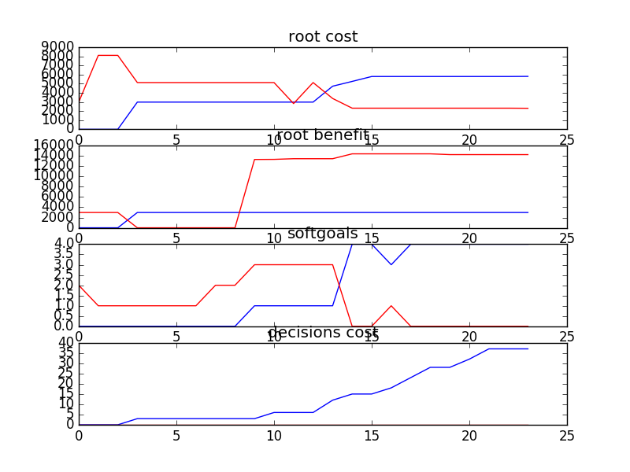

## sample_exp
```
..........8103.08392758 17394.8825703

rank ,         name ,    med   ,   iqr 
----------------------------------------------------
   1 ,      gen8_f1 ,    4723.95  ,  2806.76 (          *    |              ),2980.96, 2980.96, 4723.95, 5787.72, 5800.50
   1 ,     gen10_f1 ,    4723.95  ,  2806.76 (          *    |              ),2980.96, 2980.96, 4723.95, 5787.72, 5800.50
   1 ,      gen6_f1 ,    4839.5  ,  2806.76 (          *    |-             ),2980.96, 2980.96, 4839.50, 5787.72, 5914.40
   1 ,      gen4_f1 ,    4852.28  ,  2819.54 (          *    |-------       ),2980.96, 2980.96, 4852.28, 5787.72, 6990.95
   2 ,      gen2_f1 ,    5787.72  ,  3061.77 (----------     |*------------ ),2980.96, 4711.17, 5787.72, 5914.40, 8103.08
   2 ,      gen0_f1 ,    5800.5  ,  3379.13 (----------     |*             ),2980.96, 4839.50, 5800.50, 8103.08, 8103.08

rank ,         name ,    med   ,   iqr 
----------------------------------------------------
   1 ,      gen0_f2 ,    2980.96  ,  13465.7 (*              |            - ),2980.96, 2980.96, 2980.96, 16446.66, 17394.88
   2 ,      gen2_f2 ,    15498.44  ,  14265.51 (               |          * - ),2980.96, 2980.96, 15498.44, 16446.66, 17394.88
   2 ,      gen4_f2 ,    16298.25  ,  14265.51 (               |           *  ),2980.96, 2980.96, 16298.25, 17246.47, 17394.88
   2 ,      gen6_f2 ,    16298.25  ,  14265.51 (               |           *  ),2980.96, 2980.96, 16298.25, 17246.47, 17394.88
   2 ,      gen8_f2 ,    16298.25  ,  14265.51 (               |           *  ),2980.96, 2980.96, 16298.25, 17246.47, 17394.88
   2 ,     gen10_f2 ,    16298.25  ,  14413.92 (               |           *  ),2980.96, 2980.96, 16298.25, 17246.47, 17394.88

rank ,         name ,    med   ,   iqr 
----------------------------------------------------
   1 ,      gen0_f3 ,      4.0  ,    1.0 (---------------|-------------*), 0.00,  4.00,  4.00,  4.00,  4.00
   1 ,      gen2_f3 ,      4.0  ,    0.0 (---------------|-------------*), 0.00,  4.00,  4.00,  4.00,  4.00
   1 ,      gen4_f3 ,      4.0  ,    0.0 (              -|-------------*), 2.00,  4.00,  4.00,  4.00,  4.00
   1 ,      gen6_f3 ,      4.0  ,    0.0 (              -|-------------*), 2.00,  4.00,  4.00,  4.00,  4.00
   1 ,      gen8_f3 ,      4.0  ,    0.0 (              -|-------------*), 2.00,  4.00,  4.00,  4.00,  4.00
   1 ,     gen10_f3 ,      4.0  ,    0.0 (               |             *), 4.00,  4.00,  4.00,  4.00,  4.00
```

### Time Taken : 6.84751915932


### Decisions Ranked
```
+------+-------------------------------------------------------+----------+-------+------+---------+
| rank |                          name                         |   type   | value | cost | support |
+------+-------------------------------------------------------+----------+-------+------+---------+
|  1   |                    Monitoring Pilot                   |   task   |   1   |  0   | 0.11854 |
|  2   |                  Access Control Pilot                 |   task   |   1   |  0   | 0.11394 |
|  3   |           Define ext mandatory data std(18)           |   goal   |   1   |  3   | 0.11183 |
|  4   |                   J2EE Specification                  |   task   |   1   |  0   | 0.11073 |
|  5   |                   DB Vendor Test Env                  |   task   |   1   |  0   | 0.10833 |
|  6   |                    General Test Env                   |   task   |   1   |  0   | 0.10624 |
|  7   |                     Bakeoff Result                    |   task   |   1   |  0   | 0.10624 |
|  8   |                Access Control Assessed                |   task   |   1   |  0   | 0.10577 |
|  9   |                   Documentation Tool                  | resource |   1   |  0   |  0.1056 |
|  10  |       Provide logical data scheme internally(8)       |   goal   |   1   |  3   | 0.10525 |
|  11  |          Svc layer w/ extracted biz logic(13)         |   goal   |   -1  |  5   | 0.10482 |
|  12  |                   Data Service Pilot                  |   task   |   1   |  0   | 0.10477 |
|  13  |                      New Database                     |   goal   |   1   |  6   | 0.09661 |
|  14  |       Define data model for all shared data(15)       |   goal   |   1   |  3   | 0.09169 |
|  15  |       Svc layer w/ extracted biz logic in DB(12)      |   goal   |   -1  |  3   | 0.09088 |
|  16  | XXX coordinates and internal client does whatever(17) |   goal   |   1   |  3   | 0.08696 |
|  17  | XXX coordinates and external client does whatever(20) |   goal   |   1   |  5   | 0.08618 |
|  18  |                         2 Tier                        |   goal   |   1   |  5   | 0.08284 |
|  19  |                    Data Model Pilot                   |   task   |   1   |  0   | 0.08279 |
|  20  |        External data model can be extended(19)        |   goal   |   1   |  4   | 0.07972 |
|  21  |                         3 Tier                        |   goal   |   1   |  5   | 0.07862 |
|  22  |                   Data Service Spec                   |   task   |   1   |  0   | 0.06859 |
|  23  |                     Pnp Framework                     |   goal   |   -1  |  5   | 0.06857 |
|  24  |   External clients get exactly what they request(10)  |   goal   |   1   |  4   |  0.0655 |
+------+-------------------------------------------------------+----------+-------+------+---------+
```
