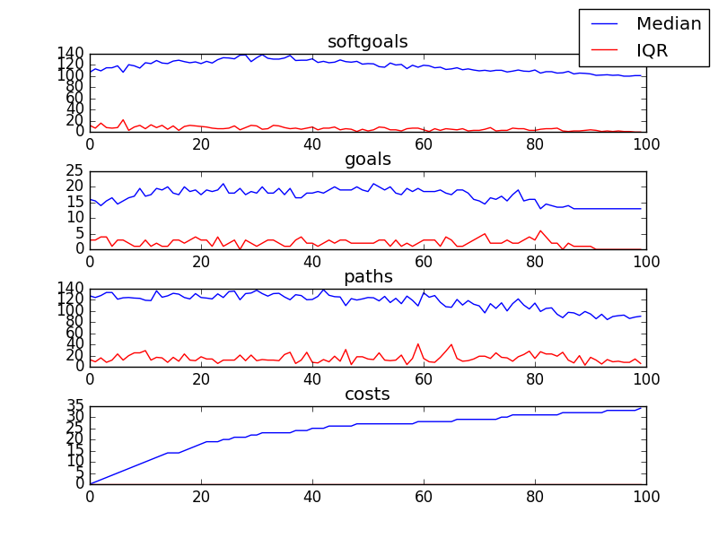

## CSCounselling
```

rank ,         name ,    med   ,   iqr 
----------------------------------------------------
   1 ,      gen0_f1 ,     86.0  ,   16.0 (------         |  *   -       ),64.00, 72.00, 88.00, 93.00, 94.00
   1 ,      gen2_f1 ,     90.0  ,    9.0 (         ------|      * ---   ),77.00, 84.00, 93.00, 96.00, 100.00
   2 ,      gen4_f1 ,     94.0  ,    6.0 (               |---     *  -- ),85.00, 90.00, 96.00, 100.00, 103.00
   2 ,      gen6_f1 ,     94.0  ,    9.0 (               |  --       *- ),88.00, 91.00, 100.00, 100.00, 103.00
   2 ,      gen8_f1 ,     97.0  ,    5.0 (               |           *  ),94.00, 95.00, 100.00, 103.00, 103.00
   2 ,     gen10_f1 ,     97.0  ,    5.0 (               |           *  ),94.00, 95.00, 100.00, 103.00, 103.00

rank ,         name ,    med   ,   iqr 
----------------------------------------------------
   1 ,      gen0_f2 ,     11.0  ,    2.0 (-----------    |       *      ), 8.00, 10.00, 12.00, 13.00, 13.00
   1 ,      gen2_f2 ,     12.0  ,    1.0 (     ----------|-------      *), 9.00, 12.00, 13.00, 13.00, 13.00
   1 ,      gen4_f2 ,     13.0  ,    1.0 (     ----------|-------      *), 9.00, 12.00, 13.00, 13.00, 13.00
   1 ,      gen6_f2 ,     13.0  ,    1.0 (     ----------|-------      *), 9.00, 12.00, 13.00, 13.00, 13.00
   1 ,      gen8_f2 ,     13.0  ,    1.0 (           ----|-------      *),10.00, 12.00, 13.00, 13.00, 13.00
   1 ,     gen10_f2 ,     13.0  ,    1.0 (           ----|-------      *),10.00, 12.00, 13.00, 13.00, 13.00
```

### Time Taken : 21.4388399124


### Decisions Ranked
```
+------+----------------------------------------------------------------------+----------+-------+------+---------+
| rank |                                 name                                 |   type   | value | cost | support |
+------+----------------------------------------------------------------------+----------+-------+------+---------+
|  1   |            Block Kids who Display Inappropriate Behavoir             |   task   |   1   |  1   | 0.01538 |
|  2   |                       Web Responses Be Generic                       | softgoal |   1   |  1   | 0.01099 |
|  3   |                       Speak at SA Conferences                        |   task   |   1   |  1   | 0.01026 |
|  4   |                       Debrief with Counsellors                       |   task   |   1   |  1   | 0.01026 |
|  5   |                     Deepen [Counselling Session]                     | softgoal |   1   |  1   | 0.01026 |
|  6   |                            Request Shifts                            |   task   |   1   |  1   | 0.00962 |
|  7   |         Cutting and Pasting Be Added to Web Posting Software         |   goal   |   1   |  1   | 0.00905 |
|  8   |           Icons for Counselling Information Be on Desktop            |   goal   |   1   |  1   | 0.00855 |
|  9   |                      !IT Systems Be Integrated                       |   goal   |   1   |  1   | 0.00855 |
|  10  |                         Refer Parents to PHL                         |   task   |   1   |  1   |  0.0081 |
|  11  |                   Provide Resources in One Source                    |   task   |   1   |  1   | 0.00769 |
|  12  |                       Improved Writing Skills                        | softgoal |   1   |  1   | 0.00733 |
|  13  |                    Remember Locations of Resouces                    | softgoal |   1   |  1   | 0.00733 |
|  14  |          Include Legal Information in Counselling Resources          |   task   |   1   |  1   | 0.00699 |
|  15  |                Comment on Technology Usability Issues                |   task   |   -1  |  1   | 0.00699 |
|  16  |          Include Drug Information in Counselling Resources           |   task   |   -1  |  1   | 0.00699 |
|  17  |                            Report Abuses                             |   task   |   1   |  1   | 0.00699 |
|  18  |                    Counsellors Police Themselves                     | softgoal |   1   |  1   | 0.00669 |
|  19  |                     Control of Floor Operations                      | softgoal |   1   |  1   | 0.00641 |
|  20  | Reduce Physical Observation/Hearing by Staff Not in Counselling Team | softgoal |   1   |  1   | 0.00641 |
|  21  |                             Recognition                              | softgoal |   1   |  1   | 0.00641 |
|  22  |                    ! Write Articles for Website 1                    |   task   |   -1  |  1   | 0.00615 |
|  23  |                        Learn Web Technologies                        |   task   |   -1  |  1   | 0.00592 |
|  24  |                  Increase Number [of Counsellors]1                   | softgoal |   1   |  1   | 0.00592 |
|  25  |                           Get Rid of Union                           |   goal   |   -1  |  1   | 0.00592 |
|  26  |           *Encourage Kids to Talk to Different Counsellors           |   task   |   1   |  1   | 0.00592 |
|  27  |                   *Receive Training from Managment                   |   task   |   -1  |  1   | 0.00592 |
|  28  |                           *Explore Options                           |   task   |   -1  |  1   | 0.00592 |
|  29  |                        Participate in events1                        |   task   |   1   |  1   | 0.00592 |
|  30  |                             Training CDs                             | resource |   -1  |  1   | 0.00592 |
|  31  |                   Be Consulted about New Policies                    |   goal   |   1   |  1   | 0.00592 |
|  32  |                         Simple [Technology]1                         | softgoal |   -1  |  1   | 0.00592 |
|  33  |              Provide Information to Other Counselloers               |   task   |   -1  |  1   | 0.00592 |
|  34  |                            Record Stories                            |   task   |   -1  |  1   | 0.00592 |
|  35  |                     Provide Resources in Library                     |   task   |   -1  |  1   | 0.00592 |
|  36  |            Easier to Find Posts [Web Posting Technology]1            | softgoal |   -1  |  1   | 0.00592 |
|  37  |                           Listen for Cues                            |   task   |   1   |  1   | 0.00592 |
|  38  |                     Control of Counselling Work1                     | softgoal |   -1  |  1   | 0.00592 |
|  39  |                   !Participate in Sponsor Meetings                   |   task   |   -1  |  1   | 0.00592 |
|  40  |                        *Allow User to Log In1                        |   goal   |   1   |  1   | 0.00592 |
|  41  |               *Increase [IT Training for Counsellors]                | softgoal |   -1  |  1   | 0.00592 |
|  42  |              Easily Accessable Technology Instructions1              | softgoal |   -1  |  1   | 0.00592 |
|  43  |                 A Resolution Focus Approach Be Used                  |   goal   |   1   |  1   | 0.00592 |
|  44  |              Listen to Calls of Experienced Counsellors              |   task   |   -1  |  1   | 0.00592 |
|  45  |                           Assess Situation                           |   task   |   -1  |  1   | 0.00592 |
|  46  |                    Provide Resources in E-Library                    |   task   |   -1  |  1   | 0.00592 |
|  47  |                  Decrease Clumsiness [Technology]1                   | softgoal |   -1  |  1   | 0.00592 |
|  48  |         Kids Be Prepared for Formal Abuse Reporting Process          |   goal   |   1   |  1   | 0.00592 |
|  49  |                       Anonymity [Counsellors]                        | softgoal |   -1  |  1   | 0.00592 |
|  50  |                        Report Outdated Links1                        |   task   |   -1  |  1   | 0.00592 |
|  51  |              Consideration of Feedback [IT Providers]1               | softgoal |   -1  |  1   | 0.00592 |
|  52  |                        Counselling Workshops                         | resource |   -1  |  1   | 0.00592 |
|  53  |                        Web Moderator Meetings                        | resource |   -1  |  1   | 0.00592 |
|  54  |                      Encourage Kids to Call CS                       |   task   |   -1  |  1   | 0.00592 |
|  55  |                   Pass Probation within Six Months                   |   goal   |   -1  |  1   | 0.00592 |
|  56  |                    Be a Mentor to New Counsellors                    |   goal   |   -1  |  1   | 0.00592 |
|  57  |           Reduce Number of Steps [Web Posting Technology]1           | softgoal |   -1  |  1   | 0.00592 |
|  58  |               Increase IT Methods to Acquire Feedback1               | softgoal |   -1  |  1   | 0.00592 |
|  59  |                         Counselling Policies                         | resource |   1   |  1   | 0.00592 |
|  60  |              Increase Emphasis on Online Feedback Form1              | softgoal |   -1  |  1   | 0.00592 |
|  61  |                     Perform Crisis Intervention                      |   task   |   -1  |  1   | 0.00592 |
|  62  |                       Attend Part Time Meeting                       |   task   |   -1  |  1   | 0.00592 |
|  63  |                 Improve [Call Recording Equipment]1                  | softgoal |   -1  |  1   | 0.00592 |
|  64  |               Perform Conference Call with Third Party               |   task   |   -1  |  1   | 0.00592 |
|  65  |                Consideration of Feedback [Managers]1                 | softgoal |   -1  |  1   | 0.00592 |
|  66  |                   Encourage Kids to Talk to Others                   |   task   |   1   |  1   | 0.00592 |
|  67  |                               Feedback                               | resource |   -1  |  1   | 0.00592 |
|  68  |                    *Implement Categorization Tool                    |   task   |   -1  |  1   | 0.00592 |
|  69  |                       !Undergo Media Training                        |   task   |   -1  |  1   | 0.00592 |
|  70  |                    !Participate in Board Meetings                    |   task   |   -1  |  1   | 0.00592 |
|  71  |                 Sign Contract with Counselling Union                 |   task   |   -1  |  1   | 0.00592 |
|  72  |                          Assess Situation1                           |   task   |   -1  |  1   | 0.00592 |
|  73  |                 Receive Call Classification Training                 |   task   |   -1  |  1   | 0.00592 |
|  74  |                  Brief Therapy Counselling Be Used                   |   goal   |   1   |  1   | 0.00592 |
|  75  |                   Reduce Staggering of Schedules1                    | softgoal |   -1  |  1   | 0.00592 |
|  76  |                               *Salary                                | softgoal |   1   |  1   | 0.00592 |
|  77  |                          Reduce Prank Calls                          | softgoal |   -1  |  1   | 0.00592 |
|  78  |             Web Posts Be Reviewed by Clinical Supervisor             |   goal   |   -1  |  1   | 0.00592 |
|  79  |                       *Edit Counselling Posts                        |   task   |   -1  |  1   | 0.00592 |
|  80  |                        *Allow User to Log In                         |   goal   |   -1  |  1   | 0.00592 |
|  81  |                     Diffuse Conflict with Parent                     |   task   |   -1  |  1   | 0.00592 |
|  82  |                     Remove Identifying Material                      |   task   |   -1  |  1   | 0.00592 |
|  83  |                                Tapes                                 | resource |   -1  |  1   | 0.00592 |
|  84  |          Mentoring Be Received from Experienced Counsellors          |   goal   |   -1  |  1   | 0.00592 |
|  85  |                       Speak Publicly about Job                       |   task   |   1   |  1   | 0.00592 |
|  86  |                          *Explore Options1                           |   task   |   -1  |  1   | 0.00592 |
|  87  |                        Accommodate Schedules1                        | softgoal |   -1  |  1   | 0.00592 |
|  88  |                           Double Headsets                            | resource |   -1  |  1   | 0.00592 |
|  89  |                      *Implement Bulletin Board1                      |   task   |   -1  |  1   | 0.00592 |
|  90  |                    Avoid Dialogues [Web Services]                    | softgoal |   -1  |  1   | 0.00592 |
|  91  |                    Provide Information in Binders                    |   task   |   -1  |  1   | 0.00592 |
|  92  |               Clearer Call Classification Catagories1                | softgoal |   -1  |  1   | 0.00592 |
|  93  |            ! Counselor Speak on Kids Issues in General 1             |   task   |   1   |  1   | 0.00592 |
|  94  |                        Increase CS Awareness1                        | softgoal |   -1  |  1   | 0.00592 |
|  95  |                  *Implement Email for Counsellors1                   |   task   |   -1  |  1   | 0.00592 |
|  96  |                  Correct Interpretation of Counsel1                  | softgoal |   -1  |  1   | 0.00592 |
|  97  |           Perform Counselling as Instructed By Supervisor            | softgoal |   -1  |  1   | 0.00481 |
|  98  |                  Engage in Dialog [with Counselled]                  | softgoal |   -1  |  1   | 0.00385 |
|  99  |                      Tape Recording Technology                       | resource |   1   |  1   |  0.0035 |
| 100  |                   ! Write Articles for Magazines 1                   |   task   |   -1  |  1   |  0.0035 |
+------+----------------------------------------------------------------------+----------+-------+------+---------+
```
