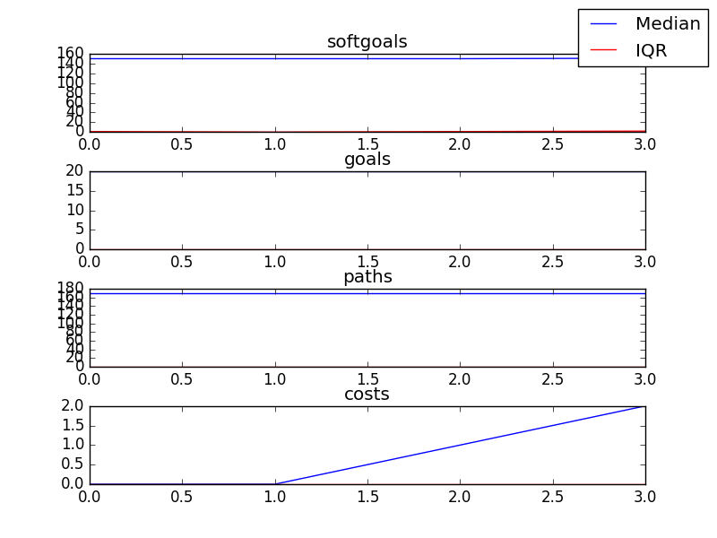

## CSSimplified
```

rank ,         name ,    med   ,   iqr 
----------------------------------------------------
   1 ,      gen0_f1 ,    151.0  ,    0.0 (*--------------|------------- ),151.00, 151.00, 151.00, 151.00, 153.00
   1 ,      gen2_f1 ,    151.0  ,    0.0 (*              |              ),151.00, 151.00, 151.00, 153.00, 153.00
   1 ,      gen4_f1 ,    151.0  ,    0.0 (*              |              ),151.00, 151.00, 151.00, 153.00, 153.00
   1 ,      gen6_f1 ,    151.0  ,    0.0 (*              |              ),151.00, 151.00, 151.00, 153.00, 153.00
   1 ,      gen8_f1 ,    151.0  ,    0.0 (*              |              ),151.00, 151.00, 151.00, 153.00, 153.00
   1 ,     gen10_f1 ,    151.0  ,    0.0 (*              |              ),151.00, 151.00, 151.00, 153.00, 153.00

rank ,         name ,    med   ,   iqr 
----------------------------------------------------
   1 ,      gen0_f2 ,     20.0  ,    0.0 (*              |              ),20.00, 20.00, 20.00, 20.00, 20.00
   1 ,      gen2_f2 ,     20.0  ,    0.0 (*              |              ),20.00, 20.00, 20.00, 20.00, 20.00
   1 ,      gen4_f2 ,     20.0  ,    0.0 (*              |              ),20.00, 20.00, 20.00, 20.00, 20.00
   1 ,      gen6_f2 ,     20.0  ,    0.0 (*              |              ),20.00, 20.00, 20.00, 20.00, 20.00
   1 ,      gen8_f2 ,     20.0  ,    0.0 (*              |              ),20.00, 20.00, 20.00, 20.00, 20.00
   1 ,     gen10_f2 ,     20.0  ,    0.0 (*              |              ),20.00, 20.00, 20.00, 20.00, 20.00
```

### Time Taken : 0.207155942917


### Decisions Ranked
```
+------+-------------------------------------------+----------+-------+------+---------+
| rank |                    name                   |   type   | value | cost | support |
+------+-------------------------------------------+----------+-------+------+---------+
|  1   |           Provide free services           |   task   |   -1  |  1   | 0.19048 |
|  2   |   Single charitable registration number   | resource |   1   |  1   | 0.14286 |
|  3   |  Up to date corporate partner information | softgoal |   1   |  1   | 0.08163 |
|  4   | Get Corporate Partner Information from DL |   task   |   1   |  1   | 0.04762 |
+------+-------------------------------------------+----------+-------+------+---------+
```
