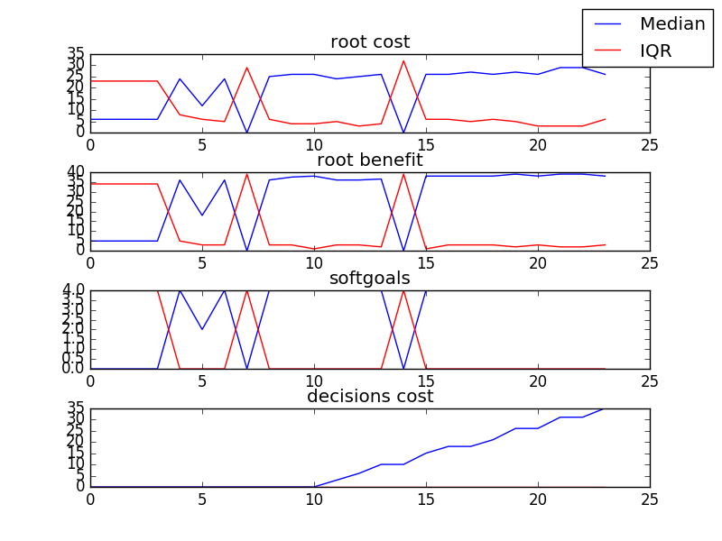
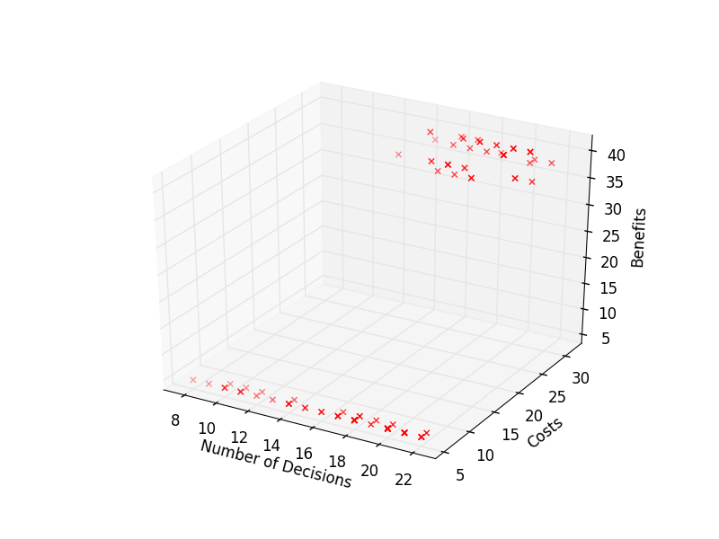

## [Model] (https://github.com/ai-se/softgoals/blob/master/pdf/AOWS.pdf)

## sample
```

rank ,         name ,    med   ,   iqr 
----------------------------------------------------
   1 ,      gen0_f1 ,      6.0  ,   23.0 (-*             |          --- ), 5.00,  6.00,  6.00, 29.00, 32.00
   1 ,      gen2_f1 ,      6.0  ,   24.0 ( *             |        ----- ), 5.00,  5.00,  6.00, 27.00, 32.00
   1 ,      gen4_f1 ,      6.0  ,   24.0 ( *             |        ---   ), 5.00,  5.00,  6.00, 27.00, 30.00
   1 ,      gen6_f1 ,      6.0  ,   24.0 ( *             |        --    ), 5.00,  5.00,  6.00, 27.00, 29.00
   1 ,      gen8_f1 ,      6.0  ,   22.0 ( *             |        --    ), 5.00,  5.00,  6.00, 27.00, 29.00
   1 ,     gen10_f1 ,      6.0  ,   22.0 ( *             |        --    ), 5.00,  5.00,  6.00, 27.00, 29.00

rank ,         name ,    med   ,   iqr 
----------------------------------------------------
   1 ,      gen0_f2 ,      5.0  ,   34.0 (*              |            - ), 5.00,  5.00,  5.00, 39.00, 41.00
   1 ,      gen2_f2 ,      5.0  ,   34.0 (*              |            - ), 5.00,  5.00,  5.00, 39.00, 41.00
   1 ,      gen4_f2 ,      5.0  ,   34.0 (*              |            - ), 5.00,  5.00,  5.00, 39.00, 41.00
   1 ,      gen6_f2 ,      5.0  ,   34.0 (*              |            - ), 5.00,  5.00,  5.00, 39.00, 41.00
   1 ,      gen8_f2 ,      5.0  ,   34.0 (*              |            - ), 5.00,  5.00,  5.00, 39.00, 41.00
   1 ,     gen10_f2 ,      5.0  ,   34.0 (*              |            - ), 5.00,  5.00,  5.00, 39.00, 41.00

rank ,         name ,    med   ,   iqr 
----------------------------------------------------
   1 ,      gen0_f3 ,      0.0  ,    4.0 (*              |              ), 0.00,  0.00,  0.00,  4.00,  4.00
   1 ,      gen2_f3 ,      0.0  ,    4.0 (*              |              ), 0.00,  0.00,  0.00,  4.00,  4.00
   1 ,      gen4_f3 ,      0.0  ,    4.0 (*              |              ), 0.00,  0.00,  0.00,  4.00,  4.00
   1 ,      gen6_f3 ,      0.0  ,    4.0 (*              |              ), 0.00,  0.00,  0.00,  4.00,  4.00
   1 ,      gen8_f3 ,      0.0  ,    4.0 (*              |              ), 0.00,  0.00,  0.00,  4.00,  4.00
   1 ,     gen10_f3 ,      0.0  ,    4.0 (*              |              ), 0.00,  0.00,  0.00,  4.00,  4.00
```

### Time Taken : 4.4693198204


### Decisions Ranked
```
+------+-------------------------------------------------------+----------+-------+------+---------+
| rank |                          name                         |   type   | value | cost | support |
+------+-------------------------------------------------------+----------+-------+------+---------+
|  1   |                     Pnp Framework                     |   goal   |   -1  |  5   | 0.12872 |
|  2   |                   J2EE Specification                  |   task   |   1   |  0   | 0.12381 |
|  3   |                   Documentation Tool                  | resource |   1   |  0   | 0.11489 |
|  4   |                      New Database                     |   goal   |   -1  |  6   | 0.11359 |
|  5   |                Access Control Assessed                |   task   |   1   |  0   | 0.11308 |
|  6   |                    Monitoring Pilot                   |   task   |   1   |  0   |  0.1122 |
|  7   |                    General Test Env                   |   task   |   1   |  0   | 0.10963 |
|  8   |                     Bakeoff Result                    |   task   |   1   |  0   | 0.10963 |
|  9   |                  Access Control Pilot                 |   task   |   1   |  0   | 0.10798 |
|  10  |                   DB Vendor Test Env                  |   task   |   1   |  0   | 0.10483 |
|  11  |       Define data model for all shared data(15)       |   goal   |   1   |  3   | 0.09878 |
|  12  | XXX coordinates and internal client does whatever(17) |   goal   |   1   |  3   | 0.09847 |
|  13  |   External clients get exactly what they request(10)  |   goal   |   1   |  4   | 0.09807 |
|  14  |                   Data Service Spec                   |   task   |   1   |  0   | 0.09675 |
|  15  |                         2 Tier                        |   goal   |   1   |  5   | 0.09535 |
|  16  |       Provide logical data scheme internally(8)       |   goal   |   1   |  3   | 0.09476 |
|  17  |                   Data Service Pilot                  |   task   |   1   |  0   | 0.09424 |
|  18  |           Define ext mandatory data std(18)           |   goal   |   1   |  3   | 0.09009 |
|  19  |                         3 Tier                        |   goal   |   1   |  5   |  0.0854 |
|  20  |                    Data Model Pilot                   |   task   |   1   |  0   | 0.07981 |
|  21  | XXX coordinates and external client does whatever(20) |   goal   |   1   |  5   | 0.07883 |
|  22  |          Svc layer w/ extracted biz logic(13)         |   goal   |   -1  |  5   | 0.06568 |
|  23  |        External data model can be extended(19)        |   goal   |   1   |  4   | 0.06213 |
|  24  |       Svc layer w/ extracted biz logic in DB(12)      |   goal   |   -1  |  3   | 0.05171 |
+------+-------------------------------------------------------+----------+-------+------+---------+
```

### Support Chart


##[Recommendation](../../../src/img/star1_induced/sample_choices.png)

## Visualizations
###Decisions vs Costs vs Benefits


###Decisions vs Costs


###Decisions vs Benefits


## Maximal Subset
**16** maximal subsets of size **13** are in the model

| Objective | Median | IQR | Max | Min |
|-----------|--------|-----|-----|-----|
| Cost | 30 | 3.0 | 32 | 27 |
| Benefit | 39 | 2.0 | 41 | 37 |
| Softgoals | 4 | 0 | 4 | 4 |
| Total Decision Cost | 15 | 3 | 17 | 12 |
