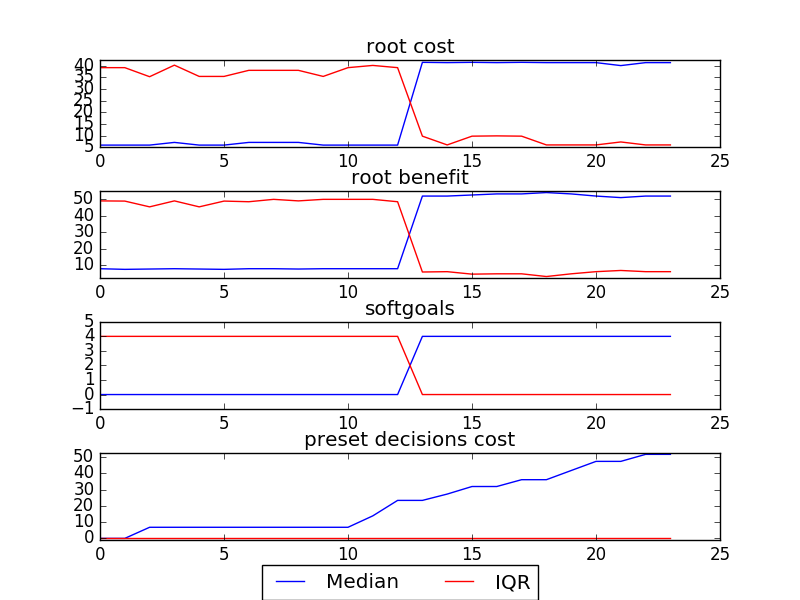
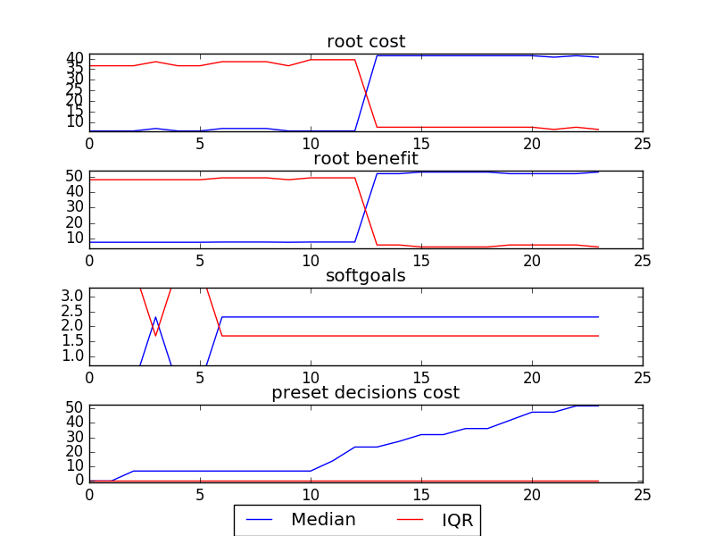
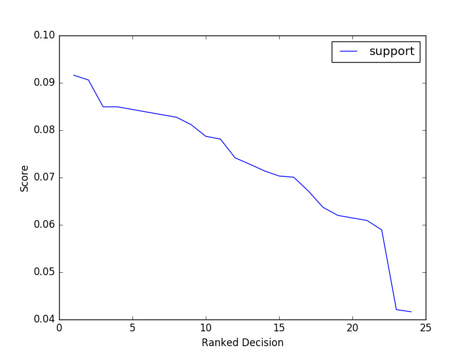
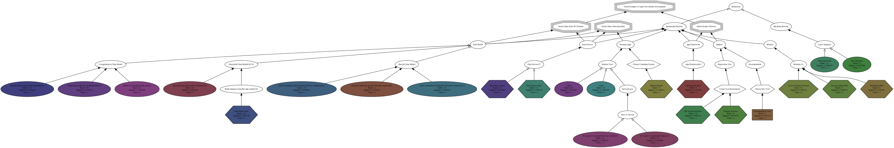

## [Model](https://github.com/ai-se/softgoals/blob/master/pdf/AOWS.pdf)
## sample
```

rank ,         name ,    med   ,   iqr 
----------------------------------------------------
   1 ,     gen40_f1 ,      5.0  ,   22.0 (*              |        --    ), 5.00,  5.00,  5.00, 27.00, 29.00
   1 ,     gen60_f1 ,      5.0  ,   22.0 (*              |              ), 5.00,  5.00,  5.00, 27.00, 27.00
   1 ,     gen80_f1 ,      5.0  ,   22.0 (*              |              ), 5.00,  5.00,  5.00, 27.00, 27.00
   1 ,    gen100_f1 ,      5.0  ,   22.0 (*              |              ), 5.00,  5.00,  5.00, 27.00, 27.00
   1 ,      gen0_f1 ,      6.0  ,   23.0 (-*             |          --- ), 5.00,  6.00,  6.00, 29.00, 32.00
   1 ,     gen20_f1 ,      6.0  ,   22.0 ( *             |        --    ), 5.00,  5.00,  6.00, 27.00, 29.00

rank ,         name ,    med   ,   iqr 
----------------------------------------------------
   1 ,      gen0_f2 ,      5.0  ,   34.0 (*              |            - ), 5.00,  5.00,  5.00, 39.00, 41.00
   1 ,     gen20_f2 ,      5.0  ,   36.0 (*              |            - ), 5.00,  5.00,  5.00, 39.00, 41.00
   1 ,     gen40_f2 ,      5.0  ,   36.0 (*              |            - ), 5.00,  5.00,  5.00, 39.00, 41.00
   1 ,     gen60_f2 ,      5.0  ,   36.0 (*              |            - ), 5.00,  5.00,  5.00, 39.00, 41.00
   1 ,     gen80_f2 ,      5.0  ,   36.0 (*              |              ), 5.00,  5.00,  5.00, 41.00, 41.00
   1 ,    gen100_f2 ,      5.0  ,   36.0 (*              |              ), 5.00,  5.00,  5.00, 41.00, 41.00

rank ,         name ,    med   ,   iqr 
----------------------------------------------------
   1 ,      gen0_f3 ,      0.0  ,    4.0 (*              |              ), 0.00,  0.00,  0.00,  4.00,  4.00
   1 ,     gen20_f3 ,      0.0  ,    4.0 (*              |              ), 0.00,  0.00,  0.00,  4.00,  4.00
   1 ,     gen40_f3 ,      0.0  ,    4.0 (*              |              ), 0.00,  0.00,  0.00,  4.00,  4.00
   1 ,     gen60_f3 ,      0.0  ,    4.0 (*              |              ), 0.00,  0.00,  0.00,  4.00,  4.00
   1 ,     gen80_f3 ,      0.0  ,    4.0 (*              |              ), 0.00,  0.00,  0.00,  4.00,  4.00
   1 ,    gen100_f3 ,      0.0  ,    4.0 (*              |              ), 0.00,  0.00,  0.00,  4.00,  4.00
```

### Smoothened Plot


### Decisions Ranked
```
+------+-------------------------------------------------------+----------+-------+------+---------+
| rank |                          name                         |   type   | value | cost | support |
+------+-------------------------------------------------------+----------+-------+------+---------+
|  1   |                   J2EE Specification                  |   task   |   1   |  0   | 0.08553 |
|  2   |                     Pnp Framework                     |   goal   |   -1  |  5   | 0.08169 |
|  3   |                      New Database                     |   goal   |   -1  |  6   | 0.07999 |
|  4   |                   Documentation Tool                  | resource |   1   |  0   | 0.07841 |
|  5   |                Access Control Assessed                |   task   |   1   |  0   | 0.07693 |
|  6   |                    Monitoring Pilot                   |   task   |   1   |  0   | 0.07693 |
|  7   |                    General Test Env                   |   task   |   1   |  0   | 0.07597 |
|  8   |                     Bakeoff Result                    |   task   |   1   |  0   | 0.07504 |
|  9   |                  Access Control Pilot                 |   task   |   1   |  0   | 0.07458 |
|  10  |                   DB Vendor Test Env                  |   task   |   1   |  0   |  0.0728 |
|  11  |                   Data Service Spec                   |   task   |   1   |  0   | 0.06763 |
|  12  |   External clients get exactly what they request(10)  |   goal   |   1   |  4   | 0.06594 |
|  13  | XXX coordinates and internal client does whatever(17) |   goal   |   1   |  3   | 0.06382 |
|  14  | XXX coordinates and external client does whatever(20) |   goal   |   1   |  5   | 0.06231 |
|  15  |                    Data Model Pilot                   |   task   |   1   |  0   | 0.06187 |
|  16  |                   Data Service Pilot                  |   task   |   1   |  0   | 0.06052 |
|  17  |                         2 Tier                        |   goal   |   1   |  5   | 0.05919 |
|  18  |                         3 Tier                        |   goal   |   1   |  5   | 0.05804 |
|  19  |       Define data model for all shared data(15)       |   goal   |   1   |  3   | 0.05723 |
|  20  |          Svc layer w/ extracted biz logic(13)         |   goal   |   -1  |  5   | 0.05363 |
|  21  |           Define ext mandatory data std(18)           |   goal   |   1   |  3   | 0.05016 |
|  22  |       Svc layer w/ extracted biz logic in DB(12)      |   goal   |   1   |  3   | 0.05012 |
|  23  |        External data model can be extended(19)        |   goal   |   1   |  4   | 0.04892 |
|  24  |       Provide logical data scheme internally(8)       |   goal   |   1   |  3   | 0.04852 |
+------+-------------------------------------------------------+----------+-------+------+---------+
```

### Support Chart


##[Recommendation](../../../src/img/junk/sample_choices.png)

### Decisions Clustered
```
+------------+-------------------------------------------------------+
| Cluster ID |                     Decision Name                     |
+------------+-------------------------------------------------------+
|     1      |                   J2EE Specification                  |
|     "      |                     Pnp Framework                     |
|     "      |                      New Database                     |
|     2      |                   Documentation Tool                  |
|     "      |                Access Control Assessed                |
|     "      |                    Monitoring Pilot                   |
|     "      |                    General Test Env                   |
|     "      |                     Bakeoff Result                    |
|     "      |                  Access Control Pilot                 |
|     "      |                   DB Vendor Test Env                  |
|     "      |                   Data Service Spec                   |
|     "      |   External clients get exactly what they request(10)  |
|     "      | XXX coordinates and internal client does whatever(17) |
|     "      | XXX coordinates and external client does whatever(20) |
|     "      |                    Data Model Pilot                   |
|     "      |                   Data Service Pilot                  |
|     "      |                         2 Tier                        |
|     "      |                         3 Tier                        |
|     "      |       Define data model for all shared data(15)       |
|     "      |          Svc layer w/ extracted biz logic(13)         |
|     "      |           Define ext mandatory data std(18)           |
|     "      |       Svc layer w/ extracted biz logic in DB(12)      |
|     "      |        External data model can be extended(19)        |
|     "      |       Provide logical data scheme internally(8)       |
+------------+-------------------------------------------------------+
```

### Time Taken : 34.193559885
