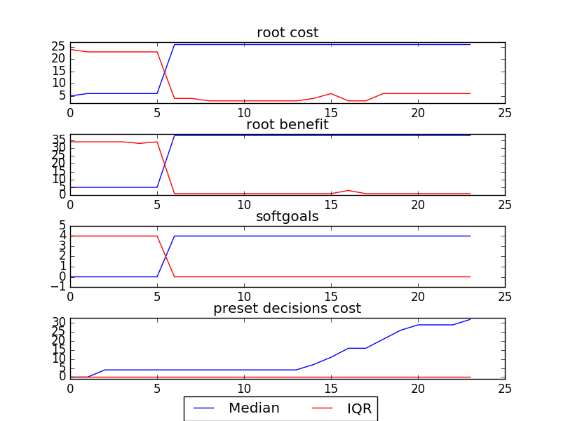
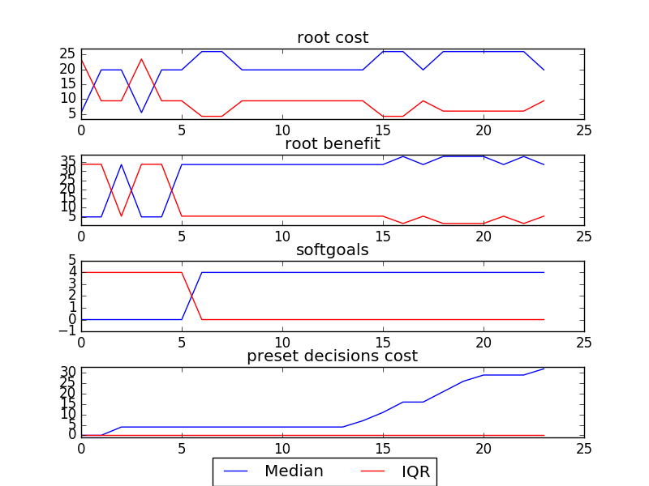
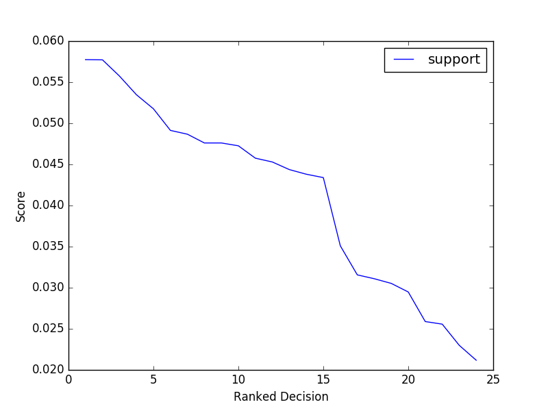

## [Model](https://github.com/ai-se/softgoals/blob/master/pdf/AOWS.pdf)
## sample
### Early Termination Cost = 29
```

rank ,         name ,    med   ,   iqr 
----------------------------------------------------
   1 ,     gen20_f1 ,      5.0  ,   19.0 (*--------------|------------  ), 5.00,  5.00,  5.00,  5.00, 26.00
   1 ,     gen40_f1 ,      5.0  ,   19.0 (*--------------|------------  ), 5.00,  5.00,  5.00,  5.00, 26.00
   1 ,     gen60_f1 ,      5.0  ,   19.0 (*--------------|---------     ), 5.00,  5.00,  5.00,  5.00, 24.00
   1 ,     gen80_f1 ,      5.0  ,   19.0 (*--------------|---------     ), 5.00,  5.00,  5.00,  5.00, 24.00
   1 ,    gen100_f1 ,      5.0  ,   19.0 (*--------------|---------     ), 5.00,  5.00,  5.00,  5.00, 24.00
   1 ,      gen0_f1 ,      6.0  ,   19.0 ( *-------------|------------  ), 5.00,  5.00,  6.00,  6.00, 26.00

rank ,         name ,    med   ,   iqr 
----------------------------------------------------
   1 ,      gen0_f2 ,      5.0  ,   31.0 (*--------------|-----------   ), 5.00,  5.00,  5.00,  5.00, 38.00
   1 ,     gen20_f2 ,      5.0  ,   31.0 (*--------------|-----------   ), 5.00,  5.00,  5.00,  5.00, 38.00
   1 ,     gen40_f2 ,      5.0  ,   33.0 (*--------------|-----------   ), 5.00,  5.00,  5.00,  5.00, 38.00
   1 ,     gen60_f2 ,      5.0  ,   33.0 (*--------------|-----------   ), 5.00,  5.00,  5.00,  5.00, 38.00
   1 ,     gen80_f2 ,      5.0  ,   33.0 (*--------------|-----------   ), 5.00,  5.00,  5.00,  5.00, 38.00
   1 ,    gen100_f2 ,      5.0  ,   33.0 (*--------------|-----------   ), 5.00,  5.00,  5.00,  5.00, 38.00

rank ,         name ,    med   ,   iqr 
----------------------------------------------------
   1 ,      gen0_f3 ,      0.0  ,    4.0 (*--------------|------------- ), 0.00,  0.00,  0.00,  0.00,  4.00
   1 ,     gen20_f3 ,      0.0  ,    4.0 (*--------------|------------- ), 0.00,  0.00,  0.00,  0.00,  4.00
   1 ,     gen40_f3 ,      0.0  ,    4.0 (*--------------|------------- ), 0.00,  0.00,  0.00,  0.00,  4.00
   1 ,     gen60_f3 ,      0.0  ,    4.0 (*--------------|------------- ), 0.00,  0.00,  0.00,  0.00,  4.00
   1 ,     gen80_f3 ,      0.0  ,    4.0 (*--------------|------------- ), 0.00,  0.00,  0.00,  0.00,  4.00
   1 ,    gen100_f3 ,      0.0  ,    4.0 (*--------------|------------- ), 0.00,  0.00,  0.00,  0.00,  4.00
```

### Smoothened Plot


### Decisions Ranked
```
+------+-------------------------------------------------------+----------+-------+------+---------+
| rank |                          name                         |   type   | value | cost | support |
+------+-------------------------------------------------------+----------+-------+------+---------+
|  1   |                    Data Model Pilot                   |   task   |   1   |  0   | 0.05775 |
|  2   |        External data model can be extended(19)        |   goal   |   1   |  4   | 0.05772 |
|  3   |                   J2EE Specification                  |   task   |   1   |  0   | 0.05575 |
|  4   |                     Pnp Framework                     |   goal   |   -1  |  5   | 0.05347 |
|  5   |                   Documentation Tool                  | resource |   1   |  0   | 0.05176 |
|  6   |                      New Database                     |   goal   |   -1  |  6   | 0.04914 |
|  7   |                    Monitoring Pilot                   |   task   |   1   |  0   | 0.04867 |
|  8   |                    General Test Env                   |   task   |   1   |  0   | 0.04761 |
|  9   |                     Bakeoff Result                    |   task   |   1   |  0   | 0.04761 |
|  10  |                Access Control Assessed                |   task   |   1   |  0   | 0.04726 |
|  11  |                   Data Service Pilot                  |   task   |   1   |  0   | 0.04576 |
|  12  |                   DB Vendor Test Env                  |   task   |   1   |  0   | 0.04529 |
|  13  |                  Access Control Pilot                 |   task   |   1   |  0   | 0.04437 |
|  14  | XXX coordinates and internal client does whatever(17) |   goal   |   1   |  3   |  0.0438 |
|  15  |   External clients get exactly what they request(10)  |   goal   |   1   |  4   |  0.0434 |
|  16  |                         2 Tier                        |   goal   |   1   |  5   |  0.0351 |
|  17  |                   Data Service Spec                   |   task   |   1   |  0   | 0.03156 |
|  18  | XXX coordinates and external client does whatever(20) |   goal   |   1   |  5   | 0.03109 |
|  19  |                         3 Tier                        |   goal   |   1   |  5   | 0.03052 |
|  20  |       Svc layer w/ extracted biz logic in DB(12)      |   goal   |   1   |  3   | 0.02948 |
|  21  |           Define ext mandatory data std(18)           |   goal   |   -1  |  3   | 0.02588 |
|  22  |       Define data model for all shared data(15)       |   goal   |   -1  |  3   | 0.02557 |
|  23  |       Provide logical data scheme internally(8)       |   goal   |   1   |  3   | 0.02299 |
|  24  |          Svc layer w/ extracted biz logic(13)         |   goal   |   -1  |  5   | 0.02118 |
+------+-------------------------------------------------------+----------+-------+------+---------+
```

### Support Chart


##[Recommendation](../../../src/img/junk_et/sample_choices.png)

### Decisions Clustered
```
+------------+-------------------------------------------------------+
| Cluster ID |                     Decision Name                     |
+------------+-------------------------------------------------------+
|     1      |                    Data Model Pilot                   |
|     "      |        External data model can be extended(19)        |
|     "      |                   J2EE Specification                  |
|     "      |                     Pnp Framework                     |
|     "      |                   Documentation Tool                  |
|     "      |                      New Database                     |
|     2      |                    Monitoring Pilot                   |
|     "      |                    General Test Env                   |
|     "      |                     Bakeoff Result                    |
|     "      |                Access Control Assessed                |
|     "      |                   Data Service Pilot                  |
|     "      |                   DB Vendor Test Env                  |
|     "      |                  Access Control Pilot                 |
|     "      | XXX coordinates and internal client does whatever(17) |
|     "      |   External clients get exactly what they request(10)  |
|     "      |                         2 Tier                        |
|     "      |                   Data Service Spec                   |
|     "      | XXX coordinates and external client does whatever(20) |
|     "      |                         3 Tier                        |
|     "      |       Svc layer w/ extracted biz logic in DB(12)      |
|     "      |           Define ext mandatory data std(18)           |
|     "      |       Define data model for all shared data(15)       |
|     "      |       Provide logical data scheme internally(8)       |
|     "      |          Svc layer w/ extracted biz logic(13)         |
+------------+-------------------------------------------------------+
```

### Time Taken : 44.3896541595
